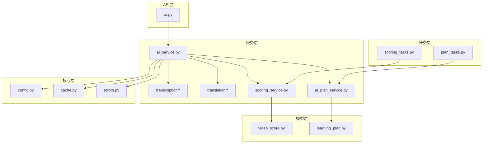
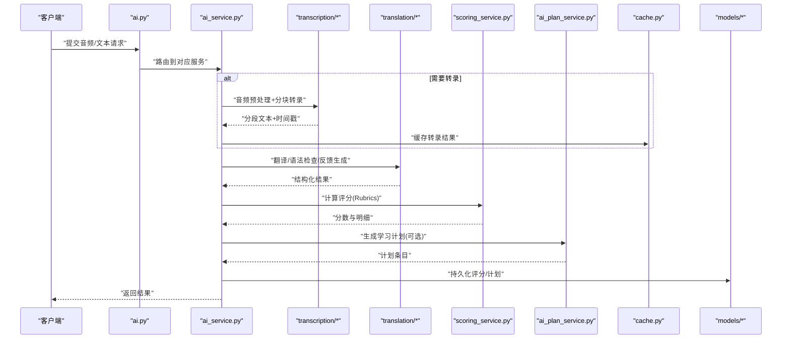
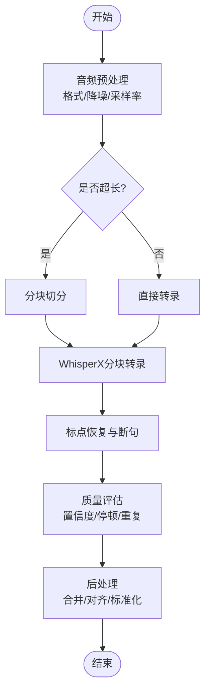
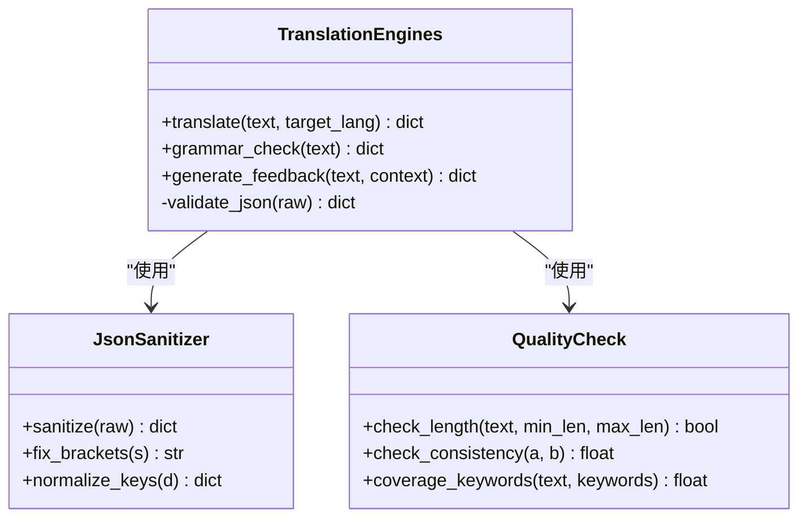
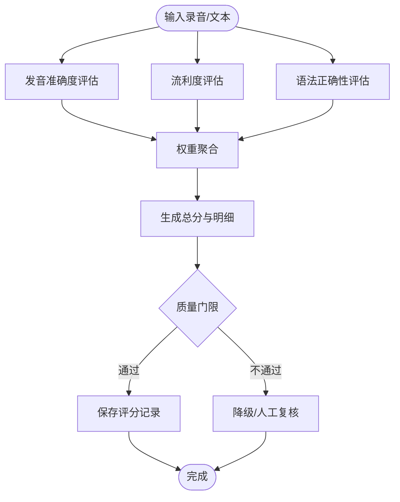
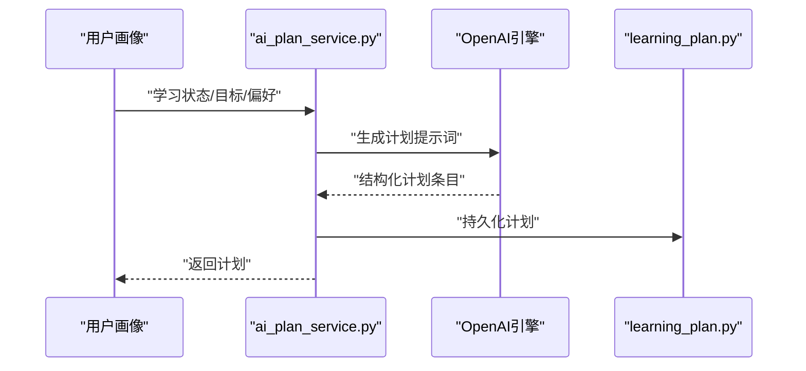
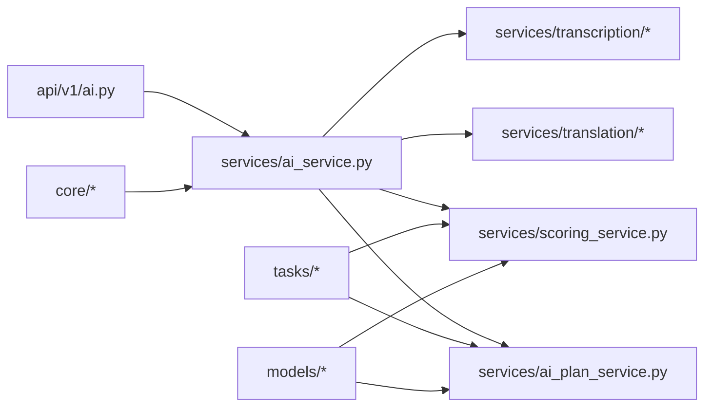

# AI服务集成

<cite>
**本文引用的文件**
- [backend/app/api/v1/ai.py](file://backend/app/api/v1/ai.py)
- [backend/app/services/ai_service.py](file://backend/app/services/ai_service.py)
- [backend/app/services/transcription/__init__.py](file://backend/app/services/transcription/__init__.py)
- [backend/app/services/transcription/audio_extractor.py](file://backend/app/services/transcription/audio_extractor.py)
- [backend/app/services/transcription/chunked_transcription.py](file://backend/app/services/transcription/chunked_transcription.py)
- [backend/app/services/transcription/whisper_model.py](file://backend/app/services/transcription/whisper_model.py)
- [backend/app/services/transcription/punctuation.py](file://backend/app/services/transcription/punctuation.py)
- [backend/app/services/transcription/quality.py](file://backend/app/services/transcription/quality.py)
- [backend/app/services/translation/__init__.py](file://backend/app/services/translation/__init__.py)
- [backend/app/services/translation/engines.py](file://backend/app/services/translation/engines.py)
- [backend/app/services/translation/json_sanitizer.py](file://backend/app/services/translation/json_sanitizer.py)
- [backend/app/services/translation/quality.py](file://backend/app/services/translation/quality.py)
- [backend/app/services/scoring_service.py](file://backend/app/services/scoring_service.py)
- [backend/app/services/ai_plan_service.py](file://backend/app/services/ai_plan_service.py)
- [backend/app/core/config.py](file://backend/app/core/config.py)
- [backend/app/core/cache.py](file://backend/app/core/cache.py)
- [backend/app/core/errors.py](file://backend/app/core/errors.py)
- [backend/app/models/video_score.py](file://backend/app/models/video_score.py)
- [backend/app/models/learning_plan.py](file://backend/app/models/learning_plan.py)
- [backend/app/tasks/scoring_tasks.py](file://backend/app/tasks/scoring_tasks.py)
- [backend/app/tasks/plan_tasks.py](file://backend/app/tasks/plan_tasks.py)
- [backend/tests/test_ai_rubrics.py](file://backend/tests/test_ai_rubrics.py)
- [backend/tests/test_translation_service.py](file://backend/tests/test_translation_service.py)
- [backend/tests/test_whisperx_segmentation.py](file://backend/tests/test_whisperx_segmentation.py)
- [backend/tests/test_quality_safety_net.py](file://backend/tests/test_quality_safety_net.py)
</cite>

## 目录
1. [简介](#简介)
2. [项目结构](#项目结构)
3. [核心组件](#核心组件)
4. [架构总览](#架构总览)
5. [详细组件分析](#详细组件分析)
6. [依赖关系分析](#依赖关系分析)
7. [性能考虑](#性能考虑)
8. [故障排查指南](#故障排查指南)
9. [结论](#结论)
10. [附录](#附录)

## 简介
本文件面向Speaking平台的AI服务集成，系统性梳理并文档化以下能力：
- WhisperX语音识别服务的集成与使用（音频预处理、转录质量评估、结果后处理）
- OpenAI API的集成方案（翻译、语法检查、智能反馈生成）
- AI评分算法的实现原理（发音准确度、流利度、语法正确性）
- 学习计划生成的AI逻辑（个性化推荐、内容难度匹配）
- AI服务配置管理、错误处理与降级策略
- 性能优化技巧、缓存策略与批量处理能力
- AI结果的验证机制与质量保证措施

## 项目结构
后端采用分层架构：API层暴露接口，Service层封装业务与AI调用，Tasks层承载异步任务，Core层提供配置、缓存、错误等基础设施。AI相关能力主要分布在services下的transcription、translation模块以及独立的scoring_service和ai_plan_service中。

**图表来源**
- [backend/app/api/v1/ai.py](file://backend/app/api/v1/ai.py)
- [backend/app/services/ai_service.py](file://backend/app/services/ai_service.py)
- [backend/app/services/transcription/__init__.py](file://backend/app/services/transcription/__init__.py)
- [backend/app/services/translation/__init__.py](file://backend/app/services/translation/__init__.py)
- [backend/app/services/scoring_service.py](file://backend/app/services/scoring_service.py)
- [backend/app/services/ai_plan_service.py](file://backend/app/services/ai_plan_service.py)
- [backend/app/core/config.py](file://backend/app/core/config.py)
- [backend/app/core/cache.py](file://backend/app/core/cache.py)
- [backend/app/core/errors.py](file://backend/app/core/errors.py)
- [backend/app/models/video_score.py](file://backend/app/models/video_score.py)
- [backend/app/models/learning_plan.py](file://backend/app/models/learning_plan.py)
- [backend/app/tasks/scoring_tasks.py](file://backend/app/tasks/scoring_tasks.py)
- [backend/app/tasks/plan_tasks.py](file://backend/app/tasks/plan_tasks.py)

**章节来源**
- [backend/app/api/v1/ai.py](file://backend/app/api/v1/ai.py)
- [backend/app/services/ai_service.py](file://backend/app/services/ai_service.py)

## 核心组件
- 转录服务（WhisperX）：负责音频提取、分块转录、标点恢复、质量评估与后处理
- 翻译与语言服务（OpenAI）：负责翻译、语法检查、智能反馈生成
- 评分服务：基于Rubrics对发音准确度、流利度、语法正确性进行量化评分
- 学习计划服务：结合用户画像与语料难度生成个性化学习计划
- 配置与缓存：集中管理API密钥、模型参数、缓存键与TTL
- 错误处理与降级：统一异常类型、重试与回退策略

**章节来源**
- [backend/app/services/transcription/audio_extractor.py](file://backend/app/services/transcription/audio_extractor.py)
- [backend/app/services/transcription/chunked_transcription.py](file://backend/app/services/transcription/chunked_transcription.py)
- [backend/app/services/transcription/whisper_model.py](file://backend/app/services/transcription/whisper_model.py)
- [backend/app/services/transcription/punctuation.py](file://backend/app/services/transcription/punctuation.py)
- [backend/app/services/transcription/quality.py](file://backend/app/services/transcription/quality.py)
- [backend/app/services/translation/engines.py](file://backend/app/services/translation/engines.py)
- [backend/app/services/translation/json_sanitizer.py](file://backend/app/services/translation/json_sanitizer.py)
- [backend/app/services/translation/quality.py](file://backend/app/services/translation/quality.py)
- [backend/app/services/scoring_service.py](file://backend/app/services/scoring_service.py)
- [backend/app/services/ai_plan_service.py](file://backend/app/services/ai_plan_service.py)
- [backend/app/core/config.py](file://backend/app/core/config.py)
- [backend/app/core/cache.py](file://backend/app/core/cache.py)
- [backend/app/core/errors.py](file://backend/app/core/errors.py)

## 架构总览
整体流程从API入口进入，由ai_service协调转录、翻译、评分与计划生成；耗时任务通过Celery异步执行；结果写入数据库并通过缓存加速读取。

**图表来源**
- [backend/app/api/v1/ai.py](file://backend/app/api/v1/ai.py)
- [backend/app/services/ai_service.py](file://backend/app/services/ai_service.py)
- [backend/app/services/transcription/__init__.py](file://backend/app/services/transcription/__init__.py)
- [backend/app/services/translation/__init__.py](file://backend/app/services/translation/__init__.py)
- [backend/app/services/scoring_service.py](file://backend/app/services/scoring_service.py)
- [backend/app/services/ai_plan_service.py](file://backend/app/services/ai_plan_service.py)
- [backend/app/core/cache.py](file://backend/app/core/cache.py)
- [backend/app/models/video_score.py](file://backend/app/models/video_score.py)
- [backend/app/models/learning_plan.py](file://backend/app/models/learning_plan.py)

## 详细组件分析

### WhisperX语音识别集成
- 音频预处理：格式转换、降噪、音量归一化、采样率对齐
- 分块转录：按时长或句长切分，避免显存溢出，支持并发
- 标点恢复：基于规则与轻量模型的断句与标点补全
- 质量评估：置信度、停顿检测、重复词过滤、噪声指标
- 结果后处理：去噪、合并相邻段、时间戳对齐、标准化输出

**图表来源**
- [backend/app/services/transcription/audio_extractor.py](file://backend/app/services/transcription/audio_extractor.py)
- [backend/app/services/transcription/chunked_transcription.py](file://backend/app/services/transcription/chunked_transcription.py)
- [backend/app/services/transcription/whisper_model.py](file://backend/app/services/transcription/whisper_model.py)
- [backend/app/services/transcription/punctuation.py](file://backend/app/services/transcription/punctuation.py)
- [backend/app/services/transcription/quality.py](file://backend/app/services/transcription/quality.py)

**章节来源**
- [backend/app/services/transcription/audio_extractor.py](file://backend/app/services/transcription/audio_extractor.py)
- [backend/app/services/transcription/chunked_transcription.py](file://backend/app/services/transcription/chunked_transcription.py)
- [backend/app/services/transcription/whisper_model.py](file://backend/app/services/transcription/whisper_model.py)
- [backend/app/services/transcription/punctuation.py](file://backend/app/services/transcription/punctuation.py)
- [backend/app/services/transcription/quality.py](file://backend/app/services/transcription/quality.py)
- [backend/tests/test_whisperx_segmentation.py](file://backend/tests/test_whisperx_segmentation.py)

### OpenAI API集成（翻译、语法检查、智能反馈）
- 引擎抽象：统一接口适配不同提供商，支持多引擎切换
- JSON清洗：确保LLM返回的结构化数据可解析
- 质量控制：长度阈值、关键词覆盖、一致性校验
- 降级策略：失败时回退到本地规则或缓存结果

**图表来源**
- [backend/app/services/translation/engines.py](file://backend/app/services/translation/engines.py)
- [backend/app/services/translation/json_sanitizer.py](file://backend/app/services/translation/json_sanitizer.py)
- [backend/app/services/translation/quality.py](file://backend/app/services/translation/quality.py)

**章节来源**
- [backend/app/services/translation/engines.py](file://backend/app/services/translation/engines.py)
- [backend/app/services/translation/json_sanitizer.py](file://backend/app/services/translation/json_sanitizer.py)
- [backend/app/services/translation/quality.py](file://backend/app/services/translation/quality.py)
- [backend/tests/test_translation_service.py](file://backend/tests/test_translation_service.py)

### AI评分算法（Rubrics）
- 维度定义：发音准确度、流利度、语法正确性
- 打分策略：加权聚合、阈值判定、异常值处理
- 结果结构：总分与各维度得分、证据片段、改进建议

**图表来源**
- [backend/app/services/scoring_service.py](file://backend/app/services/scoring_service.py)
- [backend/app/models/video_score.py](file://backend/app/models/video_score.py)

**章节来源**
- [backend/app/services/scoring_service.py](file://backend/app/services/scoring_service.py)
- [backend/app/models/video_score.py](file://backend/app/models/video_score.py)
- [backend/tests/test_ai_rubrics.py](file://backend/tests/test_ai_rubrics.py)

### 学习计划生成（AI逻辑）
- 个性化推荐：基于用户历史表现、目标考试级别、薄弱点
- 难度匹配：语料难度与学习者水平动态匹配
- 计划结构：每日/每周任务、复习间隔、练习形式

**图表来源**
- [backend/app/services/ai_plan_service.py](file://backend/app/services/ai_plan_service.py)
- [backend/app/models/learning_plan.py](file://backend/app/models/learning_plan.py)

**章节来源**
- [backend/app/services/ai_plan_service.py](file://backend/app/services/ai_plan_service.py)
- [backend/app/models/learning_plan.py](file://backend/app/models/learning_plan.py)

### 配置管理
- 环境变量：API密钥、模型名称、超时、重试次数
- 运行时配置：开关控制、灰度发布、A/B测试
- 缓存配置：键前缀、TTL、命中率监控

**章节来源**
- [backend/app/core/config.py](file://backend/app/core/config.py)
- [backend/app/core/cache.py](file://backend/app/core/cache.py)

### 错误处理与降级策略
- 统一异常：网络错误、鉴权失败、配额耗尽、模型不可用
- 重试与退避：指数退避、最大重试次数
- 降级路径：缓存命中、规则引擎、离线模式

**章节来源**
- [backend/app/core/errors.py](file://backend/app/core/errors.py)
- [backend/tests/test_quality_safety_net.py](file://backend/tests/test_quality_safety_net.py)

## 依赖关系分析
- API层依赖ai_service，后者组合transcription、translation、scoring、plan等服务
- 任务层通过Celery调度耗时任务（评分、计划生成）
- 核心层为所有服务提供配置、缓存、错误处理

**图表来源**
- [backend/app/api/v1/ai.py](file://backend/app/api/v1/ai.py)
- [backend/app/services/ai_service.py](file://backend/app/services/ai_service.py)
- [backend/app/services/transcription/__init__.py](file://backend/app/services/transcription/__init__.py)
- [backend/app/services/translation/__init__.py](file://backend/app/services/translation/__init__.py)
- [backend/app/services/scoring_service.py](file://backend/app/services/scoring_service.py)
- [backend/app/services/ai_plan_service.py](file://backend/app/services/ai_plan_service.py)
- [backend/app/tasks/scoring_tasks.py](file://backend/app/tasks/scoring_tasks.py)
- [backend/app/tasks/plan_tasks.py](file://backend/app/tasks/plan_tasks.py)
- [backend/app/core/config.py](file://backend/app/core/config.py)
- [backend/app/core/cache.py](file://backend/app/core/cache.py)
- [backend/app/core/errors.py](file://backend/app/core/errors.py)
- [backend/app/models/video_score.py](file://backend/app/models/video_score.py)
- [backend/app/models/learning_plan.py](file://backend/app/models/learning_plan.py)

**章节来源**
- [backend/app/api/v1/ai.py](file://backend/app/api/v1/ai.py)
- [backend/app/services/ai_service.py](file://backend/app/services/ai_service.py)
- [backend/app/tasks/scoring_tasks.py](file://backend/app/tasks/scoring_tasks.py)
- [backend/app/tasks/plan_tasks.py](file://backend/app/tasks/plan_tasks.py)

## 性能考虑
- 转录阶段
  - 分块大小与并发数调优，避免GPU OOM
  - 音频预处理流水线并行化
  - 结果缓存（相同音频指纹命中）
- 翻译与反馈
  - 请求批处理与流式响应
  - 小模型优先，大模型兜底
  - 结果缓存与增量更新
- 评分与计划
  - 异步任务队列削峰填谷
  - 评分维度预计算与缓存
  - 计划生成模板化减少LLM调用

[本节为通用指导，无需特定文件引用]

## 故障排查指南
- 常见问题
  - WhisperX显存不足：降低分块大小、增加内存限制
  - OpenAI配额耗尽：启用降级与缓存
  - 转录质量低：调整降噪参数、增加标点恢复
  - 评分不一致：检查Rubrics权重与阈值
- 诊断手段
  - 日志定位：关键步骤埋点与错误码
  - 指标监控：延迟、成功率、缓存命中率
  - 单元测试与回归测试：覆盖边界用例

**章节来源**
- [backend/app/core/errors.py](file://backend/app/core/errors.py)
- [backend/tests/test_quality_safety_net.py](file://backend/tests/test_quality_safety_net.py)
- [backend/tests/test_ai_rubrics.py](file://backend/tests/test_ai_rubrics.py)
- [backend/tests/test_translation_service.py](file://backend/tests/test_translation_service.py)
- [backend/tests/test_whisperx_segmentation.py](file://backend/tests/test_whisperx_segmentation.py)

## 结论
本集成以模块化服务为核心，围绕WhisperX与OpenAI构建稳定的语音识别、翻译与反馈能力；通过Rubrics实现可解释的评分体系；借助异步任务与缓存提升吞吐与稳定性。建议在上线前完善监控与告警，持续优化分块策略与降级路径，保障用户体验与服务质量。

[本节为总结，无需特定文件引用]

## 附录
- 术语表：WhisperX、Rubrics、Celery、TTL等
- 参考链接：内部设计文档与运维手册

[本节为补充信息，无需特定文件引用]
