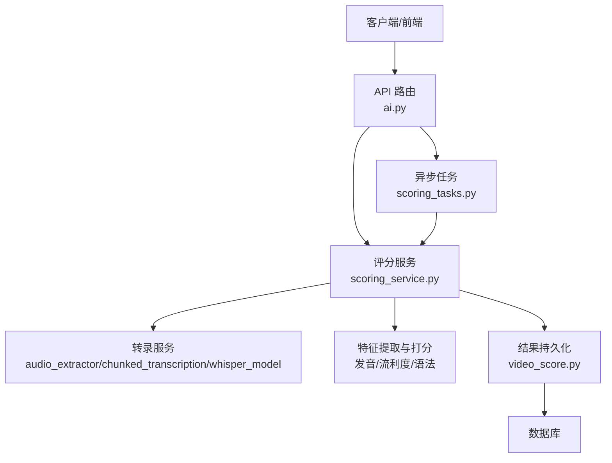
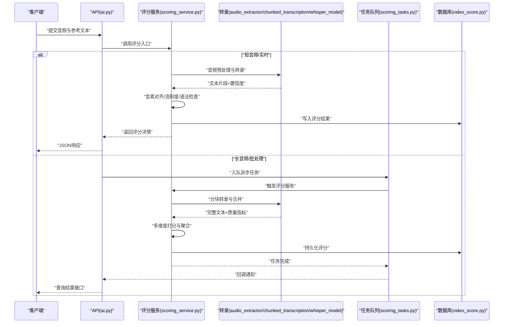
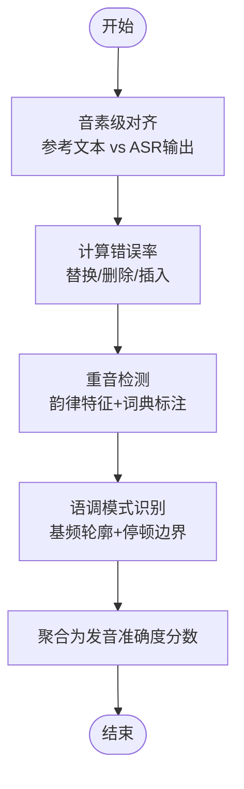
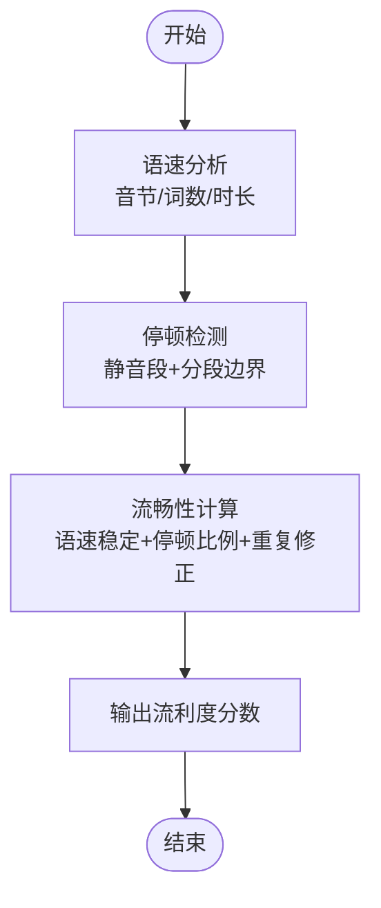
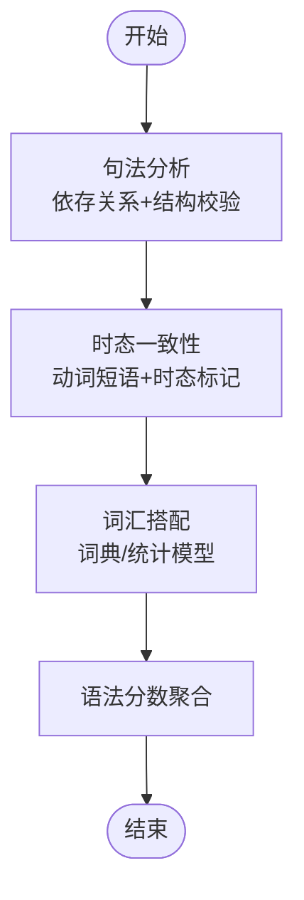
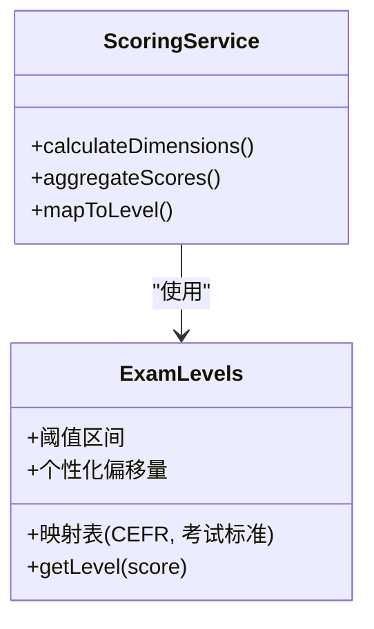
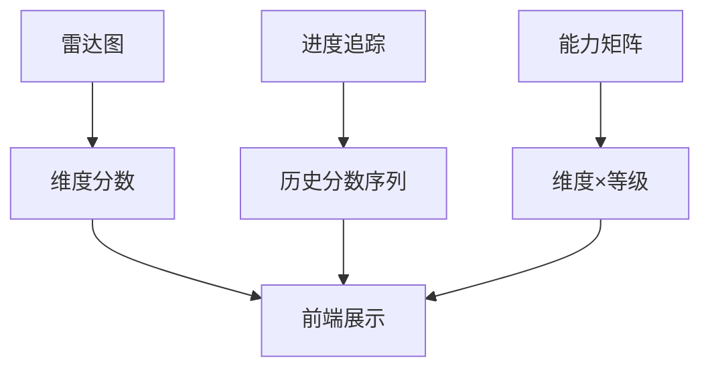
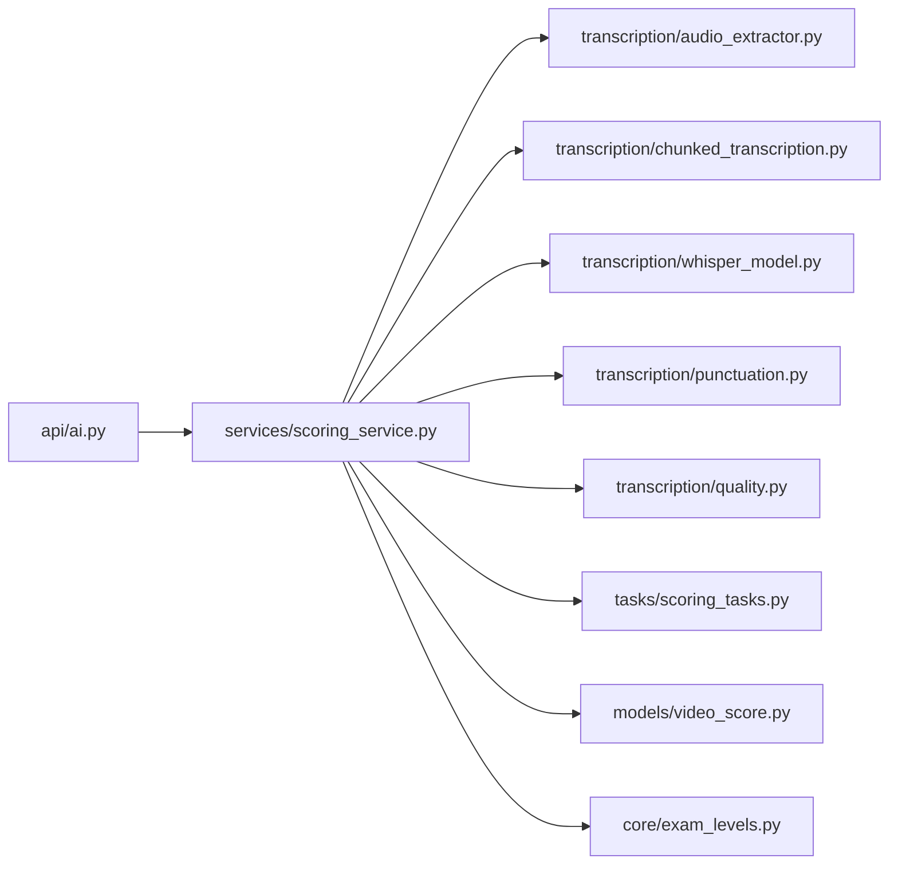

# AI评分算法

<cite>
**本文引用的文件**
- [backend/app/services/scoring_service.py](file://backend/app/services/scoring_service.py)
- [backend/app/tasks/scoring_tasks.py](file://backend/app/tasks/scoring_tasks.py)
- [backend/app/api/v1/ai.py](file://backend/app/api/v1/ai.py)
- [backend/app/core/exam_levels.py](file://backend/app/core/exam_levels.py)
- [backend/app/models/video_score.py](file://backend/app/models/video_score.py)
- [backend/app/services/transcription/audio_extractor.py](file://backend/app/services/transcription/audio_extractor.py)
- [backend/app/services/transcription/chunked_transcription.py](file://backend/app/services/transcription/chunked_transcription.py)
- [backend/app/services/transcription/whisper_model.py](file://backend/app/services/transcription/whisper_model.py)
- [backend/app/services/transcription/punctuation.py](file://backend/app/services/transcription/punctuation.py)
- [backend/app/services/transcription/quality.py](file://backend/app/services/transcription/quality.py)
- [backend/tests/test_scoring.py](file://backend/tests/test_scoring.py)
- [backend/tests/test_ai_rubrics.py](file://backend/tests/test_ai_rubrics.py)
</cite>

## 目录
1. [简介](#简介)
2. [项目结构](#项目结构)
3. [核心组件](#核心组件)
4. [架构总览](#架构总览)
5. [详细组件分析](#详细组件分析)
6. [依赖关系分析](#依赖关系分析)
7. [性能考量](#性能考量)
8. [故障排查指南](#故障排查指南)
9. [结论](#结论)
10. [附录](#附录)

## 简介
本技术文档围绕AI口语评分算法展开，覆盖发音准确度、流利度与语法正确性三大维度，并说明评分标准制定依据（CEFR等级映射、考试标准对齐、个性化调整）、结果可视化（雷达图、进度追踪、能力矩阵）以及质量保证措施（人工审核、偏差检测、持续优化）。同时提供评分算法的配置参数、权重调整与自定义规则设置方法，帮助开发者与评测工程师快速理解与扩展系统。

## 项目结构
本项目采用前后端分离架构，后端以FastAPI提供服务，评分相关逻辑集中在服务层与任务层：
- API层：对外暴露评分接口，接收音频与文本输入，返回结构化评分结果。
- 服务层：封装评分主流程，协调转录、特征提取、模型推理与分数聚合。
- 任务层：异步处理耗时任务（如长音频分块转录、批量评分），保障高吞吐与稳定性。
- 数据层：持久化评分结果与元数据，支持历史追踪与可视化。
- 配置与标准：统一考试等级映射与评分标准定义，支撑多场景对齐。

**图示来源**
- [backend/app/api/v1/ai.py](file://backend/app/api/v1/ai.py)
- [backend/app/services/scoring_service.py](file://backend/app/services/scoring_service.py)
- [backend/app/tasks/scoring_tasks.py](file://backend/app/tasks/scoring_tasks.py)
- [backend/app/models/video_score.py](file://backend/app/models/video_score.py)
- [backend/app/services/transcription/audio_extractor.py](file://backend/app/services/transcription/audio_extractor.py)
- [backend/app/services/transcription/chunked_transcription.py](file://backend/app/services/transcription/chunked_transcription.py)
- [backend/app/services/transcription/whisper_model.py](file://backend/app/services/transcription/whisper_model.py)

**章节来源**
- [backend/app/api/v1/ai.py](file://backend/app/api/v1/ai.py)
- [backend/app/services/scoring_service.py](file://backend/app/services/scoring_service.py)
- [backend/app/tasks/scoring_tasks.py](file://backend/app/tasks/scoring_tasks.py)
- [backend/app/models/video_score.py](file://backend/app/models/video_score.py)

## 核心组件
- 评分服务（Scoring Service）
  - 职责：编排转录、特征计算、模型推理、分数聚合与结果落库；支持同步与异步两种调用路径。
  - 关键流程：输入校验→音频预处理→分块转录→音素级对齐→流利度统计→语法检查→加权聚合→等级映射→结果输出。
- 转录服务（Transcription Pipeline）
  - 职责：音频提取、分块策略、Whisper推理、标点恢复与质量评估。
  - 关键点：长音频分块、VAD静音切分、ASR置信度过滤、标点重建。
- 任务调度（Scoring Tasks）
  - 职责：异步队列执行评分任务，重试与失败回滚，状态机推进。
- 数据模型（Video Score）
  - 职责：存储评分明细、维度得分、等级映射、时间戳与版本信息。
- 考试等级映射（Exam Levels）
  - 职责：CEFR与考试标准的映射表、阈值与区间划分、个性化偏移量。

**章节来源**
- [backend/app/services/scoring_service.py](file://backend/app/services/scoring_service.py)
- [backend/app/services/transcription/audio_extractor.py](file://backend/app/services/transcription/audio_extractor.py)
- [backend/app/services/transcription/chunked_transcription.py](file://backend/app/services/transcription/chunked_transcription.py)
- [backend/app/services/transcription/whisper_model.py](file://backend/app/services/transcription/whisper_model.py)
- [backend/app/services/transcription/punctuation.py](file://backend/app/services/transcription/punctuation.py)
- [backend/app/services/transcription/quality.py](file://backend/app/services/transcription/quality.py)
- [backend/app/tasks/scoring_tasks.py](file://backend/app/tasks/scoring_tasks.py)
- [backend/app/models/video_score.py](file://backend/app/models/video_score.py)
- [backend/app/core/exam_levels.py](file://backend/app/core/exam_levels.py)

## 架构总览
评分系统采用“API→服务→任务”的分层设计，结合转录流水线与数据持久化，形成端到端的评分闭环。

**图示来源**
- [backend/app/api/v1/ai.py](file://backend/app/api/v1/ai.py)
- [backend/app/services/scoring_service.py](file://backend/app/services/scoring_service.py)
- [backend/app/tasks/scoring_tasks.py](file://backend/app/tasks/scoring_tasks.py)
- [backend/app/models/video_score.py](file://backend/app/models/video_score.py)
- [backend/app/services/transcription/audio_extractor.py](file://backend/app/services/transcription/audio_extractor.py)
- [backend/app/services/transcription/chunked_transcription.py](file://backend/app/services/transcription/chunked_transcription.py)
- [backend/app/services/transcription/whisper_model.py](file://backend/app/services/transcription/whisper_model.py)

## 详细组件分析

### 发音准确度评估模型
- 目标：从音素级对齐、重音检测与语调模式识别三个层面量化发音准确度。
- 实现要点：
  - 音素级分析：基于ASR输出与参考文本的对齐，计算音素错误率（替换/删除/插入），并结合声学置信度进行修正。
  - 重音检测：通过韵律特征（能量、基频）与词典重音标注匹配，统计重音位置偏差。
  - 语调模式识别：利用基频轮廓与停顿边界，识别陈述/疑问/强调等语调类别，并与参考语调模板对比。
- 输出：音素级错误率、重音准确率、语调分类F1、综合发音准确度分数。

**图示来源**
- [backend/app/services/scoring_service.py](file://backend/app/services/scoring_service.py)
- [backend/app/services/transcription/whisper_model.py](file://backend/app/services/transcription/whisper_model.py)
- [backend/app/services/transcription/punctuation.py](file://backend/app/services/transcription/punctuation.py)
- [backend/app/services/transcription/quality.py](file://backend/app/services/transcription/quality.py)

**章节来源**
- [backend/app/services/scoring_service.py](file://backend/app/services/scoring_service.py)
- [backend/app/services/transcription/whisper_model.py](file://backend/app/services/transcription/whisper_model.py)
- [backend/app/services/transcription/punctuation.py](file://backend/app/services/transcription/punctuation.py)
- [backend/app/services/transcription/quality.py](file://backend/app/services/transcription/quality.py)

### 流利度评分机制
- 目标：衡量语速、停顿分布与整体流畅性。
- 实现要点：
  - 语速分析：单位时间内音节/词数统计，考虑语言特性与内容长度。
  - 停顿检测：基于静音段与ASR分段边界，区分自然停顿与非必要停顿。
  - 流畅性计算：结合语速稳定性、停顿比例、重复与自我修正次数，生成流利度分数。
- 输出：平均语速、停顿密度、流畅度指数。

**图示来源**
- [backend/app/services/scoring_service.py](file://backend/app/services/scoring_service.py)
- [backend/app/services/transcription/chunked_transcription.py](file://backend/app/services/transcription/chunked_transcription.py)
- [backend/app/services/transcription/quality.py](file://backend/app/services/transcription/quality.py)

**章节来源**
- [backend/app/services/scoring_service.py](file://backend/app/services/scoring_service.py)
- [backend/app/services/transcription/chunked_transcription.py](file://backend/app/services/transcription/chunked_transcription.py)
- [backend/app/services/transcription/quality.py](file://backend/app/services/transcription/quality.py)

### 语法正确性检查算法
- 目标：句法结构、时态一致性与词汇搭配验证。
- 实现要点：
  - 句法分析：基于NLP工具进行依存句法分析，检测主谓宾结构与从句嵌套合理性。
  - 时态一致性：抽取动词短语与时态标记，检查上下文时态一致性。
  - 词汇搭配：使用搭配词典或统计模型，评估常见搭配与异常组合。
- 输出：句法错误计数、时态不一致标记、搭配异常列表与语法分数。

**图示来源**
- [backend/app/services/scoring_service.py](file://backend/app/services/scoring_service.py)

**章节来源**
- [backend/app/services/scoring_service.py](file://backend/app/services/scoring_service.py)

### 评分标准制定依据
- CEFR等级映射：将维度分数映射至CEFR等级（A1-C2），支持阈值区间与平滑过渡。
- 考试标准对齐：对接主流考试（如雅思、托福）的评分量表，保证可比性。
- 个性化调整：根据用户历史表现与目标考试类型，动态调整权重与阈值。

**图示来源**
- [backend/app/core/exam_levels.py](file://backend/app/core/exam_levels.py)
- [backend/app/services/scoring_service.py](file://backend/app/services/scoring_service.py)

**章节来源**
- [backend/app/core/exam_levels.py](file://backend/app/core/exam_levels.py)
- [backend/app/services/scoring_service.py](file://backend/app/services/scoring_service.py)

### 评分结果可视化展示
- 雷达图：多维能力（发音、流利度、语法）可视化，便于用户直观了解强弱项。
- 进度追踪：按时间序列记录各维度分数变化，支持趋势分析与目标达成度。
- 能力矩阵：将维度分数与CEFR等级交叉，形成能力矩阵，辅助学习规划。

[本图为概念性展示，不直接对应具体源码文件]

### 评分质量保证措施
- 人工审核：对低置信度或争议样本进行抽样复核，反馈至模型优化。
- 偏差检测：监控不同群体与场景的分数分布，发现系统性偏差并校正。
- 持续优化：基于A/B测试与离线评估，迭代特征与权重，提升鲁棒性。

**章节来源**
- [backend/tests/test_scoring.py](file://backend/tests/test_scoring.py)
- [backend/tests/test_ai_rubrics.py](file://backend/tests/test_ai_rubrics.py)

### 配置参数、权重调整与自定义规则
- 配置参数：
  - 转录相关：分块大小、VAD阈值、ASR置信度阈值、标点恢复开关。
  - 评分相关：维度权重、等级阈值、个性化偏移量、异常值处理策略。
- 权重调整：支持在线热更新与灰度发布，确保稳定性。
- 自定义规则：允许业务方注入规则集（如特定考试搭配词典、句法约束）。

**章节来源**
- [backend/app/services/scoring_service.py](file://backend/app/services/scoring_service.py)
- [backend/app/core/exam_levels.py](file://backend/app/core/exam_levels.py)

## 依赖关系分析
评分系统依赖转录服务、任务队列与数据模型，形成清晰的模块边界与调用链。

**图示来源**
- [backend/app/api/v1/ai.py](file://backend/app/api/v1/ai.py)
- [backend/app/services/scoring_service.py](file://backend/app/services/scoring_service.py)
- [backend/app/services/transcription/audio_extractor.py](file://backend/app/services/transcription/audio_extractor.py)
- [backend/app/services/transcription/chunked_transcription.py](file://backend/app/services/transcription/chunked_transcription.py)
- [backend/app/services/transcription/whisper_model.py](file://backend/app/services/transcription/whisper_model.py)
- [backend/app/services/transcription/punctuation.py](file://backend/app/services/transcription/punctuation.py)
- [backend/app/services/transcription/quality.py](file://backend/app/services/transcription/quality.py)
- [backend/app/tasks/scoring_tasks.py](file://backend/app/tasks/scoring_tasks.py)
- [backend/app/models/video_score.py](file://backend/app/models/video_score.py)
- [backend/app/core/exam_levels.py](file://backend/app/core/exam_levels.py)

**章节来源**
- [backend/app/api/v1/ai.py](file://backend/app/api/v1/ai.py)
- [backend/app/services/scoring_service.py](file://backend/app/services/scoring_service.py)
- [backend/app/tasks/scoring_tasks.py](file://backend/app/tasks/scoring_tasks.py)
- [backend/app/models/video_score.py](file://backend/app/models/video_score.py)
- [backend/app/core/exam_levels.py](file://backend/app/core/exam_levels.py)

## 性能考量
- 长音频分块：采用自适应分块与并行转录，降低内存占用与超时风险。
- 缓存策略：对高频参考文本与词典进行缓存，减少重复计算。
- 异步处理：将耗时任务放入队列，提升API响应速度。
- 资源隔离：GPU/CPU资源池化管理，避免争用。

[本节为通用指导，不直接分析具体文件]

## 故障排查指南
- 常见问题：
  - 转录失败：检查音频格式、VAD阈值与ASR服务可用性。
  - 评分异常：核对维度权重与阈值配置，查看置信度与质量指标。
  - 任务堆积：监控队列长度与消费者健康状态。
- 诊断步骤：
  - 查看日志与质量报告，定位失败阶段。
  - 回放样本，比对ASR输出与参考文本。
  - 逐步关闭功能开关，缩小问题范围。

**章节来源**
- [backend/tests/test_scoring.py](file://backend/tests/test_scoring.py)
- [backend/tests/test_ai_rubrics.py](file://backend/tests/test_ai_rubrics.py)

## 结论
本AI评分算法体系以模块化设计与可扩展配置为核心，覆盖发音、流利度与语法三大维度，并通过CEFR与考试标准对齐，满足多场景评测需求。借助异步任务与质量控制机制，系统在性能与准确性之间取得平衡，适合大规模部署与持续优化。

[本节为总结性内容，不直接分析具体文件]

## 附录
- 术语表：音素、重音、语调、流利度、CEFR、ASR、VAD等。
- 参考链接：内部API文档、操作手册与安全规范。

[本节为补充信息，不直接分析具体文件]
