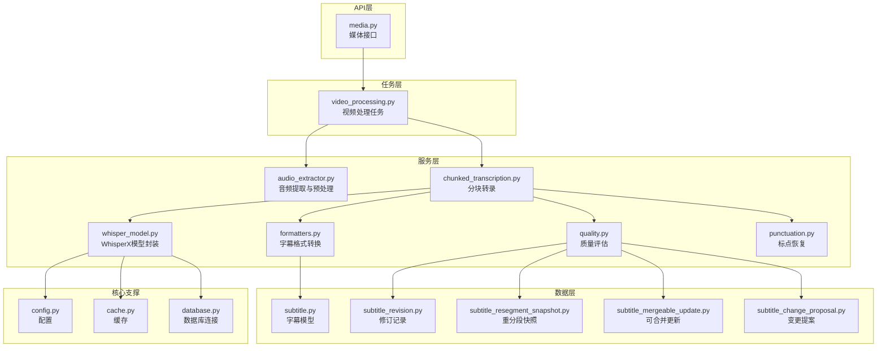
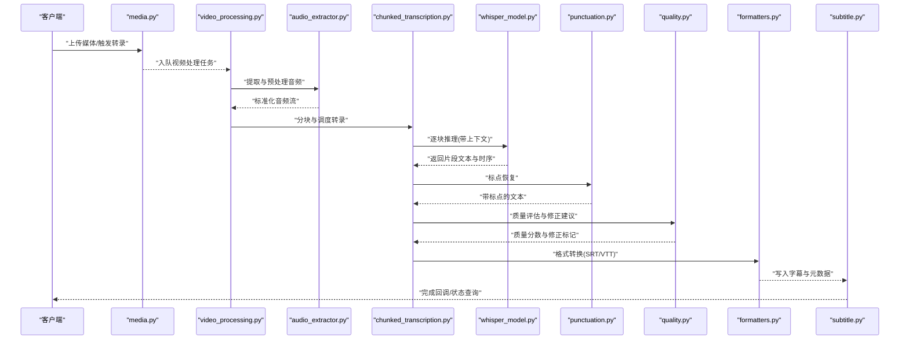
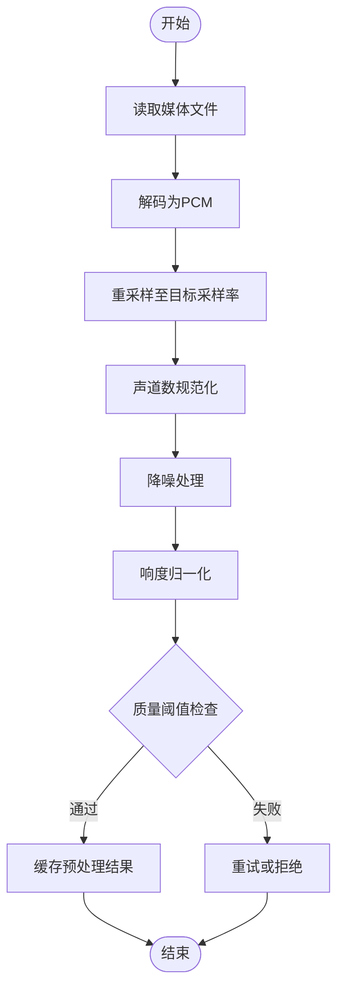
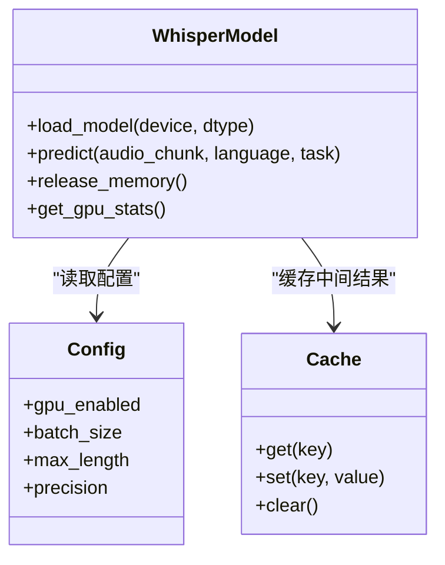
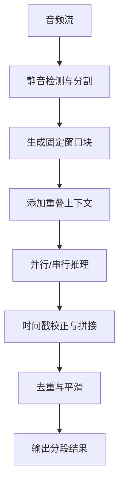
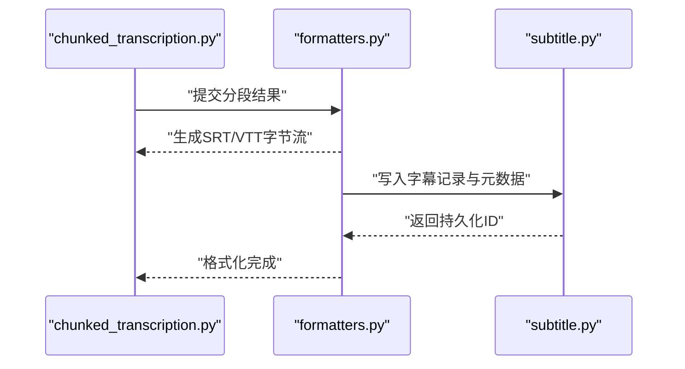
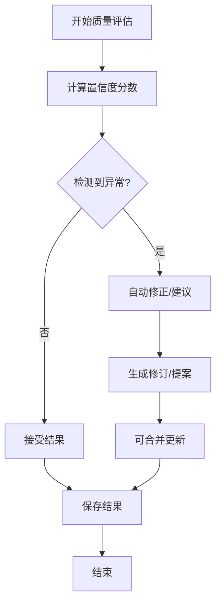
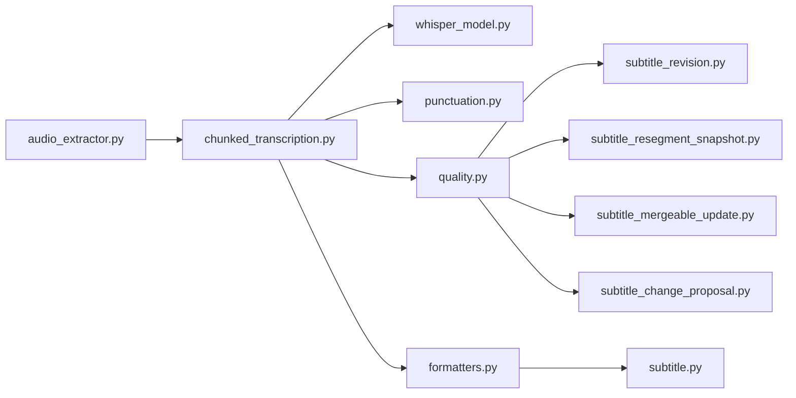

# WhisperX语音识别集成

<cite>
**本文引用的文件**
- [backend/app/services/transcription/__init__.py](file://backend/app/services/transcription/__init__.py)
- [backend/app/services/transcription/audio_extractor.py](file://backend/app/services/transcription/audio_extractor.py)
- [backend/app/services/transcription/chunked_transcription.py](file://backend/app/services/transcription/chunked_transcription.py)
- [backend/app/services/transcription/exceptions.py](file://backend/app/services/transcription/exceptions.py)
- [backend/app/services/transcription/formatters.py](file://backend/app/services/transcription/formatters.py)
- [backend/app/services/transcription/punctuation.py](file://backend/app/services/transcription/punctuation.py)
- [backend/app/services/transcription/quality.py](file://backend/app/services/transcription/quality.py)
- [backend/app/services/transcription/whisper_model.py](file://backend/app/services/transcription/whisper_model.py)
- [backend/app/models/subtitle.py](file://backend/app/models/subtitle.py)
- [backend/app/models/subtitle_revision.py](file://backend/app/models/subtitle_revision.py)
- [backend/app/models/subtitle_resegment_snapshot.py](file://backend/app/models/subtitle_resegment_snapshot.py)
- [backend/app/models/subtitle_mergeable_update.py](file://backend/app/models/subtitle_mergeable_update.py)
- [backend/app/models/subtitle_change_proposal.py](file://backend/app/models/subtitle_change_proposal.py)
- [backend/app/api/v1/media.py](file://backend/app/api/v1/media.py)
- [backend/app/tasks/video_processing.py](file://backend/app/tasks/video_processing.py)
- [backend/app/core/config.py](file://backend/app/core/config.py)
- [backend/app/core/cache.py](file://backend/app/core/cache.py)
- [backend/app/core/database.py](file://backend/app/core/database.py)
- [backend/tests/test_whisperx_oom_retry.py](file://backend/tests/test_whisperx_oom_retry.py)
- [backend/tests/test_whisperx_segmentation.py](file://backend/tests/test_whisperx_segmentation.py)
</cite>

## 目录
1. [简介](#简介)
2. [项目结构](#项目结构)
3. [核心组件](#核心组件)
4. [架构总览](#架构总览)
5. [详细组件分析](#详细组件分析)
6. [依赖关系分析](#依赖关系分析)
7. [性能考量](#性能考量)
8. [故障排查指南](#故障排查指南)
9. [结论](#结论)
10. [附录](#附录)

## 简介
本技术文档围绕WhisperX语音识别服务，系统化阐述音频预处理、模型配置与调用、分段转录机制、结果格式化输出、质量控制与优化策略。面向开发者与运维人员，提供从端到端的实现说明、架构图示、常见问题定位与解决方案，帮助在生产环境中稳定高效地部署与使用WhisperX能力。

## 项目结构
后端采用分层与服务化组织：
- API层：暴露媒体处理接口，触发转录任务。
- 服务层：transcription子模块封装音频提取、分块、模型调用、标点恢复、质量评估与格式转换等能力。
- 数据模型：字幕及其修订、重分段快照、可合并更新、变更提案等持久化实体。
- 任务层：异步任务编排视频处理流水线（含转录）。
- 核心支撑：配置、缓存、数据库连接等基础设施。

图表来源
- [backend/app/api/v1/media.py](file://backend/app/api/v1/media.py)
- [backend/app/tasks/video_processing.py](file://backend/app/tasks/video_processing.py)
- [backend/app/services/transcription/audio_extractor.py](file://backend/app/services/transcription/audio_extractor.py)
- [backend/app/services/transcription/chunked_transcription.py](file://backend/app/services/transcription/chunked_transcription.py)
- [backend/app/services/transcription/whisper_model.py](file://backend/app/services/transcription/whisper_model.py)
- [backend/app/services/transcription/formatters.py](file://backend/app/services/transcription/formatters.py)
- [backend/app/services/transcription/quality.py](file://backend/app/services/transcription/quality.py)
- [backend/app/services/transcription/punctuation.py](file://backend/app/services/transcription/punctuation.py)
- [backend/app/models/subtitle.py](file://backend/app/models/subtitle.py)
- [backend/app/models/subtitle_revision.py](file://backend/app/models/subtitle_revision.py)
- [backend/app/models/subtitle_resegment_snapshot.py](file://backend/app/models/subtitle_resegment_snapshot.py)
- [backend/app/models/subtitle_mergeable_update.py](file://backend/app/models/subtitle_mergeable_update.py)
- [backend/app/models/subtitle_change_proposal.py](file://backend/app/models/subtitle_change_proposal.py)
- [backend/app/core/config.py](file://backend/app/core/config.py)
- [backend/app/core/cache.py](file://backend/app/core/cache.py)
- [backend/app/core/database.py](file://backend/app/core/database.py)

章节来源
- [backend/app/api/v1/media.py](file://backend/app/api/v1/media.py)
- [backend/app/tasks/video_processing.py](file://backend/app/tasks/video_processing.py)
- [backend/app/services/transcription/__init__.py](file://backend/app/services/transcription/__init__.py)

## 核心组件
- 音频提取与预处理：负责从媒体源抽取音频流，统一采样率与声道，进行降噪与响度归一化，确保输入质量满足模型要求。
- 分块转录：将长音频切分为适合GPU显存的片段，管理上下文重叠与边界对齐，保证时间戳连续性与语义连贯性。
- WhisperX模型封装：集中管理模型加载、设备选择（CPU/GPU）、批大小、内存管理与并发控制，支持重试与OOM恢复。
- 标点恢复：在转录后对文本进行标点恢复，提升可读性与下游任务可用性。
- 质量评估：基于置信度、噪声水平、重复检测等指标评估转录质量，驱动自动修正或人工审核流程。
- 格式转换：将内部转录结果转换为SRT、VTT等标准字幕格式，便于前端播放与编辑。

章节来源
- [backend/app/services/transcription/audio_extractor.py](file://backend/app/services/transcription/audio_extractor.py)
- [backend/app/services/transcription/chunked_transcription.py](file://backend/app/services/transcription/chunked_transcription.py)
- [backend/app/services/transcription/whisper_model.py](file://backend/app/services/transcription/whisper_model.py)
- [backend/app/services/transcription/punctuation.py](file://backend/app/services/transcription/punctuation.py)
- [backend/app/services/transcription/quality.py](file://backend/app/services/transcription/quality.py)
- [backend/app/services/transcription/formatters.py](file://backend/app/services/transcription/formatters.py)

## 架构总览
整体流程从媒体接口触发，进入异步任务队列执行视频处理流水线；转录阶段由分块模块协调音频预处理、模型推理、标点恢复与质量评估；最终通过格式转换器生成标准字幕并持久化到数据库，同时记录修订与快照以支持后续编辑与回溯。

图表来源
- [backend/app/api/v1/media.py](file://backend/app/api/v1/media.py)
- [backend/app/tasks/video_processing.py](file://backend/app/tasks/video_processing.py)
- [backend/app/services/transcription/audio_extractor.py](file://backend/app/services/transcription/audio_extractor.py)
- [backend/app/services/transcription/chunked_transcription.py](file://backend/app/services/transcription/chunked_transcription.py)
- [backend/app/services/transcription/whisper_model.py](file://backend/app/services/transcription/whisper_model.py)
- [backend/app/services/transcription/punctuation.py](file://backend/app/services/transcription/punctuation.py)
- [backend/app/services/transcription/quality.py](file://backend/app/services/transcription/quality.py)
- [backend/app/services/transcription/formatters.py](file://backend/app/services/transcription/formatters.py)
- [backend/app/models/subtitle.py](file://backend/app/models/subtitle.py)

## 详细组件分析

### 音频预处理流程（格式转换、降噪、质量优化）
- 输入适配：支持多种媒体容器与编码，统一解码为PCM，按目标采样率重采样至单声道或立体声。
- 降噪与增益：应用频谱降噪与动态范围压缩，避免削波与底噪过高。
- 质量校验：计算信噪比、峰值电平、静音段比例，不达标则回退或提示重新采集。
- 缓存策略：对相同媒体指纹的预处理结果进行缓存，减少重复计算。

图表来源
- [backend/app/services/transcription/audio_extractor.py](file://backend/app/services/transcription/audio_extractor.py)
- [backend/app/core/cache.py](file://backend/app/core/cache.py)

章节来源
- [backend/app/services/transcription/audio_extractor.py](file://backend/app/services/transcription/audio_extractor.py)
- [backend/app/core/cache.py](file://backend/app/core/cache.py)

### WhisperX模型配置与调用（GPU加速、内存管理、并发）
- 设备选择：优先GPU，回退CPU；根据显存容量动态调整批大小与序列长度。
- 模型加载：延迟加载与预热，支持多实例隔离以避免资源竞争。
- 内存管理：启用梯度关闭、混合精度、显存清理；监控峰值显存并触发安全降级。
- 并发控制：限制并发请求数，防止过载；失败自动重试与指数退避。

图表来源
- [backend/app/services/transcription/whisper_model.py](file://backend/app/services/transcription/whisper_model.py)
- [backend/app/core/config.py](file://backend/app/core/config.py)
- [backend/app/core/cache.py](file://backend/app/core/cache.py)

章节来源
- [backend/app/services/transcription/whisper_model.py](file://backend/app/services/transcription/whisper_model.py)
- [backend/app/core/config.py](file://backend/app/core/config.py)
- [backend/app/core/cache.py](file://backend/app/core/cache.py)

### 分段转录机制（音频分块、时间戳对齐、上下文保持）
- 分块策略：固定时长窗口+滑动重叠，平衡内存占用与连续性；依据静音检测自适应调整。
- 时间戳对齐：跨块拼接时校正偏移，消除累积误差；保留原始帧级时间戳用于对齐。
- 上下文保持：相邻块共享前后若干秒上下文，提升边界处识别稳定性。
- 异常处理：块级别失败不影响整体，支持局部重试与兜底策略。

图表来源
- [backend/app/services/transcription/chunked_transcription.py](file://backend/app/services/transcription/chunked_transcription.py)

章节来源
- [backend/app/services/transcription/chunked_transcription.py](file://backend/app/services/transcription/chunked_transcription.py)

### 转录结果格式化输出（SRT、VTT等）
- 内部表示：统一为时间段+文本+置信度的结构化对象。
- 格式转换：按规范生成SRT/VTT，包含序号、时间轴、文本与可选样式。
- 兼容性：处理换行、特殊字符、时间精度与语言标签。
- 存储：持久化字幕与元数据，支持版本与修订追踪。

图表来源
- [backend/app/services/transcription/formatters.py](file://backend/app/services/transcription/formatters.py)
- [backend/app/models/subtitle.py](file://backend/app/models/subtitle.py)

章节来源
- [backend/app/services/transcription/formatters.py](file://backend/app/services/transcription/formatters.py)
- [backend/app/models/subtitle.py](file://backend/app/models/subtitle.py)

### 转录质量控制（置信度评估、错误检测、自动修正）
- 置信度评估：基于模型概率、声学得分与文本流畅度综合打分。
- 错误检测：重复词、异常停顿、低信噪比片段标记。
- 自动修正：规则与轻量模型结合进行标点恢复、同音词替换、断句优化。
- 审计与回溯：记录修订历史与快照，支持人工审核与合并更新。

图表来源
- [backend/app/services/transcription/quality.py](file://backend/app/services/transcription/quality.py)
- [backend/app/models/subtitle_revision.py](file://backend/app/models/subtitle_revision.py)
- [backend/app/models/subtitle_resegment_snapshot.py](file://backend/app/models/subtitle_resegment_snapshot.py)
- [backend/app/models/subtitle_mergeable_update.py](file://backend/app/models/subtitle_mergeable_update.py)
- [backend/app/models/subtitle_change_proposal.py](file://backend/app/models/subtitle_change_proposal.py)

章节来源
- [backend/app/services/transcription/quality.py](file://backend/app/services/transcription/quality.py)
- [backend/app/models/subtitle_revision.py](file://backend/app/models/subtitle_revision.py)
- [backend/app/models/subtitle_resegment_snapshot.py](file://backend/app/models/subtitle_resegment_snapshot.py)
- [backend/app/models/subtitle_mergeable_update.py](file://backend/app/models/subtitle_mergeable_update.py)
- [backend/app/models/subtitle_change_proposal.py](file://backend/app/models/subtitle_change_proposal.py)

### 标点恢复
- 输入：无标点或弱标点文本。
- 方法：基于统计与规则的标点预测，结合上下文语义。
- 输出：带标点文本，供下游翻译与展示使用。

章节来源
- [backend/app/services/transcription/punctuation.py](file://backend/app/services/transcription/punctuation.py)

## 依赖关系分析
- 组件耦合：分块模块依赖模型封装与标点恢复；质量评估依赖多个模型与规则；格式转换依赖数据库模型。
- 外部依赖：GPU运行时、音频编解码库、数据库与缓存系统。
- 潜在循环：应避免服务间直接循环导入，通过接口或事件解耦。

图表来源
- [backend/app/services/transcription/audio_extractor.py](file://backend/app/services/transcription/audio_extractor.py)
- [backend/app/services/transcription/chunked_transcription.py](file://backend/app/services/transcription/chunked_transcription.py)
- [backend/app/services/transcription/whisper_model.py](file://backend/app/services/transcription/whisper_model.py)
- [backend/app/services/transcription/punctuation.py](file://backend/app/services/transcription/punctuation.py)
- [backend/app/services/transcription/quality.py](file://backend/app/services/transcription/quality.py)
- [backend/app/services/transcription/formatters.py](file://backend/app/services/transcription/formatters.py)
- [backend/app/models/subtitle.py](file://backend/app/models/subtitle.py)
- [backend/app/models/subtitle_revision.py](file://backend/app/models/subtitle_revision.py)
- [backend/app/models/subtitle_resegment_snapshot.py](file://backend/app/models/subtitle_resegment_snapshot.py)
- [backend/app/models/subtitle_mergeable_update.py](file://backend/app/models/subtitle_mergeable_update.py)
- [backend/app/models/subtitle_change_proposal.py](file://backend/app/models/subtitle_change_proposal.py)

章节来源
- [backend/app/services/transcription/__init__.py](file://backend/app/services/transcription/__init__.py)

## 性能考量
- GPU加速：启用CUDA与混合精度，合理设置批大小与最大序列长度，避免显存溢出。
- 内存管理：及时释放中间张量，定期清理缓存，监控峰值显存并触发降级。
- 并发处理：限制并发任务数，使用队列背压；热点数据缓存减少重复计算。
- 批量能力：聚合短音频进行批推理，提高吞吐；长音频分块并行处理。
- 缓存策略：对预处理结果、模型中间特征与常见短语进行缓存，缩短响应时间。

[本节为通用指导，无需特定文件引用]

## 故障排查指南
- OOM与重试：当显存不足时自动降级参数并重试，必要时回退CPU模式。
- 分段异常：检查静音检测与分块参数，确认时间戳对齐逻辑。
- 质量低下：查看置信度分布与错误标记，调整降噪与标点恢复策略。
- 格式错误：验证SRT/VTT时间轴与字符编码，确保兼容播放器。
- 日志与测试：利用单元测试覆盖关键路径，如OOM重试与分段行为。

章节来源
- [backend/tests/test_whisperx_oom_retry.py](file://backend/tests/test_whisperx_oom_retry.py)
- [backend/tests/test_whisperx_segmentation.py](file://backend/tests/test_whisperx_segmentation.py)
- [backend/app/services/transcription/exceptions.py](file://backend/app/services/transcription/exceptions.py)

## 结论
本WhisperX语音识别服务通过模块化设计与完善的预处理、分块、模型封装、质量评估与格式转换，实现了高可用、高性能的端到端转录能力。生产环境应重点关注GPU资源管理、并发控制与质量闭环，结合缓存与批量策略持续提升吞吐与稳定性。

[本节为总结，无需特定文件引用]

## 附录
- 配置项建议：明确GPU开关、批大小、精度、超时与重试策略。
- 监控指标：显存占用、推理耗时、成功率、质量分数分布。
- 运维脚本：参考scripts目录中的GPU工作进程与批量处理脚本，辅助部署与调试。

[本节为补充信息，无需特定文件引用]
