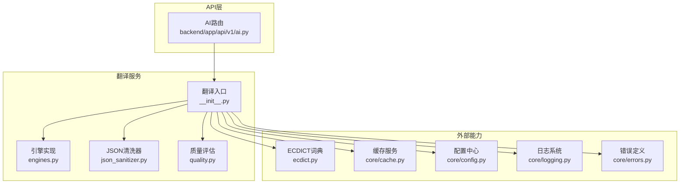
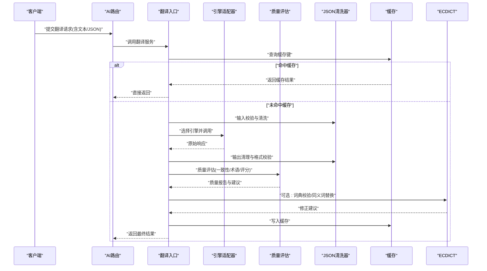
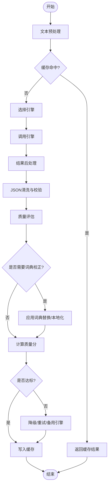
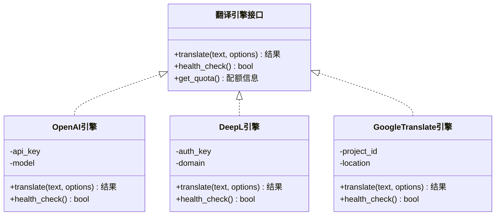
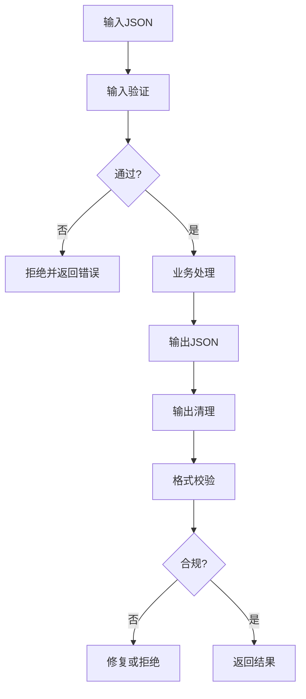
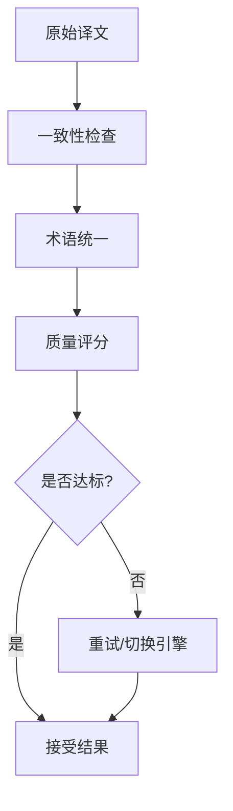
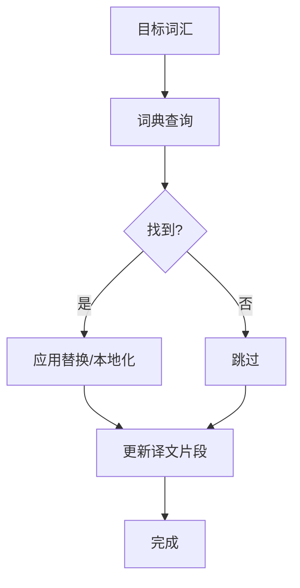
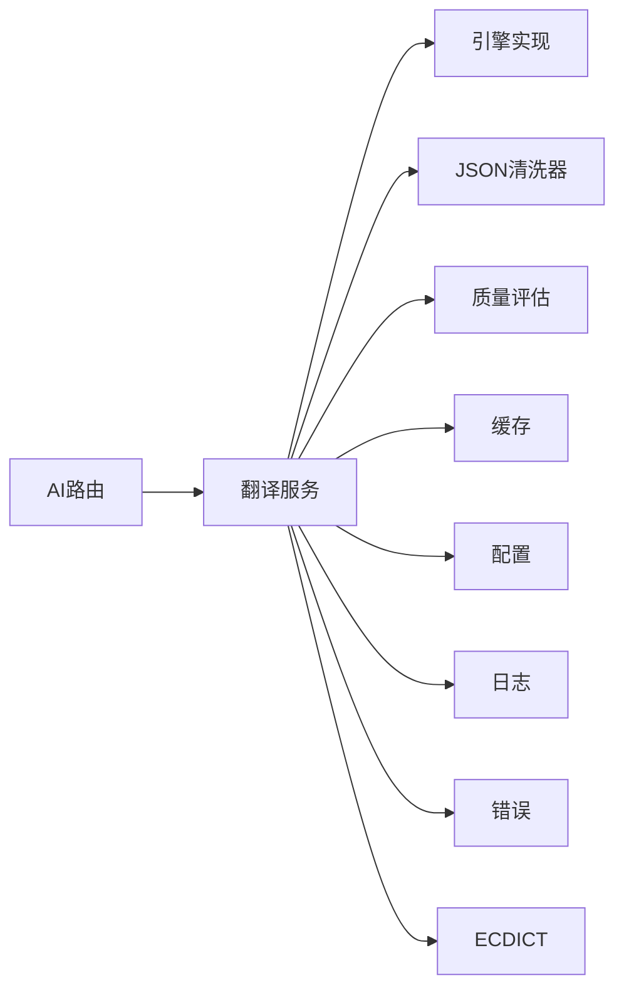

# 翻译服务引擎

<cite>
**本文引用的文件**
- [backend/app/services/translation/__init__.py](file://backend/app/services/translation/__init__.py)
- [backend/app/services/translation/engines.py](file://backend/app/services/translation/engines.py)
- [backend/app/services/translation/json_sanitizer.py](file://backend/app/services/translation/json_sanitizer.py)
- [backend/app/services/translation/quality.py](file://backend/app/services/translation/quality.py)
- [backend/app/services/ecdict.py](file://backend/app/services/ecdict.py)
- [backend/app/core/cache.py](file://backend/app/core/cache.py)
- [backend/app/core/config.py](file://backend/app/core/config.py)
- [backend/app/core/logging.py](file://backend/app/core/logging.py)
- [backend/app/core/errors.py](file://backend/app/core/errors.py)
- [backend/app/api/v1/ai.py](file://backend/app/api/v1/ai.py)
- [backend/tests/test_translation_service.py](file://backend/tests/test_translation_service.py)
</cite>

## 目录
1. [简介](#简介)
2. [项目结构](#项目结构)
3. [核心组件](#核心组件)
4. [架构总览](#架构总览)
5. [详细组件分析](#详细组件分析)
6. [依赖关系分析](#依赖关系分析)
7. [性能考量](#性能考量)
8. [故障排查指南](#故障排查指南)
9. [结论](#结论)
10. [附录](#附录)

## 简介
本文件为“翻译服务引擎”的综合技术文档，面向开发者与运维人员，系统化阐述多翻译引擎的抽象接口、请求处理流程、JSON数据安全机制、质量评估体系、ECDICT词典集成、缓存策略、错误重试与降级方案，以及监控、日志与调试实践。目标是让读者在不深入源码的情况下也能理解并正确使用该引擎。

## 项目结构
翻译相关能力集中在后端服务的 services/translation 模块中，并通过 API 层暴露对外能力；同时与缓存、配置、日志、错误等基础能力解耦协作。

图表来源
- [backend/app/api/v1/ai.py](file://backend/app/api/v1/ai.py)
- [backend/app/services/translation/__init__.py](file://backend/app/services/translation/__init__.py)
- [backend/app/services/translation/engines.py](file://backend/app/services/translation/engines.py)
- [backend/app/services/translation/json_sanitizer.py](file://backend/app/services/translation/json_sanitizer.py)
- [backend/app/services/translation/quality.py](file://backend/app/services/translation/quality.py)
- [backend/app/services/ecdict.py](file://backend/app/services/ecdict.py)
- [backend/app/core/cache.py](file://backend/app/core/cache.py)
- [backend/app/core/config.py](file://backend/app/core/config.py)
- [backend/app/core/logging.py](file://backend/app/core/logging.py)
- [backend/app/core/errors.py](file://backend/app/core/errors.py)

章节来源
- [backend/app/api/v1/ai.py](file://backend/app/api/v1/ai.py)
- [backend/app/services/translation/__init__.py](file://backend/app/services/translation/__init__.py)

## 核心组件
- 翻译入口：统一编排文本预处理、引擎选择、调用、后处理与质量评估。
- 引擎抽象与实现：对 OpenAI、DeepL、Google Translate 等提供统一接口，屏蔽差异。
- JSON 安全清洗：输入校验、输出清理、格式校验，确保结构化数据稳定可用。
- 质量评估：一致性检查、术语统一、质量评分与回退策略。
- ECDICT 词典：词汇查询、同义词替换、本地化支持。
- 缓存与配置：键值缓存、配置注入、可观测性（日志）。
- 错误与重试：标准化异常、指数退避重试、降级到备用引擎或规则引擎。

章节来源
- [backend/app/services/translation/__init__.py](file://backend/app/services/translation/__init__.py)
- [backend/app/services/translation/engines.py](file://backend/app/services/translation/engines.py)
- [backend/app/services/translation/json_sanitizer.py](file://backend/app/services/translation/json_sanitizer.py)
- [backend/app/services/translation/quality.py](file://backend/app/services/translation/quality.py)
- [backend/app/services/ecdict.py](file://backend/app/services/ecdict.py)
- [backend/app/core/cache.py](file://backend/app/core/cache.py)
- [backend/app/core/config.py](file://backend/app/core/config.py)
- [backend/app/core/logging.py](file://backend/app/core/logging.py)
- [backend/app/core/errors.py](file://backend/app/core/errors.py)

## 架构总览
下图展示了从 API 到翻译引擎、词典、缓存与质量评估的整体交互。

图表来源
- [backend/app/api/v1/ai.py](file://backend/app/api/v1/ai.py)
- [backend/app/services/translation/__init__.py](file://backend/app/services/translation/__init__.py)
- [backend/app/services/translation/engines.py](file://backend/app/services/translation/engines.py)
- [backend/app/services/translation/json_sanitizer.py](file://backend/app/services/translation/json_sanitizer.py)
- [backend/app/services/translation/quality.py](file://backend/app/services/translation/quality.py)
- [backend/app/services/ecdict.py](file://backend/app/services/ecdict.py)
- [backend/app/core/cache.py](file://backend/app/core/cache.py)

## 详细组件分析

### 翻译入口与请求处理流程
- 职责：接收请求、参数校验、选择引擎、调用、后处理、质量评估、缓存读写。
- 关键点：
  - 文本预处理：规范化编码、去除不可见字符、长度限制、敏感词过滤。
  - 引擎选择：按优先级、配额、延迟、成本动态选择。
  - 结果后处理：格式化、字段映射、单位/时区/数字规范化。
  - 质量评估：一致性检查、术语统一、评分阈值与回退。
  - 缓存策略：键生成、TTL、失效条件、并发保护。
  - 错误处理：分类异常、重试、降级、熔断。

图表来源
- [backend/app/services/translation/__init__.py](file://backend/app/services/translation/__init__.py)
- [backend/app/services/translation/json_sanitizer.py](file://backend/app/services/translation/json_sanitizer.py)
- [backend/app/services/translation/quality.py](file://backend/app/services/translation/quality.py)
- [backend/app/services/ecdict.py](file://backend/app/services/ecdict.py)
- [backend/app/core/cache.py](file://backend/app/core/cache.py)

章节来源
- [backend/app/services/translation/__init__.py](file://backend/app/services/translation/__init__.py)

### 多引擎抽象与实现
- 抽象接口：统一的 translate(text, options) 方法，返回标准化结构。
- 引擎实现：OpenAI、DeepL、Google Translate 等分别封装鉴权、限流、重试、错误码映射。
- 适配层：负责参数转换、响应解析、字段对齐、失败回退。

图表来源
- [backend/app/services/translation/engines.py](file://backend/app/services/translation/engines.py)

章节来源
- [backend/app/services/translation/engines.py](file://backend/app/services/translation/engines.py)

### JSON 数据安全处理
- 输入验证：类型检查、必填字段、长度限制、白名单字段、正则匹配。
- 输出清理：移除危险字符、HTML/脚本标签过滤、数值范围归一化。
- 格式校验：JSON Schema 校验、字段映射、缺失字段默认值填充。
- 安全策略：最小权限原则、敏感字段脱敏、审计日志记录。

图表来源
- [backend/app/services/translation/json_sanitizer.py](file://backend/app/services/translation/json_sanitizer.py)

章节来源
- [backend/app/services/translation/json_sanitizer.py](file://backend/app/services/translation/json_sanitizer.py)

### 翻译质量评估体系
- 一致性检查：术语一致性、风格一致性、跨段落一致性。
- 术语统一：基于词典与术语库进行替换与对齐。
- 质量评分：语义相似度、流畅度、可读性、领域适配度。
- 回退策略：低于阈值触发重试、切换引擎或启用规则引擎。

图表来源
- [backend/app/services/translation/quality.py](file://backend/app/services/translation/quality.py)

章节来源
- [backend/app/services/translation/quality.py](file://backend/app/services/translation/quality.py)

### ECDICT 词典集成
- 词汇查询：根据词条获取释义、词性、例句、同义词。
- 同义词替换：在特定上下文中进行替换以提升可读性与一致性。
- 本地化支持：地区用语差异、文化适配、术语表管理。
- 使用场景：术语校验、歧义消解、风格统一。

图表来源
- [backend/app/services/ecdict.py](file://backend/app/services/ecdict.py)

章节来源
- [backend/app/services/ecdict.py](file://backend/app/services/ecdict.py)

### 缓存策略
- 键生成：基于输入哈希、语言对、模型版本、选项组合。
- TTL 与失效：按内容稳定性设置过期时间，支持主动失效。
- 并发控制：分布式锁避免缓存击穿。
- 命中率优化：粒度拆分、预取与预热。

章节来源
- [backend/app/core/cache.py](file://backend/app/core/cache.py)

### 错误重试与降级
- 重试策略：指数退避、最大重试次数、抖动随机化。
- 降级路径：切换到备用引擎、规则引擎、本地缓存或默认模板。
- 熔断保护：快速失败避免雪崩，恢复后自动探测。
- 错误分类：网络错误、认证失败、限流、业务异常。

章节来源
- [backend/app/core/errors.py](file://backend/app/core/errors.py)

### 监控、日志与调试
- 日志规范：结构化日志、关键路径埋点、敏感信息脱敏。
- 指标采集：延迟、吞吐、错误率、缓存命中率、质量分分布。
- 调试工具：请求追踪、慢查询定位、引擎健康检查。
- 告警策略：阈值告警、趋势告警、容量预警。

章节来源
- [backend/app/core/logging.py](file://backend/app/core/logging.py)

## 依赖关系分析
翻译服务依赖配置、缓存、日志、错误定义与词典服务，API 层作为入口协调各组件。

图表来源
- [backend/app/api/v1/ai.py](file://backend/app/api/v1/ai.py)
- [backend/app/services/translation/__init__.py](file://backend/app/services/translation/__init__.py)
- [backend/app/services/translation/engines.py](file://backend/app/services/translation/engines.py)
- [backend/app/services/translation/json_sanitizer.py](file://backend/app/services/translation/json_sanitizer.py)
- [backend/app/services/translation/quality.py](file://backend/app/services/translation/quality.py)
- [backend/app/services/ecdict.py](file://backend/app/services/ecdict.py)
- [backend/app/core/cache.py](file://backend/app/core/cache.py)
- [backend/app/core/config.py](file://backend/app/core/config.py)
- [backend/app/core/logging.py](file://backend/app/core/logging.py)
- [backend/app/core/errors.py](file://backend/app/core/errors.py)

章节来源
- [backend/app/api/v1/ai.py](file://backend/app/api/v1/ai.py)
- [backend/app/services/translation/__init__.py](file://backend/app/services/translation/__init__.py)

## 性能考量
- 并行调用：多引擎健康探测与备选路径并行，减少首包延迟。
- 缓存优先：热点内容高命中率，降低外部调用压力。
- 批处理：批量翻译与合并响应，提升吞吐。
- 资源隔离：引擎调用池、连接池、超时与限流。
- 质量评估开销：轻量级检查前置，重评估异步化。

[本节为通用指导，不直接分析具体文件]

## 故障排查指南
- 常见问题：
  - 引擎不可用：检查健康状态、密钥与配额、网络连通性。
  - JSON 校验失败：核对输入结构与字段类型，查看清洗日志。
  - 质量分过低：检查术语库与词典覆盖，调整阈值与回退策略。
  - 缓存未命中：确认键生成逻辑与 TTL 设置。
- 诊断步骤：
  - 查看结构化日志与追踪 ID。
  - 检查错误分类与重试计数。
  - 对比不同引擎结果差异。
  - 使用测试用例复现问题。

章节来源
- [backend/app/core/errors.py](file://backend/app/core/errors.py)
- [backend/app/core/logging.py](file://backend/app/core/logging.py)
- [backend/tests/test_translation_service.py](file://backend/tests/test_translation_service.py)

## 结论
翻译服务引擎通过统一的抽象接口整合多提供商能力，结合严格的 JSON 安全处理、质量评估与词典校正，形成稳定可靠的翻译流水线。配合缓存、重试与降级策略，能够在高并发与不稳定环境下保持高质量输出。完善的监控与日志体系为持续优化与故障定位提供了坚实基础。

[本节为总结性内容，不直接分析具体文件]

## 附录
- 最佳实践：
  - 始终对输入进行严格校验与清洗。
  - 使用质量评估驱动的回退与升级策略。
  - 合理设置缓存粒度与 TTL，避免脏读。
  - 定期更新术语库与词典，保持本地化一致性。
- 扩展建议：
  - 新增引擎只需实现统一接口并在注册表中声明。
  - 引入更多质量维度（如领域适配度、可读性指标）。
  - 增强 A/B 测试与灰度发布能力。

[本节为补充说明，不直接分析具体文件]
