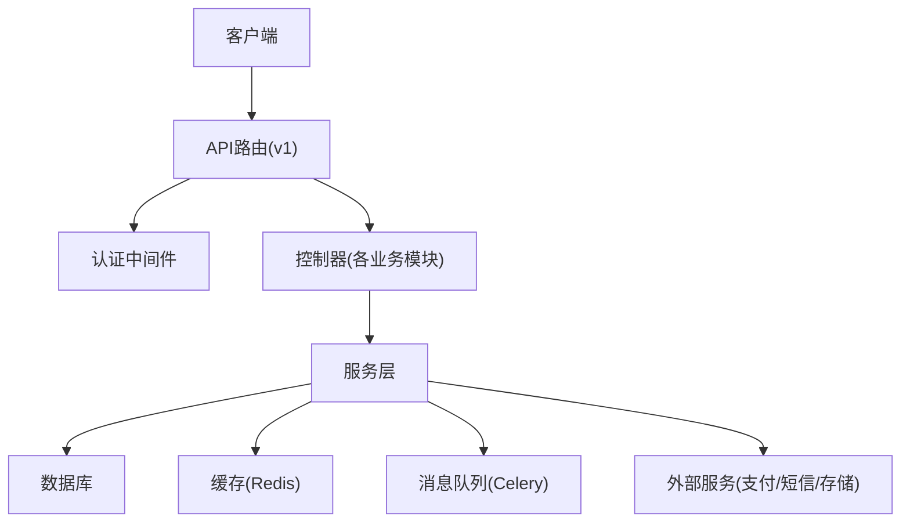
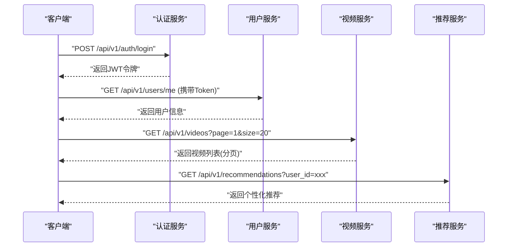
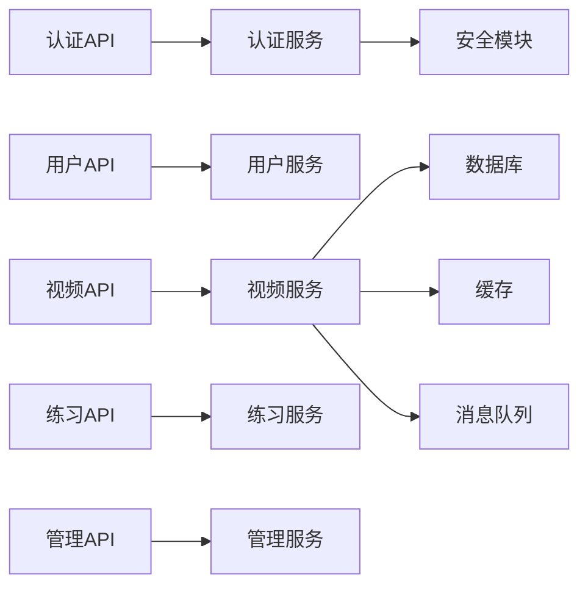

# API参考文档

<cite>
**本文档引用的文件**
- [backend/app/main.py](file://backend/app/main.py)
- [backend/app/api/v1/auth.py](file://backend/app/api/v1/auth.py)
- [backend/app/api/v1/users.py](file://backend/app/api/v1/users.py)
- [backend/app/api/v1/videos.py](file://backend/app/api/v1/videos.py)
- [backend/app/api/v1/comments.py](file://backend/app/api/v1/comments.py)
- [backend/app/api/v1/favorites.py](file://backend/app/api/v1/favorites.py)
- [backend/app/api/v1/practice.py](file://backend/app/api/v1/practice.py)
- [backend/app/api/v1/shadowing.py](file://backend/app/api/v1/shadowing.py)
- [backend/app/api/v1/learning.py](file://backend/app/api/v1/learning.py)
- [backend/app/api/v1/learning_plan.py](file://backend/app/api/v1/learning_plan.py)
- [backend/app/api/v1/media.py](file://backend/app/api/v1/media.py)
- [backend/app/api/v1/recommendations.py](file://backend/app/api/v1/recommendations.py)
- [backend/app/api/v1/search.py](file://backend/app/api/v1/search.py)
- [backend/app/api/v1/admin.py](file://backend/app/api/v1/admin.py)
- [backend/app/core/security.py](file://backend/app/core/security.py)
- [backend/app/core/config.py](file://backend/app/core/config.py)
- [backend/app/core/errors.py](file://backend/app/core/errors.py)
- [backend/app/schemas/common.py](file://backend/app/schemas/common.py)
- [backend/app/schemas/pagination.py](file://backend/app/schemas/pagination.py)
- [backend/app/schemas/user.py](file://backend/app/schemas/user.py)
- [backend/app/schemas/video.py](file://backend/app/schemas/video.py)
- [backend/app/services/video_service.py](file://backend/app/services/video_service.py)
- [backend/app/services/auth_service.py](file://backend/app/services/auth_service.py)
</cite>

## 目录
1. [简介](#简介)
2. [项目结构](#项目结构)
3. [核心组件](#核心组件)
4. [架构总览](#架构总览)
5. [详细组件分析](#详细组件分析)
6. [依赖关系分析](#依赖关系分析)
7. [性能考虑](#性能考虑)
8. [故障排查指南](#故障排查指南)
9. [结论](#结论)
10. [附录](#附录)

## 简介
本文件为Speaking平台的完整API参考文档，覆盖RESTful端点、认证授权、请求头与错误码、数据模型验证规则、分页与搜索过滤、WebSocket实时通信接口（如存在）、版本管理与兼容性策略、最佳实践与限流策略、客户端集成与SDK使用说明。文档面向开发者与集成方，力求以循序渐进的方式呈现从概览到细节的完整信息。

## 项目结构
后端采用模块化分层设计：
- API层：按业务域划分v1路由模块，集中定义HTTP端点与参数校验。
- 服务层：封装领域逻辑、第三方调用与异步任务编排。
- 数据模型与Schema：使用ORM模型与Pydantic Schema进行数据建模与校验。
- 核心能力：安全、配置、缓存、限流、日志、数据库连接等公共能力。



图表来源
- [backend/app/main.py:1-200](file://backend/app/main.py#L1-L200)
- [backend/app/api/v1/auth.py:1-200](file://backend/app/api/v1/auth.py#L1-L200)
- [backend/app/core/security.py:1-200](file://backend/app/core/security.py#L1-L200)

章节来源
- [backend/app/main.py:1-200](file://backend/app/main.py#L1-L200)

## 核心组件
- 认证与授权
  - JWT访问令牌签发与刷新，支持黑名单机制与权限控制。
  - 基于角色的访问控制（RBAC），管理员与普通用户权限分离。
- 数据校验与响应格式
  - Pydantic Schema统一输入输出校验，提供一致的JSON响应结构。
  - 分页对象标准化，包含页码、每页数量、总数、是否首尾页等。
- 限流与缓存
  - 基于IP或用户的请求频率限制，保护后端资源。
  - Redis缓存热点数据，降低数据库压力。
- 异步任务
  - Celery处理耗时任务（视频转写、评分、推荐计算等）。

章节来源
- [backend/app/core/security.py:1-200](file://backend/app/core/security.py#L1-L200)
- [backend/app/schemas/common.py:1-200](file://backend/app/schemas/common.py#L1-L200)
- [backend/app/schemas/pagination.py:1-200](file://backend/app/schemas/pagination.py#L1-L200)
- [backend/app/core/limiter.py:1-200](file://backend/app/core/limiter.py#L1-L200)

## 架构总览
系统采用前后端分离架构，前端通过HTTPS调用后端REST API；部分实时功能可通过WebSocket扩展（当前以REST为主）。关键交互流程如下：



图表来源
- [backend/app/api/v1/auth.py:1-200](file://backend/app/api/v1/auth.py#L1-L200)
- [backend/app/api/v1/users.py:1-200](file://backend/app/api/v1/users.py#L1-L200)
- [backend/app/api/v1/videos.py:1-200](file://backend/app/api/v1/videos.py#L1-L200)
- [backend/app/api/v1/recommendations.py:1-200](file://backend/app/api/v1/recommendations.py#L1-L200)

## 详细组件分析

### 认证与授权API
- 登录
  - 方法：POST
  - URL：/api/v1/auth/login
  - 请求体：用户名/手机号、密码
  - 响应：访问令牌、刷新令牌、过期时间
- 注册
  - 方法：POST
  - URL：/api/v1/auth/register
  - 请求体：用户名、邮箱、密码、验证码（可选）
  - 响应：用户ID、状态
- 刷新令牌
  - 方法：POST
  - URL：/api/v1/auth/refresh
  - 请求体：刷新令牌
  - 响应：新访问令牌
- 登出
  - 方法：POST
  - URL：/api/v1/auth/logout
  - 请求头：Authorization: Bearer <token>
  - 响应：成功状态

章节来源
- [backend/app/api/v1/auth.py:1-200](file://backend/app/api/v1/auth.py#L1-L200)
- [backend/app/core/security.py:1-200](file://backend/app/core/security.py#L1-L200)

### 用户管理API
- 获取当前用户信息
  - 方法：GET
  - URL：/api/v1/users/me
  - 请求头：Authorization: Bearer <token>
  - 响应：用户详情
- 更新用户资料
  - 方法：PUT
  - URL：/api/v1/users/me
  - 请求体：昵称、头像、偏好设置
  - 响应：更新后的用户信息
- 修改密码
  - 方法：PUT
  - URL：/api/v1/users/me/password
  - 请求体：旧密码、新密码
  - 响应：成功状态

章节来源
- [backend/app/api/v1/users.py:1-200](file://backend/app/api/v1/users.py#L1-L200)
- [backend/app/schemas/user.py:1-200](file://backend/app/schemas/user.py#L1-L200)

### 视频内容API
- 获取视频列表（分页）
  - 方法：GET
  - URL：/api/v1/videos?page=1&size=20&sort=newest
  - 查询参数：page、size、sort、category、language
  - 响应：视频数组、分页元数据
- 获取视频详情
  - 方法：GET
  - URL：/api/v1/videos/{video_id}
  - 路径参数：video_id
  - 响应：视频详情、字幕、评分
- 上传视频
  - 方法：POST
  - URL：/api/v1/videos
  - 请求体：multipart/form-data（视频文件、标题、描述）
  - 响应：视频ID、处理状态
- 删除视频
  - 方法：DELETE
  - URL：/api/v1/videos/{video_id}
  - 路径参数：video_id
  - 响应：成功状态

章节来源
- [backend/app/api/v1/videos.py:1-200](file://backend/app/api/v1/videos.py#L1-L200)
- [backend/app/schemas/video.py:1-200](file://backend/app/schemas/video.py#L1-L200)
- [backend/app/services/video_service.py:1-200](file://backend/app/services/video_service.py#L1-L200)

### 评论与互动API
- 获取评论列表
  - 方法：GET
  - URL：/api/v1/videos/{video_id}/comments?page=1&size=20
  - 响应：评论数组、分页元数据
- 发表评论
  - 方法：POST
  - URL：/api/v1/videos/{video_id}/comments
  - 请求体：评论内容、父评论ID（可选）
  - 响应：评论ID、创建时间
- 点赞/取消点赞
  - 方法：POST/DELETE
  - URL：/api/v1/comments/{comment_id}/like
  - 响应：点赞状态

章节来源
- [backend/app/api/v1/comments.py:1-200](file://backend/app/api/v1/comments.py#L1-L200)

### 收藏与学习记录API
- 收藏视频
  - 方法：POST
  - URL：/api/v1/favorites
  - 请求体：video_id
  - 响应：收藏ID
- 取消收藏
  - 方法：DELETE
  - URL：/api/v1/favorites/{favorite_id}
  - 响应：成功状态
- 获取收藏列表
  - 方法：GET
  - URL：/api/v1/favorites?page=1&size=20
  - 响应：收藏视频数组、分页元数据

章节来源
- [backend/app/api/v1/favorites.py:1-200](file://backend/app/api/v1/favorites.py#L1-L200)

### 练习与影子跟读API
- 开始练习会话
  - 方法：POST
  - URL：/api/v1/practice/start
  - 请求体：video_id、mode（shadowing/quiz）
  - 响应：会话ID、初始题目
- 提交练习答案
  - 方法：POST
  - URL：/api/v1/practice/submit
  - 请求体：session_id、answer、score（可选）
  - 响应：评分结果、反馈
- 获取练习历史
  - 方法：GET
  - URL：/api/v1/practice/history?page=1&size=20
  - 响应：练习记录数组、分页元数据

章节来源
- [backend/app/api/v1/practice.py:1-200](file://backend/app/api/v1/practice.py#L1-L200)
- [backend/app/api/v1/shadowing.py:1-200](file://backend/app/api/v1/shadowing.py#L1-L200)

### 学习计划与AI建议API
- 生成学习计划
  - 方法：POST
  - URL：/api/v1/learning-plan/generate
  - 请求体：目标水平、学习时间、兴趣领域
  - 响应：计划ID、每日任务
- 获取学习计划
  - 方法：GET
  - URL：/api/v1/learning-plan/{plan_id}
  - 响应：计划详情、进度
- 更新计划完成状态
  - 方法：PUT
  - URL：/api/v1/learning-plan/{plan_id}/tasks/{task_id}/complete
  - 响应：更新后的计划

章节来源
- [backend/app/api/v1/learning_plan.py:1-200](file://backend/app/api/v1/learning_plan.py#L1-L200)
- [backend/app/api/v1/learning.py:1-200](file://backend/app/api/v1/learning.py#L1-L200)

### 媒体与推荐API
- 获取媒体URL
  - 方法：GET
  - URL：/api/v1/media/{media_id}/url
  - 响应：临时访问链接、过期时间
- 获取推荐内容
  - 方法：GET
  - URL：/api/v1/recommendations?user_id={user_id}&type=videos
  - 响应：推荐列表、权重分数

章节来源
- [backend/app/api/v1/media.py:1-200](file://backend/app/api/v1/media.py#L1-L200)
- [backend/app/api/v1/recommendations.py:1-200](file://backend/app/api/v1/recommendations.py#L1-L200)

### 搜索API
- 全文搜索
  - 方法：GET
  - URL：/api/v1/search?q={query}&type=videos|users|comments&page=1&size=20
  - 响应：搜索结果数组、分页元数据、高亮片段

章节来源
- [backend/app/api/v1/search.py:1-200](file://backend/app/api/v1/search.py#L1-L200)

### 管理后台API
- 获取用户列表
  - 方法：GET
  - URL：/api/v1/admin/users?page=1&size=20&status=active
  - 响应：用户数组、分页元数据
- 封禁/解封用户
  - 方法：PUT
  - URL：/api/v1/admin/users/{user_id}/ban
  - 请求体：reason、duration
  - 响应：更新后的用户状态
- 审核视频
  - 方法：PUT
  - URL：/api/v1/admin/videos/{video_id}/review
  - 请求体：status、notes
  - 响应：审核结果

章节来源
- [backend/app/api/v1/admin.py:1-200](file://backend/app/api/v1/admin.py#L1-L200)

## 依赖关系分析
API层依赖服务层，服务层依赖数据模型和外部服务。关键依赖链：



图表来源
- [backend/app/api/v1/auth.py:1-200](file://backend/app/api/v1/auth.py#L1-L200)
- [backend/app/api/v1/users.py:1-200](file://backend/app/api/v1/users.py#L1-L200)
- [backend/app/api/v1/videos.py:1-200](file://backend/app/api/v1/videos.py#L1-L200)
- [backend/app/services/video_service.py:1-200](file://backend/app/services/video_service.py#L1-L200)

章节来源
- [backend/app/main.py:1-200](file://backend/app/main.py#L1-L200)

## 性能考虑
- 缓存策略：热点数据（用户信息、视频元数据）使用Redis缓存，TTL可配置。
- 分页优化：默认分页大小20，最大100，避免大结果集传输。
- 异步处理：视频转写、评分、推荐计算等耗时操作通过Celery异步执行。
- 连接池：数据库连接池配置合理，避免连接泄漏。
- 压缩：启用Gzip压缩减少网络传输。
- CDN：静态资源和媒体文件通过CDN分发。

## 故障排查指南
- 常见错误码
  - 400：请求参数错误，检查Schema校验
  - 401：未认证或令牌无效，检查Authorization头
  - 403：权限不足，检查用户角色
  - 404：资源不存在，检查URL路径
  - 429：请求过于频繁，检查限流策略
  - 500：服务器内部错误，查看日志
- 调试技巧
  - 启用详细日志：设置DEBUG=true
  - 检查请求链路：使用Trace ID追踪
  - 验证Schema：使用OpenAPI文档校验请求格式
  - 监控指标：关注错误率、延迟、吞吐量

章节来源
- [backend/app/core/errors.py:1-200](file://backend/app/core/errors.py#L1-L200)

## 结论
本API参考文档提供了Speaking平台的核心接口规范、认证机制、数据模型和最佳实践。开发团队应遵循统一的Schema定义和错误处理规范，确保接口的稳定性和可维护性。建议在生产环境启用完整的监控和日志收集，以便快速定位和解决问题。

## 附录

### 认证与授权机制
- JWT令牌：访问令牌有效期15分钟，刷新令牌有效期7天
- 请求头：Authorization: Bearer <access_token>
- 权限控制：基于角色的访问控制（RBAC）
- 令牌黑名单：登出时将令牌加入黑名单

### 数据模型验证规则
- 用户名：3-20位字母数字组合
- 邮箱：标准邮箱格式
- 密码：至少8位，包含大小写字母和数字
- 视频标题：1-100字符
- 评论内容：1-500字符

### 分页规范
- 查询参数：page（页码，默认1）、size（每页数量，默认20，最大100）
- 响应结构：包含data、pagination、meta字段
- 排序：支持按时间、热度、评分排序

### 搜索过滤选项
- 全文搜索：支持关键词匹配和高亮显示
- 类型过滤：videos、users、comments
- 时间范围：created_at、updated_at
- 状态过滤：published、draft、archived

### WebSocket实时通信接口
- 连接地址：wss://api.speaking.com/ws
- 认证：连接时携带JWT令牌
- 事件类型：
  - message：实时消息推送
  - notification：通知更新
  - progress：任务进度更新
  - error：错误事件

### API版本管理
- 版本策略：URL前缀版本化（/api/v1/）
- 向后兼容：新版本不破坏现有接口
- 弃用策略：提前3个月通知，提供迁移指南

### 限流策略
- 基础限流：100请求/分钟/IP
- 认证限流：10请求/分钟/IP（登录接口）
- 高级限流：基于用户等级的差异化限流

### 客户端集成指南
- SDK选择：官方提供的JavaScript/Python SDK
- 错误处理：实现重试机制和降级策略
- 缓存策略：本地缓存热点数据
- 监控上报：集成APM和错误追踪

### 请求响应示例

#### 成功场景
```json
{
  "code": 200,
  "message": "success",
  "data": {
    "id": "123",
    "title": "视频标题",
    "description": "视频描述",
    "created_at": "2024-01-01T00:00:00Z"
  },
  "pagination": {
    "page": 1,
    "size": 20,
    "total": 100,
    "has_next": true,
    "has_prev": false
  }
}
```

#### 失败场景
```json
{
  "code": 400,
  "message": "validation_error",
  "errors": [
    {
      "field": "email",
      "message": "邮箱格式不正确"
    }
  ]
}
```

### 最佳实践
- 使用HTTPS协议
- 实现请求超时和重试机制
- 合理使用缓存减少重复请求
- 批量操作合并多个请求
- 实现优雅的错误处理和用户提示
- 定期更新SDK和依赖库
- 监控API调用性能和错误率
