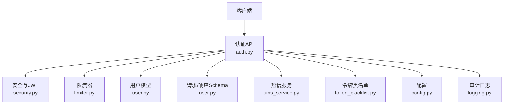
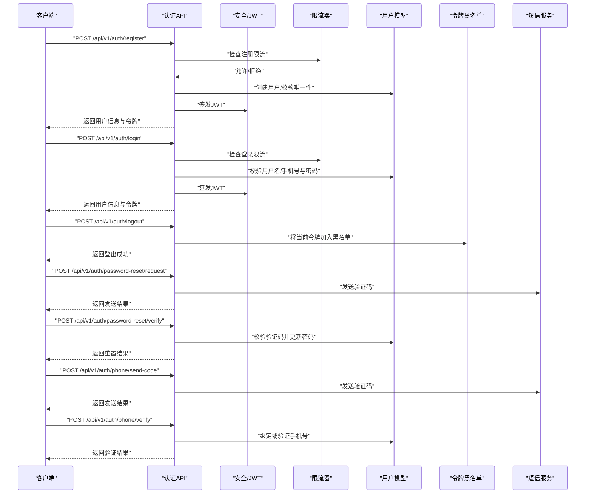
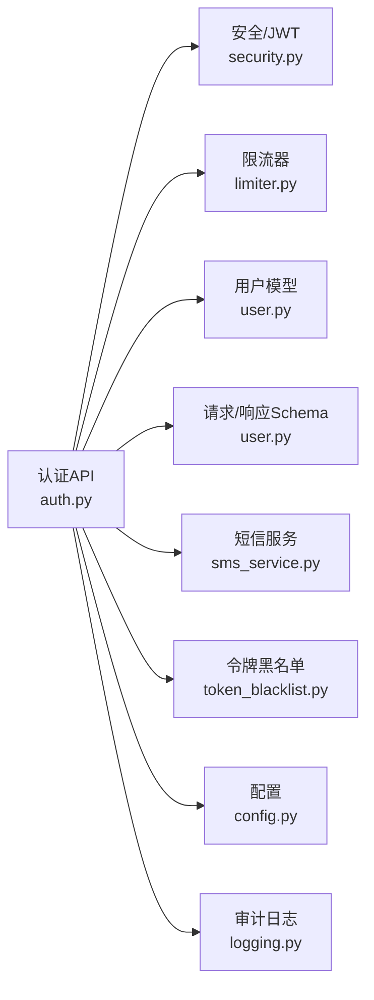
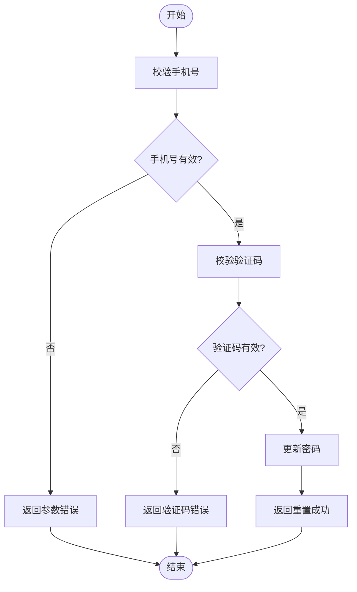
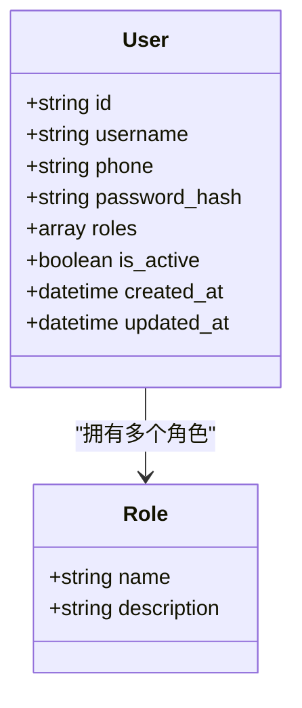

# 用户认证API

<cite>
**本文引用的文件**
- [backend/app/api/v1/auth.py](file://backend/app/api/v1/auth.py)
- [backend/app/core/security.py](file://backend/app/core/security.py)
- [backend/app/core/token_blacklist.py](file://backend/app/core/token_blacklist.py)
- [backend/app/core/limiter.py](file://backend/app/core/limiter.py)
- [backend/app/models/user.py](file://backend/app/models/user.py)
- [backend/app/schemas/user.py](file://backend/app/schemas/user.py)
- [backend/app/services/sms_service.py](file://backend/app/services/sms_service.py)
- [backend/app/core/config.py](file://backend/app/core/config.py)
- [backend/app/core/logging.py](file://backend/app/core/logging.py)
- [backend/tests/test_auth.py](file://backend/tests/test_auth.py)
- [backend/tests/test_auth_flows.py](file://backend/tests/test_auth_flows.py)
- [backend/tests/test_auth_sms.py](file://backend/tests/test_auth_sms.py)
</cite>

## 目录
1. [简介](#简介)
2. [项目结构](#项目结构)
3. [核心组件](#核心组件)
4. [架构总览](#架构总览)
5. [详细组件分析](#详细组件分析)
6. [依赖关系分析](#依赖关系分析)
7. [性能考虑](#性能考虑)
8. [故障排查指南](#故障排查指南)
9. [结论](#结论)
10. [附录](#附录)

## 简介
本文件为用户认证系统的完整API文档，覆盖注册、登录、登出、密码重置、手机号验证等认证相关端点。文档同时说明JWT令牌生成与校验机制、会话管理策略与安全最佳实践，包含请求参数校验规则、响应格式规范与错误处理机制，并提供成功与失败场景的请求/响应示例。此外，还涵盖权限控制、角色管理与访问限制，以及安全考量、防暴力破解措施和审计日志记录。

## 项目结构
认证相关代码主要分布在以下模块：
- API层：v1/auth.py 暴露认证相关HTTP端点
- 安全与令牌：core/security.py 负责JWT签发与校验；core/token_blacklist.py 实现令牌黑名单
- 限流与防护：core/limiter.py 提供速率限制能力
- 数据模型与校验：models/user.py 定义用户模型；schemas/user.py 定义请求/响应Schema
- 短信服务：services/sms_service.py 用于验证码发送
- 配置与日志：core/config.py、core/logging.py 提供配置与审计日志支持
- 测试：tests/test_auth*.py 覆盖认证流程与边界情况

图表来源
- [backend/app/api/v1/auth.py](file://backend/app/api/v1/auth.py)
- [backend/app/core/security.py](file://backend/app/core/security.py)
- [backend/app/core/token_blacklist.py](file://backend/app/core/token_blacklist.py)
- [backend/app/core/limiter.py](file://backend/app/core/limiter.py)
- [backend/app/models/user.py](file://backend/app/models/user.py)
- [backend/app/schemas/user.py](file://backend/app/schemas/user.py)
- [backend/app/services/sms_service.py](file://backend/app/services/sms_service.py)
- [backend/app/core/config.py](file://backend/app/core/config.py)
- [backend/app/core/logging.py](file://backend/app/core/logging.py)

章节来源
- [backend/app/api/v1/auth.py](file://backend/app/api/v1/auth.py)
- [backend/app/core/security.py](file://backend/app/core/security.py)
- [backend/app/core/token_blacklist.py](file://backend/app/core/token_blacklist.py)
- [backend/app/core/limiter.py](file://backend/app/core/limiter.py)
- [backend/app/models/user.py](file://backend/app/models/user.py)
- [backend/app/schemas/user.py](file://backend/app/schemas/user.py)
- [backend/app/services/sms_service.py](file://backend/app/services/sms_service.py)
- [backend/app/core/config.py](file://backend/app/core/config.py)
- [backend/app/core/logging.py](file://backend/app/core/logging.py)

## 核心组件
- 认证API（auth.py）
  - 提供注册、登录、登出、密码重置、手机号验证码获取与验证等端点
  - 集成限流、鉴权、审计日志与统一错误响应
- 安全与JWT（security.py）
  - 负责JWT签发、解码、刷新与过期策略
  - 提供密码哈希与校验工具
- 令牌黑名单（token_blacklist.py）
  - 存储已登出的JWT标识，防止重放攻击
- 限流器（limiter.py）
  - 对敏感接口进行频率限制，抵御暴力破解
- 用户模型（user.py）
  - 定义用户实体字段、状态与约束
- 请求/响应Schema（schemas/user.py）
  - 定义注册、登录、密码重置、手机验证等请求体与响应体的校验规则
- 短信服务（sms_service.py）
  - 发送验证码、重试与失败回退策略
- 配置（config.py）
  - JWT密钥、过期时间、限流阈值、短信服务配置等
- 审计日志（logging.py）
  - 记录认证事件、异常与关键操作

章节来源
- [backend/app/api/v1/auth.py](file://backend/app/api/v1/auth.py)
- [backend/app/core/security.py](file://backend/app/core/security.py)
- [backend/app/core/token_blacklist.py](file://backend/app/core/token_blacklist.py)
- [backend/app/core/limiter.py](file://backend/app/core/limiter.py)
- [backend/app/models/user.py](file://backend/app/models/user.py)
- [backend/app/schemas/user.py](file://backend/app/schemas/user.py)
- [backend/app/services/sms_service.py](file://backend/app/services/sms_service.py)
- [backend/app/core/config.py](file://backend/app/core/config.py)
- [backend/app/core/logging.py](file://backend/app/core/logging.py)

## 架构总览
认证系统采用分层架构：API层接收请求并编排业务逻辑，安全层处理JWT与密码校验，数据层通过模型与数据库交互，外部依赖包括短信服务与缓存（可选）。所有敏感接口均受限流保护，登出后令牌加入黑名单，审计日志记录关键事件。

图表来源
- [backend/app/api/v1/auth.py](file://backend/app/api/v1/auth.py)
- [backend/app/core/security.py](file://backend/app/core/security.py)
- [backend/app/core/token_blacklist.py](file://backend/app/core/token_blacklist.py)
- [backend/app/core/limiter.py](file://backend/app/core/limiter.py)
- [backend/app/models/user.py](file://backend/app/models/user.py)
- [backend/app/services/sms_service.py](file://backend/app/services/sms_service.py)

## 详细组件分析

### 注册接口
- 路径与方法：POST /api/v1/auth/register
- 功能：创建新用户并返回JWT
- 请求体字段（基于schemas/user.py）：
  - username：字符串，必填，长度与字符集校验
  - password：字符串，必填，复杂度要求（长度、大小写、数字等）
  - phone：可选，手机号格式校验
  - invite_code：可选，邀请码校验（如有）
- 响应体：
  - success：布尔
  - data：{ user_id, username, phone?, token }
  - message：描述信息
- 错误码：
  - 400：参数校验失败（如密码过弱、用户名重复）
  - 409：资源冲突（用户名已存在）
  - 500：服务器内部错误
- 安全与限流：
  - 限流：按IP限制每分钟注册次数
  - 审计：记录注册成功/失败事件

章节来源
- [backend/app/api/v1/auth.py](file://backend/app/api/v1/auth.py)
- [backend/app/schemas/user.py](file://backend/app/schemas/user.py)
- [backend/app/core/limiter.py](file://backend/app/core/limiter.py)
- [backend/app/core/logging.py](file://backend/app/core/logging.py)

### 登录接口
- 路径与方法：POST /api/v1/auth/login
- 功能：用户名/手机号 + 密码登录，返回JWT
- 请求体字段：
  - identifier：字符串，必填，用户名或手机号
  - password：字符串，必填
- 响应体：
  - success：布尔
  - data：{ user_id, username, phone?, roles[], token }
  - message：描述信息
- 错误码：
  - 400：参数缺失或格式错误
  - 401：用户名/手机号或密码错误
  - 429：登录频率超限
  - 500：服务器内部错误
- 安全与限流：
  - 限流：按IP限制每分钟登录尝试次数
  - 审计：记录登录成功/失败、锁定事件

章节来源
- [backend/app/api/v1/auth.py](file://backend/app/api/v1/auth.py)
- [backend/app/schemas/user.py](file://backend/app/schemas/user.py)
- [backend/app/core/limiter.py](file://backend/app/core/limiter.py)
- [backend/app/core/logging.py](file://backend/app/core/logging.py)

### 登出接口
- 路径与方法：POST /api/v1/auth/logout
- 功能：将当前JWT加入黑名单，使后续请求失效
- 请求头：
  - Authorization：Bearer <token>
- 响应体：
  - success：布尔
  - message：描述信息
- 错误码：
  - 401：未携带或无效令牌
  - 500：服务器内部错误
- 安全与限流：
  - 限流：低频率限制
  - 审计：记录登出事件

章节来源
- [backend/app/api/v1/auth.py](file://backend/app/api/v1/auth.py)
- [backend/app/core/token_blacklist.py](file://backend/app/core/token_blacklist.py)
- [backend/app/core/logging.py](file://backend/app/core/logging.py)

### 密码重置（请求验证码）
- 路径与方法：POST /api/v1/auth/password-reset/request
- 功能：向用户绑定的手机号发送验证码
- 请求体字段：
  - phone：字符串，必填，手机号格式校验
- 响应体：
  - success：布尔
  - message：描述信息
- 错误码：
  - 400：手机号不存在或格式错误
  - 429：发送频率超限
  - 500：服务器内部错误
- 安全与限流：
  - 限流：按手机号限制每分钟发送次数
  - 审计：记录发送成功/失败

章节来源
- [backend/app/api/v1/auth.py](file://backend/app/api/v1/auth.py)
- [backend/app/services/sms_service.py](file://backend/app/services/sms_service.py)
- [backend/app/core/limiter.py](file://backend/app/core/limiter.py)
- [backend/app/core/logging.py](file://backend/app/core/logging.py)

### 密码重置（验证码校验与更新密码）
- 路径与方法：POST /api/v1/auth/password-reset/verify
- 功能：校验验证码并更新密码
- 请求体字段：
  - phone：字符串，必填
  - code：字符串，必填，验证码
  - new_password：字符串，必填，复杂度要求
- 响应体：
  - success：布尔
  - message：描述信息
- 错误码：
  - 400：验证码错误或已过期
  - 401：无权限修改该手机号账户
  - 500：服务器内部错误
- 安全与限流：
  - 限流：按手机号限制验证次数
  - 审计：记录重置成功/失败

章节来源
- [backend/app/api/v1/auth.py](file://backend/app/api/v1/auth.py)
- [backend/app/schemas/user.py](file://backend/app/schemas/user.py)
- [backend/app/core/limiter.py](file://backend/app/core/limiter.py)
- [backend/app/core/logging.py](file://backend/app/core/logging.py)

### 手机号验证码发送
- 路径与方法：POST /api/v1/auth/phone/send-code
- 功能：向指定手机号发送验证码
- 请求体字段：
  - phone：字符串，必填，手机号格式校验
- 响应体：
  - success：布尔
  - message：描述信息
- 错误码：
  - 400：手机号格式错误
  - 429：发送频率超限
  - 500：服务器内部错误
- 安全与限流：
  - 限流：按手机号限制每分钟发送次数
  - 审计：记录发送成功/失败

章节来源
- [backend/app/api/v1/auth.py](file://backend/app/api/v1/auth.py)
- [backend/app/services/sms_service.py](file://backend/app/services/sms_service.py)
- [backend/app/core/limiter.py](file://backend/app/core/limiter.py)
- [backend/app/core/logging.py](file://backend/app/core/logging.py)

### 手机号验证（绑定或确认）
- 路径与方法：POST /api/v1/auth/phone/verify
- 功能：使用验证码绑定或确认手机号
- 请求体字段：
  - phone：字符串，必填
  - code：字符串，必填，验证码
- 响应体：
  - success：布尔
  - data：{ user_id, phone }
  - message：描述信息
- 错误码：
  - 400：验证码错误或已过期
  - 401：无权限操作该账户
  - 500：服务器内部错误
- 安全与限流：
  - 限流：按手机号限制验证次数
  - 审计：记录验证成功/失败

章节来源
- [backend/app/api/v1/auth.py](file://backend/app/api/v1/auth.py)
- [backend/app/schemas/user.py](file://backend/app/schemas/user.py)
- [backend/app/core/limiter.py](file://backend/app/core/limiter.py)
- [backend/app/core/logging.py](file://backend/app/core/logging.py)

### JWT令牌生成与验证机制
- 生成：
  - 签发主体：用户ID、用户名、角色列表、签发时间、过期时间
  - 签名算法：HS256或RS256（依据配置）
  - 密钥管理：从配置读取，生产环境建议使用强随机密钥
- 验证：
  - 校验签名、过期时间、黑名单命中
  - 从请求头Authorization: Bearer <token>提取令牌
- 刷新：
  - 支持刷新令牌（可选），短生命周期访问令牌+长生命周期刷新令牌
- 黑名单：
  - 登出时将令牌标识加入黑名单，设置过期时间与TTL
- 安全建议：
  - 最小化载荷，避免敏感信息
  - 启用HTTPS传输
  - 定期轮换密钥

章节来源
- [backend/app/core/security.py](file://backend/app/core/security.py)
- [backend/app/core/token_blacklist.py](file://backend/app/core/token_blacklist.py)
- [backend/app/core/config.py](file://backend/app/core/config.py)

### 会话管理策略
- 无状态会话：基于JWT，服务端不持久化会话状态
- 令牌黑名单：用于强制失效（登出、安全事件）
- 前端存储：建议HttpOnly Cookie或内存存储，避免XSS泄露
- 刷新策略：可引入刷新令牌以改善用户体验

章节来源
- [backend/app/core/token_blacklist.py](file://backend/app/core/token_blacklist.py)
- [backend/app/core/security.py](file://backend/app/core/security.py)

### 权限控制、角色管理与访问限制
- 角色模型：用户对象包含roles数组，常见角色包括普通用户、管理员
- 访问控制：
  - 基于角色的路由守卫（在API层或中间件实现）
  - 资源级授权（如仅所有者可编辑）
- 限制策略：
  - 敏感接口限流（登录、注册、验证码）
  - IP与账号维度双重限制
- 审计：
  - 记录权限校验失败、越权尝试

章节来源
- [backend/app/models/user.py](file://backend/app/models/user.py)
- [backend/app/api/v1/auth.py](file://backend/app/api/v1/auth.py)
- [backend/app/core/logging.py](file://backend/app/core/logging.py)

### 安全最佳实践
- 密码安全：
  - 使用强哈希算法（如bcrypt/argon2）
  - 强制复杂度与历史密码检查
- 传输安全：
  - 全站HTTPS，禁用明文传输
- 防暴力破解：
  - 登录与验证码接口限流
  - 失败计数与临时锁定
- 令牌安全：
  - 短过期时间、黑名单机制
  - 避免在URL中传递令牌
- 输入校验：
  - 严格白名单校验，防止注入
- 审计日志：
  - 记录认证事件与异常，便于溯源

章节来源
- [backend/app/core/security.py](file://backend/app/core/security.py)
- [backend/app/core/limiter.py](file://backend/app/core/limiter.py)
- [backend/app/core/logging.py](file://backend/app/core/logging.py)

## 依赖关系分析
认证API依赖安全、限流、模型、Schema、短信服务、黑名单与配置模块。下图展示主要依赖关系。

图表来源
- [backend/app/api/v1/auth.py](file://backend/app/api/v1/auth.py)
- [backend/app/core/security.py](file://backend/app/core/security.py)
- [backend/app/core/limiter.py](file://backend/app/core/limiter.py)
- [backend/app/models/user.py](file://backend/app/models/user.py)
- [backend/app/schemas/user.py](file://backend/app/schemas/user.py)
- [backend/app/services/sms_service.py](file://backend/app/services/sms_service.py)
- [backend/app/core/token_blacklist.py](file://backend/app/core/token_blacklist.py)
- [backend/app/core/config.py](file://backend/app/core/config.py)
- [backend/app/core/logging.py](file://backend/app/core/logging.py)

章节来源
- [backend/app/api/v1/auth.py](file://backend/app/api/v1/auth.py)
- [backend/app/core/security.py](file://backend/app/core/security.py)
- [backend/app/core/limiter.py](file://backend/app/core/limiter.py)
- [backend/app/models/user.py](file://backend/app/models/user.py)
- [backend/app/schemas/user.py](file://backend/app/schemas/user.py)
- [backend/app/services/sms_service.py](file://backend/app/services/sms_service.py)
- [backend/app/core/token_blacklist.py](file://backend/app/core/token_blacklist.py)
- [backend/app/core/config.py](file://backend/app/core/config.py)
- [backend/app/core/logging.py](file://backend/app/core/logging.py)

## 性能考虑
- 限流策略：合理设置阈值，平衡安全与可用性
- 令牌校验：尽量无状态，减少数据库查询
- 短信服务：异步发送与重试，避免阻塞主流程
- 缓存：验证码与黑名单可使用Redis提升性能
- 日志：控制日志级别与采样率，避免I/O瓶颈

[本节为通用指导，无需特定文件引用]

## 故障排查指南
常见问题与定位方法：
- 登录失败：
  - 检查参数格式与密码复杂度
  - 查看限流是否触发（429）
  - 审计日志中搜索“login_failed”事件
- 验证码无法发送：
  - 检查短信服务配置与配额
  - 查看限流与重试策略
  - 审计日志中搜索“sms_send_failed”事件
- 令牌无效：
  - 检查Authorization头格式
  - 确认令牌是否在黑名单中
  - 查看过期时间与签名算法配置
- 权限不足：
  - 检查用户角色与资源访问策略
  - 审计日志中搜索“access_denied”事件

章节来源
- [backend/app/core/logging.py](file://backend/app/core/logging.py)
- [backend/app/core/token_blacklist.py](file://backend/app/core/token_blacklist.py)
- [backend/app/core/limiter.py](file://backend/app/core/limiter.py)
- [backend/app/services/sms_service.py](file://backend/app/services/sms_service.py)

## 结论
本认证系统通过清晰的API分层、严格的参数校验、完善的JWT与黑名单机制、全面的限流与审计日志，提供了安全可靠的认证能力。建议在部署时强化密钥管理、启用HTTPS、优化限流阈值与短信服务可靠性，并持续监控审计日志以发现潜在风险。

[本节为总结性内容，无需特定文件引用]

## 附录

### 请求/响应示例（成功场景）
- 注册成功
  - 请求：POST /api/v1/auth/register
  - 响应：{ "success": true, "data": { "user_id": "uuid", "username": "alice", "phone": "13800000000", "token": "jwt_token" }, "message": "注册成功" }
- 登录成功
  - 请求：POST /api/v1/auth/login
  - 响应：{ "success": true, "data": { "user_id": "uuid", "username": "alice", "phone": "13800000000", "roles": ["user"], "token": "jwt_token" }, "message": "登录成功" }
- 登出成功
  - 请求：POST /api/v1/auth/logout
  - 响应：{ "success": true, "message": "登出成功" }
- 密码重置请求验证码成功
  - 请求：POST /api/v1/auth/password-reset/request
  - 响应：{ "success": true, "message": "验证码已发送" }
- 密码重置验证成功
  - 请求：POST /api/v1/auth/password-reset/verify
  - 响应：{ "success": true, "message": "密码重置成功" }
- 手机号验证码发送成功
  - 请求：POST /api/v1/auth/phone/send-code
  - 响应：{ "success": true, "message": "验证码已发送" }
- 手机号验证成功
  - 请求：POST /api/v1/auth/phone/verify
  - 响应：{ "success": true, "data": { "user_id": "uuid", "phone": "13800000000" }, "message": "手机号验证成功" }

### 请求/响应示例（错误场景）
- 参数校验失败
  - 响应：{ "success": false, "message": "参数校验失败", "errors": { "password": "密码强度不足" } }
- 用户名已存在
  - 响应：{ "success": false, "message": "用户名已存在" }
- 登录失败（密码错误）
  - 响应：{ "success": false, "message": "用户名或密码错误" }
- 频率限制触发
  - 响应：{ "success": false, "message": "请求过于频繁，请稍后再试" }
- 验证码错误
  - 响应：{ "success": false, "message": "验证码错误或已过期" }
- 令牌无效
  - 响应：{ "success": false, "message": "未授权或令牌无效" }

### 流程图：密码重置验证

图表来源
- [backend/app/api/v1/auth.py](file://backend/app/api/v1/auth.py)
- [backend/app/schemas/user.py](file://backend/app/schemas/user.py)

### 类图：用户与角色

图表来源
- [backend/app/models/user.py](file://backend/app/models/user.py)
