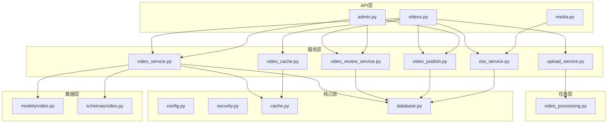
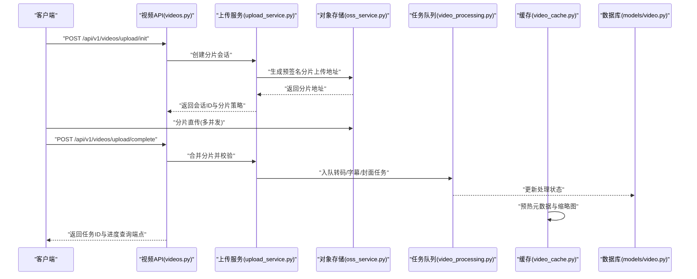
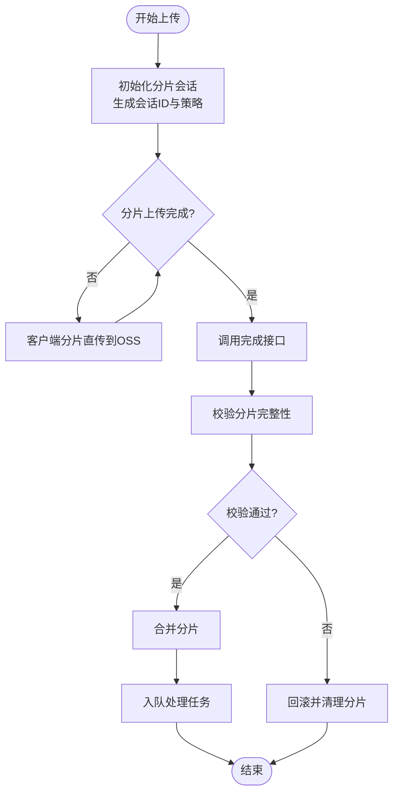
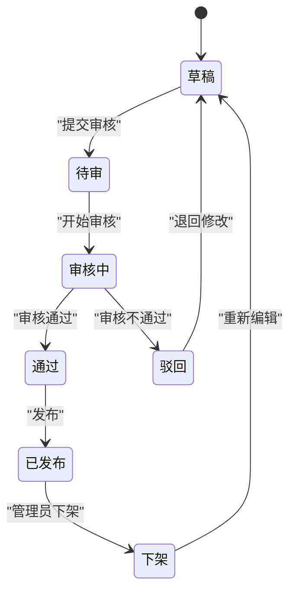
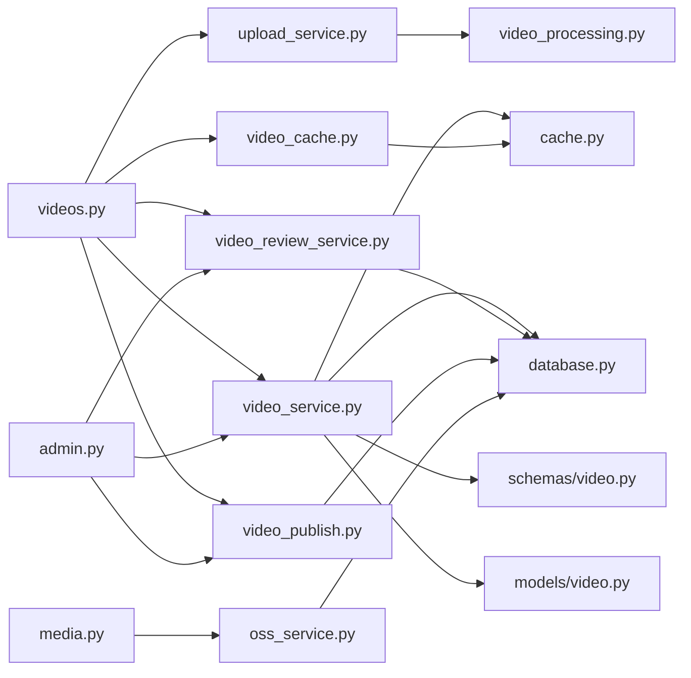

# 视频管理API

<cite>
**本文引用的文件**
- [backend/app/api/v1/videos.py](file://backend/app/api/v1/videos.py)
- [backend/app/schemas/video.py](file://backend/app/schemas/video.py)
- [backend/app/models/video.py](file://backend/app/models/video.py)
- [backend/app/services/upload_service.py](file://backend/app/services/upload_service.py)
- [backend/app/services/video_service.py](file://backend/app/services/video_service.py)
- [backend/app/services/video_review_service.py](file://backend/app/services/video_review_service.py)
- [backend/app/services/video_publish.py](file://backend/app/services/video_publish.py)
- [backend/app/services/video_cache.py](file://backend/app/services/video_cache.py)
- [backend/app/services/oss_service.py](file://backend/app/services/oss_service.py)
- [backend/app/tasks/video_processing.py](file://backend/app/tasks/video_processing.py)
- [backend/app/core/config.py](file://backend/app/core/config.py)
- [backend/app/core/security.py](file://backend/app/core/security.py)
- [backend/app/core/cache.py](file://backend/app/core/cache.py)
- [backend/app/core/database.py](file://backend/app/core/database.py)
- [backend/app/api/v1/media.py](file://backend/app/api/v1/media.py)
- [backend/app/api/v1/admin.py](file://backend/app/api/v1/admin.py)
</cite>

## 目录
1. [简介](#简介)
2. [项目结构](#项目结构)
3. [核心组件](#核心组件)
4. [架构总览](#架构总览)
5. [详细组件分析](#详细组件分析)
6. [依赖关系分析](#依赖关系分析)
7. [性能考量](#性能考量)
8. [故障排查指南](#故障排查指南)
9. [结论](#结论)
10. [附录](#附录)

## 简介
本文件为“视频管理模块”的完整API文档，覆盖视频上传、下载、播放、编辑、删除等全生命周期操作；阐述视频状态管理与审核流程、版本控制与分片上传机制；说明视频元数据管理、标签系统、分类功能与搜索过滤；给出流媒体传输协议、缓存策略与CDN集成方案；并包含视频处理任务队列、异步处理与进度查询接口，以及权限控制、访问限制与内容安全机制。

## 项目结构
后端采用FastAPI路由分层：API层（v1）暴露REST端点，服务层封装业务逻辑，模型层定义数据库实体，任务层负责异步处理，核心层提供配置、缓存、鉴权与数据库连接。

**图表来源**
- [backend/app/api/v1/videos.py](file://backend/app/api/v1/videos.py)
- [backend/app/api/v1/media.py](file://backend/app/api/v1/media.py)
- [backend/app/api/v1/admin.py](file://backend/app/api/v1/admin.py)
- [backend/app/services/upload_service.py](file://backend/app/services/upload_service.py)
- [backend/app/services/video_service.py](file://backend/app/services/video_service.py)
- [backend/app/services/video_review_service.py](file://backend/app/services/video_review_service.py)
- [backend/app/services/video_publish.py](file://backend/app/services/video_publish.py)
- [backend/app/services/video_cache.py](file://backend/app/services/video_cache.py)
- [backend/app/services/oss_service.py](file://backend/app/services/oss_service.py)
- [backend/app/tasks/video_processing.py](file://backend/app/tasks/video_processing.py)
- [backend/app/core/config.py](file://backend/app/core/config.py)
- [backend/app/core/security.py](file://backend/app/core/security.py)
- [backend/app/core/cache.py](file://backend/app/core/cache.py)
- [backend/app/core/database.py](file://backend/app/core/database.py)
- [backend/app/models/video.py](file://backend/app/models/video.py)
- [backend/app/schemas/video.py](file://backend/app/schemas/video.py)

**章节来源**
- [backend/app/api/v1/videos.py](file://backend/app/api/v1/videos.py)
- [backend/app/api/v1/media.py](file://backend/app/api/v1/media.py)
- [backend/app/api/v1/admin.py](file://backend/app/api/v1/admin.py)
- [backend/app/services/video_service.py](file://backend/app/services/video_service.py)
- [backend/app/services/upload_service.py](file://backend/app/services/upload_service.py)
- [backend/app/services/video_review_service.py](file://backend/app/services/video_review_service.py)
- [backend/app/services/video_publish.py](file://backend/app/services/video_publish.py)
- [backend/app/services/video_cache.py](file://backend/app/services/video_cache.py)
- [backend/app/services/oss_service.py](file://backend/app/services/oss_service.py)
- [backend/app/tasks/video_processing.py](file://backend/app/tasks/video_processing.py)
- [backend/app/core/config.py](file://backend/app/core/config.py)
- [backend/app/core/security.py](file://backend/app/core/security.py)
- [backend/app/core/cache.py](file://backend/app/core/cache.py)
- [backend/app/core/database.py](file://backend/app/core/database.py)
- [backend/app/models/video.py](file://backend/app/models/video.py)
- [backend/app/schemas/video.py](file://backend/app/schemas/video.py)

## 核心组件
- 视频API路由：提供CRUD、上传、下载、播放、审核、发布、统计等端点。
- 上传服务：支持分片上传、断点续传、并发合并、校验与回滚。
- 视频服务：封装视频元数据、版本控制、标签与分类、搜索过滤、播放URL生成。
- 审核服务：维护审核状态机、审批记录、驳回与通过流转。
- 发布服务：将审核通过的版本发布为公开可见，更新索引与缓存。
- 缓存服务：视频元数据与缩略图缓存、播放列表缓存、热点预热。
- 对象存储：对接云存储（OSS/S3），签名直传、CDN加速、防盗链。
- 任务队列：转码、字幕提取、封面生成、质量检查、索引构建等异步任务。
- 鉴权与安全：JWT鉴权、角色权限、访问令牌、速率限制、内容安全扫描。
- 配置与基础设施：环境变量、数据库连接、Redis缓存、日志与监控。

**章节来源**
- [backend/app/api/v1/videos.py](file://backend/app/api/v1/videos.py)
- [backend/app/services/upload_service.py](file://backend/app/services/upload_service.py)
- [backend/app/services/video_service.py](file://backend/app/services/video_service.py)
- [backend/app/services/video_review_service.py](file://backend/app/services/video_review_service.py)
- [backend/app/services/video_publish.py](file://backend/app/services/video_publish.py)
- [backend/app/services/video_cache.py](file://backend/app/services/video_cache.py)
- [backend/app/services/oss_service.py](file://backend/app/services/oss_service.py)
- [backend/app/tasks/video_processing.py](file://backend/app/tasks/video_processing.py)
- [backend/app/core/security.py](file://backend/app/core/security.py)
- [backend/app/core/config.py](file://backend/app/core/config.py)
- [backend/app/core/cache.py](file://backend/app/core/cache.py)
- [backend/app/core/database.py](file://backend/app/core/database.py)

## 架构总览
视频管理模块遵循“API -> Service -> Task/Storage/Cache/DB”的分层架构，关键交互如下：

**图表来源**
- [backend/app/api/v1/videos.py](file://backend/app/api/v1/videos.py)
- [backend/app/services/upload_service.py](file://backend/app/services/upload_service.py)
- [backend/app/services/oss_service.py](file://backend/app/services/oss_service.py)
- [backend/app/tasks/video_processing.py](file://backend/app/tasks/video_processing.py)
- [backend/app/services/video_cache.py](file://backend/app/services/video_cache.py)
- [backend/app/models/video.py](file://backend/app/models/video.py)

## 详细组件分析

### 视频API端点
- 上传相关
  - 初始化分片上传：返回会话ID、分片大小、过期时间、直传策略。
  - 分片上传：客户端按策略向对象存储直传分片。
  - 完成上传：校验分片完整性，触发后续处理任务。
- 下载与播放
  - 获取播放信息：返回HLS/DASH清单、自适应码率、防盗链签名。
  - 分段下载：Range请求支持，CDN命中优先。
- 元数据与版本
  - 创建/更新/删除视频元数据：标题、描述、分类、标签、封面、语言、时长、分辨率等。
  - 版本控制：每次更新生成新版本，保留历史版本与差异快照。
- 审核与发布
  - 提交审核：进入待审状态，记录审核意见。
  - 审核通过/驳回：状态机流转，通过后自动或手动发布。
- 搜索与过滤
  - 关键词搜索：标题、描述、标签、分类模糊匹配。
  - 高级过滤：按分类、标签、状态、发布时间、语言、难度等级筛选。
- 统计与指标
  - 播放量、点赞、收藏、评论数、完播率等聚合统计。

**章节来源**
- [backend/app/api/v1/videos.py](file://backend/app/api/v1/videos.py)
- [backend/app/schemas/video.py](file://backend/app/schemas/video.py)
- [backend/app/models/video.py](file://backend/app/models/video.py)

### 上传服务（分片上传与断点续传）
- 分片策略：可配置分片大小、最大并发、超时与重试次数。
- 断点续传：基于会话ID与分片ETag校验，支持失败重传。
- 完整性校验：MD5/SHA256校验，异常分片隔离与告警。
- 合并与清理：成功合并后清理临时分片，失败回滚并释放资源。

**图表来源**
- [backend/app/services/upload_service.py](file://backend/app/services/upload_service.py)
- [backend/app/services/oss_service.py](file://backend/app/services/oss_service.py)

**章节来源**
- [backend/app/services/upload_service.py](file://backend/app/services/upload_service.py)
- [backend/app/services/oss_service.py](file://backend/app/services/oss_service.py)

### 视频服务（元数据、版本、标签、分类、搜索）
- 元数据管理：结构化字段校验、默认值填充、唯一性约束。
- 版本控制：版本号递增、差异对比、回滚到指定版本。
- 标签与分类：多对多关系，批量增删改查，别名与同义词映射。
- 搜索过滤：全文检索、布尔过滤、排序与分页。
- 播放URL生成：根据用户权限与设备类型选择最佳格式。

**章节来源**
- [backend/app/services/video_service.py](file://backend/app/services/video_service.py)
- [backend/app/schemas/video.py](file://backend/app/schemas/video.py)
- [backend/app/models/video.py](file://backend/app/models/video.py)

### 审核服务（状态机与审批流）
- 状态机：草稿 -> 待审 -> 审核中 -> 通过/驳回 -> 已发布/下架。
- 审批记录：审计日志、操作人、时间戳、备注。
- 自动发布：满足条件时自动发布，否则需人工确认。
- 驳回处理：退回修改并通知上传者。

**图表来源**
- [backend/app/services/video_review_service.py](file://backend/app/services/video_review_service.py)
- [backend/app/models/video.py](file://backend/app/models/video.py)

**章节来源**
- [backend/app/services/video_review_service.py](file://backend/app/services/video_review_service.py)
- [backend/app/models/video.py](file://backend/app/models/video.py)

### 发布服务（索引与缓存）
- 发布动作：更新可见性、构建搜索索引、预热缓存。
- 灰度发布：按区域或用户群体逐步放量。
- 回滚机制：快速回退到上一稳定版本。

**章节来源**
- [backend/app/services/video_publish.py](file://backend/app/services/video_publish.py)
- [backend/app/services/video_cache.py](file://backend/app/services/video_cache.py)

### 缓存服务（元数据与播放列表）
- 缓存策略：TTL、LRU、热点键保护、失效广播。
- 多级缓存：本地内存 + Redis集群，跨节点一致性。
- 预热机制：热门视频启动时预加载至缓存。

**章节来源**
- [backend/app/services/video_cache.py](file://backend/app/services/video_cache.py)
- [backend/app/core/cache.py](file://backend/app/core/cache.py)

### 对象存储（OSS/S3）与CDN
- 直传模式：服务端生成签名，客户端直传降低带宽压力。
- 防盗链：Referer白名单、IP白名单、时间戳签名。
- CDN集成：边缘缓存、按需回源、缓存预热与刷新。

**章节来源**
- [backend/app/services/oss_service.py](file://backend/app/services/oss_service.py)
- [backend/app/core/config.py](file://backend/app/core/config.py)

### 任务队列（异步处理与进度查询）
- 任务类型：转码、字幕提取、封面生成、质量检查、索引构建。
- 进度查询：基于任务ID的状态轮询或WebSocket推送。
- 重试与死信：失败重试、降级策略、死信队列告警。

**章节来源**
- [backend/app/tasks/video_processing.py](file://backend/app/tasks/video_processing.py)

### 鉴权与安全（权限控制与访问限制）
- JWT鉴权：访问令牌与刷新令牌，黑名单机制。
- 角色权限：管理员、编辑、上传者、普通用户等细粒度授权。
- 访问限制：速率限制、IP封禁、敏感操作二次验证。
- 内容安全：恶意内容检测、水印、DRM可选。

**章节来源**
- [backend/app/core/security.py](file://backend/app/core/security.py)
- [backend/app/core/config.py](file://backend/app/core/config.py)

### 媒体端点（通用媒体访问）
- 统一媒体访问：缩略图、音频、字幕、附件的统一路径与权限校验。
- 动态裁剪与压缩：按需生成不同尺寸与码率。

**章节来源**
- [backend/app/api/v1/media.py](file://backend/app/api/v1/media.py)

### 管理端点（后台管理）
- 视频管理：批量操作、状态变更、审核批处理。
- 用户与权限：角色分配、访问控制列表。
- 系统与监控：任务队列监控、错误日志、性能指标。

**章节来源**
- [backend/app/api/v1/admin.py](file://backend/app/api/v1/admin.py)

## 依赖关系分析

**图表来源**
- [backend/app/api/v1/videos.py](file://backend/app/api/v1/videos.py)
- [backend/app/api/v1/media.py](file://backend/app/api/v1/media.py)
- [backend/app/api/v1/admin.py](file://backend/app/api/v1/admin.py)
- [backend/app/services/upload_service.py](file://backend/app/services/upload_service.py)
- [backend/app/services/video_service.py](file://backend/app/services/video_service.py)
- [backend/app/services/video_review_service.py](file://backend/app/services/video_review_service.py)
- [backend/app/services/video_publish.py](file://backend/app/services/video_publish.py)
- [backend/app/services/video_cache.py](file://backend/app/services/video_cache.py)
- [backend/app/services/oss_service.py](file://backend/app/services/oss_service.py)
- [backend/app/tasks/video_processing.py](file://backend/app/tasks/video_processing.py)
- [backend/app/core/cache.py](file://backend/app/core/cache.py)
- [backend/app/core/database.py](file://backend/app/core/database.py)
- [backend/app/models/video.py](file://backend/app/models/video.py)
- [backend/app/schemas/video.py](file://backend/app/schemas/video.py)

**章节来源**
- [backend/app/api/v1/videos.py](file://backend/app/api/v1/videos.py)
- [backend/app/api/v1/media.py](file://backend/app/api/v1/media.py)
- [backend/app/api/v1/admin.py](file://backend/app/api/v1/admin.py)
- [backend/app/services/upload_service.py](file://backend/app/services/upload_service.py)
- [backend/app/services/video_service.py](file://backend/app/services/video_service.py)
- [backend/app/services/video_review_service.py](file://backend/app/services/video_review_service.py)
- [backend/app/services/video_publish.py](file://backend/app/services/video_publish.py)
- [backend/app/services/video_cache.py](file://backend/app/services/video_cache.py)
- [backend/app/services/oss_service.py](file://backend/app/services/oss_service.py)
- [backend/app/tasks/video_processing.py](file://backend/app/tasks/video_processing.py)
- [backend/app/core/cache.py](file://backend/app/core/cache.py)
- [backend/app/core/database.py](file://backend/app/core/database.py)
- [backend/app/models/video.py](file://backend/app/models/video.py)
- [backend/app/schemas/video.py](file://backend/app/schemas/video.py)

## 性能考量
- 分片上传：合理设置分片大小与并发数，避免小文件频繁握手与大文件内存占用过高。
- 播放优化：优先CDN命中，启用HTTP/2与Keep-Alive，使用自适应码率与懒加载。
- 缓存策略：热点视频元数据与缩略图常驻缓存，播放列表按需加载。
- 任务队列：削峰填谷，避免瞬时峰值导致队列阻塞；关键任务优先级调度。
- 数据库索引：针对常用查询字段建立复合索引，减少慢查询。
- 存储成本：冷热数据分层，旧版本归档至低成本存储。

[本节为通用指导，无需特定文件引用]

## 故障排查指南
- 上传失败
  - 检查分片完整性与ETag校验，查看对象存储签名是否过期。
  - 核对网络连通性与防火墙规则，确认CDN回源正常。
- 播放异常
  - 验证播放清单生成与防盗链签名有效性。
  - 检查CDN缓存命中率与回源链路延迟。
- 审核卡住
  - 查看审核状态机流转与审批记录，确认权限与回调是否正常。
- 任务堆积
  - 监控队列长度与消费者健康，扩容Worker实例，检查依赖服务可用性。
- 鉴权问题
  - 检查JWT令牌有效期与黑名单，确认角色权限与访问控制列表。

**章节来源**
- [backend/app/services/upload_service.py](file://backend/app/services/upload_service.py)
- [backend/app/services/oss_service.py](file://backend/app/services/oss_service.py)
- [backend/app/services/video_review_service.py](file://backend/app/services/video_review_service.py)
- [backend/app/tasks/video_processing.py](file://backend/app/tasks/video_processing.py)
- [backend/app/core/security.py](file://backend/app/core/security.py)

## 结论
视频管理模块以清晰的分层架构与完善的业务流程支撑了从上传到播放的全链路能力。通过分片上传、审核状态机、版本控制、缓存与CDN、任务队列与鉴权安全等机制，实现了高可用、可扩展与安全的视频服务能力。建议在生产环境中结合监控与告警持续优化性能与稳定性。

[本节为总结性内容，无需特定文件引用]

## 附录
- 术语表
  - 分片上传：将大文件拆分为多个片段并行上传以提升效率。
  - 审核状态机：定义视频从草稿到发布的状态转换规则。
  - 版本控制：对视频元数据与内容进行版本化管理，支持回滚与对比。
  - 缓存预热：在系统启动或热点变化时提前加载数据至缓存。
  - 防盗链：通过签名、白名单等手段防止未授权访问。
- 参考实现路径
  - 视频API端点定义：[backend/app/api/v1/videos.py](file://backend/app/api/v1/videos.py)
  - 上传服务实现：[backend/app/services/upload_service.py](file://backend/app/services/upload_service.py)
  - 视频服务实现：[backend/app/services/video_service.py](file://backend/app/services/video_service.py)
  - 审核服务实现：[backend/app/services/video_review_service.py](file://backend/app/services/video_review_service.py)
  - 发布服务实现：[backend/app/services/video_publish.py](file://backend/app/services/video_publish.py)
  - 缓存服务实现：[backend/app/services/video_cache.py](file://backend/app/services/video_cache.py)
  - 对象存储实现：[backend/app/services/oss_service.py](file://backend/app/services/oss_service.py)
  - 任务队列实现：[backend/app/tasks/video_processing.py](file://backend/app/tasks/video_processing.py)
  - 鉴权与安全：[backend/app/core/security.py](file://backend/app/core/security.py)
  - 配置与基础设施：[backend/app/core/config.py](file://backend/app/core/config.py), [backend/app/core/cache.py](file://backend/app/core/cache.py), [backend/app/core/database.py](file://backend/app/core/database.py)
  - 数据模型与Schema：[backend/app/models/video.py](file://backend/app/models/video.py), [backend/app/schemas/video.py](file://backend/app/schemas/video.py)
