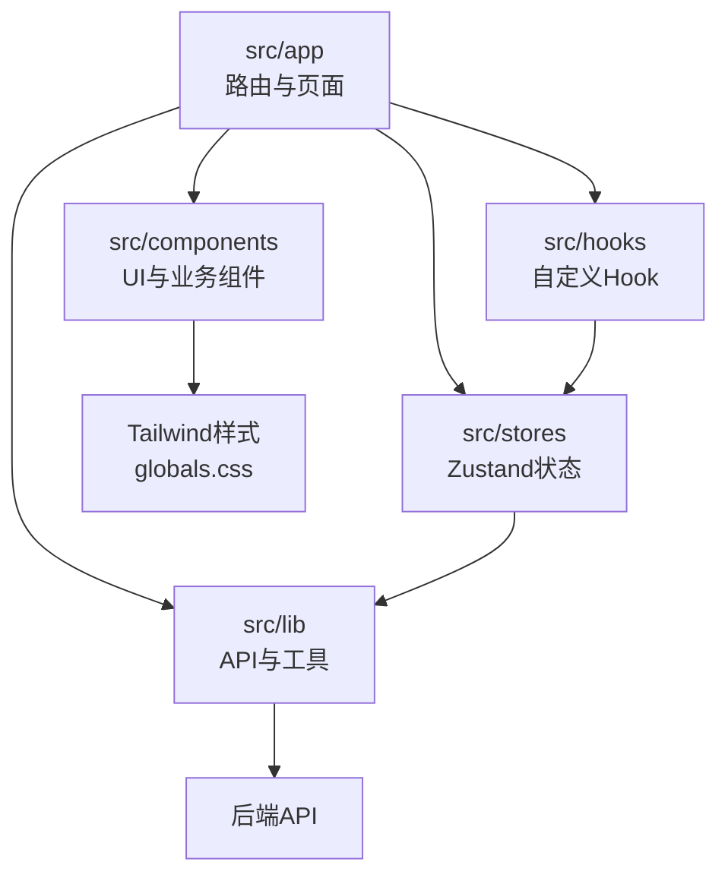
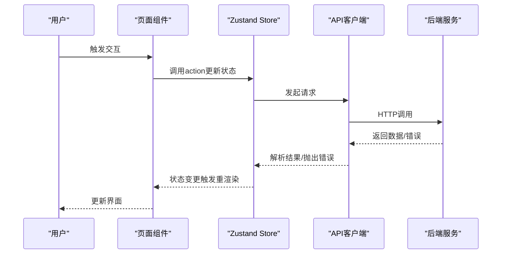
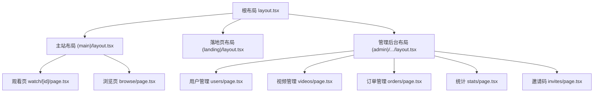
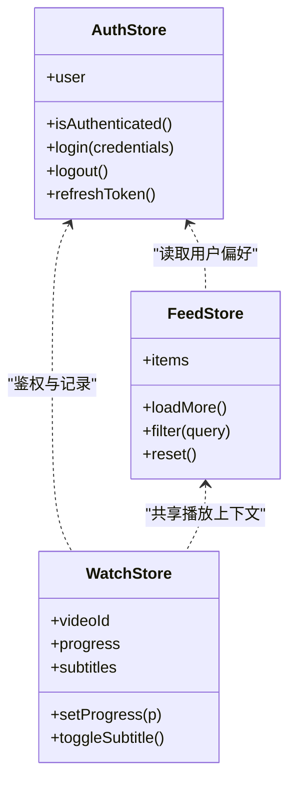
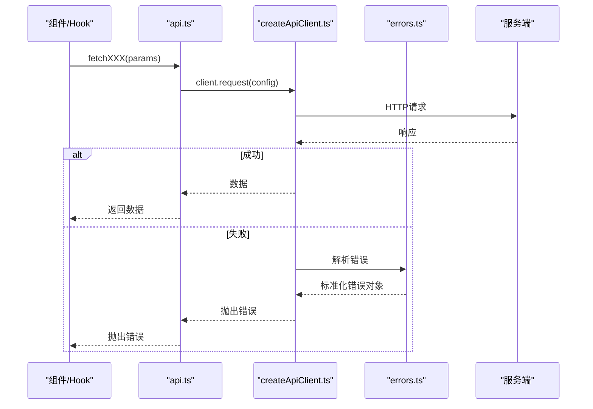
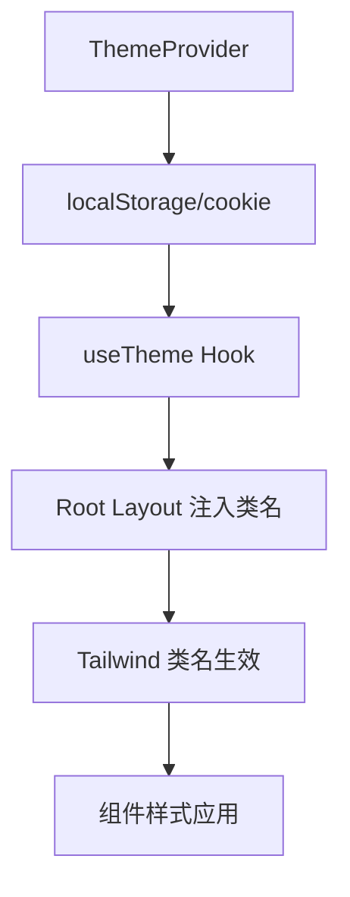
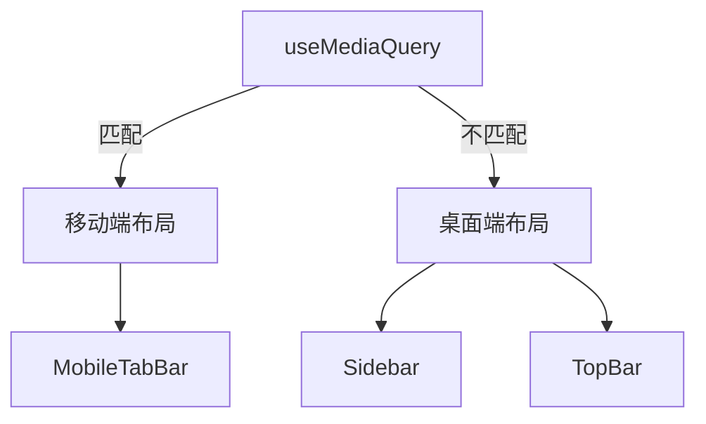
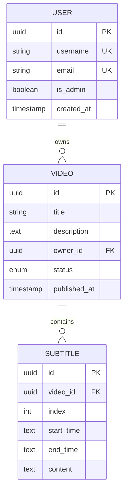
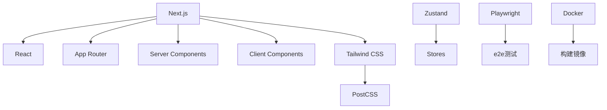

# 前端开发

<cite>
**本文引用的文件**
- [frontend/package.json](file://frontend/package.json)
- [frontend/next.config.js](file://frontend/next.config.js)
- [frontend/tsconfig.json](file://frontend/tsconfig.json)
- [frontend/postcss.config.js](file://frontend/postcss.config.js)
- [frontend/eslint.config.mjs](file://frontend/eslint.config.mjs)
- [frontend/src/app/layout.tsx](file://frontend/src/app/layout.tsx)
- [frontend/src/app/loading.tsx](file://frontend/src/app/loading.tsx)
- [frontend/src/app/not-found.tsx](file://frontend/src/app/not-found.tsx)
- [frontend/src/app/error.tsx](file://frontend/src/app/error.tsx)
- [frontend/src/app/(main)/layout.tsx](file://frontend/src/app/(main)/layout.tsx)
- [frontend/src/app/(main)/page.tsx](file://frontend/src/app/(main)/page.tsx)
- [frontend/src/app/(main)/watch/[id]/page.tsx](file://frontend/src/app/(main)/watch/[id]/page.tsx)
- [frontend/src/app/(main)/browse/page.tsx](file://frontend/src/app/(main)/browse/page.tsx)
- [frontend/src/app/(landing)/layout.tsx](file://frontend/src/app/(landing)/layout.tsx)
- [frontend/src/app/(landing)/landing/page.tsx](file://frontend/src/app/(landing)/landing/page.tsx)
- [frontend/src/app/login/page.tsx](file://frontend/src/app/login/page.tsx)
- [frontend/src/app/register/page.tsx](file://frontend/src/app/register/page.tsx)
- [frontend/src/app/forgot-password/page.tsx](file://frontend/src/app/forgot-password/page.tsx)
- [frontend/src/app/onboarding/page.tsx](file://frontend/src/app/onboarding/page.tsx)
- [frontend/src/app/(admin)/admin/(shell)/layout.tsx](file://frontend/src/app/(admin)/admin/(shell)/layout.tsx)
- [frontend/src/app/(admin)/admin/(shell)/page.tsx](file://frontend/src/app/(admin)/admin/(shell)/page.tsx)
- [frontend/src/app/(admin)/admin/(shell)/users/page.tsx](file://frontend/src/app/(admin)/admin/(shell)/users/page.tsx)
- [frontend/src/app/(admin)/admin/(shell)/videos/page.tsx](file://frontend/src/app/(admin)/admin/(shell)/videos/page.tsx)
- [frontend/src/app/(admin)/admin/(shell)/orders/page.tsx](file://frontend/src/app/(admin)/admin/(shell)/orders/page.tsx)
- [frontend/src/app/(admin)/admin/(shell)/stats/page.tsx](file://frontend/src/app/(admin)/admin/(shell)/stats/page.tsx)
- [frontend/src/app/(admin)/admin/(shell)/invites/page.tsx](file://frontend/src/app/(admin)/admin/(shell)/invites/page.tsx)
- [frontend/src/app/(admin)/admin/(shell)/videos/[id]/page.tsx](file://frontend/src/app/(admin)/admin/(shell)/videos/[id]/page.tsx)
- [frontend/src/components/ui/Button.tsx](file://frontend/src/components/ui/Button.tsx)
- [frontend/src/components/ui/Input.tsx](file://frontend/src/components/ui/Input.tsx)
- [frontend/src/components/ui/Card.tsx](file://frontend/src/components/ui/Card.tsx)
- [frontend/src/components/common/Modal.tsx](file://frontend/src/components/common/Modal.tsx)
- [frontend/src/components/common/ErrorState.tsx](file://frontend/src/components/common/ErrorState.tsx)
- [frontend/src/components/common/Spinner.tsx](file://frontend/src/components/common/Spinner.tsx)
- [frontend/src/components/common/ThemeProvider.tsx](file://frontend/src/components/common/ThemeProvider.tsx)
- [frontend/src/components/layout/Sidebar.tsx](file://frontend/src/components/layout/Sidebar.tsx)
- [frontend/src/components/layout/TopBar.tsx](file://frontend/src/components/layout/TopBar.tsx)
- [frontend/src/components/layout/MobileTabBar.tsx](file://frontend/src/components/layout/MobileTabBar.tsx)
- [frontend/src/hooks/useSession.ts](file://frontend/src/hooks/useSession.ts)
- [frontend/src/hooks/useTheme.ts](file://frontend/src/hooks/useTheme.ts)
- [frontend/src/hooks/useMediaQuery.ts](file://frontend/src/hooks/useMediaQuery.ts)
- [frontend/src/stores/authStore.ts](file://frontend/src/stores/authStore.ts)
- [frontend/src/stores/feedStore.ts](file://frontend/src/stores/feedStore.ts)
- [frontend/src/stores/watchStore.ts](file://frontend/src/stores/watchStore.ts)
- [frontend/src/lib/api.ts](file://frontend/src/lib/api.ts)
- [frontend/src/lib/createApiClient.ts](file://frontend/src/lib/createApiClient.ts)
- [frontend/src/lib/errors.ts](file://frontend/src/lib/errors.ts)
- [frontend/src/types/index.ts](file://frontend/src/types/index.ts)
- [frontend/src/types/platform.ts](file://frontend/src/types/platform.ts)
- [frontend/src/app/globals.css](file://frontend/src/app/globals.css)
- [frontend/Dockerfile](file://frontend/Dockerfile)
- [frontend/Dockerfile.prod](file://frontend/Dockerfile.prod)
- [frontend/playwright.config.ts](file://frontend/playwright.config.ts)
</cite>

## 目录
1. [简介](#简介)
2. [项目结构](#项目结构)
3. [核心组件](#核心组件)
4. [架构总览](#架构总览)
5. [详细组件分析](#详细组件分析)
6. [依赖关系分析](#依赖关系分析)
7. [性能考虑](#性能考虑)
8. [故障排查指南](#故障排查指南)
9. [结论](#结论)
10. [附录](#附录)

## 简介
本指南面向Speaking平台的前端开发者，基于Next.js（App Router）与React构建的SPA应用。文档覆盖：
- App Router路由组织、页面与布局约定
- 组件设计规范与UI库使用
- 状态管理（Zustand）与数据流
- TypeScript类型定义、接口契约与数据校验
- 响应式设计与主题系统（Tailwind CSS）
- API客户端封装、错误处理与加载状态
- 页面路由设计、导航模式与用户体验优化
- 构建配置、性能优化与浏览器兼容性
- 开发工具链、调试技巧与代码质量保障

## 项目结构
前端采用Next.js App Router，按功能域划分目录：
- src/app：路由与页面（(main)、(landing)、(admin)等路由组）
- src/components：可复用组件（ui、common、layout、业务组件）
- src/hooks：自定义Hook（会话、主题、媒体查询、播放器、轮询等）
- src/stores：Zustand全局状态（认证、信息流、播放等）
- src/lib：API客户端、错误处理、工具函数
- src/types：TypeScript类型定义与平台模型

图表来源
- [frontend/src/app/layout.tsx](file://frontend/src/app/layout.tsx)
- [frontend/src/app/(main)/layout.tsx](file://frontend/src/app/(main)/layout.tsx)
- [frontend/src/app/(landing)/layout.tsx](file://frontend/src/app/(landing)/layout.tsx)
- [frontend/src/app/(admin)/admin/(shell)/layout.tsx](file://frontend/src/app/(admin)/admin/(shell)/layout.tsx)

章节来源
- [frontend/package.json](file://frontend/package.json)
- [frontend/next.config.js](file://frontend/next.config.js)
- [frontend/tsconfig.json](file://frontend/tsconfig.json)
- [frontend/postcss.config.js](file://frontend/postcss.config.js)
- [frontend/src/app/layout.tsx](file://frontend/src/app/layout.tsx)

## 核心组件
- UI基础组件：Button、Input、Card等，统一交互与样式规范
- 通用组件：Modal、ErrorState、Spinner、ThemeProvider等
- 布局组件：Sidebar、TopBar、MobileTabBar，适配多端导航
- 业务组件：视频、字幕、练习、计划等模块组件

组件设计规范
- 单一职责：每个组件聚焦一个功能或展示单元
- Props最小化：通过组合与上下文扩展能力
- 可访问性：键盘操作、语义标签、ARIA属性
- 主题化：遵循Design Tokens，支持明暗主题切换
- 测试友好：纯函数优先，副作用隔离到Hooks

章节来源
- [frontend/src/components/ui/Button.tsx](file://frontend/src/components/ui/Button.tsx)
- [frontend/src/components/ui/Input.tsx](file://frontend/src/components/ui/Input.tsx)
- [frontend/src/components/ui/Card.tsx](file://frontend/src/components/ui/Card.tsx)
- [frontend/src/components/common/Modal.tsx](file://frontend/src/components/common/Modal.tsx)
- [frontend/src/components/common/ErrorState.tsx](file://frontend/src/components/common/ErrorState.tsx)
- [frontend/src/components/common/Spinner.tsx](file://frontend/src/components/common/Spinner.tsx)
- [frontend/src/components/common/ThemeProvider.tsx](file://frontend/src/components/common/ThemeProvider.tsx)
- [frontend/src/components/layout/Sidebar.tsx](file://frontend/src/components/layout/Sidebar.tsx)
- [frontend/src/components/layout/TopBar.tsx](file://frontend/src/components/layout/TopBar.tsx)
- [frontend/src/components/layout/MobileTabBar.tsx](file://frontend/src/components/layout/MobileTabBar.tsx)

## 架构总览
整体架构由“页面层—组件层—状态层—API层”构成，数据流单向清晰：
- 页面层：Next.js App Router组织路由，负责渲染与布局
- 组件层：UI与业务组件，接收Props并触发事件
- 状态层：Zustand Store集中管理用户会话、信息流、播放状态等
- API层：统一的HTTP客户端封装，处理鉴权、重试、错误映射

图表来源
- [frontend/src/stores/authStore.ts](file://frontend/src/stores/authStore.ts)
- [frontend/src/stores/feedStore.ts](file://frontend/src/stores/feedStore.ts)
- [frontend/src/stores/watchStore.ts](file://frontend/src/stores/watchStore.ts)
- [frontend/src/lib/api.ts](file://frontend/src/lib/api.ts)
- [frontend/src/lib/createApiClient.ts](file://frontend/src/lib/createApiClient.ts)

章节来源
- [frontend/src/app/(main)/layout.tsx](file://frontend/src/app/(main)/layout.tsx)
- [frontend/src/app/(landing)/layout.tsx](file://frontend/src/app/(landing)/layout.tsx)
- [frontend/src/app/(admin)/admin/(shell)/layout.tsx](file://frontend/src/app/(admin)/admin/(shell)/layout.tsx)

## 详细组件分析

### App Router路由与布局
- 根布局：提供全局HTML/Body、主题Provider、全局样式注入
- 路由组：(main)主站、(landing)落地页、(admin)管理后台
- 动态路由：如watch/[id]、admin/videos/[id]
- 错误与加载：error.tsx、loading.tsx、not-found.tsx

图表来源
- [frontend/src/app/layout.tsx](file://frontend/src/app/layout.tsx)
- [frontend/src/app/(main)/layout.tsx](file://frontend/src/app/(main)/layout.tsx)
- [frontend/src/app/(landing)/layout.tsx](file://frontend/src/app/(landing)/layout.tsx)
- [frontend/src/app/(admin)/admin/(shell)/layout.tsx](file://frontend/src/app/(admin)/admin/(shell)/layout.tsx)
- [frontend/src/app/(main)/watch/[id]/page.tsx](file://frontend/src/app/(main)/watch/[id]/page.tsx)
- [frontend/src/app/(main)/browse/page.tsx](file://frontend/src/app/(main)/browse/page.tsx)
- [frontend/src/app/(admin)/admin/(shell)/users/page.tsx](file://frontend/src/app/(admin)/admin/(shell)/users/page.tsx)
- [frontend/src/app/(admin)/admin/(shell)/videos/page.tsx](file://frontend/src/app/(admin)/admin/(shell)/videos/page.tsx)
- [frontend/src/app/(admin)/admin/(shell)/orders/page.tsx](file://frontend/src/app/(admin)/admin/(shell)/orders/page.tsx)
- [frontend/src/app/(admin)/admin/(shell)/stats/page.tsx](file://frontend/src/app/(admin)/admin/(shell)/stats/page.tsx)
- [frontend/src/app/(admin)/admin/(shell)/invites/page.tsx](file://frontend/src/app/(admin)/admin/(shell)/invites/page.tsx)

章节来源
- [frontend/src/app/layout.tsx](file://frontend/src/app/layout.tsx)
- [frontend/src/app/loading.tsx](file://frontend/src/app/loading.tsx)
- [frontend/src/app/not-found.tsx](file://frontend/src/app/not-found.tsx)
- [frontend/src/app/error.tsx](file://frontend/src/app/error.tsx)
- [frontend/src/app/(main)/layout.tsx](file://frontend/src/app/(main)/layout.tsx)
- [frontend/src/app/(main)/page.tsx](file://frontend/src/app/(main)/page.tsx)
- [frontend/src/app/(landing)/layout.tsx](file://frontend/src/app/(landing)/layout.tsx)
- [frontend/src/app/(landing)/landing/page.tsx](file://frontend/src/app/(landing)/landing/page.tsx)
- [frontend/src/app/login/page.tsx](file://frontend/src/app/login/page.tsx)
- [frontend/src/app/register/page.tsx](file://frontend/src/app/register/page.tsx)
- [frontend/src/app/forgot-password/page.tsx](file://frontend/src/app/forgot-password/page.tsx)
- [frontend/src/app/onboarding/page.tsx](file://frontend/src/app/onboarding/page.tsx)

### Zustand状态管理
- authStore：用户登录态、权限、会话刷新
- feedStore：首页/推荐信息流缓存与分页
- watchStore：播放进度、字幕状态、练习记录

图表来源
- [frontend/src/stores/authStore.ts](file://frontend/src/stores/authStore.ts)
- [frontend/src/stores/feedStore.ts](file://frontend/src/stores/feedStore.ts)
- [frontend/src/stores/watchStore.ts](file://frontend/src/stores/watchStore.ts)

章节来源
- [frontend/src/stores/authStore.ts](file://frontend/src/stores/authStore.ts)
- [frontend/src/stores/feedStore.ts](file://frontend/src/stores/feedStore.ts)
- [frontend/src/stores/watchStore.ts](file://frontend/src/stores/watchStore.ts)

### API客户端与错误处理
- createApiClient：工厂函数创建带拦截器的HTTP客户端
- api.ts：统一方法封装（GET/POST/PUT/DELETE），自动附加鉴权头
- errors.ts：错误分类、消息映射、重试策略

图表来源
- [frontend/src/lib/createApiClient.ts](file://frontend/src/lib/createApiClient.ts)
- [frontend/src/lib/api.ts](file://frontend/src/lib/api.ts)
- [frontend/src/lib/errors.ts](file://frontend/src/lib/errors.ts)

章节来源
- [frontend/src/lib/createApiClient.ts](file://frontend/src/lib/createApiClient.ts)
- [frontend/src/lib/api.ts](file://frontend/src/lib/api.ts)
- [frontend/src/lib/errors.ts](file://frontend/src/lib/errors.ts)

### 主题系统与样式管理
- Tailwind CSS：原子化样式，快速构建一致UI
- ThemeProvider：明暗主题切换，持久化用户偏好
- globals.css：全局变量、动画、滚动条定制

图表来源
- [frontend/src/components/common/ThemeProvider.tsx](file://frontend/src/components/common/ThemeProvider.tsx)
- [frontend/src/hooks/useTheme.ts](file://frontend/src/hooks/useTheme.ts)
- [frontend/src/app/globals.css](file://frontend/src/app/globals.css)

章节来源
- [frontend/src/components/common/ThemeProvider.tsx](file://frontend/src/components/common/ThemeProvider.tsx)
- [frontend/src/hooks/useTheme.ts](file://frontend/src/hooks/useTheme.ts)
- [frontend/src/app/globals.css](file://frontend/src/app/globals.css)

### 响应式设计与移动端体验
- useMediaQuery：断点监听，条件渲染与布局切换
- MobileTabBar：底部导航栏，适配小屏设备
- Sidebar/TopBar：桌面端侧边栏与顶部导航

图表来源
- [frontend/src/hooks/useMediaQuery.ts](file://frontend/src/hooks/useMediaQuery.ts)
- [frontend/src/components/layout/MobileTabBar.tsx](file://frontend/src/components/layout/MobileTabBar.tsx)
- [frontend/src/components/layout/Sidebar.tsx](file://frontend/src/components/layout/Sidebar.tsx)
- [frontend/src/components/layout/TopBar.tsx](file://frontend/src/components/layout/TopBar.tsx)

章节来源
- [frontend/src/hooks/useMediaQuery.ts](file://frontend/src/hooks/useMediaQuery.ts)
- [frontend/src/components/layout/MobileTabBar.tsx](file://frontend/src/components/layout/MobileTabBar.tsx)
- [frontend/src/components/layout/Sidebar.tsx](file://frontend/src/components/layout/Sidebar.tsx)
- [frontend/src/components/layout/TopBar.tsx](file://frontend/src/components/layout/TopBar.tsx)

### 类型定义与数据验证
- types/index.ts：通用类型（分页、响应体、枚举）
- types/platform.ts：平台领域模型（用户、视频、字幕、学习记录）
- 建议：在API层进行输入校验，组件层做二次校验

图表来源
- [frontend/src/types/index.ts](file://frontend/src/types/index.ts)
- [frontend/src/types/platform.ts](file://frontend/src/types/platform.ts)

章节来源
- [frontend/src/types/index.ts](file://frontend/src/types/index.ts)
- [frontend/src/types/platform.ts](file://frontend/src/types/platform.ts)

## 依赖关系分析
- Next.js与React生态：App Router、Server Components、Client Components
- 样式：Tailwind CSS + PostCSS
- 状态：Zustand
- 测试：Playwright（端到端）
- 构建：Docker镜像（开发与生产）

图表来源
- [frontend/package.json](file://frontend/package.json)
- [frontend/postcss.config.js](file://frontend/postcss.config.js)
- [frontend/playwright.config.ts](file://frontend/playwright.config.ts)
- [frontend/Dockerfile](file://frontend/Dockerfile)
- [frontend/Dockerfile.prod](file://frontend/Dockerfile.prod)

章节来源
- [frontend/package.json](file://frontend/package.json)
- [frontend/postcss.config.js](file://frontend/postcss.config.js)
- [frontend/playwright.config.ts](file://frontend/playwright.config.ts)
- [frontend/Dockerfile](file://frontend/Dockerfile)
- [frontend/Dockerfile.prod](file://frontend/Dockerfile.prod)

## 性能考虑
- 代码分割与懒加载：按需加载路由与组件，减少首屏体积
- 数据获取：服务端渲染与缓存结合，避免不必要的客户端请求
- 图片与媒体：使用Next.js Image优化，延迟加载非关键资源
- 状态管理：Zustand轻量存储，避免过度订阅
- 网络优化：请求去重、重试与退避策略，错误快速失败
- 构建优化：Tree Shaking、压缩、CDN缓存

[本节为通用指导，无需特定文件引用]

## 故障排查指南
- 页面级错误：error.tsx捕获异常，显示友好提示
- 加载状态：loading.tsx与Skeleton组件提升感知速度
- 未找到：not-found.tsx处理404路径
- 网络错误：errors.ts统一错误分类与重试
- 调试技巧：浏览器DevTools、Network面板、Zustand Devtools

章节来源
- [frontend/src/app/error.tsx](file://frontend/src/app/error.tsx)
- [frontend/src/app/loading.tsx](file://frontend/src/app/loading.tsx)
- [frontend/src/app/not-found.tsx](file://frontend/src/app/not-found.tsx)
- [frontend/src/lib/errors.ts](file://frontend/src/lib/errors.ts)
- [frontend/src/components/common/ErrorState.tsx](file://frontend/src/components/common/ErrorState.tsx)
- [frontend/src/components/common/Spinner.tsx](file://frontend/src/components/common/Spinner.tsx)

## 结论
本指南系统化梳理了Speaking平台前端的架构与实现要点，涵盖路由、组件、状态、样式、API与性能优化。遵循本文规范将有助于团队协作、代码质量与用户体验提升。

[本节为总结性内容，无需特定文件引用]

## 附录
- 开发环境启动：参考package.json脚本
- 构建与部署：Docker镜像构建流程
- 代码质量：ESLint与Prettier规则
- 端到端测试：Playwright用例编写与执行

章节来源
- [frontend/package.json](file://frontend/package.json)
- [frontend/Dockerfile](file://frontend/Dockerfile)
- [frontend/Dockerfile.prod](file://frontend/Dockerfile.prod)
- [frontend/eslint.config.mjs](file://frontend/eslint.config.mjs)
- [frontend/playwright.config.ts](file://frontend/playwright.config.ts)
