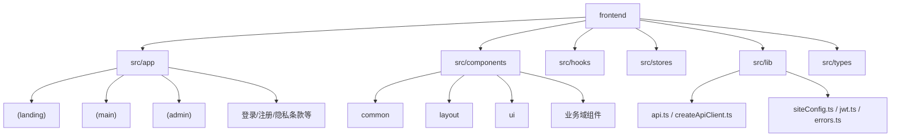
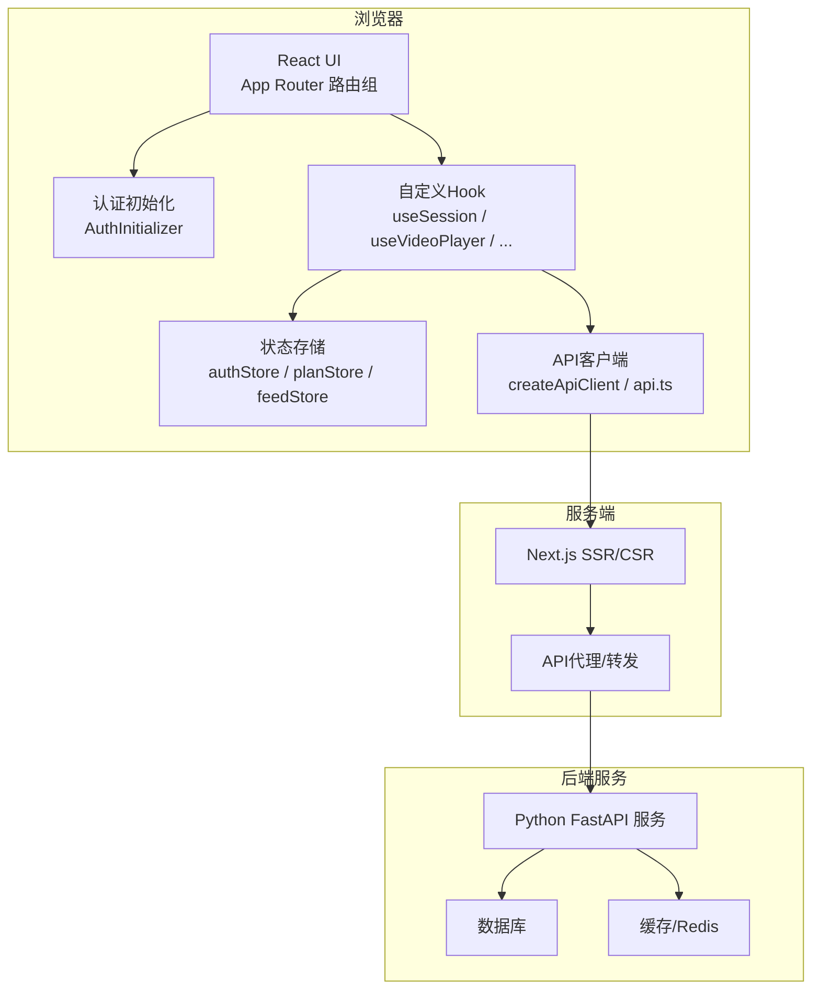
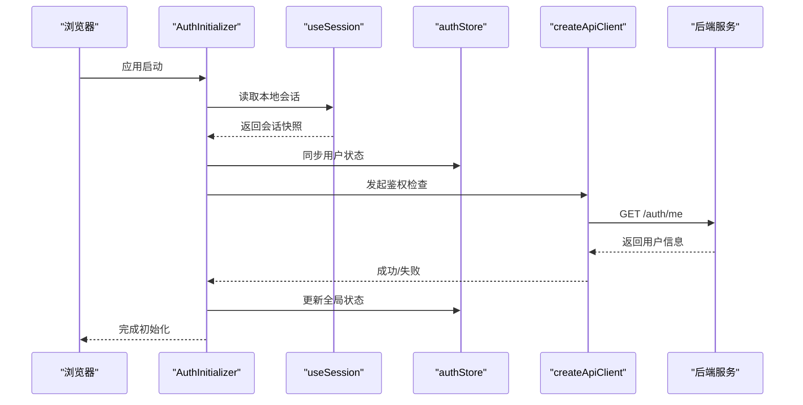
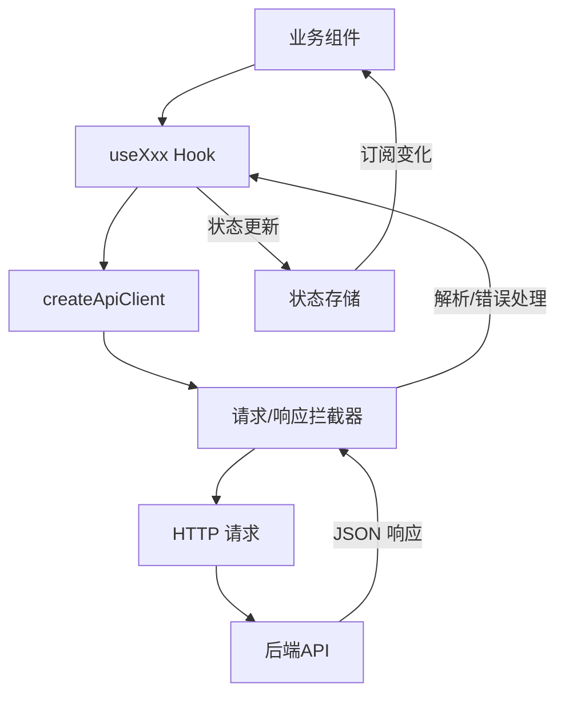
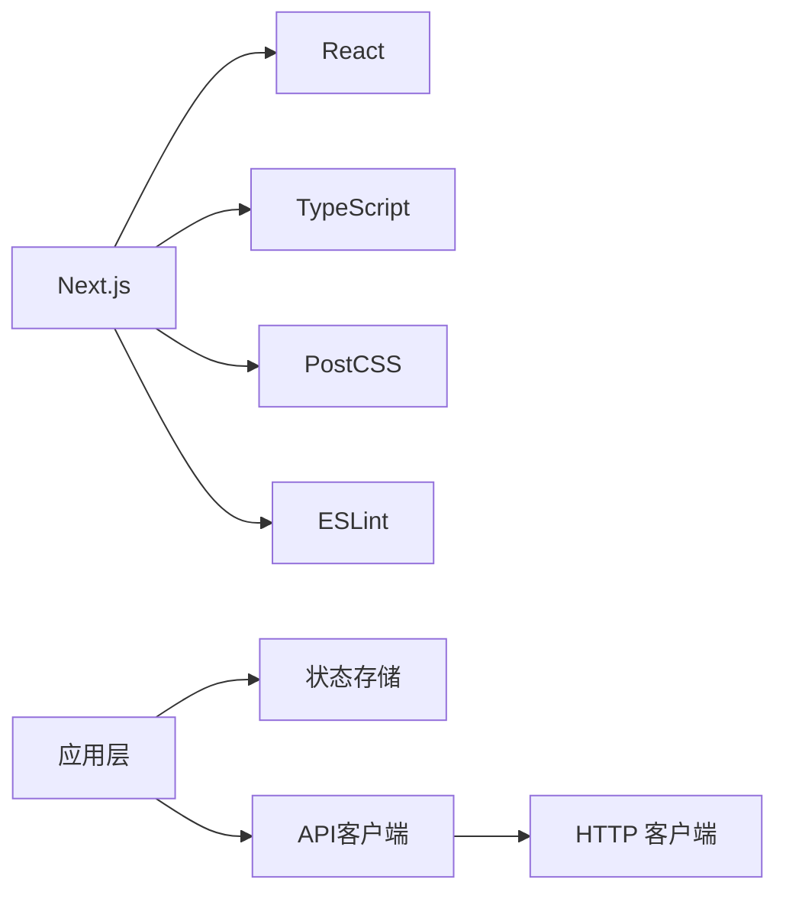

# 前端架构设计

<cite>
**本文引用的文件**
- [package.json](file://frontend/package.json)
- [next.config.js](file://frontend/next.config.js)
- [tsconfig.json](file://frontend/tsconfig.json)
- [postcss.config.js](file://frontend/postcss.config.js)
- [eslint.config.mjs](file://frontend/eslint.config.mjs)
- [app/layout.tsx](file://frontend/src/app/layout.tsx)
- [app/loading.tsx](file://frontend/src/app/loading.tsx)
- [app/not-found.tsx](file://frontend/src/app/not-found.tsx)
- [app/error.tsx](file://frontend/src/app/error.tsx)
- [app/(landing)/layout.tsx](file://frontend/src/app/(landing)/layout.tsx)
- [app/(main)/layout.tsx](file://frontend/src/app/(main)/layout.tsx)
- [app/(main)/page.tsx](file://frontend/src/app/(main)/page.tsx)
- [app/(main)/MainLayoutInner.tsx](file://frontend/src/app/(main)/MainLayoutInner.tsx)
- [app/(admin)/(shell)/layout.tsx](file://frontend/src/app/(admin)/(shell)/layout.tsx)
- [app/login/layout.tsx](file://frontend/src/app/login/layout.tsx)
- [app/register/layout.tsx](file://frontend/src/app/register/layout.tsx)
- [src/components/common/AuthInitializer.tsx](file://frontend/src/components/common/AuthInitializer.tsx)
- [src/components/common/ThemeProvider.tsx](file://frontend/src/components/common/ThemeProvider.tsx)
- [src/hooks/useSession.ts](file://frontend/src/hooks/useSession.ts)
- [src/stores/authStore.ts](file://frontend/src/stores/authStore.ts)
- [src/lib/api.ts](file://frontend/src/lib/api.ts)
- [src/lib/createApiClient.ts](file://frontend/src/lib/createApiClient.ts)
- [src/lib/siteConfig.ts](file://frontend/src/lib/siteConfig.ts)
- [src/lib/jwt.ts](file://frontend/src/lib/jwt.ts)
- [src/lib/errors.ts](file://frontend/src/lib/errors.ts)
- [src/types/index.ts](file://frontend/src/types/index.ts)
- [src/types/platform.ts](file://frontend/src/types/platform.ts)
- [Dockerfile](file://frontend/Dockerfile)
- [Dockerfile.prod](file://frontend/Dockerfile.prod)
- [.github/workflows/ci.yml](file://frontend/.github/workflows/ci.yml)
</cite>

## 目录
1. [简介](#简介)
2. [项目结构](#项目结构)
3. [核心组件](#核心组件)
4. [架构总览](#架构总览)
5. [详细组件分析](#详细组件分析)
6. [依赖关系分析](#依赖关系分析)
7. [性能考虑](#性能考虑)
8. [故障排查指南](#故障排查指南)
9. [结论](#结论)
10. [附录](#附录)

## 简介
本文件面向Speaking平台的前端工程，基于Next.js App Router构建，采用前后端分离架构。文档重点阐述：
- 路由组织策略、布局组件设计与页面分组机制
- TypeScript配置、模块导入规范与代码组织结构
- 应用初始化流程、中间件使用与全局配置管理
- 前后端API通信模式与数据流设计
- 构建优化、环境变量管理与部署设置
- 架构决策的技术背景与扩展性考量

## 项目结构
前端工程位于frontend目录，遵循Next.js App Router的约定式路由与分组布局：
- app目录为路由根，按功能域划分多个“路由组”（如(landing)、(main)、(admin)），每个路由组可拥有独立layout.tsx
- src下按职责分层：components（UI与业务组件）、hooks（自定义Hook）、stores（状态管理）、lib（工具与API封装）、types（类型定义）
- 公共样式与主题通过Theme相关组件集中管理
- 构建与质量工具链由package.json、next.config.js、tsconfig.json、postcss.config.js、eslint.config.mjs等统一管理



图表来源
- [package.json](file://frontend/package.json)
- [next.config.js](file://frontend/next.config.js)
- [app/layout.tsx](file://frontend/src/app/layout.tsx)

章节来源
- [package.json](file://frontend/package.json)
- [next.config.js](file://frontend/next.config.js)
- [tsconfig.json](file://frontend/tsconfig.json)

## 核心组件
- 应用根布局：负责全局HTML骨架、元信息、全局样式注入与错误边界
- 路由组布局：
  - (landing)：着陆页布局，通常无侧边栏或顶部导航
  - (main)：主站布局，包含顶部导航、侧边栏、内容区与全局交互
  - (admin)：后台管理布局，含管理员侧边栏、顶部栏与权限控制
- 认证初始化：在客户端启动时统一处理会话恢复、Token刷新与鉴权拦截
- 主题与国际化：通过Provider集中提供主题上下文，便于全局切换

章节来源
- [app/layout.tsx](file://frontend/src/app/layout.tsx)
- [app/(landing)/layout.tsx](file://frontend/src/app/(landing)/layout.tsx)
- [app/(main)/layout.tsx](file://frontend/src/app/(main)/layout.tsx)
- [app/(admin)/(shell)/layout.tsx](file://frontend/src/app/(admin)/(shell)/layout.tsx)
- [src/components/common/AuthInitializer.tsx](file://frontend/src/components/common/AuthInitializer.tsx)
- [src/components/common/ThemeProvider.tsx](file://frontend/src/components/common/ThemeProvider.tsx)

## 架构总览
整体采用Next.js App Router + React Server Components/Client Components混合渲染，前后端通过REST API通信，状态管理集中在轻量store中，结合Hook进行局部状态与副作用管理。



图表来源
- [app/(main)/layout.tsx](file://frontend/src/app/(main)/layout.tsx)
- [src/components/common/AuthInitializer.tsx](file://frontend/src/components/common/AuthInitializer.tsx)
- [src/lib/createApiClient.ts](file://frontend/src/lib/createApiClient.ts)
- [src/lib/api.ts](file://frontend/src/lib/api.ts)

## 详细组件分析

### 路由组织与布局设计
- 路由组：
  - (landing)：用于营销与着陆页，布局简洁，强调首屏转化
  - (main)：用户主站，包含导航、侧边栏、内容区域与全局交互
  - (admin)：后台管理，具备独立的Shell布局与权限校验
- 布局嵌套：
  - 根layout.tsx提供全局HTML与错误边界
  - 各路由组layout.tsx组合具体业务布局
  - 子级页面按需覆盖loading.tsx、not-found.tsx、error.tsx

```mermaid
flowchart TD
Start(["进入应用"]) --> RootLayout["根布局<br/>app/layout.tsx"]
RootLayout --> RouteGroup{"路由组匹配"}
RouteGroup --> |landing|(LandingLayout)["着陆页布局<br/>(landing)/layout.tsx"]
RouteGroup --> |main|(MainLayout)["主站布局<br/>(main)/layout.tsx"]
RouteGroup --> |admin|(AdminLayout)["后台布局<br/>(admin)/(shell)/layout.tsx"]
LandingLayout --> Page["页面组件"]
MainLayout --> Page
AdminLayout --> Page
Page --> ErrorBoundary["错误边界<br/>app/error.tsx"]
```

图表来源
- [app/layout.tsx](file://frontend/src/app/layout.tsx)
- [app/(landing)/layout.tsx](file://frontend/src/app/(landing)/layout.tsx)
- [app/(main)/layout.tsx](file://frontend/src/app/(main)/layout.tsx)
- [app/(admin)/(shell)/layout.tsx](file://frontend/src/app/(admin)/(shell)/layout.tsx)
- [app/error.tsx](file://frontend/src/app/error.tsx)

章节来源
- [app/(main)/layout.tsx](file://frontend/src/app/(main)/layout.tsx)
- [app/(main)/MainLayoutInner.tsx](file://frontend/src/app/(main)/MainLayoutInner.tsx)
- [app/(main)/page.tsx](file://frontend/src/app/(main)/page.tsx)
- [app/(admin)/(shell)/layout.tsx](file://frontend/src/app/(admin)/(shell)/layout.tsx)

### 应用初始化与认证流程
- 客户端启动后，AuthInitializer统一处理：
  - 从本地存储恢复会话
  - 校验Token有效性并刷新
  - 将用户状态写入全局store
  - 根据角色与权限决定路由跳转
- useSession Hook暴露当前会话状态与刷新方法
- authStore集中管理用户信息、权限与登录态



图表来源
- [src/components/common/AuthInitializer.tsx](file://frontend/src/components/common/AuthInitializer.tsx)
- [src/hooks/useSession.ts](file://frontend/src/hooks/useSession.ts)
- [src/stores/authStore.ts](file://frontend/src/stores/authStore.ts)
- [src/lib/createApiClient.ts](file://frontend/src/lib/createApiClient.ts)
- [src/lib/api.ts](file://frontend/src/lib/api.ts)

章节来源
- [src/components/common/AuthInitializer.tsx](file://frontend/src/components/common/AuthInitializer.tsx)
- [src/hooks/useSession.ts](file://frontend/src/hooks/useSession.ts)
- [src/stores/authStore.ts](file://frontend/src/stores/authStore.ts)

### API通信与数据流设计
- 统一的API客户端：
  - createApiClient封装请求头、错误处理、重试与拦截器
  - api.ts按领域拆分接口调用方法
- 数据流：
  - 组件通过Hook触发请求
  - 请求经API客户端发送，响应回写至store或Hook内部状态
  - 错误统一捕获并上报到全局错误边界



图表来源
- [src/lib/createApiClient.ts](file://frontend/src/lib/createApiClient.ts)
- [src/lib/api.ts](file://frontend/src/lib/api.ts)
- [src/lib/errors.ts](file://frontend/src/lib/errors.ts)

章节来源
- [src/lib/createApiClient.ts](file://frontend/src/lib/createApiClient.ts)
- [src/lib/api.ts](file://frontend/src/lib/api.ts)
- [src/lib/errors.ts](file://frontend/src/lib/errors.ts)

### TypeScript配置与模块导入规范
- tsconfig.json启用严格模式与路径别名，提升类型安全与开发体验
- 模块导入：
  - 优先使用相对路径与路径别名
  - 避免循环依赖，按职责分层组织
  - 类型定义集中于types目录，跨模块复用

章节来源
- [tsconfig.json](file://frontend/tsconfig.json)
- [src/types/index.ts](file://frontend/src/types/index.ts)
- [src/types/platform.ts](file://frontend/src/types/platform.ts)

### 全局配置与环境变量
- siteConfig.ts集中管理站点配置项（如域名、特性开关、第三方服务URL）
- next.config.js配置构建选项、代理、图片优化与运行时环境变量
- Dockerfile与Dockerfile.prod区分开发与生产构建参数

章节来源
- [src/lib/siteConfig.ts](file://frontend/src/lib/siteConfig.ts)
- [next.config.js](file://frontend/next.config.js)
- [Dockerfile](file://frontend/Dockerfile)
- [Dockerfile.prod](file://frontend/Dockerfile.prod)

### 构建优化与CI
- package.json定义脚本命令（开发、构建、测试、Lint）
- next.config.js启用静态导出、增量编译、图片优化与CDN集成
- CI流水线执行Lint、类型检查、单元测试与构建产物验证

章节来源
- [package.json](file://frontend/package.json)
- [next.config.js](file://frontend/next.config.js)
- [.github/workflows/ci.yml](file://frontend/.github/workflows/ci.yml)

## 依赖关系分析
- 框架与工具链：
  - Next.js、React、TypeScript、PostCSS、ESLint、Prettier
- 状态与网络：
  - 轻量store（Zustand或类似库）+ 自定义Hook
  - fetch/axios封装的统一API客户端
- 构建与部署：
  - Docker镜像构建、多阶段构建、环境变量注入



图表来源
- [package.json](file://frontend/package.json)
- [next.config.js](file://frontend/next.config.js)
- [tsconfig.json](file://frontend/tsconfig.json)

章节来源
- [package.json](file://frontend/package.json)
- [next.config.js](file://frontend/next.config.js)
- [tsconfig.json](file://frontend/tsconfig.json)

## 性能考虑
- 路由级代码分割与懒加载，减少首屏体积
- 组件级Memoization与选择性重渲染
- 图片与媒体资源优化（Next Image、WebP/AVIF、懒加载）
- 数据获取策略：
  - 服务端渲染关键数据，客户端缓存非关键数据
  - 合理分页与增量更新，避免全量拉取
- 构建优化：
  - 启用Tree Shaking、压缩与Source Map
  - 静态资源CDN加速

[本节为通用指导，不直接分析具体文件]

## 故障排查指南
- 常见错误分类：
  - 网络错误：超时、401/403、500
  - 状态错误：未登录、权限不足、数据不一致
  - 渲染错误：组件异常、类型不匹配
- 定位步骤：
  - 查看浏览器控制台与Network面板
  - 检查API客户端拦截器日志
  - 确认authStore状态与Token有效期
  - 核对环境变量与后端服务可用性
- 错误边界：
  - app/error.tsx统一捕获渲染错误
  - lib/errors.ts提供错误格式化与上报

章节来源
- [app/error.tsx](file://frontend/src/app/error.tsx)
- [src/lib/errors.ts](file://frontend/src/lib/errors.ts)
- [src/stores/authStore.ts](file://frontend/src/stores/authStore.ts)

## 结论
本架构以Next.js App Router为核心，结合清晰的路由组与布局分层、统一的API客户端与状态管理、严格的TypeScript与构建配置，实现了高内聚、低耦合的前端系统。通过环境隔离与CI流水线保障交付质量，具备良好的扩展性与可维护性。后续可在以下方向持续优化：
- 引入更细粒度的缓存策略与离线能力
- 增强监控与可观测性（错误上报、性能指标）
- 组件库抽象与样式系统升级（Design Tokens）

[本节为总结性内容，不直接分析具体文件]

## 附录
- 环境变量清单与用途说明
- 部署清单与注意事项
- 常用命令与调试技巧

[本节为补充信息，不直接分析具体文件]
