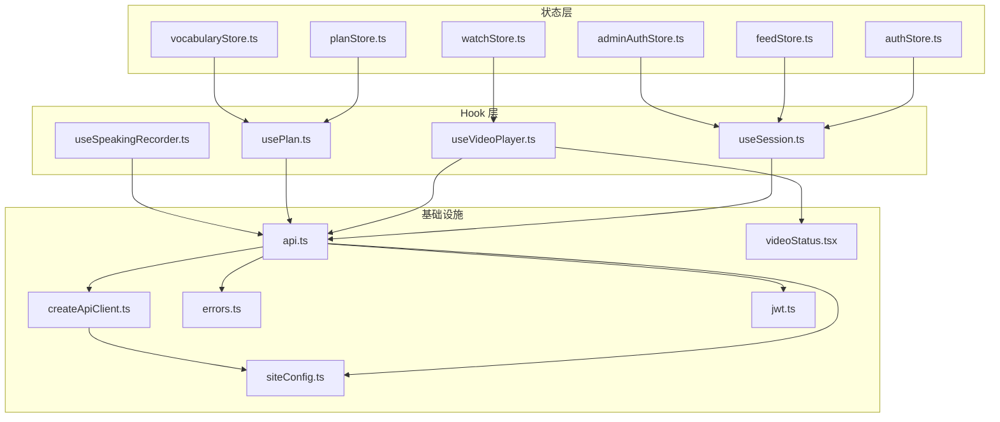
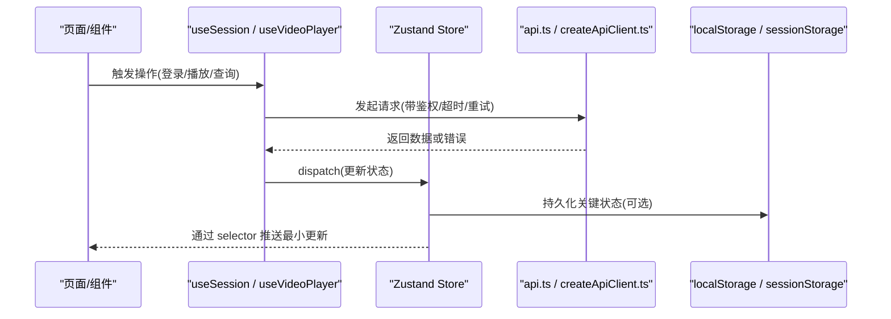
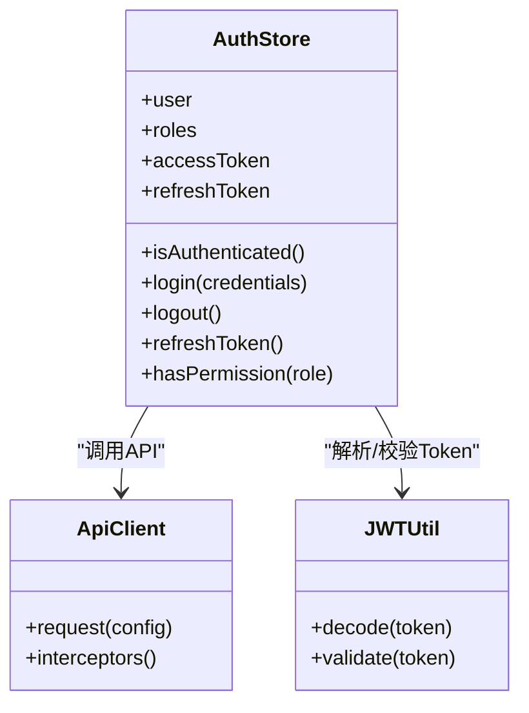
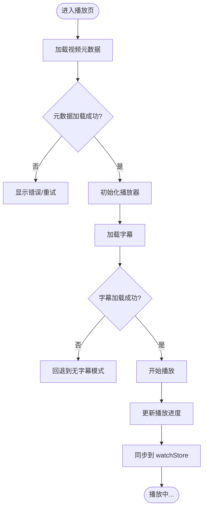
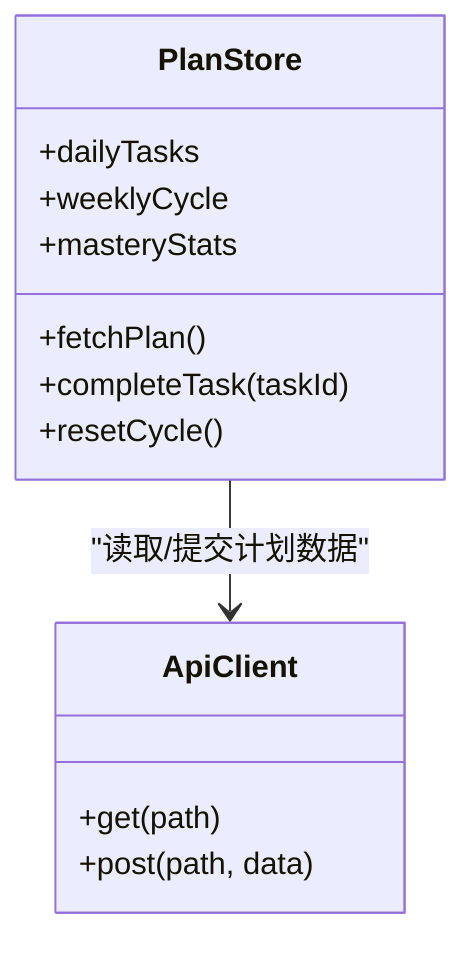
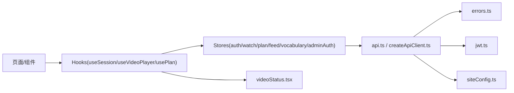

# 状态管理

<cite>
**本文引用的文件**
- [authStore.ts](file://frontend/src/stores/authStore.ts)
- [watchStore.ts](file://frontend/src/stores/watchStore.ts)
- [planStore.ts](file://frontend/src/stores/planStore.ts)
- [feedStore.ts](file://frontend/src/stores/feedStore.ts)
- [vocabularyStore.ts](file://frontend/src/stores/vocabularyStore.ts)
- [adminAuthStore.ts](file://frontend/src/stores/adminAuthStore.ts)
- [useSession.ts](file://frontend/src/hooks/useSession.ts)
- [useVideoPlayer.ts](file://frontend/src/hooks/useVideoPlayer.ts)
- [usePlan.ts](file://frontend/src/hooks/usePlan.ts)
- [useSpeakingRecorder.ts](file://frontend/src/hooks/useSpeakingRecorder.ts)
- [api.ts](file://frontend/src/lib/api.ts)
- [createApiClient.ts](file://frontend/src/lib/createApiClient.ts)
- [errors.ts](file://frontend/src/lib/errors.ts)
- [jwt.ts](file://frontend/src/lib/jwt.ts)
- [siteConfig.ts](file://frontend/src/lib/siteConfig.ts)
- [videoStatus.tsx](file://frontend/src/lib/videoStatus.tsx)
- [AuthInitializer.tsx](file://frontend/src/components/common/AuthInitializer.tsx)
- [MainLayoutInner.tsx](file://frontend/src/app/(main)/MainLayoutInner.tsx)
</cite>

## 目录
1. [简介](#简介)
2. [项目结构](#项目结构)
3. [核心组件](#核心组件)
4. [架构总览](#架构总览)
5. [详细组件分析](#详细组件分析)
6. [依赖关系分析](#依赖关系分析)
7. [性能考虑](#性能考虑)
8. [故障排查指南](#故障排查指南)
9. [结论](#结论)
10. [附录](#附录)

## 简介
本文件系统化梳理 Speaking 平台前端的状态管理方案，重点围绕 Zustand 的 store 设计、状态结构组织与数据持久化策略。文档覆盖用户认证状态、视频播放状态、学习计划状态等核心业务域，并详细说明自定义 Hook（如 useSession、useVideoPlayer）的数据获取与状态同步模式。同时给出异步数据处理、错误处理与缓存策略的实践建议，以及状态调试工具、性能优化与内存管理最佳实践，并提供状态迁移与版本兼容性处理方案。

## 项目结构
前端状态管理集中在 stores 与 hooks 两个层次：
- stores：基于 Zustand 的领域级 Store，负责全局状态与跨组件共享数据（认证、播放、计划、内容流、词汇等）。
- hooks：封装 API 调用、副作用与状态同步逻辑，向上暴露稳定接口供页面与组件使用。
- lib：通用能力（API 客户端、错误处理、JWT、站点配置、视频状态工具等），为 stores 与 hooks 提供基础设施。

图表来源
- [authStore.ts:1-200](file://frontend/src/stores/authStore.ts#L1-L200)
- [watchStore.ts:1-200](file://frontend/src/stores/watchStore.ts#L1-L200)
- [planStore.ts:1-200](file://frontend/src/stores/planStore.ts#L1-L200)
- [feedStore.ts:1-200](file://frontend/src/stores/feedStore.ts#L1-L200)
- [vocabularyStore.ts:1-200](file://frontend/src/stores/vocabularyStore.ts#L1-L200)
- [adminAuthStore.ts:1-200](file://frontend/src/stores/adminAuthStore.ts#L1-L200)
- [useSession.ts:1-200](file://frontend/src/hooks/useSession.ts#L1-L200)
- [useVideoPlayer.ts:1-200](file://frontend/src/hooks/useVideoPlayer.ts#L1-L200)
- [usePlan.ts:1-200](file://frontend/src/hooks/usePlan.ts#L1-L200)
- [useSpeakingRecorder.ts:1-200](file://frontend/src/hooks/useSpeakingRecorder.ts#L1-L200)
- [api.ts:1-200](file://frontend/src/lib/api.ts#L1-L200)
- [createApiClient.ts:1-200](file://frontend/src/lib/createApiClient.ts#L1-L200)
- [errors.ts:1-200](file://frontend/src/lib/errors.ts#L1-L200)
- [jwt.ts:1-200](file://frontend/src/lib/jwt.ts#L1-L200)
- [siteConfig.ts:1-200](file://frontend/src/lib/siteConfig.ts#L1-L200)
- [videoStatus.tsx:1-200](file://frontend/src/lib/videoStatus.tsx#L1-L200)

章节来源
- [authStore.ts:1-200](file://frontend/src/stores/authStore.ts#L1-L200)
- [watchStore.ts:1-200](file://frontend/src/stores/watchStore.ts#L1-L200)
- [planStore.ts:1-200](file://frontend/src/stores/planStore.ts#L1-L200)
- [feedStore.ts:1-200](file://frontend/src/stores/feedStore.ts#L1-L200)
- [vocabularyStore.ts:1-200](file://frontend/src/stores/vocabularyStore.ts#L1-L200)
- [adminAuthStore.ts:1-200](file://frontend/src/stores/adminAuthStore.ts#L1-L200)
- [useSession.ts:1-200](file://frontend/src/hooks/useSession.ts#L1-L200)
- [useVideoPlayer.ts:1-200](file://frontend/src/hooks/useVideoPlayer.ts#L1-L200)
- [usePlan.ts:1-200](file://frontend/src/hooks/usePlan.ts#L1-L200)
- [useSpeakingRecorder.ts:1-200](file://frontend/src/hooks/useSpeakingRecorder.ts#L1-L200)
- [api.ts:1-200](file://frontend/src/lib/api.ts#L1-L200)
- [createApiClient.ts:1-200](file://frontend/src/lib/createApiClient.ts#L1-L200)
- [errors.ts:1-200](file://frontend/src/lib/errors.ts#L1-L200)
- [jwt.ts:1-200](file://frontend/src/lib/jwt.ts#L1-L200)
- [siteConfig.ts:1-200](file://frontend/src/lib/siteConfig.ts#L1-L200)
- [videoStatus.tsx:1-200](file://frontend/src/lib/videoStatus.tsx#L1-L200)

## 核心组件
- authStore：集中管理用户认证态（登录态、用户信息、权限、Token 生命周期），提供登录、登出、刷新、权限校验等方法。
- watchStore：管理视频播放相关状态（当前视频、播放进度、字幕、倍速、全屏、画中画等），并与播放器实例联动。
- planStore：维护学习计划（每日任务、周循环、掌握度统计、完成状态），支持增量更新与本地持久化。
- feedStore：管理首页/推荐内容流的分页、筛选、加载态与缓存。
- vocabularyStore：管理词汇学习数据（词库、笔记、测验进度）及离线缓存。
- adminAuthStore：管理后台管理员认证态与权限控制。

章节来源
- [authStore.ts:1-200](file://frontend/src/stores/authStore.ts#L1-L200)
- [watchStore.ts:1-200](file://frontend/src/stores/watchStore.ts#L1-L200)
- [planStore.ts:1-200](file://frontend/src/stores/planStore.ts#L1-L200)
- [feedStore.ts:1-200](file://frontend/src/stores/feedStore.ts#L1-L200)
- [vocabularyStore.ts:1-200](file://frontend/src/stores/vocabularyStore.ts#L1-L200)
- [adminAuthStore.ts:1-200](file://frontend/src/stores/adminAuthStore.ts#L1-L200)

## 架构总览
Zustand 作为轻量状态容器，配合自定义 Hook 实现“数据获取 + 状态同步”的统一模式。整体流程如下：
- 页面/Hook 通过 Zustand selector 订阅最小状态片段，避免不必要重渲染。
- 业务 Hook（如 useSession、useVideoPlayer）封装 API 调用、错误处理、重试与缓存，并将结果写入对应 store。
- Store 内部采用不可变更新与选择性持久化（如 localStorage/sessionStorage），保证状态可预测与可恢复。
- 应用初始化阶段（如 AuthInitializer）统一拉取会话与必要元数据，确保路由守卫与权限判断正确。

图表来源
- [useSession.ts:1-200](file://frontend/src/hooks/useSession.ts#L1-L200)
- [useVideoPlayer.ts:1-200](file://frontend/src/hooks/useVideoPlayer.ts#L1-L200)
- [api.ts:1-200](file://frontend/src/lib/api.ts#L1-L200)
- [createApiClient.ts:1-200](file://frontend/src/lib/createApiClient.ts#L1-L200)
- [authStore.ts:1-200](file://frontend/src/stores/authStore.ts#L1-L200)
- [watchStore.ts:1-200](file://frontend/src/stores/watchStore.ts#L1-L200)

## 详细组件分析

### 认证状态管理（authStore）
- 状态结构：用户基本信息、角色/权限、Token（访问令牌/刷新令牌）、登录态标志、错误消息。
- 关键方法：登录、注册、短信验证码、登出、刷新 Token、权限检查、清除本地态。
- 持久化策略：访问令牌短期存储于内存或 session；刷新令牌与用户基础信息可持久化至 localStorage；敏感字段需加密或最小化存储。
- 错误处理：网络异常、Token 过期、权限不足等统一归一化为错误对象，便于 UI 提示与重试。
- 与 Hook 协作：useSession 负责会话初始化、自动刷新与路由守卫集成。

图表来源
- [authStore.ts:1-200](file://frontend/src/stores/authStore.ts#L1-L200)
- [api.ts:1-200](file://frontend/src/lib/api.ts#L1-L200)
- [createApiClient.ts:1-200](file://frontend/src/lib/createApiClient.ts#L1-L200)
- [jwt.ts:1-200](file://frontend/src/lib/jwt.ts#L1-L200)

章节来源
- [authStore.ts:1-200](file://frontend/src/stores/authStore.ts#L1-L200)
- [useSession.ts:1-200](file://frontend/src/hooks/useSession.ts#L1-L200)
- [api.ts:1-200](file://frontend/src/lib/api.ts#L1-L200)
- [createApiClient.ts:1-200](file://frontend/src/lib/createApiClient.ts#L1-L200)
- [jwt.ts:1-200](file://frontend/src/lib/jwt.ts#L1-L200)
- [errors.ts:1-200](file://frontend/src/lib/errors.ts#L1-L200)

### 视频播放状态管理（watchStore）
- 状态结构：当前视频元数据、播放进度、字幕列表、字幕高亮、倍速、音量、全屏/画中画、播放队列、错误与加载态。
- 关键方法：加载视频、切换字幕、跳转时间轴、更新播放状态、清理资源。
- 与播放器集成：通过 Hook 封装播放器实例的生命周期，避免在组件中直接操作 DOM。
- 缓存策略：字幕与元数据可缓存，结合版本号与 ETag 进行增量更新。

图表来源
- [watchStore.ts:1-200](file://frontend/src/stores/watchStore.ts#L1-L200)
- [useVideoPlayer.ts:1-200](file://frontend/src/hooks/useVideoPlayer.ts#L1-L200)
- [videoStatus.tsx:1-200](file://frontend/src/lib/videoStatus.tsx#L1-L200)

章节来源
- [watchStore.ts:1-200](file://frontend/src/stores/watchStore.ts#L1-L200)
- [useVideoPlayer.ts:1-200](file://frontend/src/hooks/useVideoPlayer.ts#L1-L200)
- [videoStatus.tsx:1-200](file://frontend/src/lib/videoStatus.tsx#L1-L200)

### 学习计划状态管理（planStore）
- 状态结构：每日任务清单、周循环计数器、掌握度指标、完成记录、目标设置。
- 关键方法：获取计划、完成任务、重置周期、同步统计数据。
- 持久化策略：本地缓存计划快照，网络冲突时以服务端为准进行合并。
- 与 Hook 协作：usePlan 封装计划数据的拉取、缓存与增量更新。

图表来源
- [planStore.ts:1-200](file://frontend/src/stores/planStore.ts#L1-L200)
- [usePlan.ts:1-200](file://frontend/src/hooks/usePlan.ts#L1-L200)
- [api.ts:1-200](file://frontend/src/lib/api.ts#L1-L200)

章节来源
- [planStore.ts:1-200](file://frontend/src/stores/planStore.ts#L1-L200)
- [usePlan.ts:1-200](file://frontend/src/hooks/usePlan.ts#L1-L200)

### 内容流与词汇学习（feedStore、vocabularyStore）
- feedStore：分页内容流、筛选条件、加载态、错误态、缓存键策略（按筛选维度生成唯一键）。
- vocabularyStore：词库检索、笔记增删改查、测验进度、离线缓存与同步。
- 与 Hook 协作：useHomeFeed、usePractice、useWordLookup 等 Hook 封装数据获取与缓存命中逻辑。

章节来源
- [feedStore.ts:1-200](file://frontend/src/stores/feedStore.ts#L1-L200)
- [vocabularyStore.ts:1-200](file://frontend/src/stores/vocabularyStore.ts#L1-L200)

### 后台认证（adminAuthStore）
- 独立于前台认证的后台管理员态，包含管理员角色、权限矩阵与操作审计。
- 与 authStore 解耦，避免权限混淆。

章节来源
- [adminAuthStore.ts:1-200](file://frontend/src/stores/adminAuthStore.ts#L1-L200)

## 依赖关系分析
- Store 与 Hook 的耦合：Hook 负责副作用与 API 调用，Store 仅关注状态变更与持久化，职责清晰。
- API 客户端抽象：统一拦截器处理鉴权、重试、错误映射，降低各模块重复代码。
- 外部依赖：JWT 工具用于 Token 解析与校验；站点配置决定 API 基址与特性开关；视频状态工具辅助播放器状态转换。

图表来源
- [useSession.ts:1-200](file://frontend/src/hooks/useSession.ts#L1-L200)
- [useVideoPlayer.ts:1-200](file://frontend/src/hooks/useVideoPlayer.ts#L1-L200)
- [usePlan.ts:1-200](file://frontend/src/hooks/usePlan.ts#L1-L200)
- [authStore.ts:1-200](file://frontend/src/stores/authStore.ts#L1-L200)
- [watchStore.ts:1-200](file://frontend/src/stores/watchStore.ts#L1-L200)
- [planStore.ts:1-200](file://frontend/src/stores/planStore.ts#L1-L200)
- [feedStore.ts:1-200](file://frontend/src/stores/feedStore.ts#L1-L200)
- [vocabularyStore.ts:1-200](file://frontend/src/stores/vocabularyStore.ts#L1-L200)
- [adminAuthStore.ts:1-200](file://frontend/src/stores/adminAuthStore.ts#L1-L200)
- [api.ts:1-200](file://frontend/src/lib/api.ts#L1-L200)
- [createApiClient.ts:1-200](file://frontend/src/lib/createApiClient.ts#L1-L200)
- [errors.ts:1-200](file://frontend/src/lib/errors.ts#L1-L200)
- [jwt.ts:1-200](file://frontend/src/lib/jwt.ts#L1-L200)
- [siteConfig.ts:1-200](file://frontend/src/lib/siteConfig.ts#L1-L200)
- [videoStatus.tsx:1-200](file://frontend/src/lib/videoStatus.tsx#L1-L200)

章节来源
- [api.ts:1-200](file://frontend/src/lib/api.ts#L1-L200)
- [createApiClient.ts:1-200](file://frontend/src/lib/createApiClient.ts#L1-L200)
- [errors.ts:1-200](file://frontend/src/lib/errors.ts#L1-L200)
- [jwt.ts:1-200](file://frontend/src/lib/jwt.ts#L1-L200)
- [siteConfig.ts:1-200](file://frontend/src/lib/siteConfig.ts#L1-L200)
- [videoStatus.tsx:1-200](file://frontend/src/lib/videoStatus.tsx#L1-L200)

## 性能考虑
- 选择器粒度：使用 Zustand 的 selector 精确订阅所需字段，减少无关重渲染。
- 惰性加载：仅在需要时拉取数据（如按需加载字幕、延迟加载推荐列表）。
- 缓存策略：对热点数据（视频元数据、字幕、词汇）实施内存+磁盘双层缓存，设置合理 TTL 与失效策略。
- 去抖与节流：搜索输入、滚动加载等高频事件使用防抖/节流，避免频繁请求。
- 资源释放：离开页面时清理定时器、取消未完成的请求、释放播放器实例，防止内存泄漏。
- 批量更新：合并多次状态变更，减少渲染次数。

[本节为通用指导，不直接分析具体文件]

## 故障排查指南
- 认证失败：检查 Token 是否过期、刷新流程是否触发、后端返回的错误码映射是否正确。
- 播放异常：确认字幕与元数据加载顺序、播放器实例生命周期、错误回调是否上报。
- 计划不同步：核对本地缓存与服务端数据版本，必要时强制刷新并合并差异。
- 网络错误：查看拦截器日志、重试策略与超时配置，定位是网络问题还是服务端异常。
- 调试工具：启用 Zustand 中间件（如 devtools）观察状态变化；在 Hook 中打印关键路径与耗时。

章节来源
- [errors.ts:1-200](file://frontend/src/lib/errors.ts#L1-L200)
- [api.ts:1-200](file://frontend/src/lib/api.ts#L1-L200)
- [createApiClient.ts:1-200](file://frontend/src/lib/createApiClient.ts#L1-L200)
- [jwt.ts:1-200](file://frontend/src/lib/jwt.ts#L1-L200)

## 结论
通过 Zustand 与自定义 Hook 的组合，Speaking 平台实现了清晰的状态分层与稳定的数据流。认证、播放、计划等核心业务状态均具备明确的职责边界、完善的错误处理与合理的缓存策略。遵循本文的最佳实践，可进一步提升性能与可维护性，并为后续功能扩展与状态迁移奠定基础。

[本节为总结性内容，不直接分析具体文件]

## 附录
- 应用初始化流程：AuthInitializer 在应用启动时统一拉取会话与必要元数据，确保路由守卫与权限判断前置完成。
- 布局集成：MainLayoutInner 在顶层布局中订阅认证与通知状态，保障全局一致性。

章节来源
- [AuthInitializer.tsx:1-200](file://frontend/src/components/common/AuthInitializer.tsx#L1-L200)
- [MainLayoutInner.tsx:1-200](file://frontend/src/app/(main)/MainLayoutInner.tsx#L1-L200)
