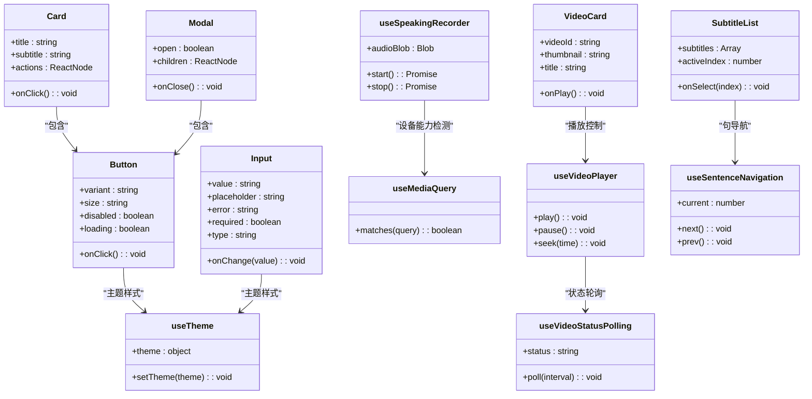
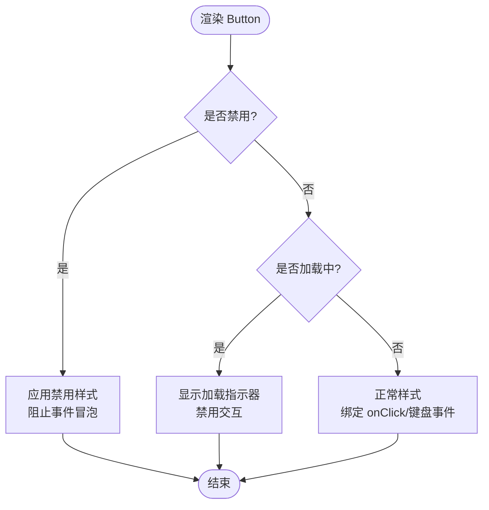
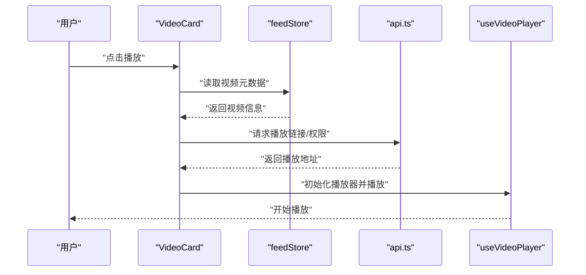
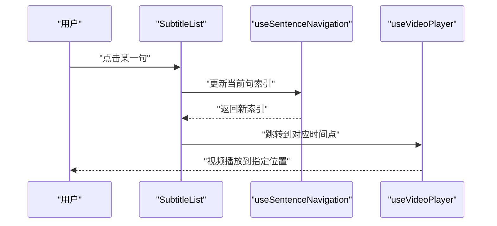
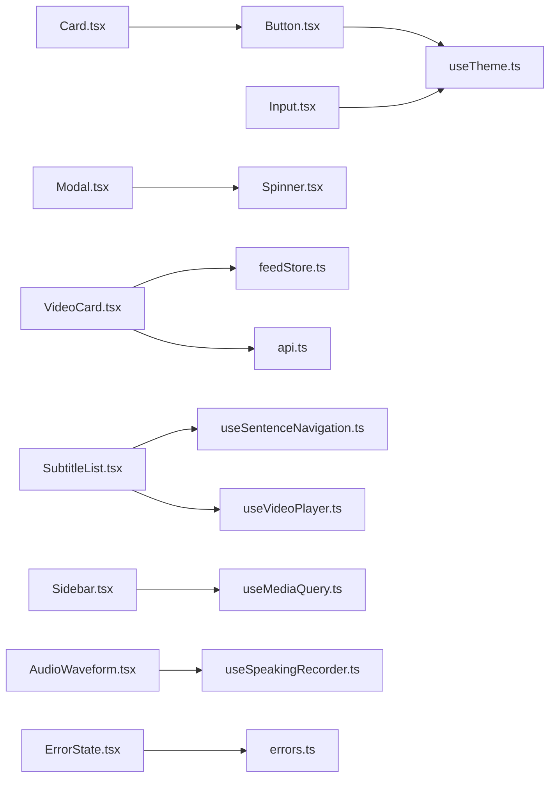

# 组件系统

<cite>
**本文引用的文件**
- [frontend/src/components/ui/Button.tsx](file://frontend/src/components/ui/Button.tsx)
- [frontend/src/components/ui/Card.tsx](file://frontend/src/components/ui/Card.tsx)
- [frontend/src/components/ui/Input.tsx](file://frontend/src/components/ui/Input.tsx)
- [frontend/src/components/ui/VideoCard.tsx](file://frontend/src/components/ui/VideoCard.tsx)
- [frontend/src/components/subtitle/SubtitleList.tsx](file://frontend/src/components/subtitle/SubtitleList.tsx)
- [frontend/src/components/common/Modal.tsx](file://frontend/src/components/common/Modal.tsx)
- [frontend/src/components/common/Spinner.tsx](file://frontend/src/components/common/Spinner.tsx)
- [frontend/src/components/layout/Sidebar.tsx](file://frontend/src/components/layout/Sidebar.tsx)
- [frontend/src/components/layout/MobileTabBar.tsx](file://frontend/src/components/layout/MobileTabBar.tsx)
- [frontend/src/hooks/useMediaQuery.ts](file://frontend/src/hooks/useMediaQuery.ts)
- [frontend/src/hooks/useTheme.ts](file://frontend/src/hooks/useTheme.ts)
- [frontend/src/components/common/ThemeProvider.tsx](file://frontend/src/components/common/ThemeProvider.tsx)
- [frontend/src/app/globals.css](file://frontend/src/app/globals.css)
- [frontend/src/lib/siteConfig.ts](file://frontend/src/lib/siteConfig.ts)
- [frontend/src/stores/authStore.ts](file://frontend/src/stores/authStore.ts)
- [frontend/src/stores/feedStore.ts](file://frontend/src/stores/feedStore.ts)
- [frontend/src/stores/watchStore.ts](file://frontend/src/stores/watchStore.ts)
- [frontend/src/lib/api.ts](file://frontend/src/lib/api.ts)
- [frontend/src/lib/errors.ts](file://frontend/src/lib/errors.ts)
- [frontend/src/components/common/ErrorState.tsx](file://frontend/src/components/common/ErrorState.tsx)
- [frontend/src/components/common/EmptyState.tsx](file://frontend/src/components/common/EmptyState.tsx)
- [frontend/src/components/admin/DataTable.tsx](file://frontend/src/components/admin/DataTable.tsx)
- [frontend/src/components/admin/Pagination.tsx](file://frontend/src/components/admin/Pagination.tsx)
- [frontend/src/components/video/VideoThumbnail.tsx](file://frontend/src/components/video/VideoThumbnail.tsx)
- [frontend/src/components/speaking/AudioWaveform.tsx](file://frontend/src/components/speaking/AudioWaveform.tsx)
- [frontend/src/hooks/useSpeakingRecorder.ts](file://frontend/src/hooks/useSpeakingRecorder.ts)
- [frontend/src/hooks/useVideoPlayer.ts](file://frontend/src/hooks/useVideoPlayer.ts)
- [frontend/src/hooks/useVideoStatusPolling.ts](file://frontend/src/hooks/useVideoStatusPolling.ts)
- [frontend/src/hooks/useSentenceNavigation.ts](file://frontend/src/hooks/useSentenceNavigation.ts)
</cite>

## 目录
1. [简介](#简介)
2. [项目结构](#项目结构)
3. [核心组件](#核心组件)
4. [架构总览](#架构总览)
5. [详细组件分析](#详细组件分析)
6. [依赖关系分析](#依赖关系分析)
7. [性能考虑](#性能考虑)
8. [故障排查指南](#故障排查指南)
9. [结论](#结论)
10. [附录](#附录)

## 简介
本文件系统化梳理 Speaking 平台前端 UI 组件体系，覆盖基础 UI 组件库（Button、Card、Input 等）与业务组件（VideoCard、SubtitleList 等）的设计原则、属性接口、样式定制、组合使用、事件处理与状态管理。同时说明响应式设计与主题适配、可访问性支持、测试策略、性能优化技巧与开发最佳实践，并提供集成指南与示例路径，帮助开发者快速上手并高质量扩展组件库。

## 项目结构
前端采用 Next.js + React + TypeScript 技术栈，组件按职责分层组织：
- ui 层：原子化基础组件（按钮、卡片、输入、栅格、头像等）
- common 层：通用交互与容器（模态框、加载、错误/空状态、主题提供者）
- layout 层：页面级布局（侧边栏、移动端底部导航、顶部栏）
- subtitle 层：字幕相关功能组件（列表、模式切换、词提示）
- video 层：视频相关展示（缩略图、状态徽章）
- speaking 层：口语练习相关（波形可视化）
- hooks 层：跨组件复用的逻辑（媒体查询、主题、播放器、录音、轮询等）
- stores 层：全局状态（认证、信息流、播放页状态）
- lib 层：工具与 API 封装（站点配置、错误处理、网络请求）

```mermaid
graph TB
subgraph "UI 原子层"
Button["Button.tsx"]
Card["Card.tsx"]
Input["Input.tsx"]
Avatar["Avatar.tsx"]
Grid["Grid.tsx"]
Stack["Stack.tsx"]
end
subgraph "通用层"
Modal["Modal.tsx"]
Spinner["Spinner.tsx"]
ErrorState["ErrorState.tsx"]
EmptyState["EmptyState.tsx"]
ThemeProvider["ThemeProvider.tsx"]
end
subgraph "布局层"
Sidebar["Sidebar.tsx"]
MobileTabBar["MobileTabBar.tsx"]
end
subgraph "业务层"
VideoCard["VideoCard.tsx"]
SubtitleList["SubtitleList.tsx"]
VideoThumbnail["VideoThumbnail.tsx"]
AudioWaveform["AudioWaveform.tsx"]
end
subgraph "状态与数据"
authStore["authStore.ts"]
feedStore["feedStore.ts"]
watchStore["watchStore.ts"]
api["api.ts"]
errors["errors.ts"]
end
subgraph "Hooks"
useMediaQuery["useMediaQuery.ts"]
useTheme["useTheme.ts"]
useVideoPlayer["useVideoPlayer.ts"]
useSpeakingRecorder["useSpeakingRecorder.ts"]
useVideoStatusPolling["useVideoStatusPolling.ts"]
useSentenceNavigation["useSentenceNavigation.ts"]
end
Button --> Card
Input --> Modal
VideoCard --> VideoThumbnail
SubtitleList --> useSentenceNavigation
AudioWaveform --> useSpeakingRecorder
Sidebar --> useMediaQuery
ThemeProvider --> useTheme
VideoCard --> api
SubtitleList --> api
ErrorState --> errors
Modal --> Spinner
```

图表来源
- [frontend/src/components/ui/Button.tsx](file://frontend/src/components/ui/Button.tsx)
- [frontend/src/components/ui/Card.tsx](file://frontend/src/components/ui/Card.tsx)
- [frontend/src/components/ui/Input.tsx](file://frontend/src/components/ui/Input.tsx)
- [frontend/src/components/ui/VideoCard.tsx](file://frontend/src/components/ui/VideoCard.tsx)
- [frontend/src/components/subtitle/SubtitleList.tsx](file://frontend/src/components/subtitle/SubtitleList.tsx)
- [frontend/src/components/common/Modal.tsx](file://frontend/src/components/common/Modal.tsx)
- [frontend/src/components/common/Spinner.tsx](file://frontend/src/components/common/Spinner.tsx)
- [frontend/src/components/common/ErrorState.tsx](file://frontend/src/components/common/ErrorState.tsx)
- [frontend/src/components/common/EmptyState.tsx](file://frontend/src/components/common/EmptyState.tsx)
- [frontend/src/components/common/ThemeProvider.tsx](file://frontend/src/components/common/ThemeProvider.tsx)
- [frontend/src/components/layout/Sidebar.tsx](file://frontend/src/components/layout/Sidebar.tsx)
- [frontend/src/components/layout/MobileTabBar.tsx](file://frontend/src/components/layout/MobileTabBar.tsx)
- [frontend/src/components/video/VideoThumbnail.tsx](file://frontend/src/components/video/VideoThumbnail.tsx)
- [frontend/src/components/speaking/AudioWaveform.tsx](file://frontend/src/components/speaking/AudioWaveform.tsx)
- [frontend/src/hooks/useMediaQuery.ts](file://frontend/src/hooks/useMediaQuery.ts)
- [frontend/src/hooks/useTheme.ts](file://frontend/src/hooks/useTheme.ts)
- [frontend/src/hooks/useVideoPlayer.ts](file://frontend/src/hooks/useVideoPlayer.ts)
- [frontend/src/hooks/useSpeakingRecorder.ts](file://frontend/src/hooks/useSpeakingRecorder.ts)
- [frontend/src/hooks/useVideoStatusPolling.ts](file://frontend/src/hooks/useVideoStatusPolling.ts)
- [frontend/src/hooks/useSentenceNavigation.ts](file://frontend/src/hooks/useSentenceNavigation.ts)
- [frontend/src/stores/authStore.ts](file://frontend/src/stores/authStore.ts)
- [frontend/src/stores/feedStore.ts](file://frontend/src/stores/feedStore.ts)
- [frontend/src/stores/watchStore.ts](file://frontend/src/stores/watchStore.ts)
- [frontend/src/lib/api.ts](file://frontend/src/lib/api.ts)
- [frontend/src/lib/errors.ts](file://frontend/src/lib/errors.ts)

章节来源
- [frontend/src/app/globals.css](file://frontend/src/app/globals.css)
- [frontend/src/lib/siteConfig.ts](file://frontend/src/lib/siteConfig.ts)

## 核心组件
本节聚焦基础 UI 组件的设计原则与使用方式，强调一致性、可组合性与可访问性。

- Button
  - 设计要点：语义化标签、键盘可达、焦点可见、无障碍标签、尺寸变体、禁用态与加载态
  - 常用属性：类型（primary/secondary/ghost）、尺寸（sm/md/lg）、是否禁用、是否加载中、点击回调
  - 样式定制：通过 CSS 变量或主题 token 控制颜色、圆角、阴影；支持 hover/focus/disabled 状态
  - 可访问性：role、aria-* 属性、tabIndex、键盘 Enter/Space 触发

- Card
  - 设计要点：内容容器、内边距与间距统一、阴影与边框一致、可嵌套其他组件
  - 常用属性：标题、副标题、操作区、是否可点击、点击回调
  - 样式定制：主题色、圆角、阴影层级、响应式宽度

- Input
  - 设计要点：表单元素标准化、校验反馈、前缀/后缀图标、只读/禁用态
  - 常用属性：占位符、值、变更回调、校验错误文本、是否必填、类型、自动完成
  - 可访问性：关联 label、错误描述 aria-describedby、焦点样式

- 其他原子组件（Avatar、Grid、Stack、Select、Badge、ProgressRing 等）
  - 遵循统一的命名与属性约定，提供默认主题与可覆盖的样式钩子

章节来源
- [frontend/src/components/ui/Button.tsx](file://frontend/src/components/ui/Button.tsx)
- [frontend/src/components/ui/Card.tsx](file://frontend/src/components/ui/Card.tsx)
- [frontend/src/components/ui/Input.tsx](file://frontend/src/components/ui/Input.tsx)

## 架构总览
组件体系以“原子→分子→模板→页面”的分层组织，结合 Hooks 与 Stores 实现逻辑复用与状态管理。

图表来源
- [frontend/src/components/ui/Button.tsx](file://frontend/src/components/ui/Button.tsx)
- [frontend/src/components/ui/Card.tsx](file://frontend/src/components/ui/Card.tsx)
- [frontend/src/components/ui/Input.tsx](file://frontend/src/components/ui/Input.tsx)
- [frontend/src/components/common/Modal.tsx](file://frontend/src/components/common/Modal.tsx)
- [frontend/src/components/ui/VideoCard.tsx](file://frontend/src/components/ui/VideoCard.tsx)
- [frontend/src/components/subtitle/SubtitleList.tsx](file://frontend/src/components/subtitle/SubtitleList.tsx)
- [frontend/src/hooks/useMediaQuery.ts](file://frontend/src/hooks/useMediaQuery.ts)
- [frontend/src/hooks/useTheme.ts](file://frontend/src/hooks/useTheme.ts)
- [frontend/src/hooks/useVideoPlayer.ts](file://frontend/src/hooks/useVideoPlayer.ts)
- [frontend/src/hooks/useSpeakingRecorder.ts](file://frontend/src/hooks/useSpeakingRecorder.ts)
- [frontend/src/hooks/useVideoStatusPolling.ts](file://frontend/src/hooks/useVideoStatusPolling.ts)
- [frontend/src/hooks/useSentenceNavigation.ts](file://frontend/src/hooks/useSentenceNavigation.ts)

## 详细组件分析

### Button 组件
- 设计目标：统一的交互入口，具备清晰的视觉层次与可访问性
- 关键特性：
  - 多形态：主按钮、次按钮、幽灵按钮
  - 多尺寸：小、中、大
  - 状态：正常、hover、focus、disabled、loading
  - 无障碍：语义化 button 标签、键盘事件、ARIA 描述
- 组合模式：常与 Icon、Text 组合，作为 Card、Modal 的操作按钮

图表来源
- [frontend/src/components/ui/Button.tsx](file://frontend/src/components/ui/Button.tsx)

章节来源
- [frontend/src/components/ui/Button.tsx](file://frontend/src/components/ui/Button.tsx)

### Card 组件
- 设计目标：内容容器，承载标题、描述、操作区与可选交互
- 关键特性：
  - 插槽：头部、主体、尾部
  - 交互：点击跳转、展开收起
  - 样式：阴影、圆角、间距、主题适配
- 组合模式：用于列表项、详情卡片、统计卡片等

章节来源
- [frontend/src/components/ui/Card.tsx](file://frontend/src/components/ui/Card.tsx)

### Input 组件
- 设计目标：标准化表单输入，提供一致的校验与反馈
- 关键特性：
  - 受控与非受控模式
  - 校验错误展示、必填标记
  - 前缀/后缀图标、自动完成
  - 可访问性：label 关联、错误描述
- 组合模式：与 FormField、ValidationMessage 组合

章节来源
- [frontend/src/components/ui/Input.tsx](file://frontend/src/components/ui/Input.tsx)

### VideoCard 组件
- 设计目标：视频内容的展示与快捷操作入口
- 关键特性：
  - 缩略图、标题、时长、状态标识
  - 点击播放、收藏、分享
  - 响应式布局与懒加载
- 数据流：从 feedStore 获取数据，调用 api 执行操作

图表来源
- [frontend/src/components/ui/VideoCard.tsx](file://frontend/src/components/ui/VideoCard.tsx)
- [frontend/src/stores/feedStore.ts](file://frontend/src/stores/feedStore.ts)
- [frontend/src/lib/api.ts](file://frontend/src/lib/api.ts)
- [frontend/src/hooks/useVideoPlayer.ts](file://frontend/src/hooks/useVideoPlayer.ts)

章节来源
- [frontend/src/components/ui/VideoCard.tsx](file://frontend/src/components/ui/VideoCard.tsx)
- [frontend/src/stores/feedStore.ts](file://frontend/src/stores/feedStore.ts)
- [frontend/src/lib/api.ts](file://frontend/src/lib/api.ts)
- [frontend/src/hooks/useVideoPlayer.ts](file://frontend/src/hooks/useVideoPlayer.ts)

### SubtitleList 组件
- 设计目标：字幕列表展示与句子导航，支持高亮当前句、点击跳转
- 关键特性：
  - 列表渲染、滚动定位、时间轴同步
  - 与 useSentenceNavigation 协作进行句间导航
  - 与 useVideoPlayer 联动播放进度
- 可访问性：列表项键盘可达、ARIA 角色与描述

图表来源
- [frontend/src/components/subtitle/SubtitleList.tsx](file://frontend/src/components/subtitle/SubtitleList.tsx)
- [frontend/src/hooks/useSentenceNavigation.ts](file://frontend/src/hooks/useSentenceNavigation.ts)
- [frontend/src/hooks/useVideoPlayer.ts](file://frontend/src/hooks/useVideoPlayer.ts)

章节来源
- [frontend/src/components/subtitle/SubtitleList.tsx](file://frontend/src/components/subtitle/SubtitleList.tsx)
- [frontend/src/hooks/useSentenceNavigation.ts](file://frontend/src/hooks/useSentenceNavigation.ts)
- [frontend/src/hooks/useVideoPlayer.ts](file://frontend/src/hooks/useVideoPlayer.ts)

### Modal 组件
- 设计目标：通用弹窗容器，支持遮罩、关闭、键盘 ESC、焦点管理
- 关键特性：
  - 打开/关闭状态管理
  - 内容插槽、操作按钮区
  - 可访问性：焦点陷阱、ARIA 描述
- 组合模式：常用于确认对话框、设置面板、表单弹窗

章节来源
- [frontend/src/components/common/Modal.tsx](file://frontend/src/components/common/Modal.tsx)

### Spinner 组件
- 设计目标：轻量加载指示器，支持尺寸与颜色主题
- 关键特性：
  - 动画帧优化
  - 无障碍：aria-busy、aria-label
- 组合模式：在异步操作期间嵌入 Button、Card、表格等

章节来源
- [frontend/src/components/common/Spinner.tsx](file://frontend/src/components/common/Spinner.tsx)

### 布局组件（Sidebar、MobileTabBar）
- 设计目标：响应式导航与页面骨架
- 关键特性：
  - 基于 useMediaQuery 的断点判断
  - 移动端底部 Tab 栏与桌面端侧边栏切换
  - 主题适配与可访问性（键盘导航、Aria 标签）

章节来源
- [frontend/src/components/layout/Sidebar.tsx](file://frontend/src/components/layout/Sidebar.tsx)
- [frontend/src/components/layout/MobileTabBar.tsx](file://frontend/src/components/layout/MobileTabBar.tsx)
- [frontend/src/hooks/useMediaQuery.ts](file://frontend/src/hooks/useMediaQuery.ts)

### 音频波形（AudioWaveform）
- 设计目标：口语录制时的实时波形可视化
- 关键特性：
  - 与 useSpeakingRecorder 协作获取音频数据
  - Canvas/WebGL 渲染优化
  - 响应式尺寸与主题适配

章节来源
- [frontend/src/components/speaking/AudioWaveform.tsx](file://frontend/src/components/speaking/AudioWaveform.tsx)
- [frontend/src/hooks/useSpeakingRecorder.ts](file://frontend/src/hooks/useSpeakingRecorder.ts)

## 依赖关系分析
组件之间的依赖呈现清晰的层次：ui 层被 common 与业务层复用；hooks 提供跨组件逻辑；stores 集中管理全局状态；lib 提供数据与错误处理。

图表来源
- [frontend/src/components/ui/Button.tsx](file://frontend/src/components/ui/Button.tsx)
- [frontend/src/components/ui/Input.tsx](file://frontend/src/components/ui/Input.tsx)
- [frontend/src/components/ui/Card.tsx](file://frontend/src/components/ui/Card.tsx)
- [frontend/src/components/common/Modal.tsx](file://frontend/src/components/common/Modal.tsx)
- [frontend/src/components/common/Spinner.tsx](file://frontend/src/components/common/Spinner.tsx)
- [frontend/src/components/ui/VideoCard.tsx](file://frontend/src/components/ui/VideoCard.tsx)
- [frontend/src/stores/feedStore.ts](file://frontend/src/stores/feedStore.ts)
- [frontend/src/lib/api.ts](file://frontend/src/lib/api.ts)
- [frontend/src/components/subtitle/SubtitleList.tsx](file://frontend/src/components/subtitle/SubtitleList.tsx)
- [frontend/src/hooks/useSentenceNavigation.ts](file://frontend/src/hooks/useSentenceNavigation.ts)
- [frontend/src/hooks/useVideoPlayer.ts](file://frontend/src/hooks/useVideoPlayer.ts)
- [frontend/src/components/layout/Sidebar.tsx](file://frontend/src/components/layout/Sidebar.tsx)
- [frontend/src/hooks/useMediaQuery.ts](file://frontend/src/hooks/useMediaQuery.ts)
- [frontend/src/components/speaking/AudioWaveform.tsx](file://frontend/src/components/speaking/AudioWaveform.tsx)
- [frontend/src/hooks/useSpeakingRecorder.ts](file://frontend/src/hooks/useSpeakingRecorder.ts)
- [frontend/src/components/common/ErrorState.tsx](file://frontend/src/components/common/ErrorState.tsx)
- [frontend/src/lib/errors.ts](file://frontend/src/lib/errors.ts)

章节来源
- [frontend/src/stores/authStore.ts](file://frontend/src/stores/authStore.ts)
- [frontend/src/stores/watchStore.ts](file://frontend/src/stores/watchStore.ts)
- [frontend/src/lib/api.ts](file://frontend/src/lib/api.ts)
- [frontend/src/lib/errors.ts](file://frontend/src/lib/errors.ts)

## 性能考虑
- 渲染优化
  - 使用 React.memo 包裹纯展示组件（如 Button、Card、VideoThumbnail）
  - 列表虚拟化（长列表场景）与按需渲染
  - 避免不必要的重渲染：拆分状态、提升状态至父组件
- 资源加载
  - 图片懒加载与 WebP 格式
  - 代码分割与动态导入（路由级与组件级）
  - 音频/视频流式加载与预缓存策略
- 计算与 I/O
  - 防抖与节流（搜索、滚动、窗口大小变化）
  - 使用 IntersectionObserver 替代 scroll 监听
  - 批量更新状态，减少 re-render
- 主题与样式
  - 使用 CSS 变量与主题 token，避免运行时样式计算
  - 最小化 CSS 体积，按需引入样式
- 可访问性与体验
  - 确保键盘可达与焦点顺序合理
  - 为屏幕阅读器提供有意义的 ARIA 描述
  - 提供加载与错误状态的友好反馈

[本节为通用指导，不直接分析具体文件]

## 故障排查指南
- 常见问题定位
  - 组件未渲染：检查 props 传递、条件渲染逻辑、状态更新时机
  - 样式异常：检查主题变量、CSS 优先级、响应式断点
  - 事件失效：检查事件冒泡、键盘事件绑定、无障碍属性
  - 数据为空：检查 API 返回、错误处理、store 状态初始化
- 调试建议
  - 使用浏览器开发者工具查看组件树与样式
  - 打印 store 状态与 API 响应，确认数据流
  - 使用 ESLint 与 Prettier 规范代码风格
- 错误处理
  - 统一错误边界与错误状态组件（ErrorState）
  - 网络请求失败重试与降级策略
  - 用户友好的错误提示与恢复操作

章节来源
- [frontend/src/components/common/ErrorState.tsx](file://frontend/src/components/common/ErrorState.tsx)
- [frontend/src/components/common/EmptyState.tsx](file://frontend/src/components/common/EmptyState.tsx)
- [frontend/src/lib/errors.ts](file://frontend/src/lib/errors.ts)
- [frontend/src/lib/api.ts](file://frontend/src/lib/api.ts)

## 结论
Speaking 平台的 UI 组件体系以原子化、可组合、可访问为核心原则，通过清晰的层次结构与统一的主题与样式规范，支撑了丰富的业务场景。借助 Hooks 与 Stores 实现逻辑复用与状态管理，结合性能优化与测试策略，确保了组件的高质量与可维护性。开发者可在此基础上快速扩展新的业务组件，保持整体一致性与用户体验。

[本节为总结性内容，不直接分析具体文件]

## 附录
- 集成指南
  - 安装与引入：在页面或布局中引入所需组件与主题提供者
  - 主题配置：通过 siteConfig 与 ThemeProvider 配置全局主题
  - 状态管理：在组件中使用对应的 store 与 hooks 获取与更新状态
  - 事件处理：为组件绑定点击、键盘、表单变更等事件回调
  - 样式定制：优先使用主题 token，其次通过 className 覆盖
- 示例路径
  - 基础组件示例：Button、Card、Input 的使用与组合
  - 业务组件示例：VideoCard 的视频播放流程、SubtitleList 的字幕导航
  - 布局示例：Sidebar 与 MobileTabBar 的响应式切换
  - 状态示例：authStore 的登录流程、watchStore 的播放状态
  - 数据示例：api.ts 的请求封装与错误处理
- 最佳实践
  - 组件命名与目录结构保持一致
  - 属性接口明确、默认值合理、类型定义完整
  - 可访问性贯穿始终，确保键盘与屏幕阅读器支持
  - 单元测试与端到端测试覆盖关键交互路径
  - 持续性能监控与优化，关注首屏与交互延迟

[本节为补充信息，不直接分析具体文件]
