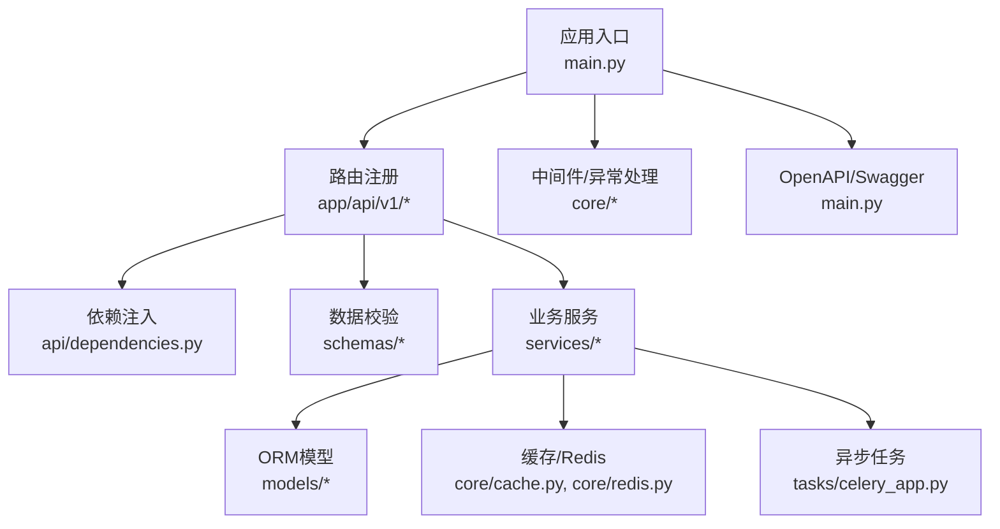
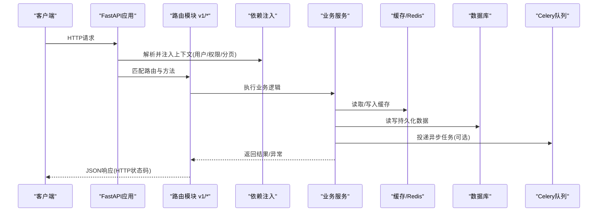
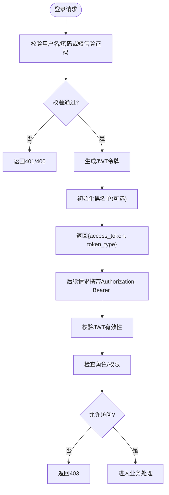
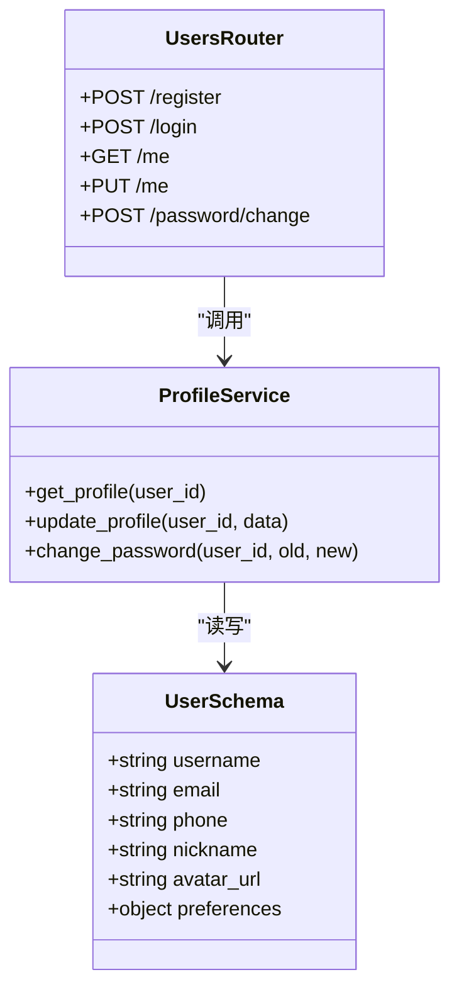
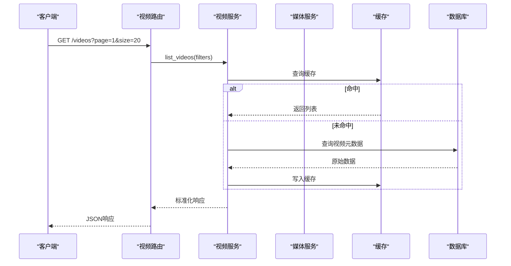
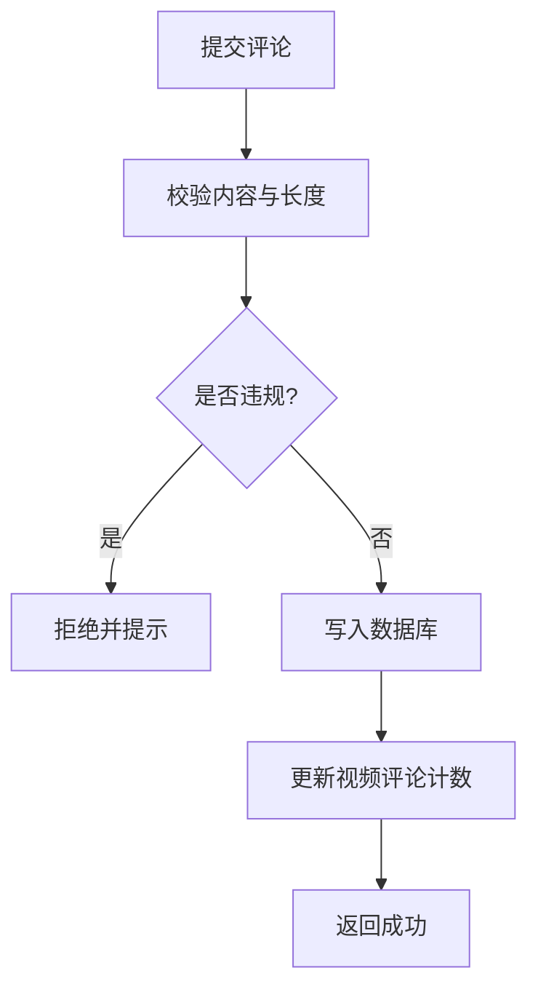
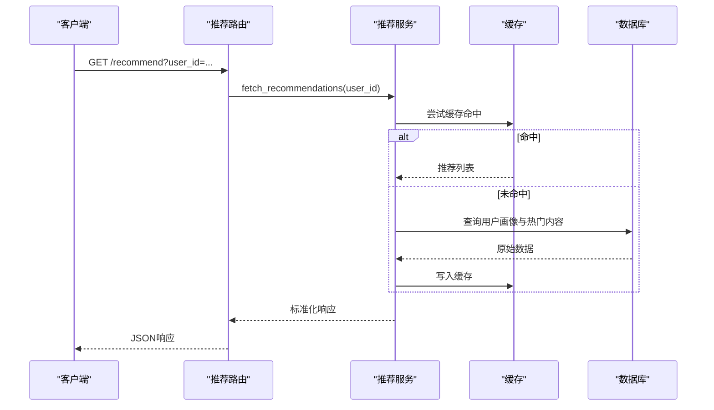
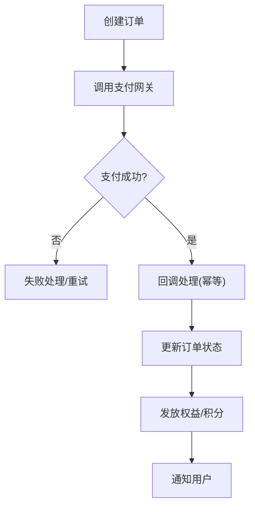
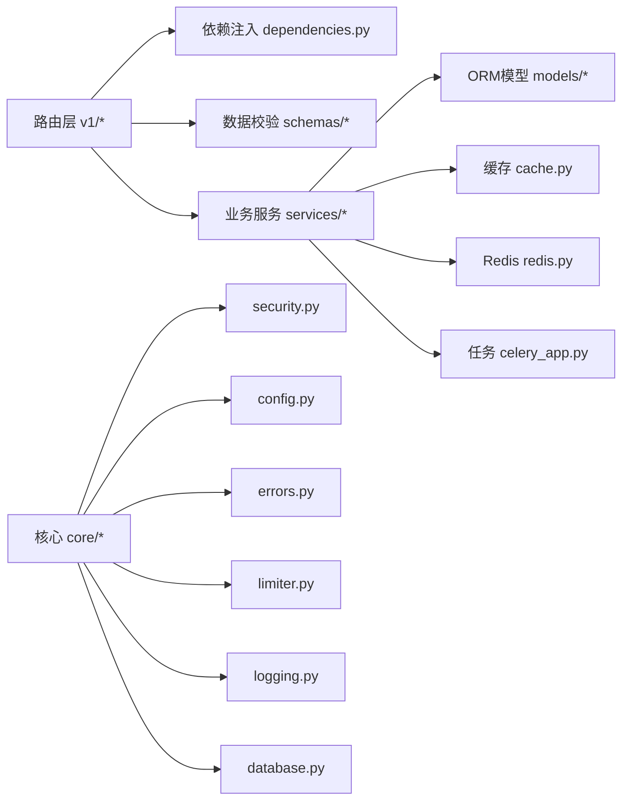

# API设计与规范

<cite>
**本文引用的文件**
- [backend/app/main.py](file://backend/app/main.py)
- [backend/app/api/v1/auth.py](file://backend/app/api/v1/auth.py)
- [backend/app/api/v1/users.py](file://backend/app/api/v1/users.py)
- [backend/app/api/v1/admin.py](file://backend/app/api/v1/admin.py)
- [backend/app/api/v1/internal.py](file://backend/app/api/v1/internal.py)
- [backend/app/api/dependencies.py](file://backend/app/api/dependencies.py)
- [backend/app/core/security.py](file://backend/app/core/security.py)
- [backend/app/core/config.py](file://backend/app/core/config.py)
- [backend/app/core/errors.py](file://backend/app/core/errors.py)
- [backend/app/schemas/common.py](file://backend/app/schemas/common.py)
- [backend/app/schemas/user.py](file://backend/app/schemas/user.py)
- [backend/app/models/user.py](file://backend/app/models/user.py)
- [backend/app/services/profile_service.py](file://backend/app/services/profile_service.py)
- [backend/app/tasks/celery_app.py](file://backend/app/tasks/celery_app.py)
- [backend/app/core/token_blacklist.py](file://backend/app/core/token_blacklist.py)
- [backend/app/core/cache.py](file://backend/app/core/cache.py)
- [backend/app/core/limiter.py](file://backend/app/core/limiter.py)
- [backend/app/core/logging.py](file://backend/app/core/logging.py)
- [backend/app/core/database.py](file://backend/app/core/database.py)
- [backend/app/core/redis.py](file://backend/app/core/redis.py)
- [backend/app/api/v1/videos.py](file://backend/app/api/v1/videos.py)
- [backend/app/api/v1/comments.py](file://backend/app/api/v1/comments.py)
- [backend/app/api/v1/favorites.py](file://backend/app/api/v1/favorites.py)
- [backend/app/api/v1/practice.py](file://backend/app/api/v1/practice.py)
- [backend/app/api/v1/shadowing.py](file://backend/app/api/v1/shadowing.py)
- [backend/app/api/v1/recommendations.py](file://backend/app/api/v1/recommendations.py)
- [backend/app/api/v1/media.py](file://backend/app/api/v1/media.py)
- [backend/app/api/v1/payments.py](file://backend/app/api/v1/payments.py)
- [backend/app/api/v1/mock_payments.py](file://backend/app/api/v1/mock_payments.py)
- [backend/app/api/v1/redeem.py](file://backend/app/api/v1/redeem.py)
- [backend/app/api/v1/learning_plan.py](file://backend/app/api/v1/learning_plan.py)
- [backend/app/api/v1/notifications.py](file://backend/app/api/v1/notifications.py)
- [backend/app/api/v1/presence.py](file://backend/app/api/v1/presence.py)
- [backend/app/api/v1/behavior.py](file://backend/app/api/v1/behavior.py)
- [backend/app/api/v1/browse.py](file://backend/app/api/v1/browse.py)
- [backend/app/api/v1/ai.py](file://backend/app/api/v1/ai.py)
- [backend/app/api/v1/words.py](file://backend/app/api/v1/words.py)
- [backend/app/api/v1/vocabulary.py](file://backend/app/api/v1/vocabulary.py)
</cite>

## 目录
1. [简介](#简介)
2. [项目结构](#项目结构)
3. [核心组件](#核心组件)
4. [架构总览](#架构总览)
5. [详细组件分析](#详细组件分析)
6. [依赖关系分析](#依赖关系分析)
7. [性能考量](#性能考量)
8. [故障排查指南](#故障排查指南)
9. [结论](#结论)
10. [附录](#附录)

## 简介
本文件面向Speaking平台的API设计与规范，聚焦基于FastAPI的RESTful设计原则与实现。内容涵盖：
- 路由组织、HTTP方法使用、URL命名规范与版本管理策略
- 请求/响应格式、数据验证规则、错误码定义与状态码使用
- 认证授权机制（JWT令牌生成、权限校验、中间件处理）
- API文档生成、Swagger集成与客户端SDK开发指南
- 最佳实践与常见模式的具体示例路径

## 项目结构
后端采用模块化分层组织：
- app/main.py：应用入口、全局异常处理器、中间件挂载、OpenAPI/Swagger配置
- app/api/v1/*：按领域划分的路由模块，统一以 /api/v1 前缀暴露
- app/schemas/*：Pydantic模型，用于请求/响应数据校验与序列化
- app/models/*：SQLAlchemy ORM模型
- app/services/*：业务服务层，封装复杂逻辑与外部调用
- app/core/*：安全、配置、数据库、缓存、限流、日志等横切能力
- app/tasks/*：异步任务（Celery）相关



**图表来源**
- [backend/app/main.py](file://backend/app/main.py)
- [backend/app/api/dependencies.py](file://backend/app/api/dependencies.py)
- [backend/app/core/cache.py](file://backend/app/core/cache.py)
- [backend/app/core/redis.py](file://backend/app/core/redis.py)
- [backend/app/tasks/celery_app.py](file://backend/app/tasks/celery_app.py)

**章节来源**
- [backend/app/main.py](file://backend/app/main.py)
- [backend/app/api/dependencies.py](file://backend/app/api/dependencies.py)

## 核心组件
- 应用入口与OpenAPI配置：集中注册路由、异常处理器、CORS、速率限制、鉴权中间件；启用/docs与/redoc
- 路由组织：按领域拆分到v1子模块，统一前缀/api/v1，便于版本演进
- 依赖注入：通过FastAPI的Depends提供用户上下文、权限校验、分页参数等
- 数据校验：Pydantic schemas定义请求体、查询参数、响应结构
- 安全与鉴权：JWT签发与校验、黑名单、角色/权限控制
- 错误处理：统一异常类型与HTTP状态码映射
- 缓存与限流：Redis缓存热点数据，限流器保护接口
- 异步任务：长耗时操作通过Celery队列执行

**章节来源**
- [backend/app/main.py](file://backend/app/main.py)
- [backend/app/api/dependencies.py](file://backend/app/api/dependencies.py)
- [backend/app/core/security.py](file://backend/app/core/security.py)
- [backend/app/core/errors.py](file://backend/app/core/errors.py)
- [backend/app/core/cache.py](file://backend/app/core/cache.py)
- [backend/app/core/limiter.py](file://backend/app/core/limiter.py)
- [backend/app/core/logging.py](file://backend/app/core/logging.py)
- [backend/app/core/database.py](file://backend/app/core/database.py)
- [backend/app/core/redis.py](file://backend/app/core/redis.py)
- [backend/app/tasks/celery_app.py](file://backend/app/tasks/celery_app.py)

## 架构总览
下图展示从HTTP请求到业务处理的完整链路，包括鉴权、校验、服务层、缓存与任务队列。



**图表来源**
- [backend/app/main.py](file://backend/app/main.py)
- [backend/app/api/dependencies.py](file://backend/app/api/dependencies.py)
- [backend/app/core/cache.py](file://backend/app/core/cache.py)
- [backend/app/core/redis.py](file://backend/app/core/redis.py)
- [backend/app/tasks/celery_app.py](file://backend/app/tasks/celery_app.py)

## 详细组件分析

### 认证与授权（JWT + 权限校验）
- JWT令牌生成与校验：在认证路由中签发令牌，后续请求通过Header携带令牌进行校验
- 权限验证：基于角色的访问控制（RBAC），对管理员、普通用户等不同资源进行细粒度控制
- 中间件处理：全局拦截未认证请求、记录审计日志、限流保护
- 令牌黑名单：支持登出或强制失效场景下的令牌撤销



**图表来源**
- [backend/app/api/v1/auth.py](file://backend/app/api/v1/auth.py)
- [backend/app/core/security.py](file://backend/app/core/security.py)
- [backend/app/core/token_blacklist.py](file://backend/app/core/token_blacklist.py)

**章节来源**
- [backend/app/api/v1/auth.py](file://backend/app/api/v1/auth.py)
- [backend/app/core/security.py](file://backend/app/core/security.py)
- [backend/app/core/token_blacklist.py](file://backend/app/core/token_blacklist.py)
- [backend/app/api/dependencies.py](file://backend/app/api/dependencies.py)

### 用户与资料管理（Users & Profile）
- 用户注册/登录：统一认证流程，返回标准令牌
- 个人资料更新：头像、昵称、学习偏好等字段校验与更新
- 权限控制：仅本人可修改资料，管理员可管理用户



**图表来源**
- [backend/app/api/v1/users.py](file://backend/app/api/v1/users.py)
- [backend/app/schemas/user.py](file://backend/app/schemas/user.py)
- [backend/app/services/profile_service.py](file://backend/app/services/profile_service.py)
- [backend/app/models/user.py](file://backend/app/models/user.py)

**章节来源**
- [backend/app/api/v1/users.py](file://backend/app/api/v1/users.py)
- [backend/app/schemas/user.py](file://backend/app/schemas/user.py)
- [backend/app/services/profile_service.py](file://backend/app/services/profile_service.py)
- [backend/app/models/user.py](file://backend/app/models/user.py)

### 视频与字幕（Videos & Subtitles）
- 视频列表/详情：分页、筛选、排序
- 字幕编辑与审核：提交修订、合并更新、快照保存
- 播放与下载：受控访问、防盗链、CDN加速



**图表来源**
- [backend/app/api/v1/videos.py](file://backend/app/api/v1/videos.py)
- [backend/app/services/video_service.py](file://backend/app/services/video_service.py)
- [backend/app/api/v1/media.py](file://backend/app/api/v1/media.py)
- [backend/app/core/cache.py](file://backend/app/core/cache.py)

**章节来源**
- [backend/app/api/v1/videos.py](file://backend/app/api/v1/videos.py)
- [backend/app/api/v1/media.py](file://backend/app/api/v1/media.py)
- [backend/app/core/cache.py](file://backend/app/core/cache.py)

### 评论与互动（Comments & Favorites）
- 评论CRUD：支持分页、点赞、举报
- 收藏管理：收藏/取消收藏、批量操作
- 行为追踪：埋点上报、统计聚合



**图表来源**
- [backend/app/api/v1/comments.py](file://backend/app/api/v1/comments.py)
- [backend/app/api/v1/favorites.py](file://backend/app/api/v1/favorites.py)
- [backend/app/api/v1/behavior.py](file://backend/app/api/v1/behavior.py)

**章节来源**
- [backend/app/api/v1/comments.py](file://backend/app/api/v1/comments.py)
- [backend/app/api/v1/favorites.py](file://backend/app/api/v1/favorites.py)
- [backend/app/api/v1/behavior.py](file://backend/app/api/v1/behavior.py)

### 练习与影子跟读（Practice & Shadowing）
- 练习题目：随机抽取、难度分级、答题记录
- 影子跟读：录音上传、评分、回放对比
- 学习计划：每日目标、进度跟踪、提醒通知

```mermaid
classDiagram
class PracticeRouter {
+POST /practice/start
+POST /practice/submit
+GET /practice/history
}
class ShadowingRouter {
+POST /shadowing/upload
+GET /shadowing/result
+DELETE /shadowing/{id}
}
class LearningPlanRouter {
+GET /plan/daily
+PUT /plan/update
+GET /plan/stats
}
PracticeRouter --> PracticeService : "调用"
ShadowingRouter --> ShadowingService : "调用"
LearningPlanRouter --> PlanService : "调用"
```

**图表来源**
- [backend/app/api/v1/practice.py](file://backend/app/api/v1/practice.py)
- [backend/app/api/v1/shadowing.py](file://backend/app/api/v1/shadowing.py)
- [backend/app/api/v1/learning_plan.py](file://backend/app/api/v1/learning_plan.py)

**章节来源**
- [backend/app/api/v1/practice.py](file://backend/app/api/v1/practice.py)
- [backend/app/api/v1/shadowing.py](file://backend/app/api/v1/shadowing.py)
- [backend/app/api/v1/learning_plan.py](file://backend/app/api/v1/learning_plan.py)

### 推荐与搜索（Recommendations & Search）
- 个性化推荐：基于用户历史与兴趣
- 全文检索：关键词高亮、同义词扩展
- 实时反馈：点击率、停留时长优化



**图表来源**
- [backend/app/api/v1/recommendations.py](file://backend/app/api/v1/recommendations.py)
- [backend/app/core/cache.py](file://backend/app/core/cache.py)

**章节来源**
- [backend/app/api/v1/recommendations.py](file://backend/app/api/v1/recommendations.py)
- [backend/app/core/cache.py](file://backend/app/core/cache.py)

### 支付与兑换（Payments & Redeem）
- 支付网关：微信/支付宝对接，订单生命周期管理
- 兑换码：生成、校验、核销、防重放
- 回调处理：幂等性保证、重试机制



**图表来源**
- [backend/app/api/v1/payments.py](file://backend/app/api/v1/payments.py)
- [backend/app/api/v1/mock_payments.py](file://backend/app/api/v1/mock_payments.py)
- [backend/app/api/v1/redeem.py](file://backend/app/api/v1/redeem.py)

**章节来源**
- [backend/app/api/v1/payments.py](file://backend/app/api/v1/payments.py)
- [backend/app/api/v1/mock_payments.py](file://backend/app/api/v1/mock_payments.py)
- [backend/app/api/v1/redeem.py](file://backend/app/api/v1/redeem.py)

### 内部与管理员接口（Internal & Admin）
- 内部接口：服务间通信，不对外暴露，需内网白名单或签名校验
- 管理员接口：用户管理、内容审核、数据统计、系统配置

```mermaid
classDiagram
class AdminRouter {
+GET /admin/users
+PUT /admin/users/{id}/ban
+GET /admin/videos
+POST /admin/videos/{id}/review
}
class InternalRouter {
+POST /internal/events
+GET /internal/health
+POST /internal/batch/process
}
AdminRouter --> AdminService : "调用"
InternalRouter --> InternalService : "调用"
```

**图表来源**
- [backend/app/api/v1/admin.py](file://backend/app/api/v1/admin.py)
- [backend/app/api/v1/internal.py](file://backend/app/api/v1/internal.py)

**章节来源**
- [backend/app/api/v1/admin.py](file://backend/app/api/v1/admin.py)
- [backend/app/api/v1/internal.py](file://backend/app/api/v1/internal.py)

### 其他功能模块（Words, Vocabulary, Notifications, Presence）
- 词汇与词库：单词查询、笔记、AI批注
- 通知中心：站内信、推送、订阅管理
- 在线状态：用户在线状态、心跳检测

**章节来源**
- [backend/app/api/v1/words.py](file://backend/app/api/v1/words.py)
- [backend/app/api/v1/vocabulary.py](file://backend/app/api/v1/vocabulary.py)
- [backend/app/api/v1/notifications.py](file://backend/app/api/v1/notifications.py)
- [backend/app/api/v1/presence.py](file://backend/app/api/v1/presence.py)

## 依赖关系分析
- 路由层依赖依赖注入模块获取用户上下文、权限、分页参数
- 服务层依赖ORM模型、缓存、外部服务（支付、短信、AI）
- 核心模块提供安全、配置、日志、限流、数据库连接等横切能力
- 任务模块解耦长耗时操作，提升响应速度



**图表来源**
- [backend/app/api/dependencies.py](file://backend/app/api/dependencies.py)
- [backend/app/core/security.py](file://backend/app/core/security.py)
- [backend/app/core/config.py](file://backend/app/core/config.py)
- [backend/app/core/errors.py](file://backend/app/core/errors.py)
- [backend/app/core/limiter.py](file://backend/app/core/limiter.py)
- [backend/app/core/logging.py](file://backend/app/core/logging.py)
- [backend/app/core/database.py](file://backend/app/core/database.py)
- [backend/app/core/cache.py](file://backend/app/core/cache.py)
- [backend/app/core/redis.py](file://backend/app/core/redis.py)
- [backend/app/tasks/celery_app.py](file://backend/app/tasks/celery_app.py)

**章节来源**
- [backend/app/api/dependencies.py](file://backend/app/api/dependencies.py)
- [backend/app/core/security.py](file://backend/app/core/security.py)
- [backend/app/core/config.py](file://backend/app/core/config.py)
- [backend/app/core/errors.py](file://backend/app/core/errors.py)
- [backend/app/core/limiter.py](file://backend/app/core/limiter.py)
- [backend/app/core/logging.py](file://backend/app/core/logging.py)
- [backend/app/core/database.py](file://backend/app/core/database.py)
- [backend/app/core/cache.py](file://backend/app/core/cache.py)
- [backend/app/core/redis.py](file://backend/app/core/redis.py)
- [backend/app/tasks/celery_app.py](file://backend/app/tasks/celery_app.py)

## 性能考量
- 缓存策略：热点数据（如首页推荐、视频元数据）优先走缓存，降低数据库压力
- 分页与过滤：默认分页大小限制，避免大结果集传输
- 异步任务：音视频处理、AI评分、批量导入等耗时操作放入队列
- 限流保护：针对登录、短信发送、支付回调等敏感接口实施限流
- 连接池：数据库与Redis连接复用，减少握手开销
- 压缩与CDN：静态资源与媒体文件通过CDN分发，启用Gzip/Brotli压缩

[本节为通用指导，无需特定文件引用]

## 故障排查指南
- 统一错误码：定义业务错误码与HTTP状态码映射，便于前端处理
- 日志记录：关键路径打点，包含请求ID、用户ID、参数摘要、耗时
- 健康检查：/health端点暴露服务状态，供负载均衡与健康探针使用
- 监控告警：错误率、延迟、资源使用率阈值告警
- 调试工具：启用详细日志、慢查询分析、缓存命中率统计

**章节来源**
- [backend/app/core/errors.py](file://backend/app/core/errors.py)
- [backend/app/core/logging.py](file://backend/app/core/logging.py)
- [backend/app/api/v1/internal.py](file://backend/app/api/v1/internal.py)

## 结论
本规范基于FastAPI的最佳实践，构建了清晰、可扩展、安全的API体系。通过模块化路由、严格的数据校验、统一的错误处理与完善的鉴权机制，确保平台在高并发场景下的稳定性与可维护性。建议团队遵循本规范进行新接口开发与既有接口重构，持续提升API质量与用户体验。

[本节为总结性内容，无需特定文件引用]

## 附录

### RESTful设计原则与URL命名规范
- URL使用名词复数，体现资源集合，如 /users、/videos、/comments
- 层级结构清晰，避免深层嵌套，必要时使用查询参数过滤
- HTTP方法语义明确：GET读取、POST创建、PUT全量更新、PATCH部分更新、DELETE删除
- 版本管理：统一前缀 /api/v1，未来可通过 /api/v2 平滑升级

### 请求/响应格式与数据验证
- 请求体与响应体使用JSON，字段命名采用小写蛇形或驼峰（前后端约定一致）
- Pydantic模型定义必填字段、默认值、正则校验、范围限制
- 分页响应包含总数、页码、每页数量、数据列表

### 错误码定义与状态码使用
- 2xx：成功
- 4xx：客户端错误（400参数错误、401未认证、403无权限、404不存在、429限流）
- 5xx：服务端错误（500内部错误、502网关错误、503服务不可用）
- 业务错误码：独立于HTTP状态码，便于前端精细化处理

### 认证授权机制
- JWT令牌：短期访问令牌+长期刷新令牌，支持黑名单撤销
- 权限模型：基于角色的访问控制（RBAC），细粒度到资源与操作
- 中间件：全局鉴权、审计日志、限流、CORS、请求ID透传

### API文档生成与Swagger集成
- 自动文档：/docs（Swagger UI）、/redoc（ReDoc）
- 注解描述：为路由、参数、响应添加详细说明
- 示例数据：提供典型请求/响应示例，便于前端联调

### 客户端SDK开发指南
- SDK生成：基于OpenAPI规范自动生成多语言SDK
- 错误处理：统一异常捕获与重试机制
- 缓存策略：本地缓存热点数据，减少网络请求
- 安全存储：令牌安全存储，避免泄露

[本节为通用指导，无需特定文件引用]
