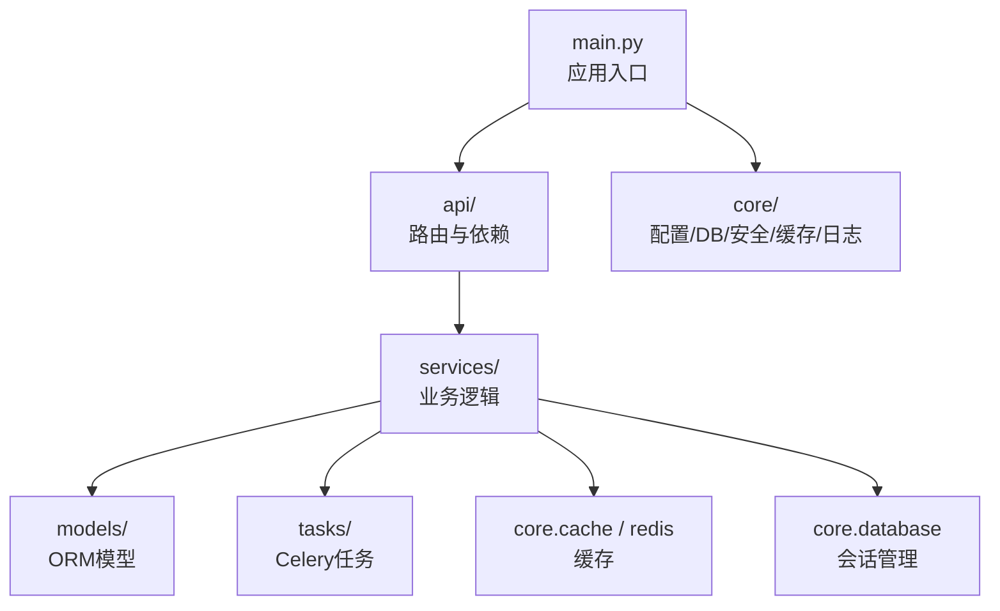
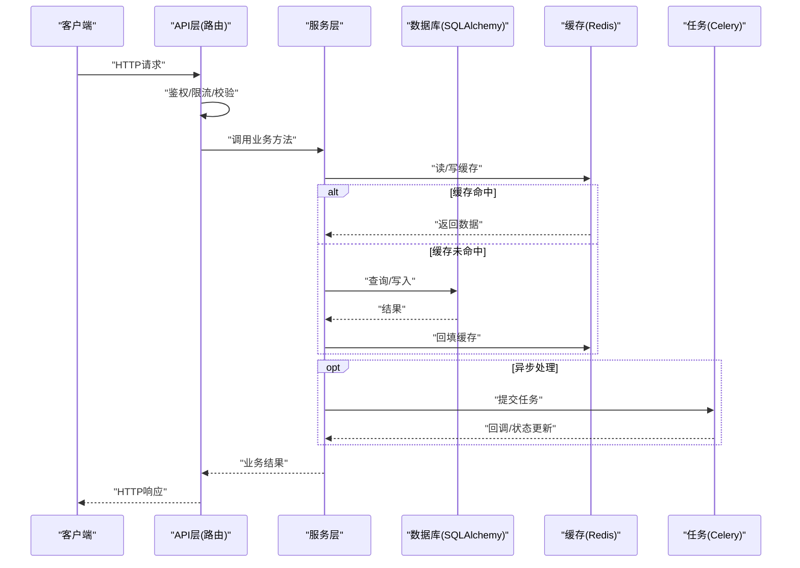
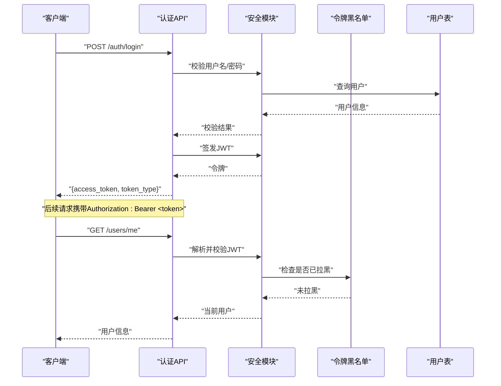
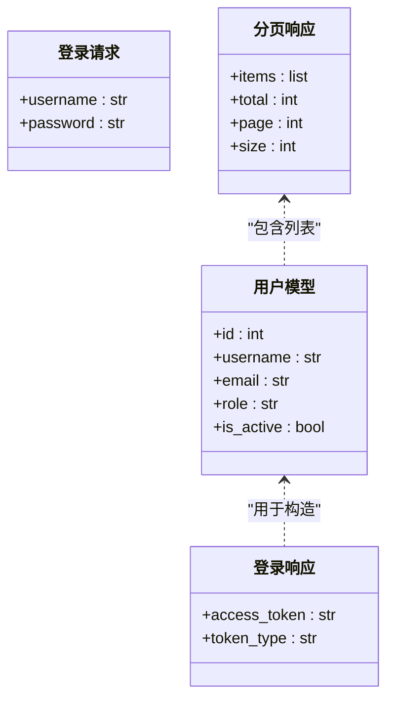
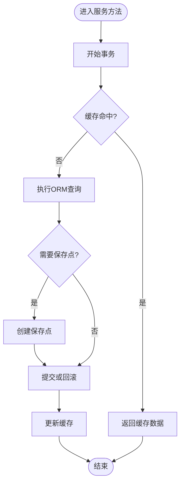
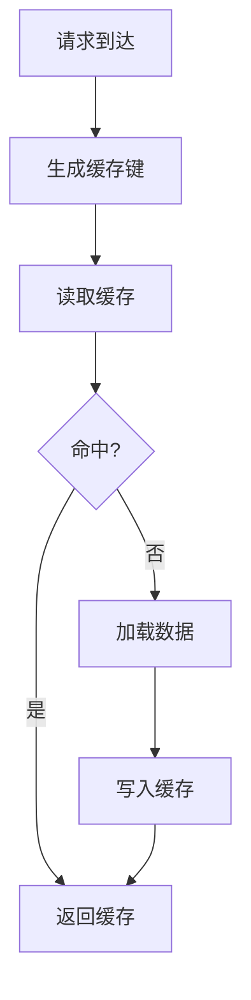
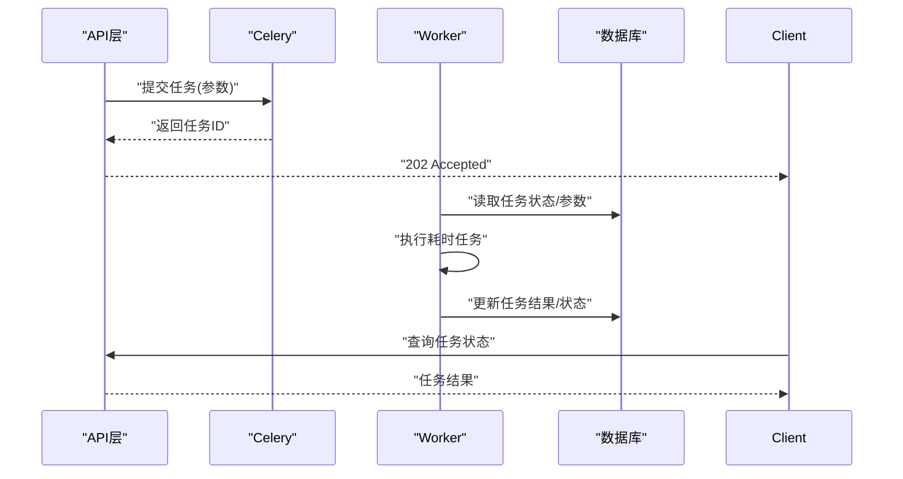
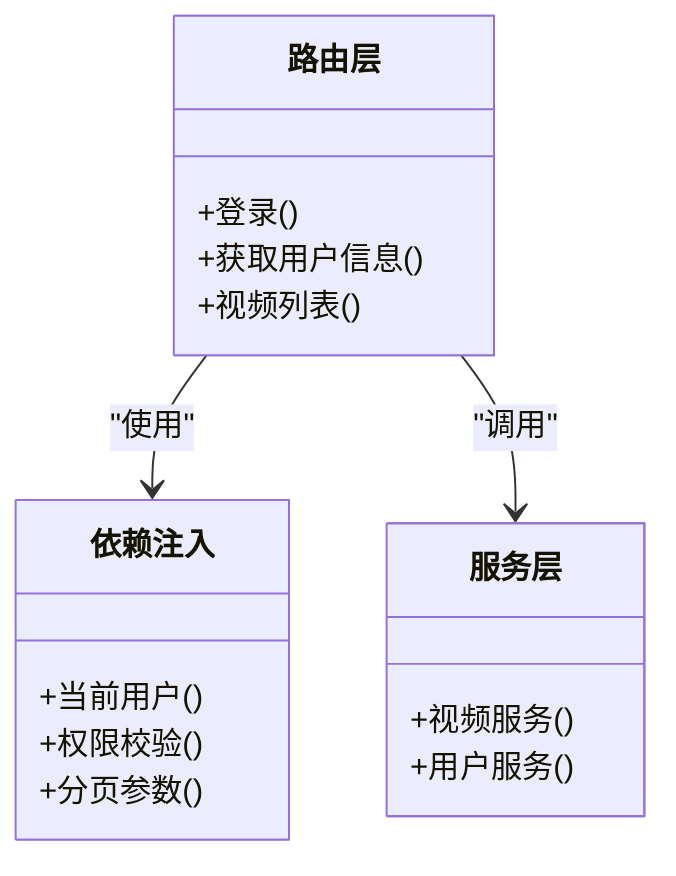
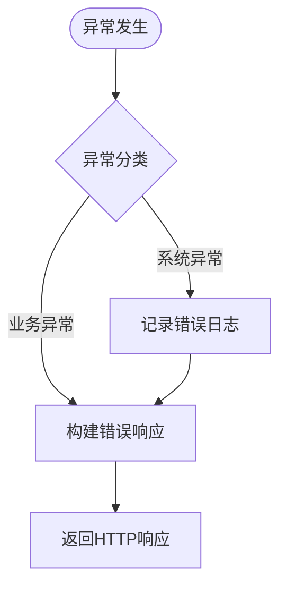
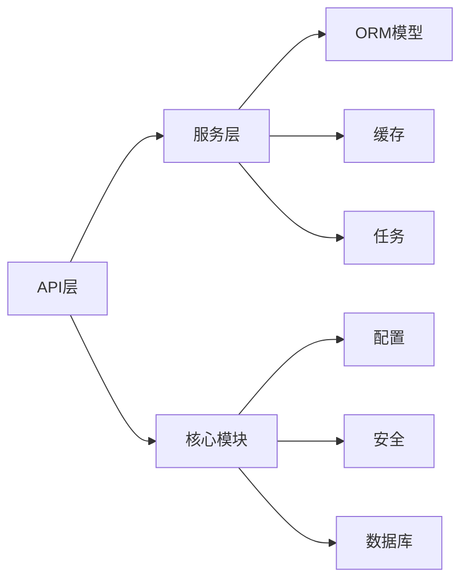

# 后端开发

<cite>
**本文引用的文件**
- [backend/app/main.py](file://backend/app/main.py)
- [backend/app/api/dependencies.py](file://backend/app/api/dependencies.py)
- [backend/app/core/config.py](file://backend/app/core/config.py)
- [backend/app/core/database.py](file://backend/app/core/database.py)
- [backend/app/core/security.py](file://backend/app/core/security.py)
- [backend/app/core/token_blacklist.py](file://backend/app/core/token_blacklist.py)
- [backend/app/core/cache.py](file://backend/app/core/cache.py)
- [backend/app/core/redis.py](file://backend/app/core/redis.py)
- [backend/app/core/errors.py](file://backend/app/core/errors.py)
- [backend/app/core/logging.py](file://backend/app/core/logging.py)
- [backend/app/core/limiter.py](file://backend/app/core/limiter.py)
- [backend/app/tasks/celery_app.py](file://backend/app/tasks/celery_app.py)
- [backend/app/services/video_service.py](file://backend/app/services/video_service.py)
- [backend/app/models/user.py](file://backend/app/models/user.py)
- [backend/app/schemas/common.py](file://backend/app/schemas/common.py)
- [backend/app/api/v1/auth.py](file://backend/app/api/v1/auth.py)
- [backend/app/api/v1/users.py](file://backend/app/api/v1/users.py)
- [backend/app/api/v1/videos.py](file://backend/app/api/v1/videos.py)
</cite>

## 目录
1. [简介](#简介)
2. [项目结构](#项目结构)
3. [核心组件](#核心组件)
4. [架构总览](#架构总览)
5. [详细组件分析](#详细组件分析)
6. [依赖分析](#依赖分析)
7. [性能考虑](#性能考虑)
8. [故障排查指南](#故障排查指南)
9. [结论](#结论)
10. [附录](#附录)

## 简介
本指南面向Speaking平台后端开发者，基于FastAPI构建RESTful API，采用分层架构（API层、服务层、数据访问层），结合JWT认证与权限控制、Pydantic请求校验与响应序列化、SQLAlchemy ORM数据库操作、Celery异步任务处理、Redis缓存以及结构化日志与限流。文档涵盖路由设计、中间件配置、错误处理策略、代码组织规范、模块依赖管理与最佳实践，并提供常见功能的实现思路与示例路径，帮助团队快速上手与高质量交付。

## 项目结构
后端代码位于 backend/app 下，按职责划分：
- api: FastAPI路由与依赖注入，按版本 v1 组织各业务域路由
- core: 应用核心能力（配置、数据库、安全、缓存、限流、日志、错误）
- models: SQLAlchemy模型定义
- schemas: Pydantic请求/响应模型
- services: 领域服务与第三方集成（视频、支付、AI等）
- tasks: Celery任务定义与辅助工具
- main.py: 应用入口与全局中间件注册

**图示来源**
- [backend/app/main.py](file://backend/app/main.py)
- [backend/app/api/dependencies.py](file://backend/app/api/dependencies.py)
- [backend/app/core/config.py](file://backend/app/core/config.py)
- [backend/app/core/database.py](file://backend/app/core/database.py)
- [backend/app/core/cache.py](file://backend/app/core/cache.py)
- [backend/app/core/redis.py](file://backend/app/core/redis.py)
- [backend/app/tasks/celery_app.py](file://backend/app/tasks/celery_app.py)

**章节来源**
- [backend/app/main.py](file://backend/app/main.py)
- [backend/app/api/dependencies.py](file://backend/app/api/dependencies.py)
- [backend/app/core/config.py](file://backend/app/core/config.py)
- [backend/app/core/database.py](file://backend/app/core/database.py)
- [backend/app/core/cache.py](file://backend/app/core/cache.py)
- [backend/app/core/redis.py](file://backend/app/core/redis.py)
- [backend/app/tasks/celery_app.py](file://backend/app/tasks/celery_app.py)

## 核心组件
- 应用启动与中间件
  - 在入口文件中创建FastAPI实例，注册CORS、压缩、请求ID、限流等中间件，挂载v1路由前缀，统一异常处理器与生命周期钩子。
- 配置管理
  - 集中读取环境变量与配置文件，提供类型安全的配置对象，供数据库连接、缓存、第三方服务使用。
- 数据库访问
  - 基于SQLAlchemy的异步引擎与会话工厂，提供统一的Session上下文管理器，支持事务与连接池参数调优。
- 安全与认证
  - JWT令牌签发与校验、黑名单机制、密码哈希、角色/权限判断；通过依赖注入将当前用户注入到路由中。
- 缓存与Redis
  - 封装Redis客户端，提供键空间隔离、过期策略、序列化选项与重试退避。
- 错误处理
  - 自定义异常类与HTTP状态码映射，统一返回格式，便于前端解析与监控埋点。
- 日志与限流
  - 结构化JSON日志、请求链路追踪、敏感字段脱敏；基于IP或用户的速率限制策略。

**章节来源**
- [backend/app/main.py](file://backend/app/main.py)
- [backend/app/core/config.py](file://backend/app/core/config.py)
- [backend/app/core/database.py](file://backend/app/core/database.py)
- [backend/app/core/security.py](file://backend/app/core/security.py)
- [backend/app/core/token_blacklist.py](file://backend/app/core/token_blacklist.py)
- [backend/app/core/cache.py](file://backend/app/core/cache.py)
- [backend/app/core/redis.py](file://backend/app/core/redis.py)
- [backend/app/core/errors.py](file://backend/app/core/errors.py)
- [backend/app/core/logging.py](file://backend/app/core/logging.py)
- [backend/app/core/limiter.py](file://backend/app/core/limiter.py)

## 架构总览
系统采用分层架构，API层仅负责协议转换与参数校验，服务层编排业务逻辑与外部调用，数据访问层通过ORM与缓存协同完成持久化。

**图示来源**
- [backend/app/api/v1/videos.py](file://backend/app/api/v1/videos.py)
- [backend/app/services/video_service.py](file://backend/app/services/video_service.py)
- [backend/app/core/database.py](file://backend/app/core/database.py)
- [backend/app/core/cache.py](file://backend/app/core/cache.py)
- [backend/app/tasks/celery_app.py](file://backend/app/tasks/celery_app.py)

## 详细组件分析

### 认证与授权（JWT + 权限控制）
- 流程要点
  - 登录接口验证凭据，签发JWT并可选写入黑名单白名单策略
  - 受保护路由通过依赖注入获取当前用户与角色
  - 权限校验在服务层或装饰器中执行，细粒度控制资源访问
- 关键实现位置
  - 认证路由与令牌生成：[backend/app/api/v1/auth.py](file://backend/app/api/v1/auth.py)
  - 安全工具（JWT、密码哈希、权限判断）：[backend/app/core/security.py](file://backend/app/core/security.py)
  - 令牌黑名单：[backend/app/core/token_blacklist.py](file://backend/app/core/token_blacklist.py)
  - 用户模型：[backend/app/models/user.py](file://backend/app/models/user.py)

**图示来源**
- [backend/app/api/v1/auth.py](file://backend/app/api/v1/auth.py)
- [backend/app/core/security.py](file://backend/app/core/security.py)
- [backend/app/core/token_blacklist.py](file://backend/app/core/token_blacklist.py)
- [backend/app/models/user.py](file://backend/app/models/user.py)

**章节来源**
- [backend/app/api/v1/auth.py](file://backend/app/api/v1/auth.py)
- [backend/app/core/security.py](file://backend/app/core/security.py)
- [backend/app/core/token_blacklist.py](file://backend/app/core/token_blacklist.py)
- [backend/app/models/user.py](file://backend/app/models/user.py)

### 请求验证与数据序列化（Pydantic）
- 统一输入输出模型
  - 使用Pydantic定义请求体、查询参数与响应结构，确保类型安全与自动文档生成
  - 分页模型与通用响应包装，提升一致性
- 常用模式
  - 必填/选填校验、正则表达式、枚举约束、嵌套模型组合
  - 响应模型与ORM模型解耦，避免泄露内部字段

**图示来源**
- [backend/app/models/user.py](file://backend/app/models/user.py)
- [backend/app/schemas/common.py](file://backend/app/schemas/common.py)

**章节来源**
- [backend/app/schemas/common.py](file://backend/app/schemas/common.py)
- [backend/app/models/user.py](file://backend/app/models/user.py)

### 数据库操作（SQLAlchemy ORM）
- 会话管理
  - 异步引擎与会话工厂，提供依赖注入的get_db函数，确保每个请求独立会话
  - 事务边界在服务层明确开启与提交/回滚
- 模型与关系
  - 模型定义与索引优化，外键与级联策略清晰
- 读写分离与连接池
  - 合理设置连接池大小、超时与回收策略，避免连接泄漏

**图示来源**
- [backend/app/core/database.py](file://backend/app/core/database.py)
- [backend/app/services/video_service.py](file://backend/app/services/video_service.py)

**章节来源**
- [backend/app/core/database.py](file://backend/app/core/database.py)
- [backend/app/services/video_service.py](file://backend/app/services/video_service.py)

### 缓存策略（Redis）
- 设计原则
  - 热点数据优先缓存，设置合理的TTL与失效策略
  - 读写穿透防护：空值缓存、布隆过滤器（可选）
  - 缓存一致性：先更新DB再删除缓存，或延迟双删
- 实现要点
  - 统一Redis客户端封装，提供命名空间与序列化
  - 失败降级：缓存不可用时直接走DB

**图示来源**
- [backend/app/core/cache.py](file://backend/app/core/cache.py)
- [backend/app/core/redis.py](file://backend/app/core/redis.py)

**章节来源**
- [backend/app/core/cache.py](file://backend/app/core/cache.py)
- [backend/app/core/redis.py](file://backend/app/core/redis.py)

### 异步任务处理（Celery）
- 适用场景
  - 视频转码、字幕处理、评分计算、邮件/短信发送等耗时任务
- 工作流
  - API层提交任务并返回任务ID，前端轮询或通过WebSocket推送进度
  - Worker消费任务队列，幂等性与重试策略保障可靠性
- 关键文件
  - Celery应用初始化与任务注册：[backend/app/tasks/celery_app.py](file://backend/app/tasks/celery_app.py)

**图示来源**
- [backend/app/tasks/celery_app.py](file://backend/app/tasks/celery_app.py)

**章节来源**
- [backend/app/tasks/celery_app.py](file://backend/app/tasks/celery_app.py)

### 路由设计与依赖注入
- 路由组织
  - 按业务域拆分模块，统一前缀与版本控制
  - 使用FastAPI的Depends进行依赖注入（用户、权限、分页、限流）
- 依赖链
  - 认证依赖 -> 用户解析 -> 权限校验 -> 业务服务调用

**图示来源**
- [backend/app/api/v1/users.py](file://backend/app/api/v1/users.py)
- [backend/app/api/v1/videos.py](file://backend/app/api/v1/videos.py)
- [backend/app/api/dependencies.py](file://backend/app/api/dependencies.py)

**章节来源**
- [backend/app/api/v1/users.py](file://backend/app/api/v1/users.py)
- [backend/app/api/v1/videos.py](file://backend/app/api/v1/videos.py)
- [backend/app/api/dependencies.py](file://backend/app/api/dependencies.py)

### 错误处理策略
- 统一异常
  - 自定义业务异常与HTTP异常，映射为统一JSON结构
  - 全局异常处理器捕获未处理异常，记录日志并返回友好提示
- 调试与监控
  - 结构化日志包含请求ID、用户ID、耗时与堆栈
  - 指标上报（可选）用于APM与告警

**图示来源**
- [backend/app/core/errors.py](file://backend/app/core/errors.py)
- [backend/app/core/logging.py](file://backend/app/core/logging.py)

**章节来源**
- [backend/app/core/errors.py](file://backend/app/core/errors.py)
- [backend/app/core/logging.py](file://backend/app/core/logging.py)

## 依赖分析
- 模块耦合
  - API层依赖服务层与依赖注入；服务层依赖ORM与缓存；任务模块独立于请求生命周期
- 外部依赖
  - Redis、数据库驱动、Celery、第三方SDK（支付、AI、OSS）
- 循环依赖规避
  - 通过接口抽象与依赖注入降低耦合，避免导入环

**图示来源**
- [backend/app/main.py](file://backend/app/main.py)
- [backend/app/core/config.py](file://backend/app/core/config.py)
- [backend/app/core/security.py](file://backend/app/core/security.py)
- [backend/app/core/database.py](file://backend/app/core/database.py)
- [backend/app/core/cache.py](file://backend/app/core/cache.py)
- [backend/app/tasks/celery_app.py](file://backend/app/tasks/celery_app.py)

**章节来源**
- [backend/app/main.py](file://backend/app/main.py)
- [backend/app/core/config.py](file://backend/app/core/config.py)
- [backend/app/core/security.py](file://backend/app/core/security.py)
- [backend/app/core/database.py](file://backend/app/core/database.py)
- [backend/app/core/cache.py](file://backend/app/core/cache.py)
- [backend/app/tasks/celery_app.py](file://backend/app/tasks/celery_app.py)

## 性能考虑
- 数据库
  - 合理使用索引、避免N+1查询、批量写入、分页游标
  - 连接池参数调优与慢查询监控
- 缓存
  - 热点键预热、合理TTL、分布式锁防击穿
- 异步
  - 长耗时任务下沉至Celery，减少请求阻塞
- 网络
  - 启用Gzip/Brotli压缩、HTTP/2、CDN静态资源
- 监控
  - 指标采集（QPS、延迟、错误率）、链路追踪、告警阈值

[本节为通用指导，不直接分析具体文件]

## 故障排查指南
- 常见问题
  - 认证失败：检查JWT签名、过期时间、黑名单策略
  - 缓存异常：检查Redis连通性、键空间冲突、序列化兼容
  - 数据库连接池耗尽：检查会话关闭、事务未提交、慢查询
  - 任务堆积：检查Worker数量、队列容量、重试策略
- 定位技巧
  - 使用请求ID串联日志，定位上下游调用
  - 打开详细日志级别，关注异常堆栈与耗时
  - 使用健康检查端点与探针观察服务状态

**章节来源**
- [backend/app/core/errors.py](file://backend/app/core/errors.py)
- [backend/app/core/logging.py](file://backend/app/core/logging.py)
- [backend/app/core/limiter.py](file://backend/app/core/limiter.py)

## 结论
本指南系统化梳理了Speaking平台后端的架构与实现要点，覆盖FastAPI路由与中间件、分层架构、认证授权、请求校验、ORM与缓存、异步任务、日志与限流等关键主题。遵循本文档的组织规范与最佳实践，可显著提升代码质量、可维护性与系统稳定性。

## 附录
- 代码组织规范
  - 路由按业务域拆分，统一版本前缀
  - 服务层保持无状态与单一职责
  - 模型与Schema解耦，避免泄露内部结构
- 模块依赖管理
  - 使用依赖注入替代全局变量
  - 通过接口抽象降低耦合，便于测试替换
- 最佳实践
  - 所有外部调用需具备超时与重试
  - 敏感信息不落盘，日志脱敏
  - 变更通过迁移与灰度发布控制风险

[本节为通用指导，不直接分析具体文件]
