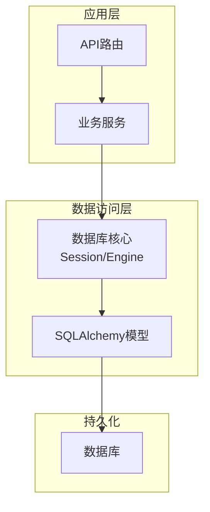
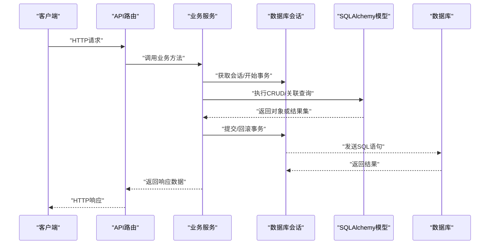
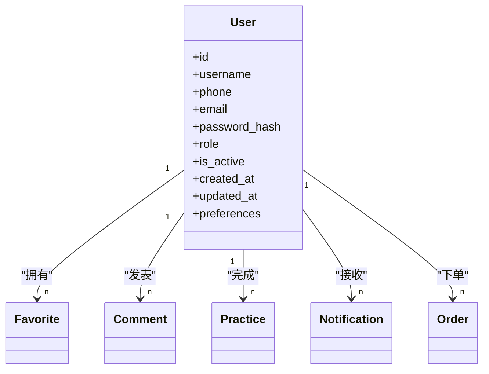
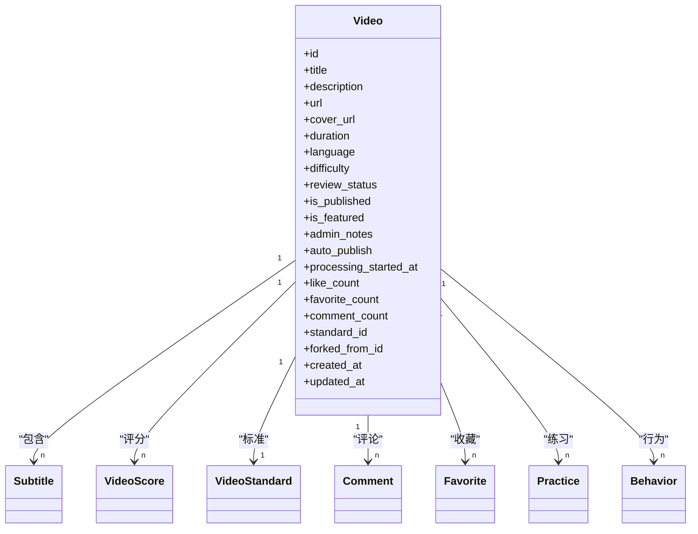
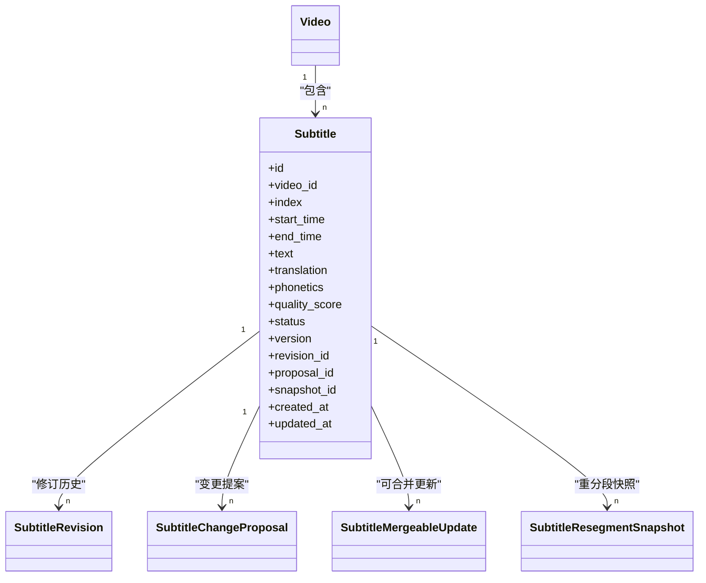
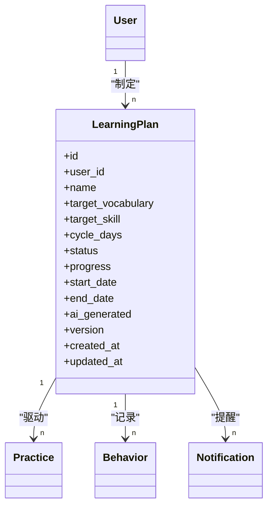
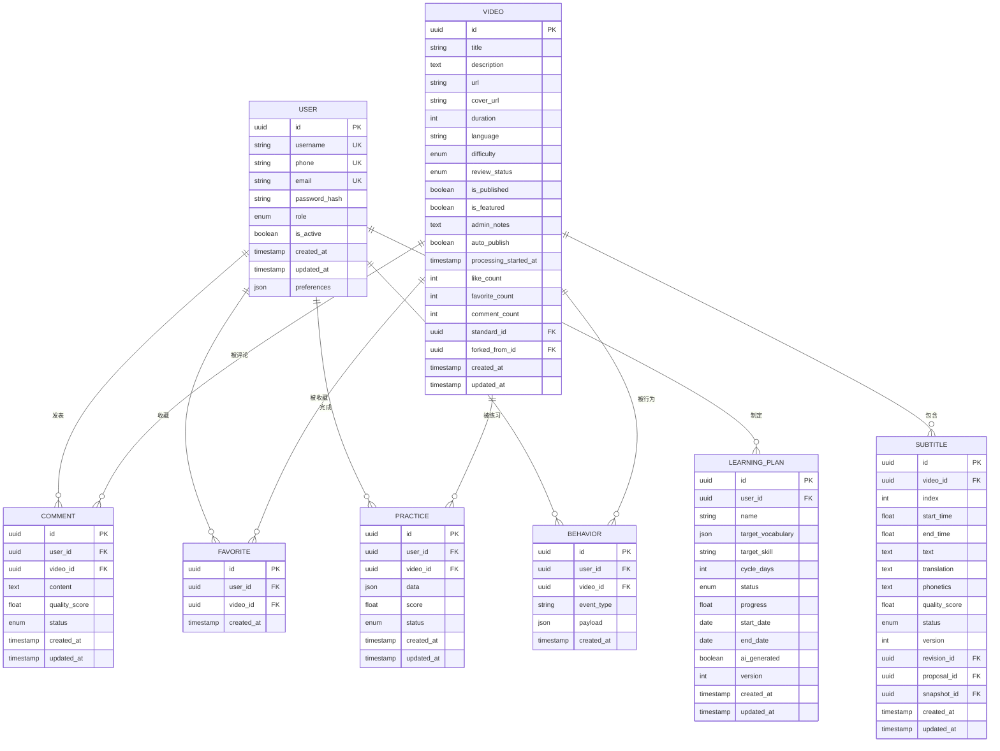
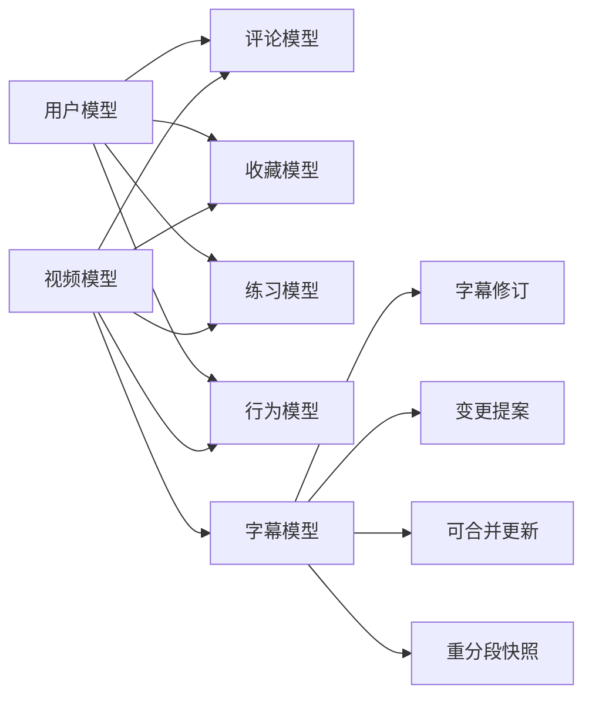

# 数据模型与ORM

<cite>
**本文引用的文件**
- [backend/app/core/database.py](file://backend/app/core/database.py)
- [backend/app/models/user.py](file://backend/app/models/user.py)
- [backend/app/models/video.py](file://backend/app/models/video.py)
- [backend/app/models/subtitle.py](file://backend/app/models/subtitle.py)
- [backend/app/models/learning_plan.py](file://backend/app/models/learning_plan.py)
- [backend/app/models/behavior.py](file://backend/app/models/behavior.py)
- [backend/app/models/comment.py](file://backend/app/models/comment.py)
- [backend/app/models/favorite.py](file://backend/app/models/favorite.py)
- [backend/app/models/practice.py](file://backend/app/models/practice.py)
- [backend/app/models/shadowing.py](file://backend/app/models/shadowing.py)
- [backend/app/models/exam_corpus.py](file://backend/app/models/exam_corpus.py)
- [backend/app/models/video_score.py](file://backend/app/models/video_score.py)
- [backend/app/models/video_standard.py](file://backend/app/models/video_standard.py)
- [backend/app/models/word_note.py](file://backend/app/models/word_note.py)
- [backend/app/models/notification.py](file://backend/app/models/notification.py)
- [backend/app/models/order.py](file://backend/app/models/order.py)
- [backend/app/models/redeem.py](file://backend/app/models/redeem.py)
- [backend/app/models/preferences.py](file://backend/app/models/preferences.py)
- [backend/app/models/engagement.py](file://backend/app/models/engagement.py)
- [backend/app/models/subtitle_revision.py](file://backend/app/models/subtitle_revision.py)
- [backend/app/models/subtitle_change_proposal.py](file://backend/app/models/subtitle_change_proposal.py)
- [backend/app/models/subtitle_mergeable_update.py](file://backend/app/models/subtitle_mergeable_update.py)
- [backend/app/models/subtitle_resegment_snapshot.py](file://backend/app/models/subtitle_resegment_snapshot.py)
- [backend/migrations/env.py](file://backend/migrations/env.py)
- [backend/migrations/script.py.mako](file://backend/migrations/script.py.mako)
- [backend/alembic.ini](file://backend/alembic.ini)
</cite>

## 目录
1. [简介](#简介)
2. [项目结构](#项目结构)
3. [核心组件](#核心组件)
4. [架构总览](#架构总览)
5. [详细组件分析](#详细组件分析)
6. [依赖关系分析](#依赖关系分析)
7. [性能考虑](#性能考虑)
8. [故障排查指南](#故障排查指南)
9. [结论](#结论)
10. [附录](#附录)

## 简介
本文件面向Speaking平台的数据模型与ORM实现，系统性阐述SQLAlchemy ORM的使用模式、核心实体设计、关系映射、查询优化与事务处理策略；并覆盖数据库迁移管理（Alembic）、版本控制与回滚策略。文档同时提供ER图与数据结构可视化说明，帮助读者快速理解用户、视频、字幕、学习计划等关键实体的字段设计、约束条件与索引策略，并给出复杂查询示例、性能优化技巧与常见问题解决方案。

## 项目结构
后端采用分层架构：API层调用服务层，服务层通过ORM访问数据库。数据模型集中在 models 目录，数据库连接与会话在 core/database.py 中集中管理，迁移脚本位于 migrations 目录并使用 Alembic 进行版本控制。

图表来源
- [backend/app/core/database.py](file://backend/app/core/database.py)
- [backend/app/models/user.py](file://backend/app/models/user.py)
- [backend/app/models/video.py](file://backend/app/models/video.py)
- [backend/app/models/subtitle.py](file://backend/app/models/subtitle.py)
- [backend/app/models/learning_plan.py](file://backend/app/models/learning_plan.py)

章节来源
- [backend/app/core/database.py](file://backend/app/core/database.py)
- [backend/app/models/__init__.py](file://backend/app/models/__init__.py)

## 核心组件
- 数据库核心与会话管理：统一创建引擎、会话工厂、连接池配置、事务边界封装。
- 核心模型：用户、视频、字幕、学习计划、行为事件、评论、收藏、练习、影子跟读、考试语料、评分、标准、单词笔记、通知、订单、兑换码、偏好、互动统计、字幕修订与变更提案等。
- 迁移管理：Alembic 环境配置、迁移脚本模板、版本管理与回滚策略。

章节来源
- [backend/app/core/database.py](file://backend/app/core/database.py)
- [backend/app/models/user.py](file://backend/app/models/user.py)
- [backend/app/models/video.py](file://backend/app/models/video.py)
- [backend/app/models/subtitle.py](file://backend/app/models/subtitle.py)
- [backend/app/models/learning_plan.py](file://backend/app/models/learning_plan.py)
- [backend/migrations/env.py](file://backend/migrations/env.py)
- [backend/migrations/script.py.mako](file://backend/migrations/script.py.mako)
- [backend/alembic.ini](file://backend/alembic.ini)

## 架构总览
下图展示从请求到数据持久化的完整流程，包括会话生命周期、事务边界与ORM交互。

图表来源
- [backend/app/core/database.py](file://backend/app/core/database.py)
- [backend/app/models/user.py](file://backend/app/models/user.py)
- [backend/app/models/video.py](file://backend/app/models/video.py)
- [backend/app/models/subtitle.py](file://backend/app/models/subtitle.py)
- [backend/app/models/learning_plan.py](file://backend/app/models/learning_plan.py)

## 详细组件分析

### 用户模型（User）
- 职责：存储用户身份、认证信息、状态与偏好。
- 关键字段：唯一标识、用户名/手机号、邮箱、密码哈希、角色、状态、时间戳、扩展JSON字段等。
- 约束与索引：用户名/手机号/邮箱唯一性约束；常用查询字段建立索引（如用户名、邮箱）。
- 关系：与收藏、评论、练习、学习记录、通知、订单等多表存在一对多或多对多关系。

图表来源
- [backend/app/models/user.py](file://backend/app/models/user.py)
- [backend/app/models/favorite.py](file://backend/app/models/favorite.py)
- [backend/app/models/comment.py](file://backend/app/models/comment.py)
- [backend/app/models/practice.py](file://backend/app/models/practice.py)
- [backend/app/models/notification.py](file://backend/app/models/notification.py)
- [backend/app/models/order.py](file://backend/app/models/order.py)

章节来源
- [backend/app/models/user.py](file://backend/app/models/user.py)
- [backend/app/models/favorite.py](file://backend/app/models/favorite.py)
- [backend/app/models/comment.py](file://backend/app/models/comment.py)
- [backend/app/models/practice.py](file://backend/app/models/practice.py)
- [backend/app/models/notification.py](file://backend/app/models/notification.py)
- [backend/app/models/order.py](file://backend/app/models/order.py)

### 视频模型（Video）
- 职责：承载视频元数据、发布状态、审核状态、统计计数、标准版本与分叉信息等。
- 关键字段：标题、描述、URL/路径、封面、时长、语言、难度、审核状态、是否发布、是否精选、管理员备注、自动发布开关、处理开始时间、点赞/收藏计数、评论计数、标准ID、分叉来源ID等。
- 约束与索引：标题/URL唯一性（视业务而定）；审核状态、发布状态、标准ID、热门字段常建索引；计数字段用于减少聚合开销。
- 关系：与字幕、评分、标准、评论、收藏、练习、行为事件等存在一对多关系。

图表来源
- [backend/app/models/video.py](file://backend/app/models/video.py)
- [backend/app/models/subtitle.py](file://backend/app/models/subtitle.py)
- [backend/app/models/video_score.py](file://backend/app/models/video_score.py)
- [backend/app/models/video_standard.py](file://backend/app/models/video_standard.py)
- [backend/app/models/comment.py](file://backend/app/models/comment.py)
- [backend/app/models/favorite.py](file://backend/app/models/favorite.py)
- [backend/app/models/practice.py](file://backend/app/models/practice.py)
- [backend/app/models/behavior.py](file://backend/app/models/behavior.py)

章节来源
- [backend/app/models/video.py](file://backend/app/models/video.py)
- [backend/app/models/subtitle.py](file://backend/app/models/subtitle.py)
- [backend/app/models/video_score.py](file://backend/app/models/video_score.py)
- [backend/app/models/video_standard.py](file://backend/app/models/video_standard.py)
- [backend/app/models/comment.py](file://backend/app/models/comment.py)
- [backend/app/models/favorite.py](file://backend/app/models/favorite.py)
- [backend/app/models/practice.py](file://backend/app/models/practice.py)
- [backend/app/models/behavior.py](file://backend/app/models/behavior.py)

### 字幕模型（Subtitle）及修订、变更提案、重分段快照
- 职责：存储视频的字幕片段、文本、时间轴、语言、质量、版本与修订历史；支持变更提案与合并更新；支持重分段快照以保留历史状态。
- 关键字段：视频ID、序号、起始/结束时间、原文、译文、音素/标注、质量分数、状态、版本号、修订ID、提案ID、快照ID等。
- 约束与索引：视频ID+序号唯一；时间范围不重叠约束（业务校验）；常用查询字段（视频ID、语言、状态、时间范围）建立索引。
- 关系：与视频一对多；与修订、变更提案、合并更新、重分段快照一对一或一对多。

图表来源
- [backend/app/models/subtitle.py](file://backend/app/models/subtitle.py)
- [backend/app/models/subtitle_revision.py](file://backend/app/models/subtitle_revision.py)
- [backend/app/models/subtitle_change_proposal.py](file://backend/app/models/subtitle_change_proposal.py)
- [backend/app/models/subtitle_mergeable_update.py](file://backend/app/models/subtitle_mergeable_update.py)
- [backend/app/models/subtitle_resegment_snapshot.py](file://backend/app/models/subtitle_resegment_snapshot.py)

章节来源
- [backend/app/models/subtitle.py](file://backend/app/models/subtitle.py)
- [backend/app/models/subtitle_revision.py](file://backend/app/models/subtitle_revision.py)
- [backend/app/models/subtitle_change_proposal.py](file://backend/app/models/subtitle_change_proposal.py)
- [backend/app/models/subtitle_mergeable_update.py](file://backend/app/models/subtitle_mergeable_update.py)
- [backend/app/models/subtitle_resegment_snapshot.py](file://backend/app/models/subtitle_resegment_snapshot.py)

### 学习计划模型（LearningPlan）
- 职责：为用户生成个性化学习计划，包含目标、周期、任务项、进度与状态。
- 关键字段：用户ID、计划名称、目标词汇/能力、周期、状态、进度、开始/结束时间、AI生成标记、版本等。
- 约束与索引：用户ID+计划名唯一；状态、日期范围、AI标记等字段建立索引。
- 关系：与用户一对多；与练习、行为事件、通知等存在关联。

图表来源
- [backend/app/models/learning_plan.py](file://backend/app/models/learning_plan.py)
- [backend/app/models/user.py](file://backend/app/models/user.py)
- [backend/app/models/practice.py](file://backend/app/models/practice.py)
- [backend/app/models/behavior.py](file://backend/app/models/behavior.py)
- [backend/app/models/notification.py](file://backend/app/models/notification.py)

章节来源
- [backend/app/models/learning_plan.py](file://backend/app/models/learning_plan.py)
- [backend/app/models/user.py](file://backend/app/models/user.py)
- [backend/app/models/practice.py](file://backend/app/models/practice.py)
- [backend/app/models/behavior.py](file://backend/app/models/behavior.py)
- [backend/app/models/notification.py](file://backend/app/models/notification.py)

### 其他重要模型概览
- 行为事件（Behavior）：记录用户浏览、播放、收藏、评论等行为，便于推荐与分析。
- 评论（Comment）：用户对视频的评论，含质量评分、举报、回复链等。
- 收藏（Favorite）：用户对视频或内容的收藏关系。
- 练习（Practice）：用户针对视频或词汇的练习记录与得分。
- 影子跟读（Shadowing）：跟读练习的尝试记录与评分。
- 考试语料（ExamCorpus）：考试相关语料与题目。
- 视频评分（VideoScore）：用户对视频的质量评分。
- 视频标准（VideoStandard）：视频内容标准与版本管理。
- 单词笔记（WordNote）：用户对单词的学习笔记与上下文。
- 通知（Notification）：系统或用户触发的通知消息。
- 订单（Order）：支付与订单生命周期。
- 兑换码（Redeem）：兑换码发放、使用与审计。
- 偏好（Preferences）：用户偏好设置。
- 互动统计（Engagement）：聚合指标用于首页推荐与统计。

章节来源
- [backend/app/models/behavior.py](file://backend/app/models/behavior.py)
- [backend/app/models/comment.py](file://backend/app/models/comment.py)
- [backend/app/models/favorite.py](file://backend/app/models/favorite.py)
- [backend/app/models/practice.py](file://backend/app/models/practice.py)
- [backend/app/models/shadowing.py](file://backend/app/models/shadowing.py)
- [backend/app/models/exam_corpus.py](file://backend/app/models/exam_corpus.py)
- [backend/app/models/video_score.py](file://backend/app/models/video_score.py)
- [backend/app/models/video_standard.py](file://backend/app/models/video_standard.py)
- [backend/app/models/word_note.py](file://backend/app/models/word_note.py)
- [backend/app/models/notification.py](file://backend/app/models/notification.py)
- [backend/app/models/order.py](file://backend/app/models/order.py)
- [backend/app/models/redeem.py](file://backend/app/models/redeem.py)
- [backend/app/models/preferences.py](file://backend/app/models/preferences.py)
- [backend/app/models/engagement.py](file://backend/app/models/engagement.py)

### ER图与数据结构可视化

图表来源
- [backend/app/models/user.py](file://backend/app/models/user.py)
- [backend/app/models/video.py](file://backend/app/models/video.py)
- [backend/app/models/subtitle.py](file://backend/app/models/subtitle.py)
- [backend/app/models/learning_plan.py](file://backend/app/models/learning_plan.py)
- [backend/app/models/comment.py](file://backend/app/models/comment.py)
- [backend/app/models/favorite.py](file://backend/app/models/favorite.py)
- [backend/app/models/practice.py](file://backend/app/models/practice.py)
- [backend/app/models/behavior.py](file://backend/app/models/behavior.py)

## 依赖关系分析
- 模型间耦合：视频与字幕强耦合（一对多），用户与评论、收藏、练习、行为事件弱耦合（外键或逻辑关联）。
- 事务边界：所有写操作应在同一会话内完成，确保一致性；读操作可使用只读会话或缓存。
- 外部依赖：Redis用于缓存与限流；Celery用于异步任务（转录、翻译、评分等）。

图表来源
- [backend/app/models/user.py](file://backend/app/models/user.py)
- [backend/app/models/video.py](file://backend/app/models/video.py)
- [backend/app/models/subtitle.py](file://backend/app/models/subtitle.py)
- [backend/app/models/comment.py](file://backend/app/models/comment.py)
- [backend/app/models/favorite.py](file://backend/app/models/favorite.py)
- [backend/app/models/practice.py](file://backend/app/models/practice.py)
- [backend/app/models/behavior.py](file://backend/app/models/behavior.py)
- [backend/app/models/subtitle_revision.py](file://backend/app/models/subtitle_revision.py)
- [backend/app/models/subtitle_change_proposal.py](file://backend/app/models/subtitle_change_proposal.py)
- [backend/app/models/subtitle_mergeable_update.py](file://backend/app/models/subtitle_mergeable_update.py)
- [backend/app/models/subtitle_resegment_snapshot.py](file://backend/app/models/subtitle_resegment_snapshot.py)

章节来源
- [backend/app/models/user.py](file://backend/app/models/user.py)
- [backend/app/models/video.py](file://backend/app/models/video.py)
- [backend/app/models/subtitle.py](file://backend/app/models/subtitle.py)
- [backend/app/models/comment.py](file://backend/app/models/comment.py)
- [backend/app/models/favorite.py](file://backend/app/models/favorite.py)
- [backend/app/models/practice.py](file://backend/app/models/practice.py)
- [backend/app/models/behavior.py](file://backend/app/models/behavior.py)
- [backend/app/models/subtitle_revision.py](file://backend/app/models/subtitle_revision.py)
- [backend/app/models/subtitle_change_proposal.py](file://backend/app/models/subtitle_change_proposal.py)
- [backend/app/models/subtitle_mergeable_update.py](file://backend/app/models/subtitle_mergeable_update.py)
- [backend/app/models/subtitle_resegment_snapshot.py](file://backend/app/models/subtitle_resegment_snapshot.py)

## 性能考虑
- 索引策略：为高频查询字段（如视频ID、用户ID、审核状态、发布时间、语言、难度、字幕时间范围）建立合适索引；复合索引用于排序与过滤组合。
- 查询优化：使用 eager loading 避免N+1问题；分页查询限制返回行数；聚合计算尽量在数据库侧完成。
- 事务与锁：写操作短事务，避免长事务持有锁；必要时使用行级锁保证并发安全。
- 缓存与预计算：热点数据（如首页推荐、视频元数据）使用Redis缓存；计数字段预计算减少聚合开销。
- 异步任务：耗时操作（转录、翻译、评分）放入队列，避免阻塞主线程。

[本节为通用指导，无需特定文件引用]

## 故障排查指南
- 会话与事务异常：检查会话是否正确关闭；事务是否提交或回滚；连接池耗尽导致超时。
- 约束冲突：唯一约束冲突需检查输入数据；外键约束失败需确认关联记录存在。
- 索引缺失：慢查询需分析执行计划，补充必要索引。
- 迁移问题：迁移脚本顺序错误、依赖缺失；使用 Alembic 版本回滚与重新生成迁移。
- 数据一致性：跨表更新需在同一事务内；分布式场景下使用补偿机制。

章节来源
- [backend/app/core/database.py](file://backend/app/core/database.py)
- [backend/migrations/env.py](file://backend/migrations/env.py)
- [backend/migrations/script.py.mako](file://backend/migrations/script.py.mako)
- [backend/alembic.ini](file://backend/alembic.ini)

## 结论
本文系统梳理了Speaking平台的数据模型与ORM实现，涵盖核心实体设计、关系映射、查询优化与事务处理，以及Alembic迁移管理与回滚策略。通过ER图与流程图直观展示数据结构与交互流程，帮助开发者快速定位问题并进行性能优化。建议在实际开发中遵循统一的会话与事务管理模式，合理设计索引与缓存策略，确保系统在高并发下的稳定性与可扩展性。

[本节为总结性内容，无需特定文件引用]

## 附录

### SQLAlchemy ORM使用模式
- 模型定义：使用 declarative_base 定义模型类，字段类型与约束明确声明。
- 关系映射：使用 relationship 定义一对多、多对一、多对多关系；配合 backref 简化反向访问。
- 查询优化：使用 joinedload/subqueryload 预加载关联；使用 filter/order_by/pagination 构建高效查询。
- 事务处理：在会话内开启事务，批量操作后统一提交；异常时回滚保证一致性。

章节来源
- [backend/app/core/database.py](file://backend/app/core/database.py)
- [backend/app/models/user.py](file://backend/app/models/user.py)
- [backend/app/models/video.py](file://backend/app/models/video.py)
- [backend/app/models/subtitle.py](file://backend/app/models/subtitle.py)
- [backend/app/models/learning_plan.py](file://backend/app/models/learning_plan.py)

### 数据库迁移管理（Alembic）
- 初始化与环境：alembic.ini 配置数据库连接与迁移目录；env.py 加载模型与上下文。
- 生成迁移：根据模型变更自动生成迁移脚本；script.py.mako 定义模板。
- 版本控制：使用 alembic revision 创建新版本；alembic upgrade/downgrade 管理版本。
- 回滚策略：回滚至上一版本或指定版本；生产环境谨慎操作，先测试后上线。

章节来源
- [backend/alembic.ini](file://backend/alembic.ini)
- [backend/migrations/env.py](file://backend/migrations/env.py)
- [backend/migrations/script.py.mako](file://backend/migrations/script.py.mako)

### 数据验证规则与业务约束
- 字段验证：必填、长度、格式、枚举值等；使用Pydantic或SQLAlchemy约束。
- 业务约束：唯一性、外键完整性、状态机转换合法性；在写入前进行校验。
- 完整性检查：定期运行校验脚本，修复不一致数据；监控异常告警。

章节来源
- [backend/app/models/user.py](file://backend/app/models/user.py)
- [backend/app/models/video.py](file://backend/app/models/video.py)
- [backend/app/models/subtitle.py](file://backend/app/models/subtitle.py)
- [backend/app/models/learning_plan.py](file://backend/app/models/learning_plan.py)

### 复杂查询示例与性能优化技巧
- 复杂查询：多表JOIN、子查询、窗口函数、聚合统计；合理使用索引与分页。
- 优化技巧：避免SELECT *；使用EXPLAIN分析执行计划；缓存热点数据；异步批处理。
- 常见问题：N+1查询、锁竞争、连接池耗尽；通过预加载、短事务、扩容解决。

章节来源
- [backend/app/core/database.py](file://backend/app/core/database.py)
- [backend/app/models/user.py](file://backend/app/models/user.py)
- [backend/app/models/video.py](file://backend/app/models/video.py)
- [backend/app/models/subtitle.py](file://backend/app/models/subtitle.py)
- [backend/app/models/learning_plan.py](file://backend/app/models/learning_plan.py)
