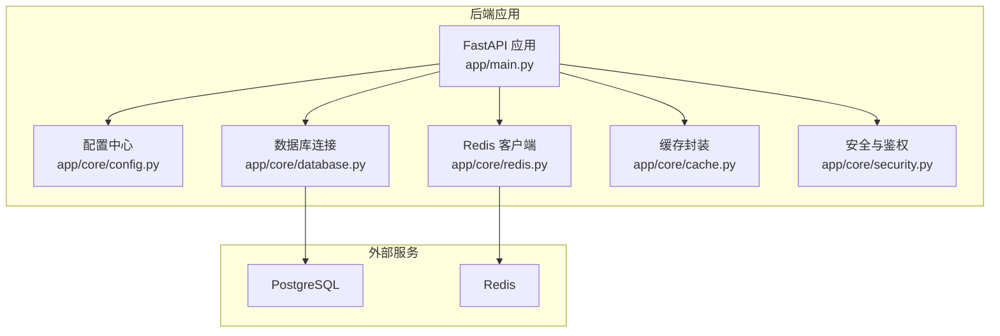
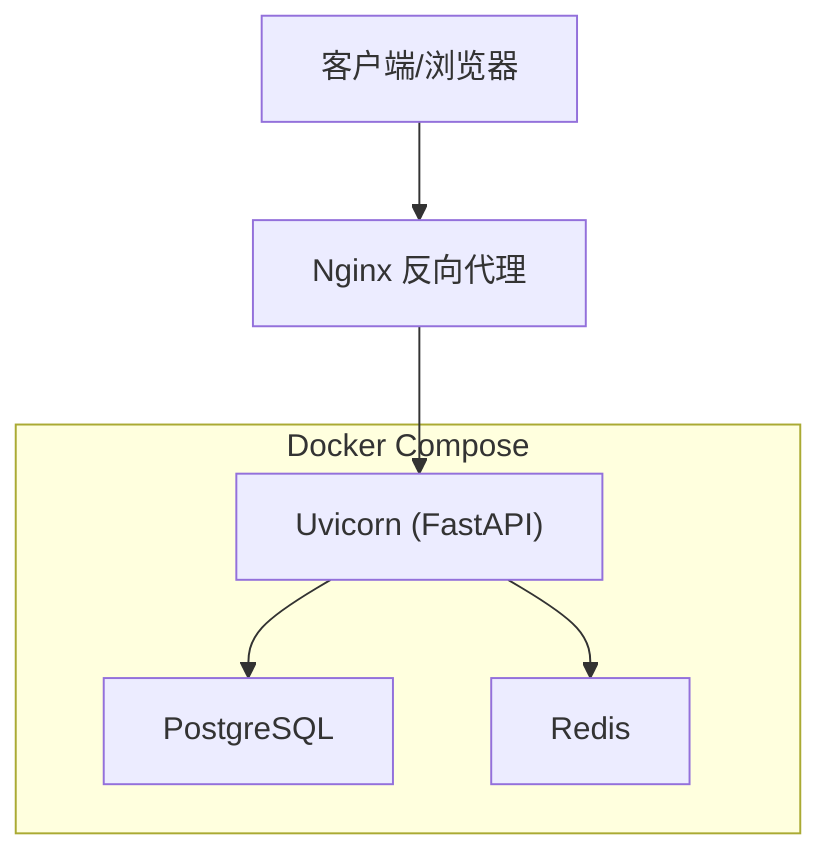
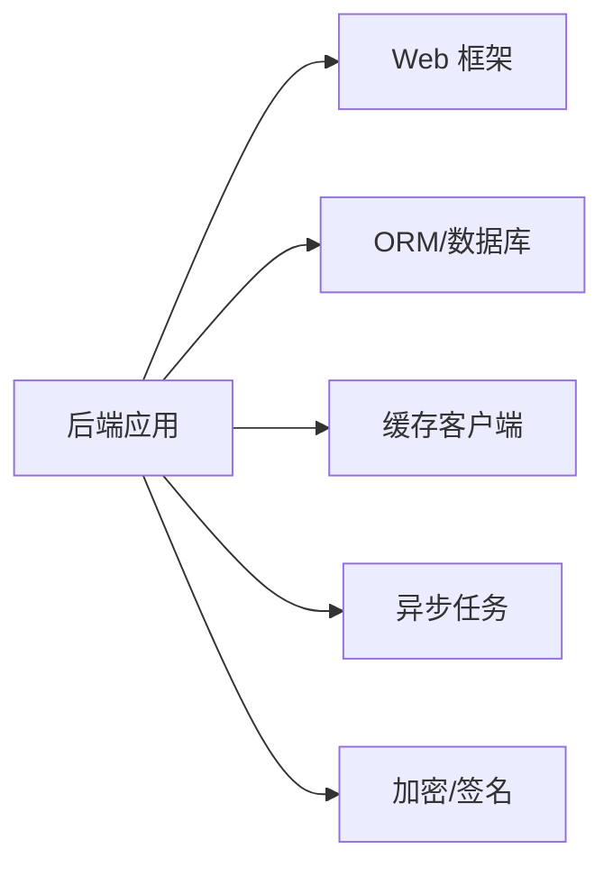

# 环境搭建与配置

<cite>
**本文引用的文件**
- [backend/app/main.py](file://backend/app/main.py)
- [backend/app/core/config.py](file://backend/app/core/config.py)
- [backend/app/core/database.py](file://backend/app/core/database.py)
- [backend/app/core/redis.py](file://backend/app/core/redis.py)
- [backend/app/core/cache.py](file://backend/app/core/cache.py)
- [backend/app/core/security.py](file://backend/app/core/security.py)
- [backend/Dockerfile](file://backend/Dockerfile)
- [backend/Dockerfile.cloud](file://backend/Dockerfile.cloud)
- [backend/entrypoint.sh](file://backend/entrypoint.sh)
- [docker-compose.yml](file://docker-compose.yml)
- [docker-compose.dev.yml](file://docker-compose.dev.yml)
- [docker-compose.prod.yml](file://docker-compose.prod.yml)
- [nginx.conf](file://nginx.conf)
- [nginx.ssl.conf](file://nginx.ssl.conf)
- [backend/pyproject.toml](file://backend/pyproject.toml)
- [backend/requirements.txt](file://backend/requirements.txt)
- [backend/requirements-dev.txt](file://backend/requirements-dev.txt)
- [backend/alembic.ini](file://backend/alembic.ini)
- [backend/migrations/env.py](file://backend/migrations/env.py)
- [backend/scripts/README.md](file://backend/scripts/README.md)
- [backend/scripts/create_admin.py](file://backend/scripts/create_admin.py)
- [backend/scripts/download_ecdict.py](file://backend/scripts/download_ecdict.py)
- [backend/scripts/seed_official_videos.py](file://backend/scripts/seed_official_videos.py)
- [backend/scripts/retranscribe_video.py](file://backend/scripts/retranscribe_video.py)
- [backend/.dockerignore](file://backend/.dockerignore)
- [backend/run_with_utf8.py](file://backend/run_with_utf8.py)
- [backend/pytest.ini](file://backend/pytest.ini)
- [backend/tests/conftest.py](file://backend/tests/conftest.py)
- [.pre-commit-config.yaml](file://.pre-commit-config.yaml)
- [CONTRIBUTING.md](file://CONTRIBUTING.md)
</cite>

## 目录
1. [简介](#简介)
2. [项目结构](#项目结构)
3. [核心组件](#核心组件)
4. [架构总览](#架构总览)
5. [详细组件分析](#详细组件分析)
6. [依赖分析](#依赖分析)
7. [性能考虑](#性能考虑)
8. [故障排查指南](#故障排查指南)
9. [结论](#结论)
10. [附录](#附录)

## 简介
本指南面向希望快速在本地或容器中搭建 Speaking 平台后端环境的开发者。内容涵盖：
- Python 环境与依赖安装
- PostgreSQL 数据库与 Redis 缓存服务配置
- 环境变量与配置文件结构、敏感信息管理
- Docker 容器化部署与开发启动流程
- 初始化脚本使用与数据库迁移命令
- 开发工具链（IDE、代码格式化、调试）配置建议

## 项目结构
后端位于 backend 目录，采用 FastAPI + SQLAlchemy + Alembic 的典型分层结构：
- app/api: REST API 路由层
- app/core: 配置、数据库、Redis、缓存、安全等基础设施
- app/models: SQLAlchemy 数据模型
- app/schemas: Pydantic 请求/响应模型
- app/services: 业务逻辑与服务集成
- app/tasks: Celery 异步任务
- migrations: Alembic 数据库迁移
- scripts: 初始化与运维脚本
- Dockerfile、entrypoint.sh: 容器镜像与启动入口
- pyproject.toml、requirements*.txt: 依赖声明
- alembic.ini、migrations/env.py: 迁移配置

图表来源
- [backend/app/main.py](file://backend/app/main.py)
- [backend/app/core/config.py](file://backend/app/core/config.py)
- [backend/app/core/database.py](file://backend/app/core/database.py)
- [backend/app/core/redis.py](file://backend/app/core/redis.py)
- [backend/app/core/cache.py](file://backend/app/core/cache.py)
- [backend/app/core/security.py](file://backend/app/core/security.py)

章节来源
- [backend/app/main.py](file://backend/app/main.py)
- [backend/app/core/config.py](file://backend/app/core/config.py)
- [backend/app/core/database.py](file://backend/app/core/database.py)
- [backend/app/core/redis.py](file://backend/app/core/redis.py)
- [backend/app/core/cache.py](file://backend/app/core/cache.py)
- [backend/app/core/security.py](file://backend/app/core/security.py)

## 核心组件
- 配置管理：集中读取环境变量与配置文件，提供类型安全的配置对象
- 数据库：基于 SQLAlchemy 的异步/同步连接池、会话管理、模型注册
- Redis：连接池、键空间隔离、序列化策略
- 缓存：统一缓存接口，支持多级缓存与失效策略
- 安全：JWT 签发与校验、密码哈希、令牌黑名单

章节来源
- [backend/app/core/config.py](file://backend/app/core/config.py)
- [backend/app/core/database.py](file://backend/app/core/database.py)
- [backend/app/core/redis.py](file://backend/app/core/redis.py)
- [backend/app/core/cache.py](file://backend/app/core/cache.py)
- [backend/app/core/security.py](file://backend/app/core/security.py)

## 架构总览
下图展示后端与外部服务的交互关系以及容器编排方式。

图表来源
- [docker-compose.yml](file://docker-compose.yml)
- [docker-compose.dev.yml](file://docker-compose.dev.yml)
- [docker-compose.prod.yml](file://docker-compose.prod.yml)
- [nginx.conf](file://nginx.conf)
- [nginx.ssl.conf](file://nginx.ssl.conf)

## 详细组件分析

### 配置与环境变量
- 配置来源优先级：环境变量 > 配置文件 > 默认值
- 关键配置项包括数据库连接串、Redis 地址、JWT 密钥、日志级别、限流策略、第三方服务密钥等
- 敏感信息通过环境变量注入，避免硬编码；建议使用 .env 文件并在 .gitignore 中排除

章节来源
- [backend/app/core/config.py](file://backend/app/core/config.py)

### 数据库（PostgreSQL）
- 使用 SQLAlchemy 进行 ORM 操作，支持连接池与会话生命周期管理
- 迁移由 Alembic 驱动，迁移脚本位于 migrations/versions
- 常用命令：
  - 生成迁移：根据模型变更生成新版本迁移
  - 执行迁移：将迁移应用到数据库
  - 回滚迁移：回退到指定版本

章节来源
- [backend/app/core/database.py](file://backend/app/core/database.py)
- [backend/alembic.ini](file://backend/alembic.ini)
- [backend/migrations/env.py](file://backend/migrations/env.py)

### 缓存（Redis）
- 提供连接池、命名空间隔离、序列化/反序列化工具
- 用于热点数据缓存、会话存储、分布式锁等场景
- 建议设置合理的过期时间与重试机制

章节来源
- [backend/app/core/redis.py](file://backend/app/core/redis.py)
- [backend/app/core/cache.py](file://backend/app/core/cache.py)

### 安全与鉴权
- JWT 令牌签发与校验，支持刷新令牌与黑名单
- 密码哈希与安全存储
- 访问控制与权限校验中间件

章节来源
- [backend/app/core/security.py](file://backend/app/core/security.py)

### 应用入口与运行
- FastAPI 应用入口负责路由注册、异常处理、中间件挂载
- 生产环境通过 Uvicorn 运行，容器入口脚本完成健康检查与依赖就绪检测

章节来源
- [backend/app/main.py](file://backend/app/main.py)
- [backend/entrypoint.sh](file://backend/entrypoint.sh)

### Docker 容器化
- 多阶段构建优化镜像体积
- 环境变量注入与卷挂载分离配置与数据
- 开发/生产不同 compose 文件便于切换

章节来源
- [backend/Dockerfile](file://backend/Dockerfile)
- [backend/Dockerfile.cloud](file://backend/Dockerfile.cloud)
- [backend/.dockerignore](file://backend/.dockerignore)
- [docker-compose.yml](file://docker-compose.yml)
- [docker-compose.dev.yml](file://docker-compose.dev.yml)
- [docker-compose.prod.yml](file://docker-compose.prod.yml)

### 初始化脚本
- create_admin：创建管理员账户
- download_ecdict：下载词典资源
- seed_official_videos：导入官方视频种子数据
- retranscribe_video：重新转录视频字幕
- 其他脚本参见 scripts/README.md

章节来源
- [backend/scripts/README.md](file://backend/scripts/README.md)
- [backend/scripts/create_admin.py](file://backend/scripts/create_admin.py)
- [backend/scripts/download_ecdict.py](file://backend/scripts/download_ecdict.py)
- [backend/scripts/seed_official_videos.py](file://backend/scripts/seed_official_videos.py)
- [backend/scripts/retranscribe_video.py](file://backend/scripts/retranscribe_video.py)

## 依赖分析
- Python 依赖集中在 pyproject.toml 与 requirements*.txt
- 开发依赖包含测试、格式化、类型检查等工具
- 运行时依赖包括 Web 框架、ORM、缓存、异步任务、加密库等

图表来源
- [backend/pyproject.toml](file://backend/pyproject.toml)
- [backend/requirements.txt](file://backend/requirements.txt)
- [backend/requirements-dev.txt](file://backend/requirements-dev.txt)

章节来源
- [backend/pyproject.toml](file://backend/pyproject.toml)
- [backend/requirements.txt](file://backend/requirements.txt)
- [backend/requirements-dev.txt](file://backend/requirements-dev.txt)

## 性能考虑
- 数据库连接池大小与超时参数需按负载调优
- Redis 缓存命中率与过期策略直接影响响应时间
- 异步任务队列长度与消费者数量影响吞吐
- 静态资源与媒体文件建议走 CDN/对象存储

[本节为通用指导，不直接分析具体文件]

## 故障排查指南
- 数据库连接失败：检查连接串、网络连通性、端口与认证
- Redis 不可用：确认地址、密码、防火墙与内存限制
- 迁移失败：核对当前版本与目标版本，查看错误日志
- 鉴权失败：检查 JWT 密钥、时区与过期时间
- 容器启动失败：查看 entrypoint 日志与健康检查输出

章节来源
- [backend/entrypoint.sh](file://backend/entrypoint.sh)
- [backend/app/core/database.py](file://backend/app/core/database.py)
- [backend/app/core/redis.py](file://backend/app/core/redis.py)
- [backend/app/core/security.py](file://backend/app/core/security.py)

## 结论
通过合理的环境变量与配置文件管理、完善的数据库与缓存配置、规范的容器化部署与迁移流程，可快速搭建稳定可靠的 Speaking 后端环境。建议在开发阶段充分使用脚本与工具链提升效率，在生产环境加强监控与告警。

[本节为总结性内容，不直接分析具体文件]

## 附录

### Python 环境与依赖安装
- 使用 Python 3.x（推荐最新稳定版），创建虚拟环境并安装依赖
- 开发依赖与运行依赖分开管理，便于最小化镜像与加速安装

章节来源
- [backend/pyproject.toml](file://backend/pyproject.toml)
- [backend/requirements.txt](file://backend/requirements.txt)
- [backend/requirements-dev.txt](file://backend/requirements-dev.txt)

### 数据库与缓存配置
- PostgreSQL：配置主机、端口、用户名、密码与数据库名
- Redis：配置主机、端口、密码与数据库索引
- 连接串格式与参数参考 core 模块实现

章节来源
- [backend/app/core/database.py](file://backend/app/core/database.py)
- [backend/app/core/redis.py](file://backend/app/core/redis.py)

### 环境变量与配置文件
- 使用 .env 文件管理本地变量，确保不被提交至版本库
- 生产环境通过容器编排注入环境变量
- 敏感信息如 JWT 密钥、支付密钥等必须通过环境变量注入

章节来源
- [backend/app/core/config.py](file://backend/app/core/config.py)

### Docker 容器化部署
- 使用 docker-compose 一键拉起后端、数据库与缓存
- 开发模式启用热重载与详细日志
- 生产模式关闭调试、启用 HTTPS 与反向代理

章节来源
- [docker-compose.yml](file://docker-compose.yml)
- [docker-compose.dev.yml](file://docker-compose.dev.yml)
- [docker-compose.prod.yml](file://docker-compose.prod.yml)
- [nginx.conf](file://nginx.conf)
- [nginx.ssl.conf](file://nginx.ssl.conf)
- [backend/Dockerfile](file://backend/Dockerfile)
- [backend/Dockerfile.cloud](file://backend/Dockerfile.cloud)
- [backend/entrypoint.sh](file://backend/entrypoint.sh)

### 开发环境启动流程
- 启动依赖服务（PostgreSQL、Redis）
- 执行数据库迁移
- 运行初始化脚本（管理员、词典、种子数据）
- 启动后端服务（开发模式）

章节来源
- [backend/alembic.ini](file://backend/alembic.ini)
- [backend/migrations/env.py](file://backend/migrations/env.py)
- [backend/scripts/README.md](file://backend/scripts/README.md)
- [backend/app/main.py](file://backend/app/main.py)

### 数据库迁移命令
- 生成迁移：根据模型变更生成新版本
- 执行迁移：应用到数据库
- 回滚迁移：回退到指定版本

章节来源
- [backend/alembic.ini](file://backend/alembic.ini)
- [backend/migrations/env.py](file://backend/migrations/env.py)

### 初始化脚本使用说明
- 创建管理员账户
- 下载词典资源
- 导入官方视频种子数据
- 重新转录视频字幕

章节来源
- [backend/scripts/README.md](file://backend/scripts/README.md)
- [backend/scripts/create_admin.py](file://backend/scripts/create_admin.py)
- [backend/scripts/download_ecdict.py](file://backend/scripts/download_ecdict.py)
- [backend/scripts/seed_official_videos.py](file://backend/scripts/seed_official_videos.py)
- [backend/scripts/retranscribe_video.py](file://backend/scripts/retranscribe_video.py)

### 开发工具链配置
- IDE：启用 PEP8、自动格式化、类型检查
- 预提交钩子：统一代码风格与基础检查
- 测试：使用 pytest，参考 conftest 与 pytest.ini
- UTF-8 运行：确保终端与进程使用 UTF-8

章节来源
- [backend/pytest.ini](file://backend/pytest.ini)
- [backend/tests/conftest.py](file://backend/tests/conftest.py)
- [backend/run_with_utf8.py](file://backend/run_with_utf8.py)
- [.pre-commit-config.yaml](file://.pre-commit-config.yaml)
- [CONTRIBUTING.md](file://CONTRIBUTING.md)
