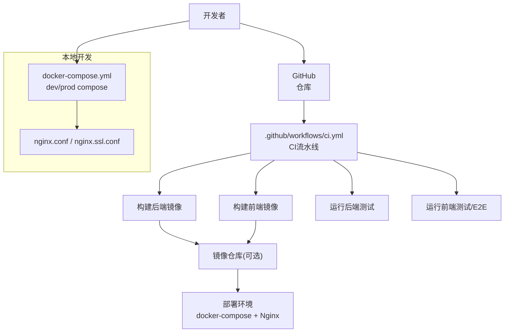
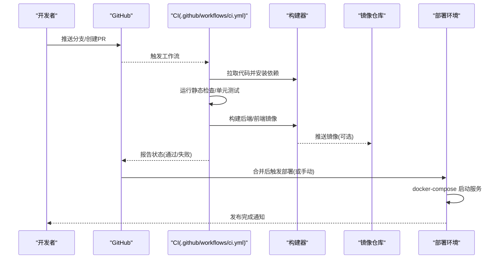
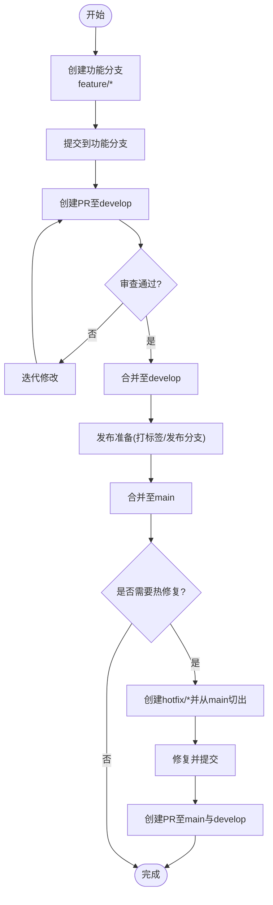
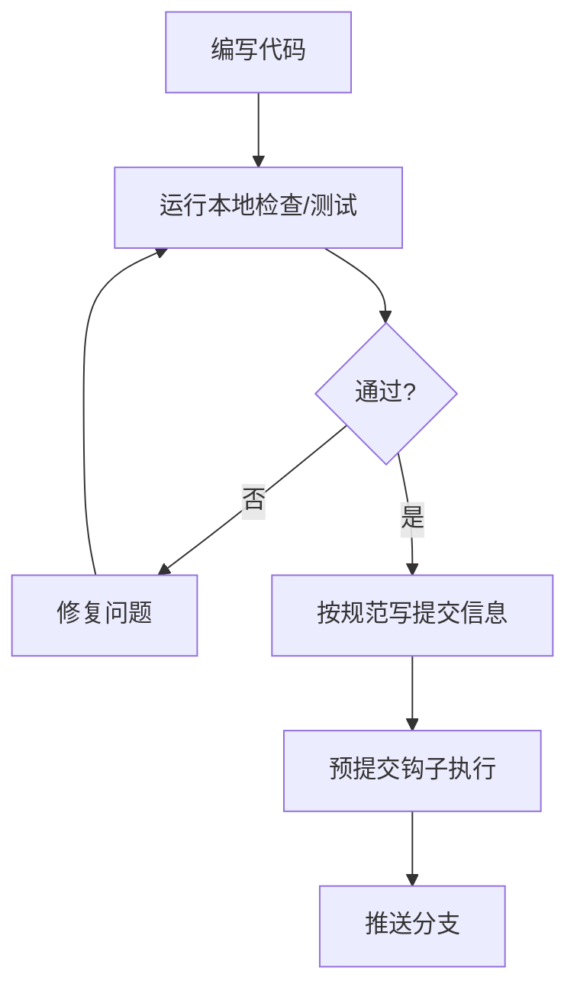
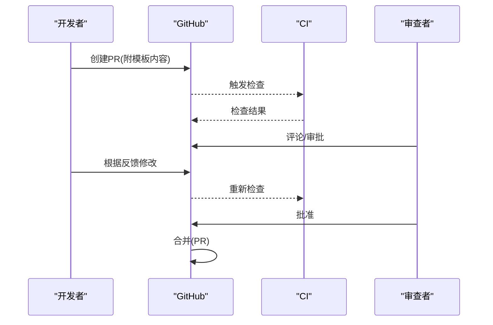
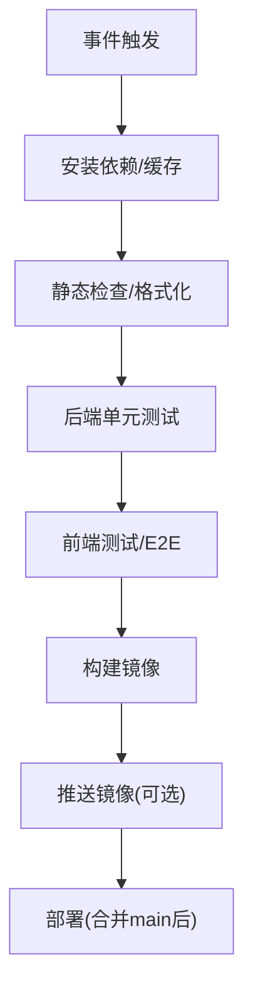
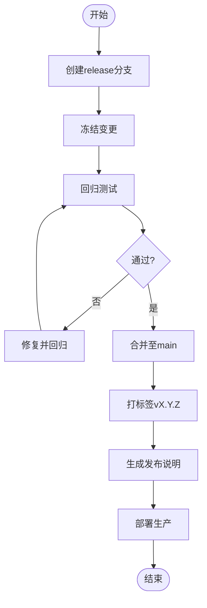
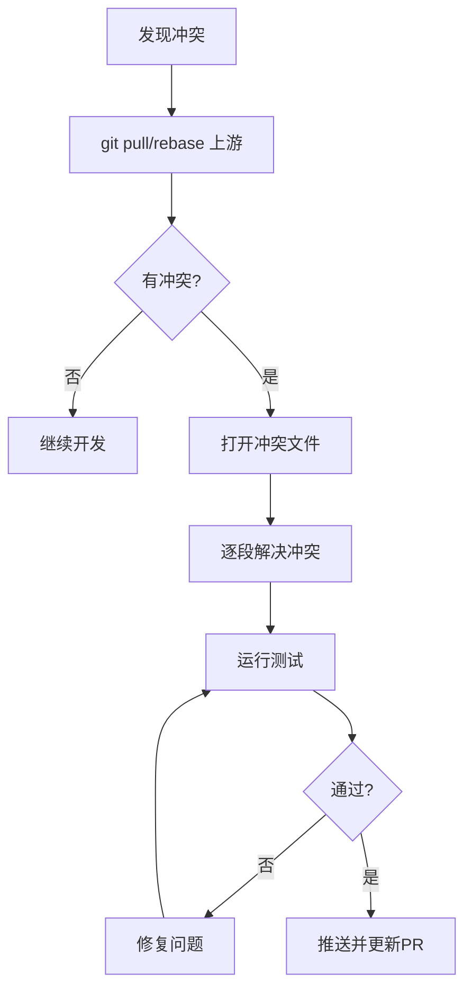
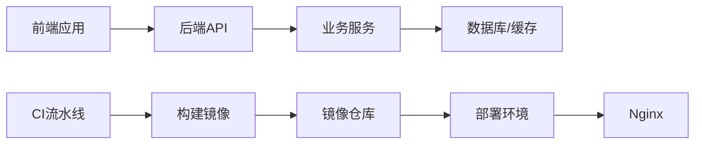

# Git工作流

<cite>
**本文引用的文件**
- [ci.yml](file://.github/workflows/ci.yml)
- [CONTRIBUTING.md](file://CONTRIBUTING.md)
- [docker-compose.dev.yml](file://docker-compose.dev.yml)
- [docker-compose.prod.yml](file://docker-compose.prod.yml)
- [docker-compose.yml](file://docker-compose.yml)
- [backend/Dockerfile](file://backend/Dockerfile)
- [backend/Dockerfile.cloud](file://backend/Dockerfile.cloud)
- [frontend/Dockerfile](file://frontend/Dockerfile)
- [frontend/Dockerfile.prod](file://frontend/Dockerfile.prod)
- [nginx.conf](file://nginx.conf)
- [nginx.ssl.conf](file://nginx.ssl.conf)
- [.pre-commit-config.yaml](file://.pre-commit-config.yaml)
- [backend/pyproject.toml](file://backend/pyproject.toml)
- [backend/pytest.ini](file://backend/pytest.ini)
- [frontend/package.json](file://frontend/package.json)
- [frontend/playwright.config.ts](file://frontend/playwright.config.ts)
</cite>

## 目录
1. [简介](#简介)
2. [项目结构](#项目结构)
3. [核心组件](#核心组件)
4. [架构总览](#架构总览)
5. [详细组件分析](#详细组件分析)
6. [依赖分析](#依赖分析)
7. [性能考虑](#性能考虑)
8. [故障排查指南](#故障排查指南)
9. [结论](#结论)
10. [附录](#附录)

## 简介
本文件为Speaking平台的Git工作流规范，覆盖分支策略、提交规范、代码审查流程、CI/CD流水线、版本与发布管理、冲突解决与协作最佳实践。目标是让不同技术背景的成员都能高效、安全地协作开发，保证主干稳定、可追溯、可回滚。

## 项目结构
仓库采用前后端分离与多容器编排：
- 后端：Python/FastAPI应用，含API、模型、服务、任务、迁移与测试
- 前端：Next.js应用，含页面、组件、类型、E2E测试
- 基础设施：Docker Compose编排、Nginx反向代理、GitHub Actions CI
- 文档与计划：设计决策、架构说明、运行手册等

**图表来源**
- [ci.yml](file://.github/workflows/ci.yml)
- [docker-compose.yml](file://docker-compose.yml)
- [docker-compose.dev.yml](file://docker-compose.dev.yml)
- [docker-compose.prod.yml](file://docker-compose.prod.yml)
- [nginx.conf](file://nginx.conf)
- [nginx.ssl.conf](file://nginx.ssl.conf)

**章节来源**
- [ci.yml](file://.github/workflows/ci.yml)
- [docker-compose.yml](file://docker-compose.yml)
- [docker-compose.dev.yml](file://docker-compose.dev.yml)
- [docker-compose.prod.yml](file://docker-compose.prod.yml)
- [nginx.conf](file://nginx.conf)
- [nginx.ssl.conf](file://nginx.ssl.conf)

## 核心组件
- 分支策略：主分支、开发分支、功能分支、热修复分支的职责与流转
- 提交规范：消息格式、变更类型、关联Issue
- 代码审查：PR模板、审查清单、合并策略
- CI/CD：自动化测试、构建、部署
- 版本管理：语义化版本、标签规范、发布流程
- 协作与冲突：分支同步、冲突解决、最佳实践

**章节来源**
- [CONTRIBUTING.md](file://CONTRIBUTING.md)

## 架构总览
下图展示从代码提交到生产发布的端到端流程，涵盖分支、PR、CI、构建、测试、镜像与部署。

**图表来源**
- [ci.yml](file://.github/workflows/ci.yml)
- [docker-compose.yml](file://docker-compose.yml)
- [backend/Dockerfile](file://backend/Dockerfile)
- [backend/Dockerfile.cloud](file://backend/Dockerfile.cloud)
- [frontend/Dockerfile](file://frontend/Dockerfile)
- [frontend/Dockerfile.prod](file://frontend/Dockerfile.prod)

## 详细组件分析

### 分支策略
- 主分支（main）
  - 用途：始终可部署的稳定基线
  - 保护：禁止直接推送；仅允许通过受保护的PR合并
  - 合并策略：建议“合并提交”或“快进”，保持线性历史
- 开发分支（develop）
  - 用途：集成即将进入下一版本的特性
  - 更新：由功能分支定期合入；发布前冻结
- 功能分支（feature/*）
  - 命名：feature/<issue-id>-<short-desc>
  - 生命周期：从develop创建，完成后发起PR至develop
- 热修复分支（hotfix/*）
  - 命名：hotfix/<issue-id>-<short-desc>
  - 目标：从main创建，修复后同时合并回main与develop

**图表来源**
- [CONTRIBUTING.md](file://CONTRIBUTING.md)

**章节来源**
- [CONTRIBUTING.md](file://CONTRIBUTING.md)

### 提交规范
- 消息格式
  - 类型: 描述 [#IssueID]
  - 类型包括：feat、fix、docs、style、refactor、test、chore、perf、build、ci、revert
  - 描述应简洁明确，必要时在正文补充动机与影响范围
- 关联Issue
  - 使用Closes #xxx、Refs #xxx等关键字自动关闭或引用问题
- 提交粒度
  - 一次提交聚焦一个变更点；避免混合无关改动
- 预提交钩子
  - 使用预提交工具进行格式化与基础检查，减少无效提交

**图表来源**
- [.pre-commit-config.yaml](file://.pre-commit-config.yaml)
- [CONTRIBUTING.md](file://CONTRIBUTING.md)

**章节来源**
- [CONTRIBUTING.md](file://CONTRIBUTING.md)
- [.pre-commit-config.yaml](file://.pre-commit-config.yaml)

### 代码审查流程
- Pull Request模板
  - 必填项：变更概述、影响范围、自测情况、依赖变化、截图/日志（如有）
  - 关联Issue：必须包含Issue链接
- 审查清单
  - 代码风格与可读性
  - 测试覆盖率与用例有效性
  - 安全性与权限控制
  - 性能与资源占用
  - 向后兼容性与迁移脚本
- 合并策略
  - 至少一名维护者批准
  - CI全绿
  - 无未决评论
  - 建议使用“合并提交”以保留上下文，或“快进”以保持线性历史

**图表来源**
- [CONTRIBUTING.md](file://CONTRIBUTING.md)

**章节来源**
- [CONTRIBUTING.md](file://CONTRIBUTING.md)

### CI/CD流水线配置
- 触发条件
  - 推送至分支、创建或更新PR、合并至受保护分支
- 阶段
  - 依赖安装与缓存
  - 静态检查与格式化
  - 后端单元测试（pytest）
  - 前端测试（含E2E）
  - 构建镜像（后端/前端）
  - 上传制品（可选）
- 环境与密钥
  - 敏感信息通过GitHub Secrets注入
  - 环境变量区分开发与生产
- 部署
  - 合并至main后触发部署（或手动触发）
  - 使用docker-compose拉起服务，Nginx作为反向代理

**图表来源**
- [ci.yml](file://.github/workflows/ci.yml)
- [backend/pytest.ini](file://backend/pytest.ini)
- [frontend/playwright.config.ts](file://frontend/playwright.config.ts)

**章节来源**
- [ci.yml](file://.github/workflows/ci.yml)
- [backend/pytest.ini](file://backend/pytest.ini)
- [frontend/playwright.config.ts](file://frontend/playwright.config.ts)

### 版本管理与发布流程
- 语义化版本
  - 遵循MAJOR.MINOR.PATCH规则
  - 主版本：破坏性变更；次版本：新功能；补丁：缺陷修复
- 标签规范
  - 格式：vX.Y.Z
  - 标签指向main分支的发布快照
- 发布流程
  - 从develop创建release分支（如release/vX.Y.Z）
  - 冻结变更，回归测试通过后合并至main并打标签
  - 生成发布说明（Changelog），包含关键变更与已知问题
  - 触发生产部署（灰度/蓝绿/滚动，视平台能力）

**图表来源**
- [CONTRIBUTING.md](file://CONTRIBUTING.md)

**章节来源**
- [CONTRIBUTING.md](file://CONTRIBUTING.md)

### 冲突解决指南
- 常见冲突场景
  - 多人并行修改同一模块
  - 合并develop至功能分支时产生差异
  - 热修复与主线并发变更
- 解决步骤
  - 先拉取最新上游分支（rebase或merge）
  - 定位冲突文件，逐段审阅并解决
  - 运行本地测试确保一致性
  - 推送并更新PR状态
- 预防建议
  - 小步提交、频繁同步上游
  - 拆分大变更为多个小PR
  - 使用分支策略与代码审查降低耦合

**图表来源**
- [CONTRIBUTING.md](file://CONTRIBUTING.md)

**章节来源**
- [CONTRIBUTING.md](file://CONTRIBUTING.md)

### 协作最佳实践
- 沟通与计划
  - 需求与任务拆分为Issue，明确验收标准
  - 复杂变更提前讨论设计与边界
- 代码质量
  - 统一编码规范与预提交钩子
  - 增加单测与E2E用例，提升覆盖率
- 安全与合规
  - 敏感配置使用Secrets管理
  - 第三方依赖定期审计与升级
- 文档与知识沉淀
  - 变更记录、架构决策、操作手册同步更新
  - 常见问题与排障指南持续完善

**章节来源**
- [CONTRIBUTING.md](file://CONTRIBUTING.md)

## 依赖分析
- 组件内聚与耦合
  - 后端API与服务层职责清晰，服务间通过接口调用
  - 前端组件按功能域划分，状态管理集中
- 外部依赖
  - Docker镜像构建依赖后端/前端Dockerfile
  - CI依赖GitHub Actions与工作流定义
  - 部署依赖docker-compose与Nginx配置
- 潜在风险
  - 循环依赖需避免
  - 第三方库版本锁定与漏洞扫描

**图表来源**
- [backend/Dockerfile](file://backend/Dockerfile)
- [backend/Dockerfile.cloud](file://backend/Dockerfile.cloud)
- [frontend/Dockerfile](file://frontend/Dockerfile)
- [frontend/Dockerfile.prod](file://frontend/Dockerfile.prod)
- [docker-compose.yml](file://docker-compose.yml)
- [nginx.conf](file://nginx.conf)

**章节来源**
- [backend/Dockerfile](file://backend/Dockerfile)
- [backend/Dockerfile.cloud](file://backend/Dockerfile.cloud)
- [frontend/Dockerfile](file://frontend/Dockerfile)
- [frontend/Dockerfile.prod](file://frontend/Dockerfile.prod)
- [docker-compose.yml](file://docker-compose.yml)
- [nginx.conf](file://nginx.conf)

## 性能考虑
- 构建优化
  - 依赖缓存、分层构建、并行任务
- 测试优化
  - 并行执行测试套件、隔离数据与环境
- 部署优化
  - 镜像瘦身、按需加载、灰度发布
- 监控与回滚
  - 指标采集、告警、快速回滚策略

[本节为通用指导，不直接分析具体文件]

## 故障排查指南
- 常见问题
  - CI失败：检查日志、依赖安装、测试用例
  - 构建失败：确认Dockerfile与上下文
  - 部署失败：核对环境变量、端口与证书
- 调试手段
  - 本地复现：使用docker-compose dev环境
  - 日志收集：后端与应用日志、Nginx访问日志
  - 回滚策略：回退至上一稳定标签

**章节来源**
- [docker-compose.dev.yml](file://docker-compose.dev.yml)
- [docker-compose.prod.yml](file://docker-compose.prod.yml)
- [nginx.ssl.conf](file://nginx.ssl.conf)

## 结论
通过明确的分支策略、提交规范、代码审查与CI/CD流水线，Speaking平台可实现高质量、可追溯、可持续交付。配合版本管理与冲突解决指南，团队可在复杂协作中保持稳定与效率。

## 附录
- 参考文件
  - 贡献指南：[CONTRIBUTING.md](file://CONTRIBUTING.md)
  - CI工作流：[ci.yml](file://.github/workflows/ci.yml)
  - 后端测试配置：[backend/pytest.ini](file://backend/pytest.ini)
  - 前端E2E配置：[frontend/playwright.config.ts](file://frontend/playwright.config.ts)
  - 预提交钩子：[.pre-commit-config.yaml](file://.pre-commit-config.yaml)
  - 容器编排：[docker-compose.yml](file://docker-compose.yml)、[docker-compose.dev.yml](file://docker-compose.dev.yml)、[docker-compose.prod.yml](file://docker-compose.prod.yml)
  - 反向代理：[nginx.conf](file://nginx.conf)、[nginx.ssl.conf](file://nginx.ssl.conf)
  - 镜像构建：[backend/Dockerfile](file://backend/Dockerfile)、[backend/Dockerfile.cloud](file://backend/Dockerfile.cloud)、[frontend/Dockerfile](file://frontend/Dockerfile)、[frontend/Dockerfile.prod](file://frontend/Dockerfile.prod)
