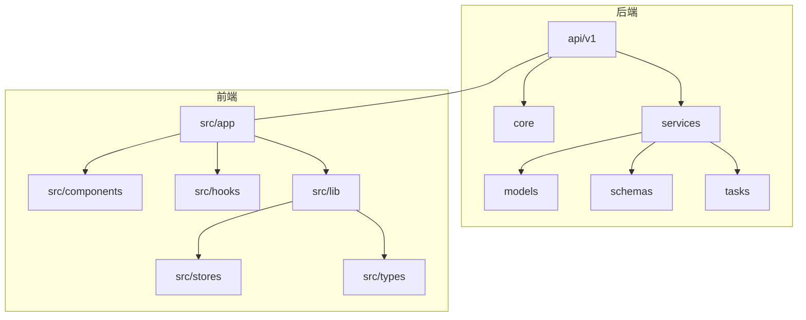
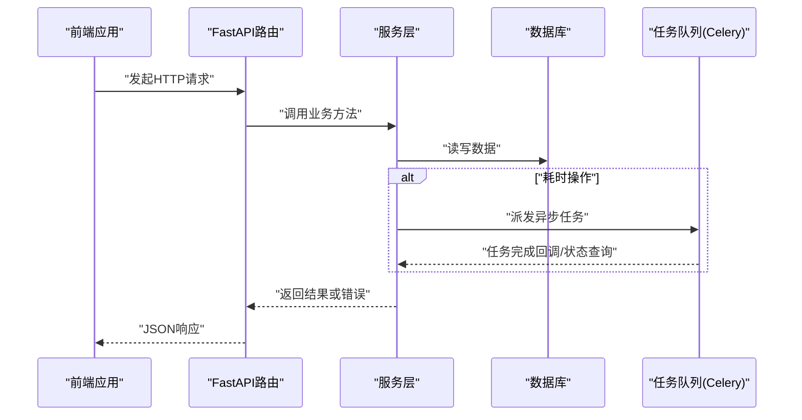
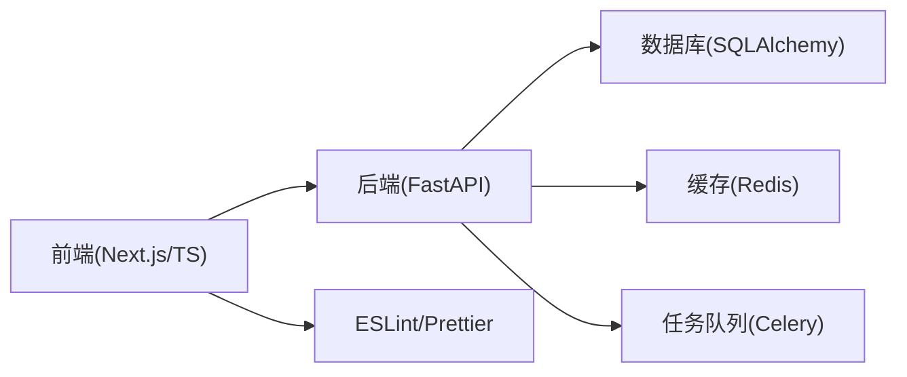

# 代码风格指南

<cite>
**本文引用的文件**
- [backend/pyproject.toml](file://backend/pyproject.toml)
- [backend/.mypy-baseline](file://backend/.mypy-baseline)
- [backend/pytest.ini](file://backend/pytest.ini)
- [backend/run_with_utf8.py](file://backend/run_with_utf8.py)
- [backend/app/core/logging.py](file://backend/app/core/logging.py)
- [backend/app/core/errors.py](file://backend/app/core/errors.py)
- [backend/app/api/v1/auth.py](file://backend/app/api/v1/auth.py)
- [backend/app/services/video_service.py](file://backend/app/services/video_service.py)
- [backend/app/tasks/celery_app.py](file://backend/app/tasks/celery_app.py)
- [.pre-commit-config.yaml](file://.pre-commit-config.yaml)
- [frontend/eslint.config.mjs](file://frontend/eslint.config.mjs)
- [frontend/.prettierrc](file://frontend/.prettierrc)
- [frontend/tsconfig.json](file://frontend/tsconfig.json)
- [frontend/package.json](file://frontend/package.json)
- [frontend/src/lib/errors.ts](file://frontend/src/lib/errors.ts)
- [frontend/src/lib/api.ts](file://frontend/src/lib/api.ts)
- [frontend/src/hooks/useSpeakingRecorder.ts](file://frontend/src/hooks/useSpeakingRecorder.ts)
</cite>

## 目录
1. [简介](#简介)
2. [项目结构](#项目结构)
3. [核心组件](#核心组件)
4. [架构总览](#架构总览)
5. [详细组件分析](#详细组件分析)
6. [依赖关系分析](#依赖关系分析)
7. [性能注意事项](#性能注意事项)
8. [故障排查指南](#故障排查指南)
9. [结论](#结论)
10. [附录](#附录)

## 简介
本指南面向Speaking平台的后端（Python/FastAPI）与前端（TypeScript/Next.js）开发者，统一代码风格、注释规范、预提交检查、API设计原则、错误处理与日志记录标准，并提供性能优化、内存泄漏预防与并发编程最佳实践。目标是降低协作成本、提升可维护性与稳定性。

## 项目结构
- 后端位于 backend/app，采用分层组织：api（路由）、core（基础设施）、models（数据模型）、schemas（请求/响应模式）、services（业务逻辑）、tasks（异步任务）。
- 前端位于 frontend/src，按功能域划分：app（页面与布局）、components（UI组件）、hooks（自定义Hook）、lib（工具与API封装）、stores（状态管理）、types（类型定义）。
- 根目录包含全局配置：.pre-commit-config.yaml（预提交钩子）、docker-compose*.yml（容器编排）、nginx.conf（反向代理）等。

**章节来源**
- [backend/app/main.py](file://backend/app/main.py)
- [frontend/src/app/layout.tsx](file://frontend/src/app/layout.tsx)

## 核心组件
- 后端核心：
  - API层：基于FastAPI的路由模块，负责参数校验、鉴权、调用服务层。
  - 服务层：封装领域逻辑，协调数据库、缓存、第三方服务与任务队列。
  - 核心库：配置、数据库连接、Redis、限流、安全、日志、错误定义等。
  - 任务：Celery任务用于耗时操作（如视频处理、转录、评分等）。
- 前端核心：
  - 页面与布局：Next.js App Router页面与布局组件。
  - UI组件：通用与业务组件，遵循一致的样式与交互约定。
  - Hook与状态：数据获取、媒体录制、播放器控制、主题切换等。
  - API与错误：统一的HTTP客户端、错误分类与用户提示。

**章节来源**
- [backend/app/api/v1/auth.py](file://backend/app/api/v1/auth.py)
- [backend/app/services/video_service.py](file://backend/app/services/video_service.py)
- [backend/app/core/logging.py](file://backend/app/core/logging.py)
- [backend/app/core/errors.py](file://backend/app/core/errors.py)
- [backend/app/tasks/celery_app.py](file://backend/app/tasks/celery_app.py)
- [frontend/src/lib/api.ts](file://frontend/src/lib/api.ts)
- [frontend/src/lib/errors.ts](file://frontend/src/lib/errors.ts)
- [frontend/src/hooks/useSpeakingRecorder.ts](file://frontend/src/hooks/useSpeakingRecorder.ts)

## 架构总览
后端通过FastAPI暴露REST API，服务层调用数据库与外部服务，必要时将耗时任务投递到Celery队列；前端通过Next.js渲染页面，使用统一API客户端访问后端，集中处理错误与状态。

**图表来源**
- [backend/app/api/v1/auth.py](file://backend/app/api/v1/auth.py)
- [backend/app/services/video_service.py](file://backend/app/services/video_service.py)
- [backend/app/tasks/celery_app.py](file://backend/app/tasks/celery_app.py)

## 详细组件分析

### Python代码风格与格式化
- 缩进与行宽：
  - 使用4空格缩进，行宽建议不超过88字符（遵循Black默认）。
  - 避免过深嵌套，优先使用卫语句与早期返回。
- 导入顺序：
  - 标准库、第三方库、本地模块分组，组间空一行，组内按字母排序。
- 命名约定：
  - 模块与包：小写下划线；类名：大驼峰；函数与变量：小写下划线；常量：大写加下划线。
- 类型注解：
  - 函数签名、返回值、关键变量需添加类型注解；复杂结构使用typing模块。
- 文档字符串：
  - 模块级提供概述；类级说明职责与用法；函数级描述参数、返回值、异常与副作用。
- 示例参考路径：
  - [backend/app/api/v1/auth.py](file://backend/app/api/v1/auth.py)
  - [backend/app/services/video_service.py](file://backend/app/services/video_service.py)

**章节来源**
- [backend/pyproject.toml](file://backend/pyproject.toml)
- [backend/app/api/v1/auth.py](file://backend/app/api/v1/auth.py)
- [backend/app/services/video_service.py](file://backend/app/services/video_service.py)

### TypeScript代码风格与格式化
- 缩进与行宽：
  - 使用2空格缩进，行宽建议不超过120字符（遵循Prettier默认）。
- 导入顺序：
  - 第三方库、内部模块、相对路径模块分组，组间空一行，组内按字母排序。
- 命名约定：
  - 组件与类：大驼峰；函数与变量：小驼峰；常量：大写加下划线；枚举：大驼峰。
- 类型严格模式：
  - 启用strict模式，避免any，尽量使用泛型与联合类型表达约束。
- 文档注释：
  - 公共接口使用JSDoc；复杂Hook与组件说明参数、返回值、副作用与边界条件。
- 示例参考路径：
  - [frontend/src/hooks/useSpeakingRecorder.ts](file://frontend/src/hooks/useSpeakingRecorder.ts)
  - [frontend/src/lib/api.ts](file://frontend/src/lib/api.ts)

**章节来源**
- [frontend/.prettierrc](file://frontend/.prettierrc)
- [frontend/tsconfig.json](file://frontend/tsconfig.json)
- [frontend/src/hooks/useSpeakingRecorder.ts](file://frontend/src/hooks/useSpeakingRecorder.ts)
- [frontend/src/lib/api.ts](file://frontend/src/lib/api.ts)

### 注释规范
- 函数注释：
  - 描述目的、输入输出、异常、副作用与性能影响；对复杂算法给出步骤说明。
- 类文档字符串：
  - 说明职责、生命周期、线程安全性、依赖与使用示例。
- 复杂逻辑注释：
  - 解释决策依据、权衡与替代方案；标注已知限制与待改进点。
- 前后端一致要求：
  - 所有对外暴露的API与服务方法必须有清晰注释；错误分支与边界条件需说明。

**章节来源**
- [backend/app/services/video_service.py](file://backend/app/services/video_service.py)
- [frontend/src/hooks/useSpeakingRecorder.ts](file://frontend/src/hooks/useSpeakingRecorder.ts)

### 预提交钩子配置
- 工具链：
  - flake8：静态检查与风格规则；black：自动格式化；mypy：类型检查；isort：导入排序。
- 触发时机：
  - git commit时运行，失败则阻止提交；支持stage文件过滤与并行执行。
- 配置位置：
  - 根目录.pre-commit-config.yaml统一管理各语言工具版本与规则。
- 建议：
  - 在CI中重复相同检查；本地开发启用IDE集成以实时反馈。

**章节来源**
- [.pre-commit-config.yaml](file://.pre-commit-config.yaml)

### 前端代码规范（ESLint与Prettier）
- ESLint：
  - 启用React/Next/TS相关规则集；禁用宽松规则，启用严格安全检查。
- Prettier：
  - 统一缩进、引号、分号、换行与对象格式；与ESLint冲突规则通过eslint-config-prettier解决。
- TypeScript严格模式：
  - 开启noImplicitAny、strictNullChecks等；避免隐式any，显式声明类型。
- 示例参考路径：
  - [frontend/eslint.config.mjs](file://frontend/eslint.config.mjs)
  - [frontend/.prettierrc](file://frontend/.prettierrc)
  - [frontend/tsconfig.json](file://frontend/tsconfig.json)

**章节来源**
- [frontend/eslint.config.mjs](file://frontend/eslint.config.mjs)
- [frontend/.prettierrc](file://frontend/.prettierrc)
- [frontend/tsconfig.json](file://frontend/tsconfig.json)

### API设计原则
- RESTful风格：
  - 资源名词化、HTTP语义明确；分页、排序、过滤使用查询参数。
- 版本管理：
  - URL前缀v1，向后兼容变更需评估影响并保留旧版本。
- 鉴权与授权：
  - 统一鉴权中间件；敏感操作需二次确认与审计日志。
- 错误码与消息：
  - 标准化错误响应体；区分客户端错误与服务端错误。
- 示例参考路径：
  - [backend/app/api/v1/auth.py](file://backend/app/api/v1/auth.py)
  - [backend/app/core/errors.py](file://backend/app/core/errors.py)

**章节来源**
- [backend/app/api/v1/auth.py](file://backend/app/api/v1/auth.py)
- [backend/app/core/errors.py](file://backend/app/core/errors.py)

### 错误处理标准
- 后端：
  - 定义统一异常类型与HTTP状态映射；服务层抛出领域异常，路由层转换为响应。
- 前端：
  - 统一错误分类（网络、业务、权限）；用户可见错误需友好提示与重试指引。
- 示例参考路径：
  - [backend/app/core/errors.py](file://backend/app/core/errors.py)
  - [frontend/src/lib/errors.ts](file://frontend/src/lib/errors.ts)

**章节来源**
- [backend/app/core/errors.py](file://backend/app/core/errors.py)
- [frontend/src/lib/errors.ts](file://frontend/src/lib/errors.ts)

### 日志记录规范
- 结构化日志：
  - JSON格式，包含时间戳、级别、模块、请求ID、用户ID等上下文。
- 分级策略：
  - DEBUG用于调试，INFO用于关键流程，WARNING为潜在问题，ERROR为异常。
- 敏感信息：
  - 禁止记录密码、令牌、完整手机号等；脱敏后再写入。
- 示例参考路径：
  - [backend/app/core/logging.py](file://backend/app/core/logging.py)

**章节来源**
- [backend/app/core/logging.py](file://backend/app/core/logging.py)

### 并发编程最佳实践
- Celery任务：
  - 幂等性设计；重试与退避策略；任务结果持久化与监控。
- 数据库事务：
  - 短事务、明确隔离级别；避免长事务与锁竞争。
- 缓存一致性：
  - 写穿/失效策略；热点键保护与降级。
- 示例参考路径：
  - [backend/app/tasks/celery_app.py](file://backend/app/tasks/celery_app.py)

**章节来源**
- [backend/app/tasks/celery_app.py](file://backend/app/tasks/celery_app.py)

### 性能优化指南
- 后端：
  - 数据库索引优化、N+1查询规避、批量操作；缓存热点数据；异步处理耗时任务。
- 前端：
  - 组件懒加载、图片压缩与CDN、减少重排重绘；合理使用状态更新与防抖节流。
- 监控与剖析：
  - 引入APM与性能埋点；定位瓶颈与回归测试。

[本节为通用指导，不直接分析具体文件]

### 内存泄漏预防
- 后端：
  - 避免闭包引用大对象；及时释放临时资源；注意生成器与迭代器使用。
- 前端：
  - 清理定时器、事件监听与订阅；避免循环引用；组件卸载时释放媒体资源。
- 示例参考路径：
  - [frontend/src/hooks/useSpeakingRecorder.ts](file://frontend/src/hooks/useSpeakingRecorder.ts)

**章节来源**
- [frontend/src/hooks/useSpeakingRecorder.ts](file://frontend/src/hooks/useSpeakingRecorder.ts)

## 依赖关系分析
- 后端依赖：
  - FastAPI、SQLAlchemy、Redis、Celery、第三方AI/支付服务等。
- 前端依赖：
  - Next.js、React、TypeScript、ESLint、Prettier、Playwright等。
- 版本管理：
  - 后端requirements.txt与pyproject.toml；前端package.json锁定版本。

**图表来源**
- [backend/pyproject.toml](file://backend/pyproject.toml)
- [frontend/package.json](file://frontend/package.json)

**章节来源**
- [backend/pyproject.toml](file://backend/pyproject.toml)
- [frontend/package.json](file://frontend/package.json)

## 性能注意事项
- 后端：
  - 合理设置连接池大小；避免阻塞IO；使用异步I/O与批处理。
- 前端：
  - 首屏优化（SSR/CSR策略）、代码分割、资源预取与缓存。
- 监控：
  - 建立性能基线与告警阈值；压测覆盖关键路径。

[本节为通用指导，不直接分析具体文件]

## 故障排查指南
- 日志定位：
  - 通过请求ID串联前后端日志；关注ERROR与WARNING级别。
- 常见错误：
  - 鉴权失败、参数校验错误、超时与重试、数据库死锁、缓存穿透。
- 调试工具：
  - 后端pytest与断点调试；前端浏览器开发者工具与Playwright e2e。
- 示例参考路径：
  - [backend/pytest.ini](file://backend/pytest.ini)
  - [backend/.mypy-baseline](file://backend/.mypy-baseline)
  - [backend/run_with_utf8.py](file://backend/run_with_utf8.py)

**章节来源**
- [backend/pytest.ini](file://backend/pytest.ini)
- [backend/.mypy-baseline](file://backend/.mypy-baseline)
- [backend/run_with_utf8.py](file://backend/run_with_utf8.py)

## 结论
本指南统一了Speaking平台前后端的代码风格、注释、检查与错误处理标准，明确了API设计与并发、性能、内存安全的最佳实践。建议团队在开发与CI中严格执行，持续完善规则与示例，确保代码质量与交付效率。

## 附录
- 常用命令：
  - 后端：flake8、black、mypy、pytest。
  - 前端：eslint、prettier、tsc、playwright。
- 参考路径：
  - [backend/pyproject.toml](file://backend/pyproject.toml)
  - [frontend/eslint.config.mjs](file://frontend/eslint.config.mjs)
  - [frontend/.prettierrc](file://frontend/.prettierrc)
  - [frontend/tsconfig.json](file://frontend/tsconfig.json)
