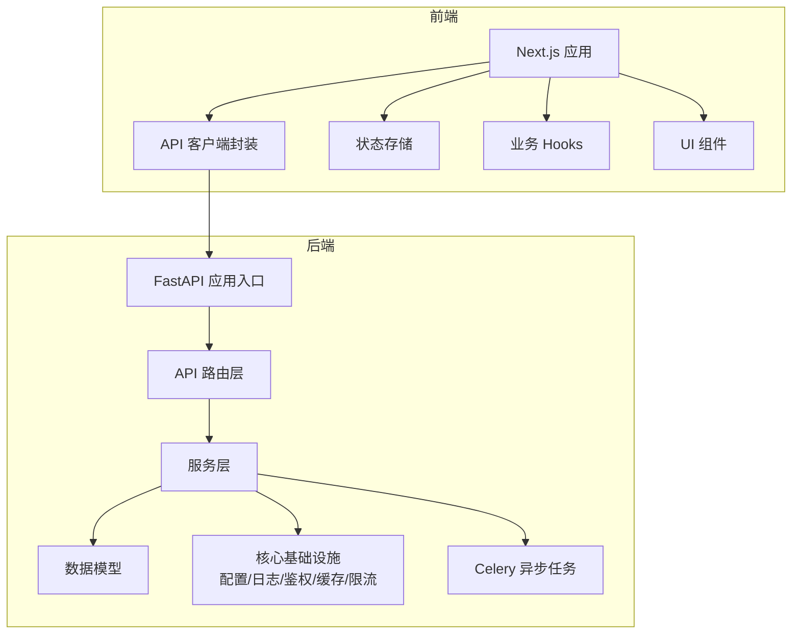
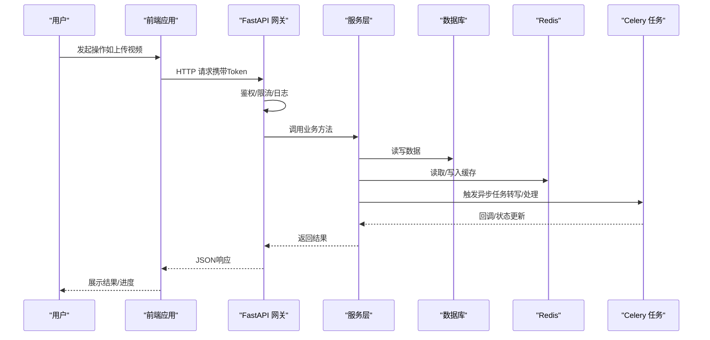
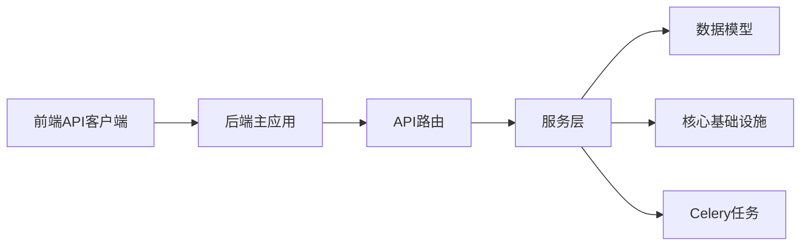

# 开发规范

<cite>
**本文档引用的文件**
- [.pre-commit-config.yaml](file://.pre-commit-config.yaml)
- [backend/pyproject.toml](file://backend/pyproject.toml)
- [backend/requirements.txt](file://backend/requirements.txt)
- [backend/app/main.py](file://backend/app/main.py)
- [backend/app/core/config.py](file://backend/app/core/config.py)
- [backend/app/core/logging.py](file://backend/app/core/logging.py)
- [backend/app/core/errors.py](file://backend/app/core/errors.py)
- [backend/app/api/v1/auth.py](file://backend/app/api/v1/auth.py)
- [backend/app/services/video_service.py](file://backend/app/services/video_service.py)
- [backend/app/tasks/celery_app.py](file://backend/app/tasks/celery_app.py)
- [frontend/package.json](file://frontend/package.json)
- [frontend/.prettierrc](file://frontend/.prettierrc)
- [frontend/eslint.config.mjs](file://frontend/eslint.config.mjs)
- [frontend/src/lib/api.ts](file://frontend/src/lib/api.ts)
- [frontend/src/lib/errors.ts](file://frontend/src/lib/errors.ts)
- [frontend/src/stores/authStore.ts](file://frontend/src/stores/authStore.ts)
- [frontend/src/hooks/useSpeakingRecorder.ts](file://frontend/src/hooks/useSpeakingRecorder.ts)
- [.github/workflows/ci.yml](file://.github/workflows/ci.yml)
- [CONTRIBUTING.md](file://CONTRIBUTING.md)
- [README.md](file://README.md)
</cite>

## 目录
1. [简介](#简介)
2. [项目结构](#项目结构)
3. [核心组件](#核心组件)
4. [架构总览](#架构总览)
5. [详细组件分析](#详细组件分析)
6. [依赖分析](#依赖分析)
7. [性能考虑](#性能考虑)
8. [故障排查指南](#故障排查指南)
9. [结论](#结论)
10. [附录](#附录)

## 简介
本规范面向Speaking平台的后端（Python/FastAPI）与前端（TypeScript/Next.js）团队，统一代码风格、命名约定、注释规范、Git工作流、预提交钩子、项目结构与模块组织、依赖管理、API设计原则、错误处理与日志记录、性能优化、并发最佳实践、文档编写与维护流程，以及安全编码与漏洞扫描策略。目标是降低协作成本、提升质量与可维护性，确保前后端一致性与可观测性。

## 项目结构
- 后端采用分层架构：API路由层、服务层、模型层、核心基础设施（配置、数据库、缓存、鉴权、限流、日志等），异步任务通过Celery执行。
- 前端基于Next.js应用路由与组件化组织，状态管理使用轻量store，API访问集中封装，类型定义与工具函数分离。
- 根级包含CI、预提交钩子、Docker编排、Nginx配置与通用文档。

**图示来源**
- [backend/app/main.py](file://backend/app/main.py)
- [backend/app/api/v1/auth.py](file://backend/app/api/v1/auth.py)
- [backend/app/services/video_service.py](file://backend/app/services/video_service.py)
- [backend/app/tasks/celery_app.py](file://backend/app/tasks/celery_app.py)
- [frontend/src/lib/api.ts](file://frontend/src/lib/api.ts)
- [frontend/src/stores/authStore.ts](file://frontend/src/stores/authStore.ts)
- [frontend/src/hooks/useSpeakingRecorder.ts](file://frontend/src/hooks/useSpeakingRecorder.ts)

**章节来源**
- [README.md](file://README.md)
- [CONTRIBUTING.md](file://CONTRIBUTING.md)

## 核心组件
- 后端核心
  - 应用入口与路由注册：统一挂载API版本前缀、中间件、异常映射、CORS与安全头。
  - 配置中心：环境变量加载、默认值、校验与敏感信息隔离。
  - 日志系统：结构化日志、分级输出、请求追踪ID。
  - 错误体系：统一错误码、HTTP状态码映射、用户友好提示。
  - 鉴权与限流：JWT签发与校验、黑名单、速率限制。
  - 缓存与Redis：热点数据缓存、分布式锁、会话存储。
  - 数据库：ORM模型、迁移脚本、连接池与事务管理。
  - 异步任务：Celery任务队列、重试与幂等、结果持久化。
- 前端核心
  - API客户端：统一请求拦截、错误处理、重试与取消、Token刷新。
  - 状态管理：认证状态、用户偏好、播放与录制状态。
  - 业务Hooks：语音录制、视频状态轮询、分页与搜索。
  - UI组件：原子化组件、主题与无障碍支持。

**章节来源**
- [backend/app/main.py](file://backend/app/main.py)
- [backend/app/core/config.py](file://backend/app/core/config.py)
- [backend/app/core/logging.py](file://backend/app/core/logging.py)
- [backend/app/core/errors.py](file://backend/app/core/errors.py)
- [backend/app/api/v1/auth.py](file://backend/app/api/v1/auth.py)
- [backend/app/services/video_service.py](file://backend/app/services/video_service.py)
- [backend/app/tasks/celery_app.py](file://backend/app/tasks/celery_app.py)
- [frontend/src/lib/api.ts](file://frontend/src/lib/api.ts)
- [frontend/src/stores/authStore.ts](file://frontend/src/stores/authStore.ts)
- [frontend/src/hooks/useSpeakingRecorder.ts](file://frontend/src/hooks/useSpeakingRecorder.ts)

## 架构总览
整体采用前后端分离架构，前端通过RESTful API与后端交互；后端以FastAPI提供接口，服务层封装业务逻辑，模型层负责数据持久化，Celery承担耗时任务；Redis用于缓存与会话，数据库为关系型存储。

**图示来源**
- [backend/app/api/v1/auth.py](file://backend/app/api/v1/auth.py)
- [backend/app/services/video_service.py](file://backend/app/services/video_service.py)
- [backend/app/tasks/celery_app.py](file://backend/app/tasks/celery_app.py)
- [frontend/src/lib/api.ts](file://frontend/src/lib/api.ts)

## 详细组件分析

### 代码风格与命名约定（Python）
- 格式化与检查
  - 使用统一格式化工具与静态检查，确保PEP8风格与类型注解一致性。
  - 在预提交阶段自动运行检查与修复，失败则阻止提交。
- 命名约定
  - 模块与包：全小写下划线分隔；类名大驼峰；函数与变量小驼峰或下划线；常量全大写。
  - 路径与URL：kebab-case；查询参数snake_case；JSON字段camelCase。
- 注释与文档字符串
  - 公共API与服务方法需包含描述、参数、返回值与异常说明；复杂算法附流程图或复杂度说明。
  - 避免无意义注释，保持与代码同步更新。

**章节来源**
- [.pre-commit-config.yaml](file://.pre-commit-config.yaml)
- [backend/pyproject.toml](file://backend/pyproject.toml)

### 代码风格与命名约定（TypeScript/Next.js）
- 格式化与检查
  - Prettier统一代码格式；ESLint进行语法与风格检查；在预提交与CI中强制执行。
- 命名约定
  - 组件与Hook：大驼峰；文件命名与组件同名；类型与接口大驼峰；枚举全大写。
  - 常量与配置：全大写；路径与路由：kebab-case；事件与回调：onXxx/doXxx。
- 注释与文档
  - 组件Props与Hook返回值需JSDoc说明；复杂逻辑添加行内注释；对外暴露的API需独立文档。

**章节来源**
- [frontend/.prettierrc](file://frontend/.prettierrc)
- [frontend/eslint.config.mjs](file://frontend/eslint.config.mjs)
- [frontend/package.json](file://frontend/package.json)

### Git工作流与分支策略
- 分支模型
  - main：稳定发布分支；develop：集成分支；feature/*：功能分支；hotfix/*：紧急修复；release/*：发布准备。
- 提交规范
  - 采用约定式提交（Conventional Commits）：feat/fix/docs/style/refactor/perf/test/build/ci/chore/revert等前缀；附带影响范围与简要描述。
- 代码审查
  - 所有变更需PR并至少一名Reviewer批准；CI必须通过；涉及破坏性变更需ADR记录。
- 合并策略
  - develop合并至main需打标签与发布说明；hotfix直接合并至main并回推develop。

**章节来源**
- [CONTRIBUTING.md](file://CONTRIBUTING.md)
- [.github/workflows/ci.yml](file://.github/workflows/ci.yml)

### 预提交钩子配置
- 检查项
  - Python：格式化、类型检查、导入排序、安全扫描；TypeScript：格式化、ESLint、类型检查。
  - 安全扫描：依赖漏洞检测、密钥泄露扫描、SQL注入与XSS风险检查。
- 行为
  - 失败时中止提交；支持跳过特定检查（仅临时调试）；CI二次校验保证一致性。

**章节来源**
- [.pre-commit-config.yaml](file://.pre-commit-config.yaml)

### 项目结构与模块组织原则
- 后端
  - app/api：按领域划分v1路由；dependencies共享依赖解析；core提供通用能力；services按业务域拆分；models对应表结构；tasks异步任务；schemas输入输出校验。
- 前端
  - src/app：页面与布局；components：原子与复合组件；hooks：复用逻辑；lib：工具与API封装；stores：状态；types：类型定义。
- 原则
  - 高内聚低耦合；单一职责；依赖倒置；配置外置；可测试性优先。

**章节来源**
- [backend/app/main.py](file://backend/app/main.py)
- [backend/app/api/v1/auth.py](file://backend/app/api/v1/auth.py)
- [backend/app/services/video_service.py](file://backend/app/services/video_service.py)
- [frontend/src/lib/api.ts](file://frontend/src/lib/api.ts)
- [frontend/src/stores/authStore.ts](file://frontend/src/stores/authStore.ts)

### 依赖管理策略
- 后端
  - 使用pyproject.toml声明依赖与构建配置；requirements.txt用于环境安装；锁定版本与哈希校验；定期扫描漏洞并升级。
- 前端
  - package.json管理依赖与脚本；锁定package-lock.json；使用安全审计与自动更新策略；区分开发与生产依赖。
- 策略
  - 最小权限与最小依赖；语义化版本；依赖树可视化；供应链安全扫描。

**章节来源**
- [backend/pyproject.toml](file://backend/pyproject.toml)
- [backend/requirements.txt](file://backend/requirements.txt)
- [frontend/package.json](file://frontend/package.json)

### API设计原则
- RESTful与版本化：资源名词复数、动词动作、HTTP语义、v1前缀；向后兼容。
- 请求与响应：统一数据结构、分页、过滤、排序；错误码标准化；字段命名camelCase。
- 鉴权与限流：Bearer Token、角色权限、IP与频率限制；敏感接口二次验证。
- 幂等与事务：写操作幂等键；关键事务原子性；补偿机制。
- 文档与契约：OpenAPI/Swagger自动生成；前端类型生成；变更需评审与回归测试。

**章节来源**
- [backend/app/api/v1/auth.py](file://backend/app/api/v1/auth.py)
- [frontend/src/lib/api.ts](file://frontend/src/lib/api.ts)

### 错误处理标准
- 后端
  - 统一异常基类与HTTP状态映射；业务异常携带错误码与消息；日志记录上下文；用户可见错误脱敏。
- 前端
  - 全局错误拦截；网络超时与重试；用户提示与降级；错误上报与分析。
- 规范
  - 错误码分层（系统/业务/第三方）；不可恢复错误快速失败；可重试错误指数退避。

**章节来源**
- [backend/app/core/errors.py](file://backend/app/core/errors.py)
- [frontend/src/lib/errors.ts](file://frontend/src/lib/errors.ts)

### 日志记录规范
- 后端
  - 结构化JSON日志；请求ID贯穿链路；分级输出（DEBUG/INFO/WARN/ERROR）；敏感信息脱敏；采样与滚动策略。
- 前端
  - 用户行为与性能指标上报；错误堆栈与上下文；隐私合规与开关控制。
- 规范
  - 固定字段（时间、级别、模块、请求ID、用户ID）；避免重复日志；告警阈值与聚合。

**章节来源**
- [backend/app/core/logging.py](file://backend/app/core/logging.py)

### 性能优化指南
- 后端
  - 数据库索引与查询优化；缓存热点数据；连接池与批量操作；异步I/O与任务队列；内存占用监控。
- 前端
  - 组件懒加载与代码分割；图片与媒体优化；虚拟列表与增量渲染；请求去重与缓存。
- 规范
  - 基准测试与压测；慢查询与慢请求定位；容量规划与弹性伸缩。

[本节为通用指导，不直接分析具体文件]

### 内存泄漏预防
- 后端
  - 避免循环引用；及时释放大对象；监听进程内存峰值；长连接与文件句柄管理。
- 前端
  - 清理定时器与事件监听；组件卸载释放资源；避免闭包持有大对象；图片与音频释放。
- 工具
  - 内存快照与火焰图；GC调优；泄漏检测与回归测试。

[本节为通用指导，不直接分析具体文件]

### 并发编程最佳实践
- 后端
  - 使用异步框架特性；避免阻塞I/O；合理设置线程/进程池；分布式锁与幂等；任务优先级与死信队列。
- 前端
  - Web Worker处理重计算；AbortController取消请求；防抖与节流；状态竞态保护。
- 规范
  - 并发边界清晰；可观测性（指标与日志）；压力测试与稳定性验证。

[本节为通用指导，不直接分析具体文件]

### 文档编写规范与API文档维护
- 规范
  - ADR记录架构决策；CHANGELOG记录变更；README与模块文档齐全；示例与FAQ完善。
- API文档
  - OpenAPI自动生成；在线Swagger UI；版本化与兼容性矩阵；前端类型同步生成。
- 流程
  - 变更即文档；PR包含文档更新；自动化校验与发布。

**章节来源**
- [docs/adr/README.md](file://docs/adr/README.md)
- [docs/api/API-REFERENCE.md](file://docs/api/API-REFERENCE.md)

### 安全编码指南与漏洞扫描
- 指南
  - 输入校验与输出编码；SQL注入与XSS防护；CSRF与CORS策略；密码与令牌安全；最小权限原则。
- 扫描
  - 依赖漏洞扫描（SCA）；代码静态扫描（SAST）；容器镜像扫描；密钥泄露检测。
- 策略
  - 定期更新依赖；灰度发布与回滚；安全事件响应与复盘。

**章节来源**
- [.pre-commit-config.yaml](file://.pre-commit-config.yaml)
- [.github/workflows/ci.yml](file://.github/workflows/ci.yml)

## 依赖分析
前后端依赖关系清晰，前端通过API客户端调用后端服务；后端服务依赖核心基础设施与外部服务（数据库、Redis、任务队列）。

**图示来源**
- [frontend/src/lib/api.ts](file://frontend/src/lib/api.ts)
- [backend/app/main.py](file://backend/app/main.py)
- [backend/app/api/v1/auth.py](file://backend/app/api/v1/auth.py)
- [backend/app/services/video_service.py](file://backend/app/services/video_service.py)
- [backend/app/tasks/celery_app.py](file://backend/app/tasks/celery_app.py)

**章节来源**
- [backend/pyproject.toml](file://backend/pyproject.toml)
- [backend/requirements.txt](file://backend/requirements.txt)
- [frontend/package.json](file://frontend/package.json)

## 性能考虑
- 端到端延迟优化：CDN与缓存、压缩与传输优化、服务端批处理与异步化。
- 资源利用率：CPU与内存监控、水平扩展与负载均衡、冷热数据分离。
- 可观测性：APM与链路追踪、指标采集与告警、容量规划与压测。

[本节为通用指导，不直接分析具体文件]

## 故障排查指南
- 常见问题
  - 鉴权失败：检查Token有效期与签名；确认CORS与跨域配置。
  - 任务失败：查看Celery日志与重试策略；确认依赖服务可用性。
  - 前端报错：检查API响应与错误码；确认网络与缓存策略。
- 诊断步骤
  - 收集请求ID与日志；复现环境与数据；逐步缩小范围；修复后回归测试。
- 工具
  - 日志聚合与检索；APM与链路追踪；错误上报与告警。

**章节来源**
- [backend/app/core/logging.py](file://backend/app/core/logging.py)
- [backend/app/core/errors.py](file://backend/app/core/errors.py)
- [frontend/src/lib/errors.ts](file://frontend/src/lib/errors.ts)

## 结论
本规范覆盖代码风格、Git工作流、预提交钩子、项目结构、依赖管理、API设计、错误处理、日志记录、性能优化、并发实践、文档维护与安全策略。遵循规范可显著提升团队协作效率与系统质量，建议结合CI与预提交钩子强制落地，并持续迭代优化。

[本节为总结，不直接分析具体文件]

## 附录
- 术语表：参见仓库术语文档。
- 参考链接：架构与设计文档、运营手册与安全指南。

[本节为补充信息，不直接分析具体文件]
