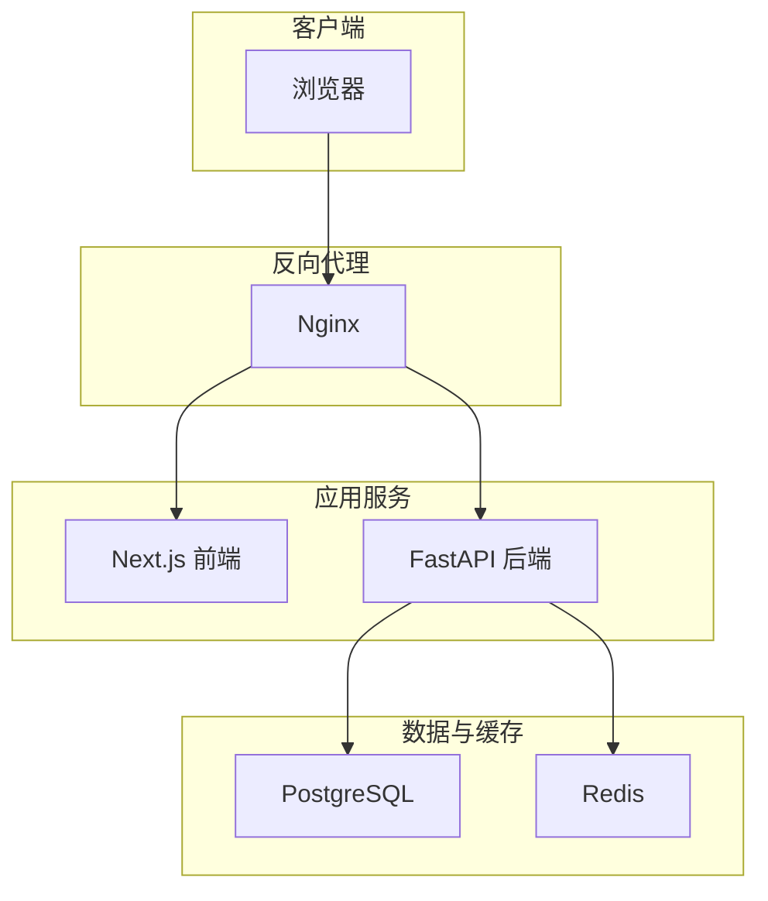
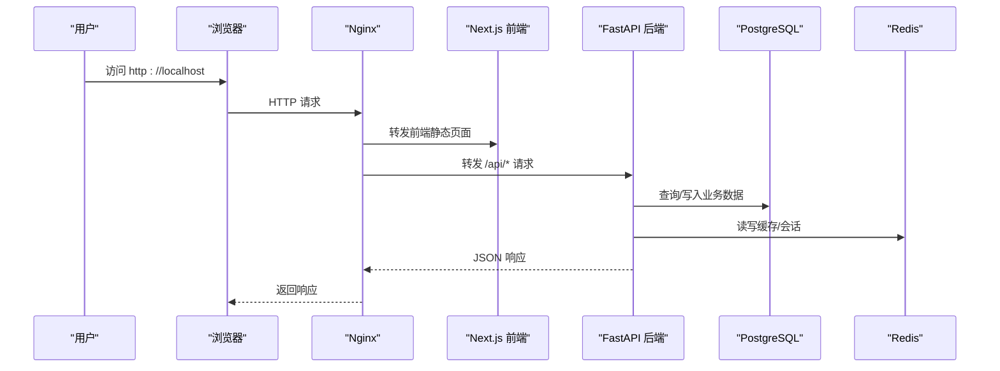
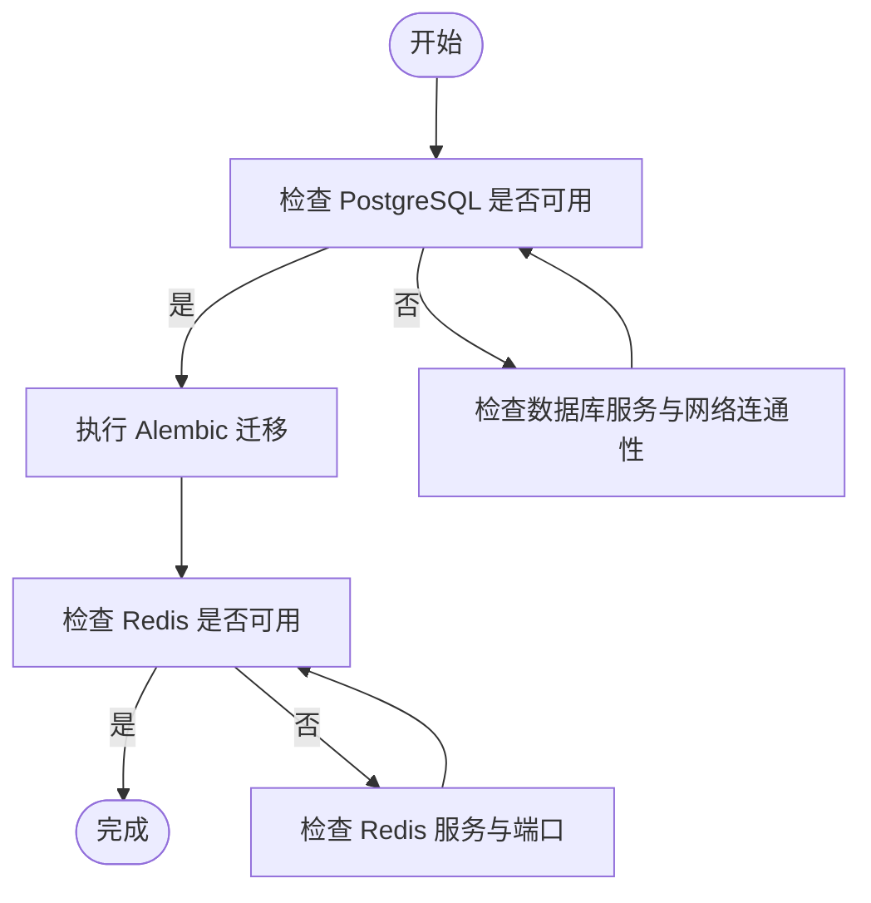
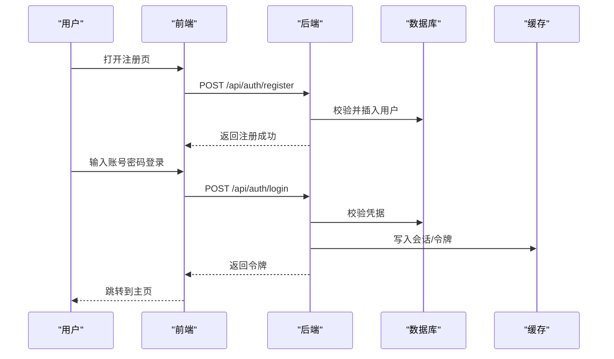
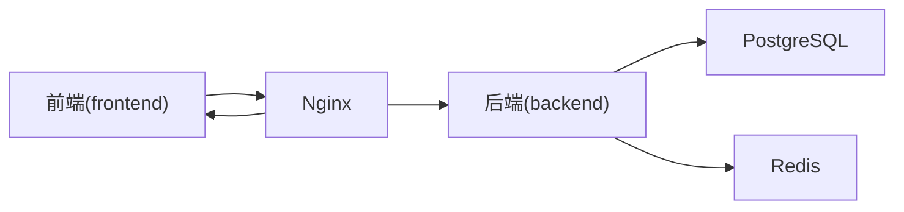

# 快速开始

<cite>
**本文引用的文件**
- [docker-compose.yml](file://docker-compose.yml)
- [docker-compose.dev.yml](file://docker-compose.dev.yml)
- [backend/requirements.txt](file://backend/requirements.txt)
- [backend/pyproject.toml](file://backend/pyproject.toml)
- [backend/app/main.py](file://backend/app/main.py)
- [backend/app/core/config.py](file://backend/app/core/config.py)
- [backend/app/core/database.py](file://backend/app/core/database.py)
- [backend/app/core/redis.py](file://backend/app/core/redis.py)
- [backend/migrations/env.py](file://backend/migrations/env.py)
- [backend/scripts/create_admin.py](file://backend/scripts/create_admin.py)
- [frontend/package.json](file://frontend/package.json)
- [frontend/next.config.js](file://frontend/next.config.js)
- [nginx.conf](file://nginx.conf)
- [README.md](file://README.md)
</cite>

## 目录
1. [简介](#简介)
2. [项目结构](#项目结构)
3. [核心组件](#核心组件)
4. [架构总览](#架构总览)
5. [详细组件分析](#详细组件分析)
6. [依赖分析](#依赖分析)
7. [性能考虑](#性能考虑)
8. [故障排查指南](#故障排查指南)
9. [结论](#结论)
10. [附录](#附录)

## 简介
本快速开始指南面向首次接触 Speaking 平台的开发者与用户，目标是在 30 分钟内完成本地开发环境搭建、数据库初始化、前后端启动，并完成基础 API 测试与用户注册登录流程演示。平台采用 Python（FastAPI）后端、Next.js 前端，使用 PostgreSQL 作为主数据库、Redis 作为缓存与会话存储，支持 Docker Compose 一键部署。

## 项目结构
- 后端：Python/FastAPI，模块化路由、服务层、模型与迁移脚本齐全，提供 RESTful API。
- 前端：Next.js，包含管理后台与用户界面，静态资源由 Nginx 或 Next 自身托管。
- 基础设施：Docker Compose 编排 PostgreSQL、Redis、后端与前端容器；Nginx 反向代理配置。

**图表来源**
- [docker-compose.yml](file://docker-compose.yml)
- [nginx.conf](file://nginx.conf)

**章节来源**
- [README.md](file://README.md)

## 核心组件
- 后端入口与配置：FastAPI 应用入口、环境变量加载、数据库连接、Redis 客户端。
- 数据库与迁移：Alembic 迁移脚本与环境配置。
- 前端构建与运行：Next.js 包管理与构建配置。
- 容器编排：Docker Compose 定义服务、端口映射、环境变量注入。

**章节来源**
- [backend/app/main.py](file://backend/app/main.py)
- [backend/app/core/config.py](file://backend/app/core/config.py)
- [backend/app/core/database.py](file://backend/app/core/database.py)
- [backend/app/core/redis.py](file://backend/app/core/redis.py)
- [backend/migrations/env.py](file://backend/migrations/env.py)
- [frontend/package.json](file://frontend/package.json)
- [frontend/next.config.js](file://frontend/next.config.js)
- [docker-compose.yml](file://docker-compose.yml)

## 架构总览
下图展示了从浏览器到后端服务的请求路径，以及数据库与缓存的交互关系。

**图表来源**
- [nginx.conf](file://nginx.conf)
- [backend/app/main.py](file://backend/app/main.py)
- [backend/app/core/database.py](file://backend/app/core/database.py)
- [backend/app/core/redis.py](file://backend/app/core/redis.py)

## 详细组件分析

### 环境与依赖准备
- Python 环境
  - 建议使用 Python 3.11+，创建虚拟环境后安装后端依赖。
  - 依赖清单参考 requirements 与 pyproject 配置文件。
- Node.js 环境
  - 建议使用 Node.js 18+，进入 frontend 目录安装依赖并构建。
- Docker 与 Docker Compose
  - 用于一键拉起 PostgreSQL、Redis、后端与前端服务。

**章节来源**
- [backend/requirements.txt](file://backend/requirements.txt)
- [backend/pyproject.toml](file://backend/pyproject.toml)
- [frontend/package.json](file://frontend/package.json)
- [docker-compose.yml](file://docker-compose.yml)

### 数据库与缓存初始化
- PostgreSQL
  - 通过 Docker Compose 启动数据库服务，确保环境变量正确设置。
  - 执行 Alembic 迁移以创建表结构与初始数据。
- Redis
  - 通过 Docker Compose 启动缓存服务，后端通过 Redis 客户端连接。

**图表来源**
- [backend/migrations/env.py](file://backend/migrations/env.py)
- [backend/app/core/database.py](file://backend/app/core/database.py)
- [backend/app/core/redis.py](file://backend/app/core/redis.py)

**章节来源**
- [backend/migrations/env.py](file://backend/migrations/env.py)
- [backend/app/core/database.py](file://backend/app/core/database.py)
- [backend/app/core/redis.py](file://backend/app/core/redis.py)

### 环境变量配置说明
- 后端关键变量
  - 数据库连接字符串（PostgreSQL）
  - Redis 连接地址
  - JWT 密钥与安全相关配置
  - 日志级别与调试开关
- 前端关键变量
  - 后端 API 基础地址
  - 站点配置与功能开关

提示：所有变量在 Docker Compose 中集中管理，便于开发与生产切换。

**章节来源**
- [backend/app/core/config.py](file://backend/app/core/config.py)
- [docker-compose.yml](file://docker-compose.yml)
- [docker-compose.dev.yml](file://docker-compose.dev.yml)
- [frontend/next.config.js](file://frontend/next.config.js)

### 启动命令与依赖安装
- 使用 Docker Compose（推荐）
  - 拉取镜像并启动全部服务。
  - 首次启动需等待数据库初始化完成。
- 本地开发模式
  - 后端：激活虚拟环境，安装依赖，启动 FastAPI 服务。
  - 前端：安装依赖，启动开发服务器。
- 反向代理
  - Nginx 将前端静态资源与后端 API 路由分发。

**章节来源**
- [docker-compose.yml](file://docker-compose.yml)
- [docker-compose.dev.yml](file://docker-compose.dev.yml)
- [backend/app/main.py](file://backend/app/main.py)
- [frontend/package.json](file://frontend/package.json)
- [nginx.conf](file://nginx.conf)

### 基本 API 测试示例
- 健康检查
  - 调用后端健康接口验证服务可用性。
- 用户注册
  - 提交用户名与密码等必要字段，获取注册结果。
- 用户登录
  - 提交凭据获取令牌，后续请求携带令牌进行鉴权。

建议通过 curl 或 Postman 进行测试，确保 CORS 与跨域配置正确。

**章节来源**
- [backend/app/api/v1/auth.py](file://backend/app/api/v1/auth.py)
- [backend/app/api/v1/users.py](file://backend/app/api/v1/users.py)

### 用户注册与登录流程演示

**图表来源**
- [backend/app/api/v1/auth.py](file://backend/app/api/v1/auth.py)
- [backend/app/core/redis.py](file://backend/app/core/redis.py)
- [backend/app/core/database.py](file://backend/app/core/database.py)

### 管理后台访问与基础功能验证
- 访问管理后台
  - 通过前端路由进入管理后台，或使用专用入口。
- 创建管理员账户
  - 使用脚本创建管理员，以便登录管理后台。
- 基础功能验证
  - 查看用户列表、视频管理等基础操作。

**章节来源**
- [backend/scripts/create_admin.py](file://backend/scripts/create_admin.py)
- [frontend/src/app/(admin)/admin/page.tsx](file://frontend/src/app/(admin)/admin/page.tsx)

## 依赖分析
- 后端依赖
  - Web 框架、ORM、数据库驱动、Redis 客户端、JWT 库、任务队列等。
- 前端依赖
  - React、Next.js、UI 组件库、状态管理、HTTP 客户端等。
- 容器化依赖
  - 各服务镜像版本、端口映射、卷挂载、环境变量注入。

**图表来源**
- [docker-compose.yml](file://docker-compose.yml)
- [nginx.conf](file://nginx.conf)

**章节来源**
- [backend/requirements.txt](file://backend/requirements.txt)
- [backend/pyproject.toml](file://backend/pyproject.toml)
- [frontend/package.json](file://frontend/package.json)
- [docker-compose.yml](file://docker-compose.yml)

## 性能考虑
- 数据库索引与查询优化：为高频查询字段添加索引，避免全表扫描。
- 缓存策略：热点数据与令牌缓存优先使用 Redis，降低数据库压力。
- 异步任务：长耗时任务（如转写、评分）通过任务队列处理，提升响应速度。
- 前端构建优化：按需加载与代码分割，减少首屏体积。

[本节为通用指导，不直接分析具体文件]

## 故障排查指南
- 数据库无法连接
  - 检查 PostgreSQL 服务是否启动、端口是否开放、连接字符串是否正确。
- Redis 连接失败
  - 确认 Redis 服务状态、网络可达性与认证配置。
- 迁移失败
  - 检查迁移脚本与环境变量，回滚或重新应用迁移。
- 前端无法访问后端
  - 检查 Nginx 配置、CORS 设置与 API 基础地址。
- 权限问题
  - 确认管理员账户已创建，JWT 密钥配置一致。

**章节来源**
- [backend/app/core/database.py](file://backend/app/core/database.py)
- [backend/app/core/redis.py](file://backend/app/core/redis.py)
- [backend/migrations/env.py](file://backend/migrations/env.py)
- [nginx.conf](file://nginx.conf)

## 结论
通过本指南，您可以在 30 分钟内完成 Speaking 平台的本地开发环境搭建、数据库初始化、前后端启动与基础功能验证。推荐使用 Docker Compose 简化部署流程，结合 Nginx 统一入口，提高开发与运维效率。遇到问题时，可依据故障排查指南逐步定位与解决。

[本节为总结性内容，不直接分析具体文件]

## 附录
- 常用命令速查
  - 启动服务：使用 Docker Compose 启动全部服务。
  - 停止服务：停止并清理容器与网络。
  - 查看日志：实时查看后端与数据库日志。
- 扩展阅读
  - 参考 README 与文档目录中的架构与设计文档，深入了解系统设计与最佳实践。

**章节来源**
- [README.md](file://README.md)
