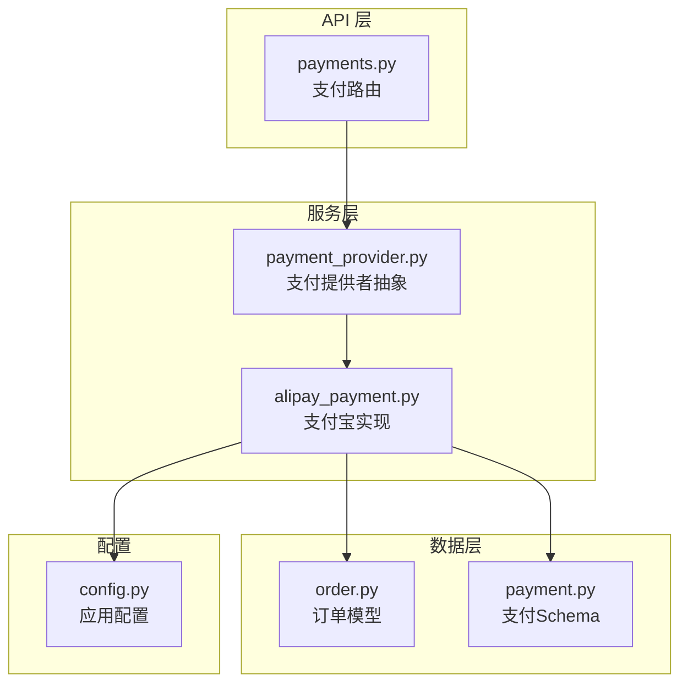
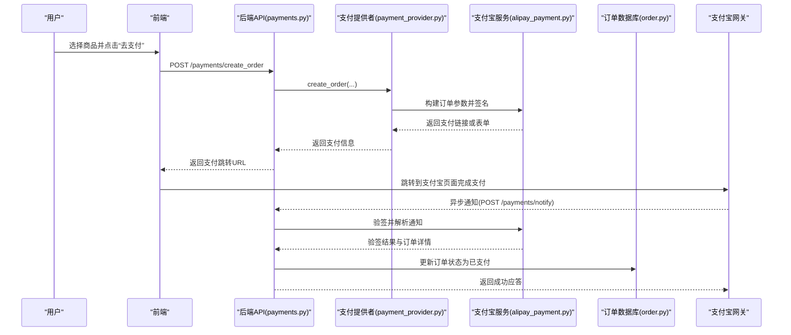
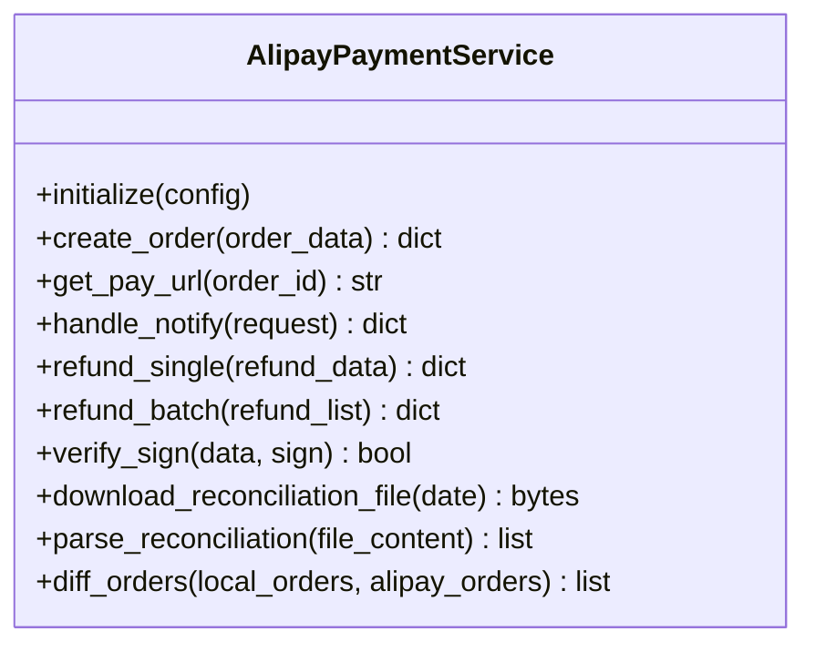
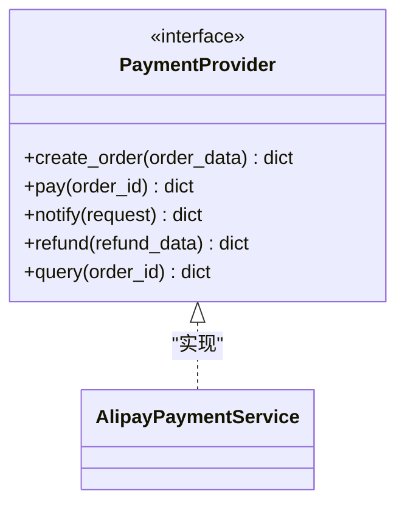
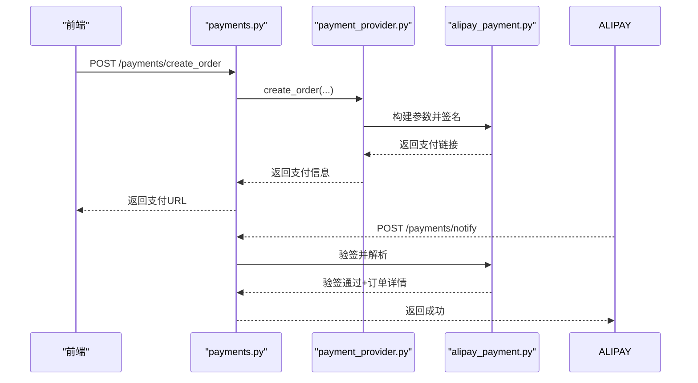
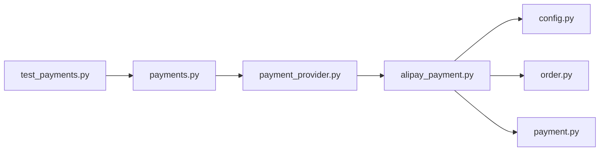
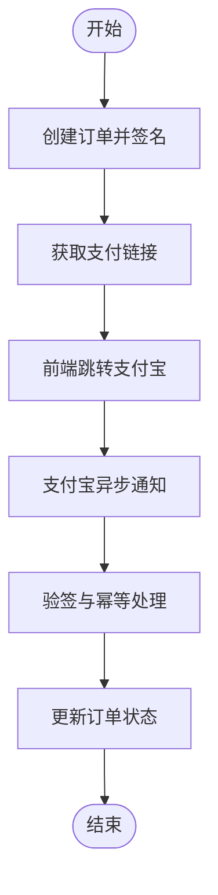
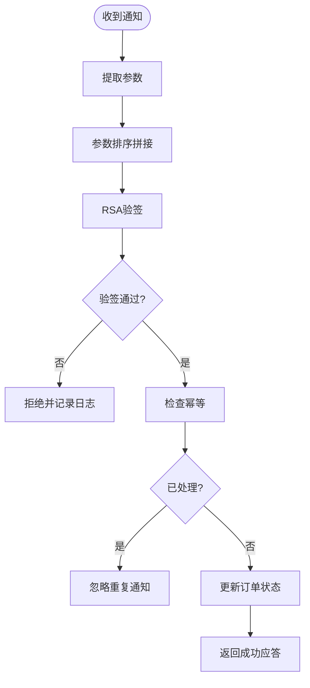
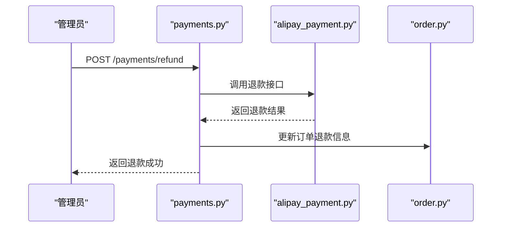
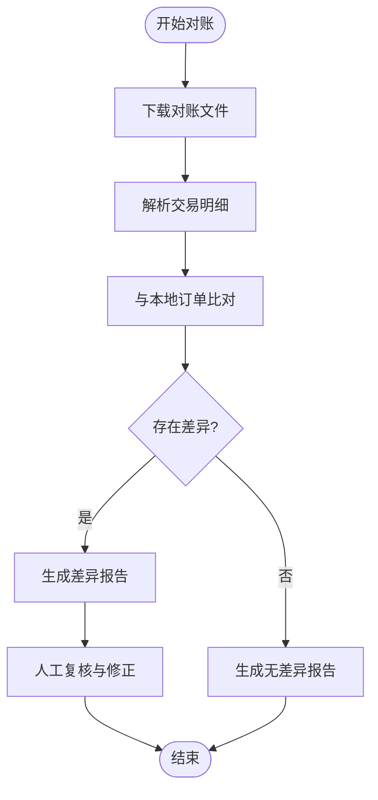

# 支付宝集成

<cite>
**本文档引用的文件**
- [alipay_payment.py](file://backend/app/services/alipay_payment.py)
- [payments.py](file://backend/app/api/v1/payments.py)
- [payment_provider.py](file://backend/app/services/payment_provider.py)
- [config.py](file://backend/app/core/config.py)
- [order.py](file://backend/app/models/order.py)
- [payment.py](file://backend/app/schemas/payment.py)
- [test_payments.py](file://backend/tests/test_payments.py)
</cite>

## 目录
1. [简介](#简介)
2. [项目结构](#项目结构)
3. [核心组件](#核心组件)
4. [架构总览](#架构总览)
5. [详细组件分析](#详细组件分析)
6. [依赖关系分析](#依赖关系分析)
7. [性能考虑](#性能考虑)
8. [故障排查指南](#故障排查指南)
9. [结论](#结论)
10. [附录](#附录)

## 简介
本文件面向需要在系统中接入支付宝支付的开发者，提供从初始化配置、网页支付调用流程、沙箱环境使用、验签与防重放、退款实现到对账解析的完整指南。文档基于当前后端代码中的支付宝服务模块与支付相关接口进行梳理，确保落地可执行且便于维护。

## 项目结构
与支付宝集成相关的核心代码主要位于后端服务的 services 层与 api 层：
- 支付服务实现：services/alipay_payment.py
- 统一支付提供者抽象：services/payment_provider.py
- 支付相关 API：api/v1/payments.py
- 配置中心：core/config.py
- 订单模型：models/order.py
- 支付领域 Schema：schemas/payment.py
- 测试用例：tests/test_payments.py

**图表来源**
- [payments.py](file://backend/app/api/v1/payments.py)
- [payment_provider.py](file://backend/app/services/payment_provider.py)
- [alipay_payment.py](file://backend/app/services/alipay_payment.py)
- [order.py](file://backend/app/models/order.py)
- [payment.py](file://backend/app/schemas/payment.py)
- [config.py](file://backend/app/core/config.py)

**章节来源**
- [payments.py](file://backend/app/api/v1/payments.py)
- [payment_provider.py](file://backend/app/services/payment_provider.py)
- [alipay_payment.py](file://backend/app/services/alipay_payment.py)
- [order.py](file://backend/app/models/order.py)
- [payment.py](file://backend/app/schemas/payment.py)
- [config.py](file://backend/app/core/config.py)

## 核心组件
- 支付提供者抽象（PaymentProvider）：定义统一的支付接口，屏蔽不同支付渠道差异，便于扩展。
- 支付宝支付服务（AlipayPaymentService）：封装支付宝 SDK 的初始化、签名、下单、查询、退款、通知验签等能力。
- 支付 API（/payments）：对外暴露创建订单、发起支付、回调处理、退款等接口。
- 配置（Config）：集中管理应用 ID、私钥、公钥、证书路径、网关地址、异步通知地址等敏感参数。
- 订单模型（Order）：承载订单号、金额、状态、支付流水号、回调信息等。
- 支付 Schema（Payment）：用于请求/响应校验与序列化。

**章节来源**
- [payment_provider.py](file://backend/app/services/payment_provider.py)
- [alipay_payment.py](file://backend/app/services/alipay_payment.py)
- [payments.py](file://backend/app/api/v1/payments.py)
- [config.py](file://backend/app/core/config.py)
- [order.py](file://backend/app/models/order.py)
- [payment.py](file://backend/app/schemas/payment.py)

## 架构总览
下图展示了用户从发起支付到收到支付宝异步通知的端到端流程，以及系统内部各组件的职责分工。

**图表来源**
- [payments.py](file://backend/app/api/v1/payments.py)
- [payment_provider.py](file://backend/app/services/payment_provider.py)
- [alipay_payment.py](file://backend/app/services/alipay_payment.py)
- [order.py](file://backend/app/models/order.py)

## 详细组件分析

### 支付宝支付服务（AlipayPaymentService）
职责：
- 初始化配置：读取应用ID、私钥、公钥、证书路径、网关地址、异步通知地址等。
- 订单创建：组装业务参数（订单号、金额、标题、描述、回调地址等），生成签名，调用支付宝下单接口。
- 支付跳转：返回前端可直接渲染的支付链接或 HTML 表单。
- 异步通知处理：接收支付宝回调，验签、幂等处理、更新订单状态。
- 退款：支持单笔与批量退款，构造退款参数并调用支付宝退款接口。
- 对账：下载对账文件、解析交易明细、与本地订单比对差异并生成报告。

关键实现要点：
- 使用 RSA2 签名算法，严格区分应用私钥与支付宝公钥。
- 所有外部调用需设置超时与重试策略，避免雪崩。
- 通知处理必须做幂等校验，防止重复入账。
- 退款需记录退款单号与原因，支持部分退款场景。
- 对账文件解析需兼容支付宝格式变更，具备容错与告警机制。

**图表来源**
- [alipay_payment.py](file://backend/app/services/alipay_payment.py)

**章节来源**
- [alipay_payment.py](file://backend/app/services/alipay_payment.py)

### 统一支付提供者（PaymentProvider）
职责：
- 定义支付接口契约：create_order、pay、notify、refund、query。
- 根据配置选择具体支付实现（如支付宝、微信支付等）。
- 提供错误映射与标准化响应。

**图表来源**
- [payment_provider.py](file://backend/app/services/payment_provider.py)
- [alipay_payment.py](file://backend/app/services/alipay_payment.py)

**章节来源**
- [payment_provider.py](file://backend/app/services/payment_provider.py)

### 支付 API（/payments）
职责：
- 创建订单：接收前端订单信息，调用支付提供者创建订单并返回支付链接。
- 支付回调：接收支付宝异步通知，调用支付宝服务验签并更新订单状态。
- 退款接口：接收退款申请，调用支付宝服务执行退款。
- 查询接口：根据订单号查询支付状态。

**图表来源**
- [payments.py](file://backend/app/api/v1/payments.py)
- [payment_provider.py](file://backend/app/services/payment_provider.py)
- [alipay_payment.py](file://backend/app/services/alipay_payment.py)

**章节来源**
- [payments.py](file://backend/app/api/v1/payments.py)

### 配置管理（Config）
职责：
- 集中管理支付宝相关配置：应用ID、私钥、公钥、证书路径、网关地址、异步通知地址、日志级别等。
- 支持多环境（开发、测试、生产）配置切换。
- 提供安全加载与校验，缺失或非法配置时快速失败。

建议配置项：
- 应用ID（app_id）
- 应用私钥（app_private_key）
- 支付宝公钥（alipay_public_key）
- 证书路径（cert_path）
- 网关地址（gateway_url）
- 异步通知地址（notify_url）
- 是否启用沙箱（sandbox）

**章节来源**
- [config.py](file://backend/app/core/config.py)

### 订单模型（Order）
字段建议：
- 订单号（order_no）
- 用户ID（user_id）
- 金额（amount）
- 币种（currency）
- 状态（status）
- 支付流水号（transaction_id）
- 支付时间（paid_at）
- 回调信息（notify_data）
- 退款信息（refund_info）

状态机：
- 待支付 -> 支付中 -> 已支付 -> 已退款
- 异常分支：支付失败、超时、取消

**章节来源**
- [order.py](file://backend/app/models/order.py)

### 支付 Schema（Payment）
用途：
- 规范创建订单、支付、退款等接口的输入输出结构。
- 包含必填字段校验、类型转换、默认值设置。

关键字段：
- order_no、amount、currency、subject、body、notify_url、return_url
- refund_amount、refund_reason、batch_refunds

**章节来源**
- [payment.py](file://backend/app/schemas/payment.py)

## 依赖关系分析
- API 层依赖支付提供者抽象，解耦具体支付实现。
- 支付提供者依赖支付宝服务实现，屏蔽 SDK 细节。
- 支付宝服务依赖配置中心获取密钥与网关信息。
- 支付宝服务读写订单模型，保证事务一致性。
- 测试覆盖支付主流程与异常分支。

**图表来源**
- [payments.py](file://backend/app/api/v1/payments.py)
- [payment_provider.py](file://backend/app/services/payment_provider.py)
- [alipay_payment.py](file://backend/app/services/alipay_payment.py)
- [config.py](file://backend/app/core/config.py)
- [order.py](file://backend/app/models/order.py)
- [payment.py](file://backend/app/schemas/payment.py)
- [test_payments.py](file://backend/tests/test_payments.py)

**章节来源**
- [payments.py](file://backend/app/api/v1/payments.py)
- [payment_provider.py](file://backend/app/services/payment_provider.py)
- [alipay_payment.py](file://backend/app/services/alipay_payment.py)
- [config.py](file://backend/app/core/config.py)
- [order.py](file://backend/app/models/order.py)
- [payment.py](file://backend/app/schemas/payment.py)
- [test_payments.py](file://backend/tests/test_payments.py)

## 性能考虑
- 连接池与超时：对支付宝网关请求设置合理的超时与重试次数，避免阻塞线程池。
- 异步化：将耗时操作（如对账文件下载与解析）放入任务队列异步处理。
- 缓存：对不频繁变化的配置与公钥进行内存缓存，减少 I/O。
- 幂等：通知处理与退款接口必须幂等，避免重复处理导致资金风险。
- 限流：对高频接口（如查询）实施限流，保护下游服务。

[本节为通用指导，无需特定文件引用]

## 故障排查指南
常见问题与处理：
- 网络超时：检查网关地址、防火墙策略、DNS 解析；增加重试与退避策略。
- 签名错误：核对应用私钥、支付宝公钥、证书路径与编码格式；打印签名前后报文对比。
- 业务异常：检查订单金额、货币、商品标题是否符合支付宝限制；查看支付宝返回的错误码与描述。
- 通知丢失：确认异步通知地址公网可达；检查服务器日志与负载均衡转发规则。
- 对账差异：定位差异订单，核对本地状态与支付宝流水；必要时人工干预并补录。

**章节来源**
- [test_payments.py](file://backend/tests/test_payments.py)

## 结论
通过统一支付提供者抽象与支付宝服务实现，系统实现了可扩展、可维护的支付集成方案。结合严格的配置管理、验签与幂等机制，能够有效保障资金安全与业务稳定性。后续可继续完善对账自动化与监控告警，提升运营效率与问题定位速度。

[本节为总结性内容，无需特定文件引用]

## 附录

### 支付宝 SDK 初始化配置
- 应用ID：在支付宝开放平台创建应用后获取。
- 私钥：应用私钥用于签名，务必妥善保管。
- 公钥：支付宝公钥用于验签，可从开放平台下载。
- 证书：如需证书模式，配置证书路径。
- 网关地址：生产与沙箱环境不同，注意切换。
- 异步通知地址：必须是公网可访问的 HTTPS 地址。

**章节来源**
- [config.py](file://backend/app/core/config.py)
- [alipay_payment.py](file://backend/app/services/alipay_payment.py)

### 网页支付接口调用流程
- 创建订单：后端生成唯一订单号，组装业务参数并签名。
- 签名生成：使用 RSA2 算法对请求参数排序拼接后签名。
- 支付跳转：返回支付宝支付链接或 HTML 表单供前端渲染。
- 异步通知：支付宝回调至指定地址，后端验签并更新订单状态。

**图表来源**
- [payments.py](file://backend/app/api/v1/payments.py)
- [alipay_payment.py](file://backend/app/services/alipay_payment.py)

**章节来源**
- [payments.py](file://backend/app/api/v1/payments.py)
- [alipay_payment.py](file://backend/app/services/alipay_payment.py)

### 沙箱环境配置与使用
- 在支付宝开放平台切换到沙箱环境，获取沙箱应用ID与密钥。
- 配置沙箱网关地址与异步通知地址（可使用内网穿透工具）。
- 准备沙箱账号：买家与卖家账号，用于模拟支付流程。
- 测试数据：构造不同金额、商品标题、订单号进行测试。

**章节来源**
- [config.py](file://backend/app/core/config.py)
- [alipay_payment.py](file://backend/app/services/alipay_payment.py)

### 验签机制与防重放攻击
- 验签流程：提取通知参数，按规则排序拼接，使用支付宝公钥验证签名。
- 防重放：检查通知中的交易号与商户订单号组合的唯一性；记录已处理的通知。
- 幂等设计：同一订单多次通知只处理一次，避免重复入账。

**图表来源**
- [alipay_payment.py](file://backend/app/services/alipay_payment.py)

**章节来源**
- [alipay_payment.py](file://backend/app/services/alipay_payment.py)

### 退款接口实现
- 单笔退款：传入订单号、退款金额、退款原因，调用支付宝退款接口。
- 批量退款：传入多个退款明细，逐笔提交或批量提交（视支付宝能力）。
- 退款状态：跟踪退款结果，更新订单退款信息与状态。

**图表来源**
- [payments.py](file://backend/app/api/v1/payments.py)
- [alipay_payment.py](file://backend/app/services/alipay_payment.py)
- [order.py](file://backend/app/models/order.py)

**章节来源**
- [payments.py](file://backend/app/api/v1/payments.py)
- [alipay_payment.py](file://backend/app/services/alipay_payment.py)
- [order.py](file://backend/app/models/order.py)

### 对账文件解析与差异处理
- 下载对账文件：按日期从支付宝拉取对账文件。
- 解析明细：提取交易号、订单号、金额、状态等字段。
- 差异比对：与本地订单比对，标记不一致订单。
- 差异处理：自动生成差异报告，支持人工复核与修正。

**图表来源**
- [alipay_payment.py](file://backend/app/services/alipay_payment.py)

**章节来源**
- [alipay_payment.py](file://backend/app/services/alipay_payment.py)
