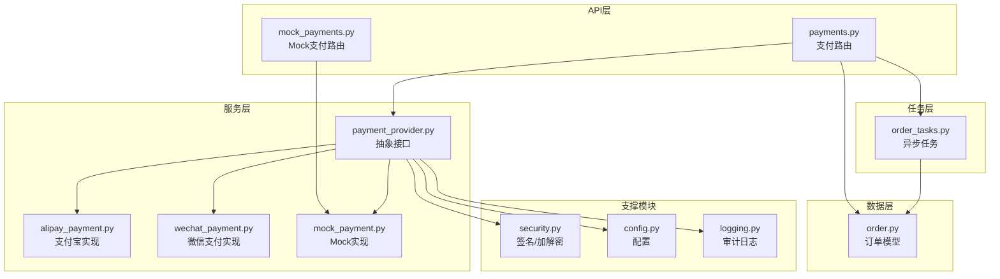
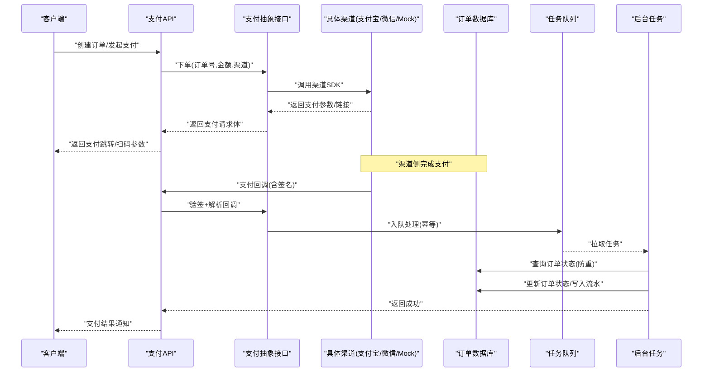
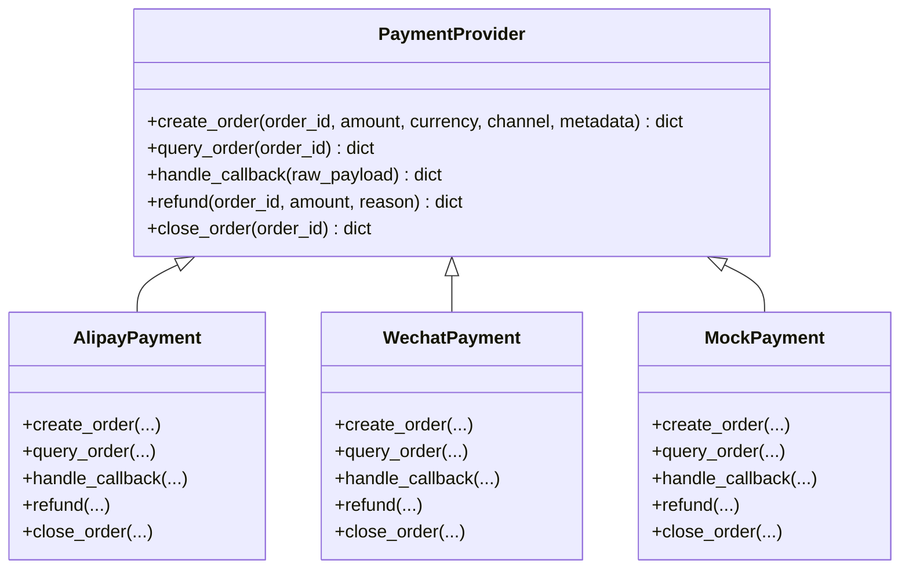
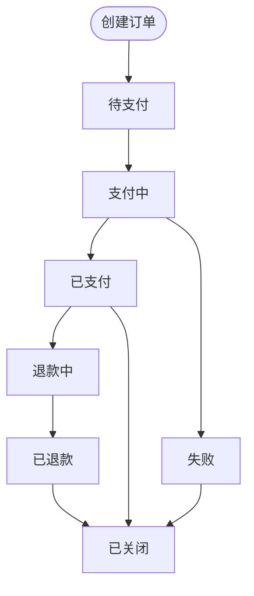
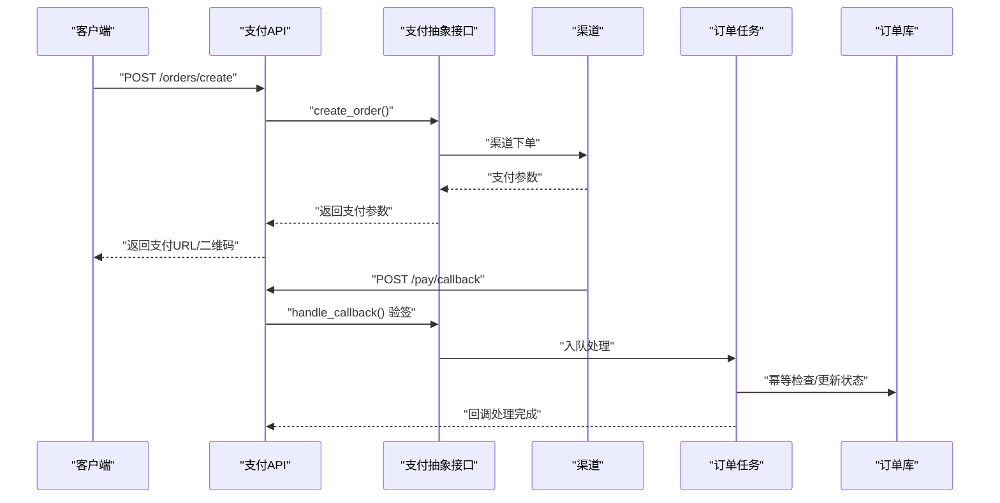
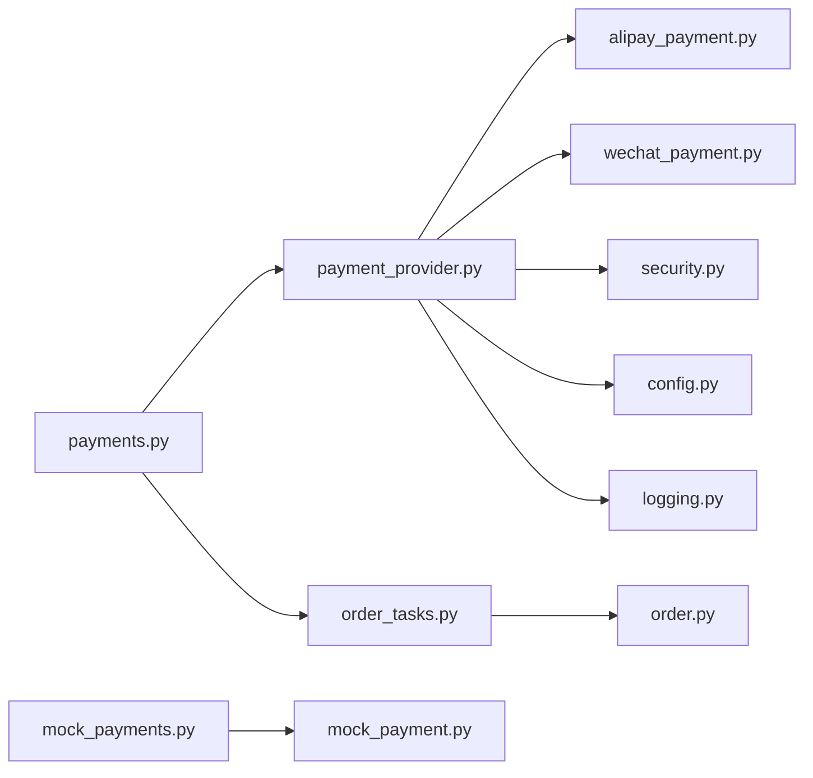

# 支付系统集成

<cite>
**本文引用的文件**
- [backend/app/api/v1/payments.py](file://backend/app/api/v1/payments.py)
- [backend/app/api/v1/mock_payments.py](file://backend/app/api/v1/mock_payments.py)
- [backend/app/services/payment_provider.py](file://backend/app/services/payment_provider.py)
- [backend/app/services/alipay_payment.py](file://backend/app/services/alipay_payment.py)
- [backend/app/services/wechat_payment.py](file://backend/app/services/wechat_payment.py)
- [backend/app/services/mock_payment.py](file://backend/app/services/mock_payment.py)
- [backend/app/schemas/payment.py](file://backend/app/schemas/payment.py)
- [backend/app/models/order.py](file://backend/app/models/order.py)
- [backend/app/tasks/order_tasks.py](file://backend/app/tasks/order_tasks.py)
- [backend/app/core/security.py](file://backend/app/core/security.py)
- [backend/app/core/config.py](file://backend/app/core/config.py)
- [backend/app/core/logging.py](file://backend/app/core/logging.py)
- [backend/tests/test_payments.py](file://backend/tests/test_payments.py)
</cite>

## 目录
1. [简介](#简介)
2. [项目结构](#项目结构)
3. [核心组件](#核心组件)
4. [架构总览](#架构总览)
5. [详细组件分析](#详细组件分析)
6. [依赖关系分析](#依赖关系分析)
7. [性能考量](#性能考量)
8. [故障排查指南](#故障排查指南)
9. [结论](#结论)
10. [附录](#附录)

## 简介
本文件为 Speaking 平台支付系统的完整技术文档，围绕“支付提供商抽象接口”的设计与实现展开，覆盖支付宝、微信支付等主流渠道接入；阐述订单创建、支付回调、状态同步与退款处理的全流程；说明签名验证、防重放攻击、数据加密等安全机制；解释订阅管理（套餐切换、续费提醒、自动扣款）；给出异常处理、重试与补偿策略；提供对账、财务统计与报表生成思路；并包含测试环境配置、沙箱与模拟支付流程，以及合规性与审计日志要求。

## 项目结构
支付相关代码主要分布在后端 API、服务层、模型、任务调度与安全/配置模块中：
- API 层：对外暴露支付下单、查询、回调、退款等接口
- 服务层：统一支付抽象与具体渠道实现（支付宝、微信、Mock）
- 模型层：订单与支付记录的数据结构
- 任务层：异步处理支付结果、对账与通知
- 安全与配置：签名校验、密钥管理、日志与限流

图表来源
- [backend/app/api/v1/payments.py](file://backend/app/api/v1/payments.py)
- [backend/app/api/v1/mock_payments.py](file://backend/app/api/v1/mock_payments.py)
- [backend/app/services/payment_provider.py](file://backend/app/services/payment_provider.py)
- [backend/app/services/alipay_payment.py](file://backend/app/services/alipay_payment.py)
- [backend/app/services/wechat_payment.py](file://backend/app/services/wechat_payment.py)
- [backend/app/services/mock_payment.py](file://backend/app/services/mock_payment.py)
- [backend/app/models/order.py](file://backend/app/models/order.py)
- [backend/app/tasks/order_tasks.py](file://backend/app/tasks/order_tasks.py)
- [backend/app/core/security.py](file://backend/app/core/security.py)
- [backend/app/core/config.py](file://backend/app/core/config.py)
- [backend/app/core/logging.py](file://backend/app/core/logging.py)

章节来源
- [backend/app/api/v1/payments.py](file://backend/app/api/v1/payments.py)
- [backend/app/api/v1/mock_payments.py](file://backend/app/api/v1/mock_payments.py)
- [backend/app/services/payment_provider.py](file://backend/app/services/payment_provider.py)
- [backend/app/services/alipay_payment.py](file://backend/app/services/alipay_payment.py)
- [backend/app/services/wechat_payment.py](file://backend/app/services/wechat_payment.py)
- [backend/app/services/mock_payment.py](file://backend/app/services/mock_payment.py)
- [backend/app/models/order.py](file://backend/app/models/order.py)
- [backend/app/tasks/order_tasks.py](file://backend/app/tasks/order_tasks.py)
- [backend/app/core/security.py](file://backend/app/core/security.py)
- [backend/app/core/config.py](file://backend/app/core/config.py)
- [backend/app/core/logging.py](file://backend/app/core/logging.py)

## 核心组件
- 支付抽象接口：定义统一的下单、查询、回调验签、退款、关闭等能力，屏蔽多渠道差异
- 渠道实现：支付宝、微信支付、Mock 三种实现，遵循同一接口契约
- 订单模型：订单号、金额、币种、状态机、支付渠道、扩展字段、时间戳等
- 任务系统：异步处理回调落库、状态同步、对账与通知
- 安全与配置：签名算法、证书/密钥、时间戳/随机串、防重放、敏感信息加密
- 测试与沙箱：Mock 支付与单元测试覆盖关键路径

章节来源
- [backend/app/services/payment_provider.py](file://backend/app/services/payment_provider.py)
- [backend/app/services/alipay_payment.py](file://backend/app/services/alipay_payment.py)
- [backend/app/services/wechat_payment.py](file://backend/app/services/wechat_payment.py)
- [backend/app/services/mock_payment.py](file://backend/app/services/mock_payment.py)
- [backend/app/models/order.py](file://backend/app/models/order.py)
- [backend/app/tasks/order_tasks.py](file://backend/app/tasks/order_tasks.py)
- [backend/app/core/security.py](file://backend/app/core/security.py)
- [backend/app/core/config.py](file://backend/app/core/config.py)

## 架构总览
支付系统采用“接口抽象 + 多实现”的分层架构，API 层仅面向抽象接口调用，具体渠道由工厂或配置注入。回调入口统一验签后进入任务队列进行幂等落库与业务状态更新。

图表来源
- [backend/app/api/v1/payments.py](file://backend/app/api/v1/payments.py)
- [backend/app/services/payment_provider.py](file://backend/app/services/payment_provider.py)
- [backend/app/services/alipay_payment.py](file://backend/app/services/alipay_payment.py)
- [backend/app/services/wechat_payment.py](file://backend/app/services/wechat_payment.py)
- [backend/app/services/mock_payment.py](file://backend/app/services/mock_payment.py)
- [backend/app/tasks/order_tasks.py](file://backend/app/tasks/order_tasks.py)
- [backend/app/models/order.py](file://backend/app/models/order.py)

## 详细组件分析

### 支付抽象接口与实现
- 抽象接口：定义统一方法，如创建支付、查询订单、处理回调、退款、关闭订单等
- 支付宝实现：对接支付宝 SDK，处理签名、证书、交易号、异步通知
- 微信支付实现：对接微信 SDK，处理签名、证书、交易号、异步通知
- Mock 实现：用于测试与沙箱，直接构造成功/失败场景

图表来源
- [backend/app/services/payment_provider.py](file://backend/app/services/payment_provider.py)
- [backend/app/services/alipay_payment.py](file://backend/app/services/alipay_payment.py)
- [backend/app/services/wechat_payment.py](file://backend/app/services/wechat_payment.py)
- [backend/app/services/mock_payment.py](file://backend/app/services/mock_payment.py)

章节来源
- [backend/app/services/payment_provider.py](file://backend/app/services/payment_provider.py)
- [backend/app/services/alipay_payment.py](file://backend/app/services/alipay_payment.py)
- [backend/app/services/wechat_payment.py](file://backend/app/services/wechat_payment.py)
- [backend/app/services/mock_payment.py](file://backend/app/services/mock_payment.py)

### 订单模型与状态机
- 关键字段：订单号、用户ID、金额、币种、渠道、状态、外部交易号、扩展元数据、创建/更新时间
- 状态机：待支付、支付中、已支付、已关闭、已退款、退款中、部分退款、失败
- 幂等性：基于订单号与外部交易号的唯一约束，防止重复入账

图表来源
- [backend/app/models/order.py](file://backend/app/models/order.py)

章节来源
- [backend/app/models/order.py](file://backend/app/models/order.py)

### 支付流程设计
- 订单创建：API 接收下单请求，校验参数，持久化订单，调用支付抽象接口生成支付参数
- 支付回调：渠道异步通知到达，统一验签，解析载荷，入队异步处理
- 状态同步：后台任务查询渠道订单状态，更新本地订单，触发业务权益发放
- 退款处理：发起退款申请，记录退款单，等待渠道确认，更新订单与退款流水

图表来源
- [backend/app/api/v1/payments.py](file://backend/app/api/v1/payments.py)
- [backend/app/services/payment_provider.py](file://backend/app/services/payment_provider.py)
- [backend/app/tasks/order_tasks.py](file://backend/app/tasks/order_tasks.py)
- [backend/app/models/order.py](file://backend/app/models/order.py)

章节来源
- [backend/app/api/v1/payments.py](file://backend/app/api/v1/payments.py)
- [backend/app/services/payment_provider.py](file://backend/app/services/payment_provider.py)
- [backend/app/tasks/order_tasks.py](file://backend/app/tasks/order_tasks.py)
- [backend/app/models/order.py](file://backend/app/models/order.py)

### 安全机制
- 签名验证：所有回调与敏感操作均进行签名校验，支持多种算法（如 HMAC/RSASign）
- 防重放攻击：校验时间戳、随机串、nonce 与签名，拒绝过期或重复请求
- 数据加密：敏感字段（如证书、密钥、用户信息）使用加密存储与传输
- 权限控制：回调接口需鉴权，限制来源 IP，最小权限原则

章节来源
- [backend/app/core/security.py](file://backend/app/core/security.py)
- [backend/app/core/config.py](file://backend/app/core/config.py)

### 订阅管理（套餐切换、续费提醒、自动扣款）
- 套餐切换：通过订单关联订阅计划，切换时生成新订单，按规则结算差价
- 续费提醒：定时任务扫描即将到期订阅，发送站内信/短信/邮件提醒
- 自动扣款：根据渠道能力（如支付宝免密、微信周期扣款）配置自动续费策略

章节来源
- [backend/app/models/order.py](file://backend/app/models/order.py)
- [backend/app/tasks/order_tasks.py](file://backend/app/tasks/order_tasks.py)

### 异常处理、重试与补偿
- 异常分类：网络超时、渠道错误、签名失败、幂等冲突、业务校验失败
- 重试策略：指数退避、最大重试次数、死信队列
- 补偿策略：对账任务发现不一致时自动修复，必要时人工介入

章节来源
- [backend/app/tasks/order_tasks.py](file://backend/app/tasks/order_tasks.py)
- [backend/app/core/logging.py](file://backend/app/core/logging.py)

### 对账、财务统计与报表
- 对账：每日拉取渠道账单，与本地流水比对，标记差异订单
- 统计：按日/周/月汇总收入、退款率、渠道占比、转化率
- 报表：导出 CSV/Excel，支持多维度筛选与可视化

章节来源
- [backend/app/tasks/order_tasks.py](file://backend/app/tasks/order_tasks.py)

### 测试环境与沙箱
- Mock 支付：通过 mock_payments 路由与 MockPayment 服务快速构造成功/失败场景
- 单元测试：覆盖下单、回调、退款、状态同步等关键路径
- 沙箱配置：隔离密钥与域名，确保不影响生产

章节来源
- [backend/app/api/v1/mock_payments.py](file://backend/app/api/v1/mock_payments.py)
- [backend/app/services/mock_payment.py](file://backend/app/services/mock_payment.py)
- [backend/tests/test_payments.py](file://backend/tests/test_payments.py)

## 依赖关系分析
- API 层依赖抽象接口，不感知具体渠道实现
- 服务层依赖安全与配置模块，统一处理签名与密钥
- 任务层依赖数据库与消息队列，保证最终一致性
- 模型层被 API、服务、任务共同引用，保持数据契约一致

图表来源
- [backend/app/api/v1/payments.py](file://backend/app/api/v1/payments.py)
- [backend/app/api/v1/mock_payments.py](file://backend/app/api/v1/mock_payments.py)
- [backend/app/services/payment_provider.py](file://backend/app/services/payment_provider.py)
- [backend/app/services/alipay_payment.py](file://backend/app/services/alipay_payment.py)
- [backend/app/services/wechat_payment.py](file://backend/app/services/wechat_payment.py)
- [backend/app/services/mock_payment.py](file://backend/app/services/mock_payment.py)
- [backend/app/tasks/order_tasks.py](file://backend/app/tasks/order_tasks.py)
- [backend/app/models/order.py](file://backend/app/models/order.py)
- [backend/app/core/security.py](file://backend/app/core/security.py)
- [backend/app/core/config.py](file://backend/app/core/config.py)
- [backend/app/core/logging.py](file://backend/app/core/logging.py)

章节来源
- [backend/app/api/v1/payments.py](file://backend/app/api/v1/payments.py)
- [backend/app/api/v1/mock_payments.py](file://backend/app/api/v1/mock_payments.py)
- [backend/app/services/payment_provider.py](file://backend/app/services/payment_provider.py)
- [backend/app/services/alipay_payment.py](file://backend/app/services/alipay_payment.py)
- [backend/app/services/wechat_payment.py](file://backend/app/services/wechat_payment.py)
- [backend/app/services/mock_payment.py](file://backend/app/services/mock_payment.py)
- [backend/app/tasks/order_tasks.py](file://backend/app/tasks/order_tasks.py)
- [backend/app/models/order.py](file://backend/app/models/order.py)
- [backend/app/core/security.py](file://backend/app/core/security.py)
- [backend/app/core/config.py](file://backend/app/core/config.py)
- [backend/app/core/logging.py](file://backend/app/core/logging.py)

## 性能考量
- 高并发下单：使用连接池与缓存预热，减少数据库压力
- 回调处理：异步化与批量化，避免阻塞主线程
- 幂等与去重：基于唯一索引与分布式锁，降低重复处理
- 对账优化：增量拉取与并行比对，缩短对账窗口

[本节为通用指导，不直接分析具体文件]

## 故障排查指南
- 常见错误：签名失败、订单不存在、金额不一致、渠道超时、重复回调
- 排查步骤：查看审计日志、核对签名参数、检查订单状态机、复现渠道回调
- 恢复策略：重试任务、手动对账修复、回滚订单状态、联系渠道客服

章节来源
- [backend/app/core/logging.py](file://backend/app/core/logging.py)
- [backend/app/tasks/order_tasks.py](file://backend/app/tasks/order_tasks.py)

## 结论
本支付系统以抽象接口为核心，统一接入多渠道支付，结合任务系统与对账机制保障一致性与可观测性。通过严格的安全策略与完善的测试体系，满足生产环境的稳定性与合规要求。后续可进一步扩展更多支付渠道与订阅计费模式，提升平台商业化能力。

[本节为总结性内容，不直接分析具体文件]

## 附录
- 术语表：订单、支付回调、幂等、对账、订阅、自动扣款
- 参考规范：支付宝/微信支付官方文档、签名与证书规范、数据安全法与个人信息保护法

[本节为概念性内容，不直接分析具体文件]
