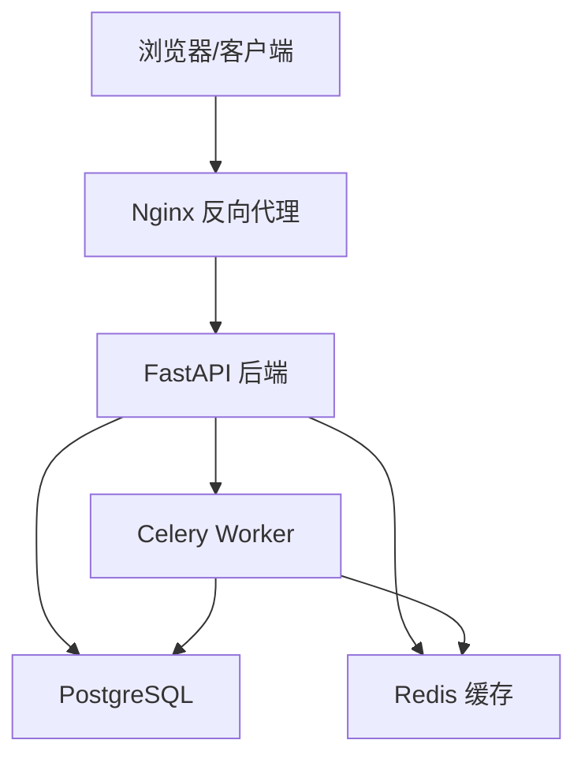
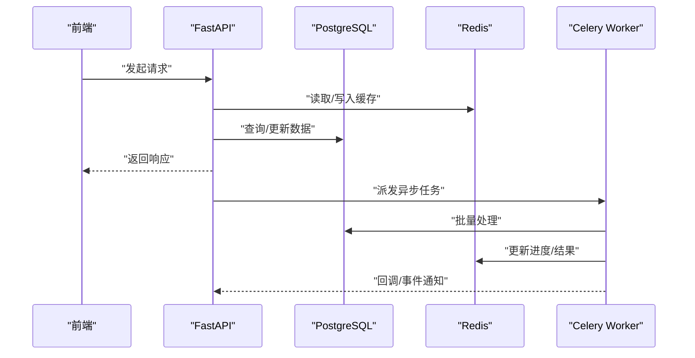
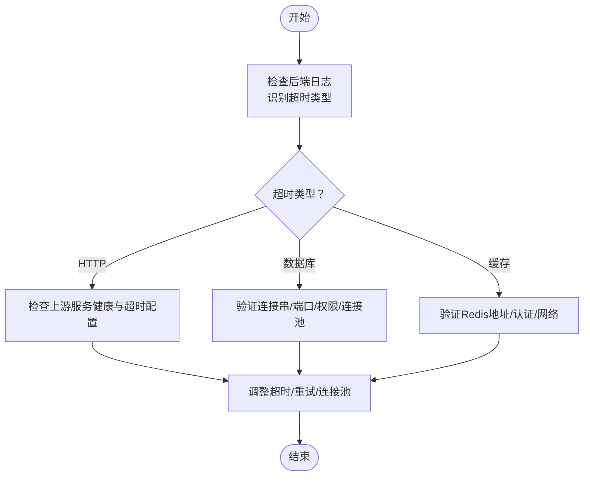
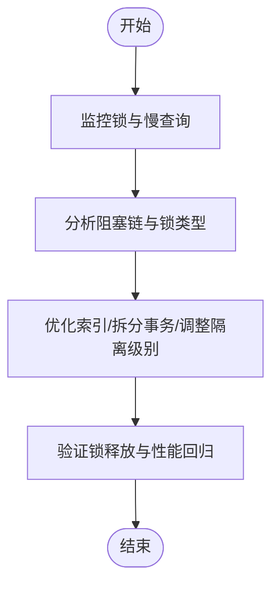
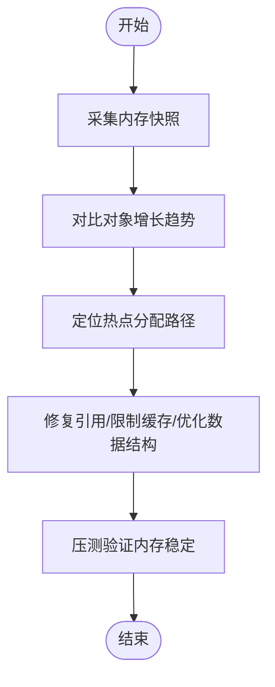
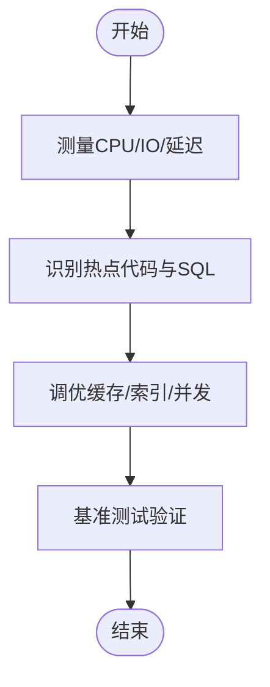
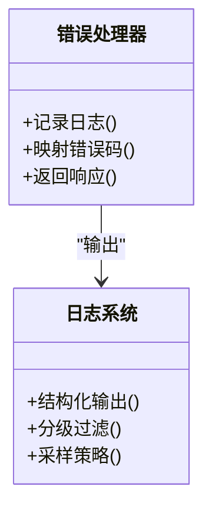
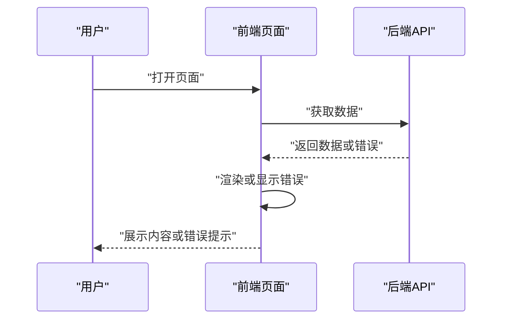
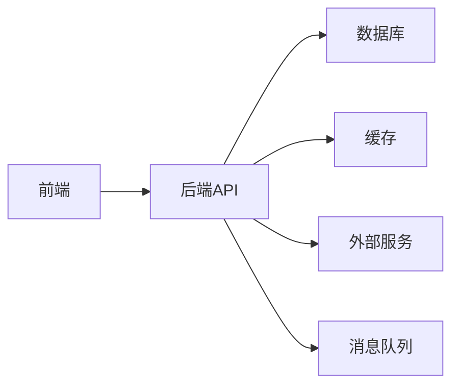

# 常见问题诊断

<cite>
**本文引用的文件**
- [backend/app/main.py](file://backend/app/main.py)
- [backend/app/core/config.py](file://backend/app/core/config.py)
- [backend/app/core/database.py](file://backend/app/core/database.py)
- [backend/app/core/redis.py](file://backend/app/core/redis.py)
- [backend/app/core/errors.py](file://backend/app/core/errors.py)
- [backend/app/core/logging.py](file://backend/app/core/logging.py)
- [backend/app/api/v1/auth.py](file://backend/app/api/v1/auth.py)
- [backend/app/services/video_service.py](file://backend/app/services/video_service.py)
- [backend/app/tasks/celery_app.py](file://backend/app/tasks/celery_app.py)
- [frontend/src/lib/api.ts](file://frontend/src/lib/api.ts)
- [frontend/src/lib/createApiClient.ts](file://frontend/src/lib/createApiClient.ts)
- [frontend/src/app/(main)/error.tsx](file://frontend/src/app/(main)/error.tsx)
- [frontend/src/app/error.tsx](file://frontend/src/app/error.tsx)
- [docker-compose.yml](file://docker-compose.yml)
- [nginx.conf](file://nginx.conf)
</cite>

## 目录
1. [简介](#简介)
2. [项目结构](#项目结构)
3. [核心组件](#核心组件)
4. [架构总览](#架构总览)
5. [详细组件分析](#详细组件分析)
6. [依赖关系分析](#依赖关系分析)
7. [性能注意事项](#性能注意事项)
8. [故障排查指南](#故障排查指南)
9. [结论](#结论)
10. [附录](#附录)

## 简介
本指南面向Speaking平台运维与开发人员，聚焦常见问题的快速定位与解决，包括连接超时、数据库锁死、内存泄漏与性能瓶颈。文档提供错误日志分析技巧（关键错误码识别、堆栈跟踪分析、异常模式匹配）、命令行工具与调试命令（数据库连接检查、Redis状态验证、API响应测试），以及环境配置问题排查（环境变量、依赖版本冲突、端口占用）。同时覆盖前端加载失败、组件渲染错误和网络请求失败的诊断流程。

## 项目结构
- 后端采用FastAPI应用，核心模块包含配置、数据库、缓存、错误处理、限流与安全等；API按功能划分在api/v1下；业务逻辑集中在services；异步任务通过Celery编排；模型与迁移位于models与migrations。
- 前端基于Next.js，API客户端封装在lib中，全局错误页面位于app目录，UI组件与页面按路由组织。
- 部署使用Docker Compose与Nginx反向代理，配置文件位于根目录。

**图表来源**
- [backend/app/main.py](file://backend/app/main.py)
- [backend/app/core/database.py](file://backend/app/core/database.py)
- [backend/app/core/redis.py](file://backend/app/core/redis.py)
- [backend/app/tasks/celery_app.py](file://backend/app/tasks/celery_app.py)
- [nginx.conf](file://nginx.conf)
- [docker-compose.yml](file://docker-compose.yml)

**章节来源**
- [backend/app/main.py](file://backend/app/main.py)
- [backend/app/core/config.py](file://backend/app/core/config.py)
- [backend/app/core/database.py](file://backend/app/core/database.py)
- [backend/app/core/redis.py](file://backend/app/core/redis.py)
- [backend/app/core/errors.py](file://backend/app/core/errors.py)
- [backend/app/core/logging.py](file://backend/app/core/logging.py)
- [backend/app/tasks/celery_app.py](file://backend/app/tasks/celery_app.py)
- [frontend/src/lib/api.ts](file://frontend/src/lib/api.ts)
- [frontend/src/lib/createApiClient.ts](file://frontend/src/lib/createApiClient.ts)
- [frontend/src/app/(main)/error.tsx](file://frontend/src/app/(main)/error.tsx)
- [frontend/src/app/error.tsx](file://frontend/src/app/error.tsx)
- [docker-compose.yml](file://docker-compose.yml)
- [nginx.conf](file://nginx.conf)

## 核心组件
- 配置中心：集中管理环境变量与运行时配置，确保服务启动时正确加载数据库、Redis、第三方服务凭据与开关。
- 数据库层：连接池、事务与ORM集成，负责SQL执行与数据一致性。
- 缓存层：Redis客户端封装，用于热点数据缓存、会话与分布式锁。
- 错误处理：统一异常类型、HTTP错误码映射与结构化日志输出。
- 日志系统：结构化日志、分级输出与采样策略，便于追踪问题。
- API网关：FastAPI路由与中间件，鉴权、限流与请求校验。
- 任务队列：Celery应用与Worker，处理耗时任务（如视频转写、翻译、评分）。

**章节来源**
- [backend/app/core/config.py](file://backend/app/core/config.py)
- [backend/app/core/database.py](file://backend/app/core/database.py)
- [backend/app/core/redis.py](file://backend/app/core/redis.py)
- [backend/app/core/errors.py](file://backend/app/core/errors.py)
- [backend/app/core/logging.py](file://backend/app/core/logging.py)
- [backend/app/main.py](file://backend/app/main.py)
- [backend/app/tasks/celery_app.py](file://backend/app/tasks/celery_app.py)

## 架构总览
后端以FastAPI为核心，暴露REST API；数据库为PostgreSQL，缓存为Redis；异步任务由Celery驱动；前端通过Next.js构建，调用后端API并处理本地状态与错误展示。Nginx作为反向代理与静态资源服务器。

**图表来源**
- [backend/app/main.py](file://backend/app/main.py)
- [backend/app/core/database.py](file://backend/app/core/database.py)
- [backend/app/core/redis.py](file://backend/app/core/redis.py)
- [backend/app/tasks/celery_app.py](file://backend/app/tasks/celery_app.py)

## 详细组件分析

### 连接超时问题诊断
- 症状：API请求长时间无响应或抛出连接超时；数据库操作阻塞；Redis读写失败。
- 可能原因：网络延迟、目标服务不可达、连接池耗尽、防火墙限制、DNS解析失败。
- 定位步骤：
  - 检查后端日志中的超时错误码与堆栈，确认是HTTP、数据库还是缓存超时。
  - 验证数据库连接字符串、端口、用户名密码与权限。
  - 检查Redis地址、认证信息与网络可达性。
  - 查看Nginx上游超时配置与负载均衡设置。
- 解决建议：
  - 调整连接池大小与超时参数，避免池耗尽。
  - 增加重试与退避策略，提升鲁棒性。
  - 优化网络路径，减少跨机房访问。

**图表来源**
- [backend/app/core/errors.py](file://backend/app/core/errors.py)
- [backend/app/core/logging.py](file://backend/app/core/logging.py)
- [backend/app/core/database.py](file://backend/app/core/database.py)
- [backend/app/core/redis.py](file://backend/app/core/redis.py)
- [nginx.conf](file://nginx.conf)

**章节来源**
- [backend/app/core/errors.py](file://backend/app/core/errors.py)
- [backend/app/core/logging.py](file://backend/app/core/logging.py)
- [backend/app/core/database.py](file://backend/app/core/database.py)
- [backend/app/core/redis.py](file://backend/app/core/redis.py)
- [nginx.conf](file://nginx.conf)

### 数据库锁死问题诊断
- 症状：查询长时间等待、事务堆积、死锁报错、写入阻塞。
- 可能原因：长事务未提交、缺少索引导致全表扫描、并发竞争热点行、外键约束冲突。
- 定位步骤：
  - 查看数据库进程列表与锁信息，识别阻塞链。
  - 分析慢查询日志，定位缺失索引或复杂JOIN。
  - 检查事务边界与提交时机，避免持有锁过久。
- 解决建议：
  - 添加合适索引，优化查询计划。
  - 拆分大事务，缩短锁持有时间。
  - 引入读写分离与分片，降低热点竞争。

**图表来源**
- [backend/app/core/database.py](file://backend/app/core/database.py)

**章节来源**
- [backend/app/core/database.py](file://backend/app/core/database.py)

### 内存泄漏问题诊断
- 症状：进程内存持续增长、GC频繁、OOM崩溃、响应变慢。
- 可能原因：未释放的引用、缓存无限增长、大对象累积、循环引用。
- 定位步骤：
  - 使用内存快照工具对比不同时间点对象数量与大小。
  - 分析热点路径是否持续分配大对象。
  - 检查缓存策略是否有过期与上限控制。
- 解决建议：
  - 引入LRU缓存与容量限制。
  - 及时释放临时对象，避免闭包捕获大对象。
  - 定期重启或水平扩容，缓解短期压力。

**章节来源**
- [backend/app/core/config.py](file://backend/app/core/config.py)
- [backend/app/core/redis.py](file://backend/app/core/redis.py)

### 性能瓶颈问题诊断
- 症状：高CPU、I/O等待、数据库慢查询、缓存命中率低。
- 可能原因：算法复杂度、未命中缓存、串行处理、外部服务慢。
- 定位步骤：
  - 启用性能剖析，定位热点函数与SQL。
  - 检查缓存命中率与预热策略。
  - 评估并发度与线程池配置。
- 解决建议：
  - 优化算法与数据结构，减少不必要的计算。
  - 引入多级缓存与CDN加速静态资源。
  - 异步化耗时操作，提升吞吐。

**章节来源**
- [backend/app/core/logging.py](file://backend/app/core/logging.py)
- [backend/app/core/database.py](file://backend/app/core/database.py)
- [backend/app/core/redis.py](file://backend/app/core/redis.py)

### 错误日志分析技巧
- 关键错误码识别：区分HTTP状态码、数据库错误码、缓存错误码与任务失败码。
- 堆栈跟踪分析：关注异常发生位置、调用链与上下文变量。
- 异常模式匹配：归纳常见错误模式，建立告警规则与自动恢复策略。

**图表来源**
- [backend/app/core/errors.py](file://backend/app/core/errors.py)
- [backend/app/core/logging.py](file://backend/app/core/logging.py)

**章节来源**
- [backend/app/core/errors.py](file://backend/app/core/errors.py)
- [backend/app/core/logging.py](file://backend/app/core/logging.py)

### 前端加载失败与组件渲染错误
- 症状：页面空白、白屏、组件不显示、控制台报错。
- 可能原因：资源加载失败、路由配置错误、状态初始化异常、API返回错误。
- 定位步骤：
  - 检查浏览器开发者工具的网络面板与控制台。
  - 查看全局错误页面与错误边界捕获。
  - 验证API客户端配置与鉴权令牌。
- 解决建议：
  - 增加重试与降级策略，提升用户体验。
  - 完善错误边界与用户提示。
  - 优化资源加载顺序与懒加载。

**图表来源**
- [frontend/src/lib/api.ts](file://frontend/src/lib/api.ts)
- [frontend/src/lib/createApiClient.ts](file://frontend/src/lib/createApiClient.ts)
- [frontend/src/app/(main)/error.tsx](file://frontend/src/app/(main)/error.tsx)
- [frontend/src/app/error.tsx](file://frontend/src/app/error.tsx)

**章节来源**
- [frontend/src/lib/api.ts](file://frontend/src/lib/api.ts)
- [frontend/src/lib/createApiClient.ts](file://frontend/src/lib/createApiClient.ts)
- [frontend/src/app/(main)/error.tsx](file://frontend/src/app/(main)/error.tsx)
- [frontend/src/app/error.tsx](file://frontend/src/app/error.tsx)

## 依赖关系分析
- 后端依赖数据库、Redis、第三方服务（如AI、支付）与消息队列。
- 前端依赖后端API、静态资源与第三方库。
- 部署依赖容器编排与反向代理。

**图表来源**
- [backend/app/main.py](file://backend/app/main.py)
- [backend/app/core/database.py](file://backend/app/core/database.py)
- [backend/app/core/redis.py](file://backend/app/core/redis.py)
- [backend/app/tasks/celery_app.py](file://backend/app/tasks/celery_app.py)
- [frontend/src/lib/api.ts](file://frontend/src/lib/api.ts)

**章节来源**
- [backend/app/main.py](file://backend/app/main.py)
- [backend/app/core/database.py](file://backend/app/core/database.py)
- [backend/app/core/redis.py](file://backend/app/core/redis.py)
- [backend/app/tasks/celery_app.py](file://backend/app/tasks/celery_app.py)
- [frontend/src/lib/api.ts](file://frontend/src/lib/api.ts)

## 性能注意事项
- 合理设置连接池大小与超时，避免资源耗尽。
- 使用缓存与CDN减轻后端压力。
- 异步化处理耗时任务，提升并发能力。
- 监控关键指标（QPS、延迟、错误率、资源使用率）。

[本节为通用指导，无需特定文件来源]

## 故障排查指南
- 连接超时：
  - 检查后端日志中的超时错误码与堆栈。
  - 验证数据库与Redis连接串与网络可达性。
  - 调整Nginx上游超时与重试策略。
- 数据库锁死：
  - 查看锁信息与慢查询日志。
  - 优化索引与事务边界。
- 内存泄漏：
  - 采集内存快照，定位热点分配。
  - 限制缓存容量与清理策略。
- 性能瓶颈：
  - 启用性能剖析，优化热点代码与SQL。
  - 引入多级缓存与异步处理。
- 前端问题：
  - 检查网络面板与控制台错误。
  - 验证API客户端配置与鉴权。
- 环境配置：
  - 核对环境变量与依赖版本。
  - 检查端口占用与服务健康。

**章节来源**
- [backend/app/core/errors.py](file://backend/app/core/errors.py)
- [backend/app/core/logging.py](file://backend/app/core/logging.py)
- [backend/app/core/database.py](file://backend/app/core/database.py)
- [backend/app/core/redis.py](file://backend/app/core/redis.py)
- [frontend/src/lib/api.ts](file://frontend/src/lib/api.ts)
- [frontend/src/lib/createApiClient.ts](file://frontend/src/lib/createApiClient.ts)
- [frontend/src/app/(main)/error.tsx](file://frontend/src/app/(main)/error.tsx)
- [frontend/src/app/error.tsx](file://frontend/src/app/error.tsx)
- [docker-compose.yml](file://docker-compose.yml)
- [nginx.conf](file://nginx.conf)

## 结论
通过系统化诊断与标准化流程，可快速定位并解决Speaking平台的常见问题。结合日志分析、性能监控与自动化恢复策略，能显著提升系统稳定性与用户体验。

[本节为总结，无需特定文件来源]

## 附录
- 常用命令：
  - 数据库连接检查：验证连接串与权限。
  - Redis状态验证：检查连通性与键空间。
  - API响应测试：模拟请求与负载测试。
- 环境变量与配置：
  - 核对数据库、Redis、第三方服务配置。
  - 检查依赖版本与端口占用。
- 前端调试：
  - 使用开发者工具与错误边界。
  - 验证API客户端与鉴权流程。

[本节为补充信息，无需特定文件来源]
