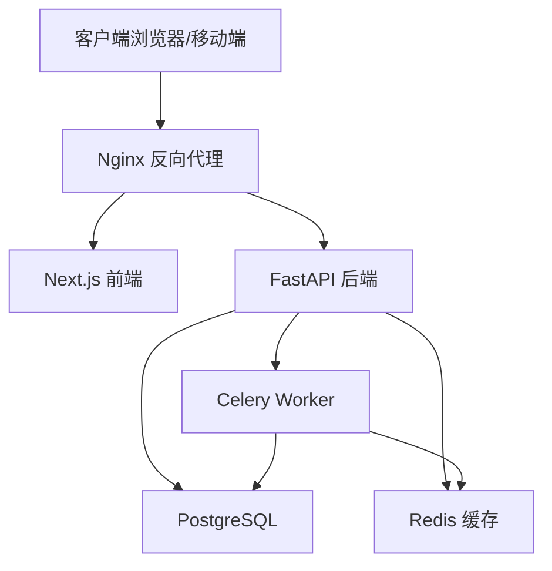
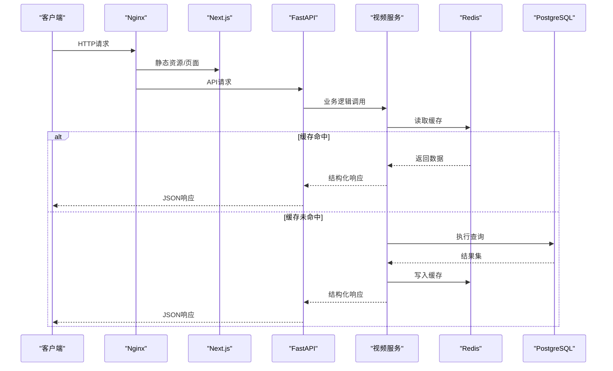
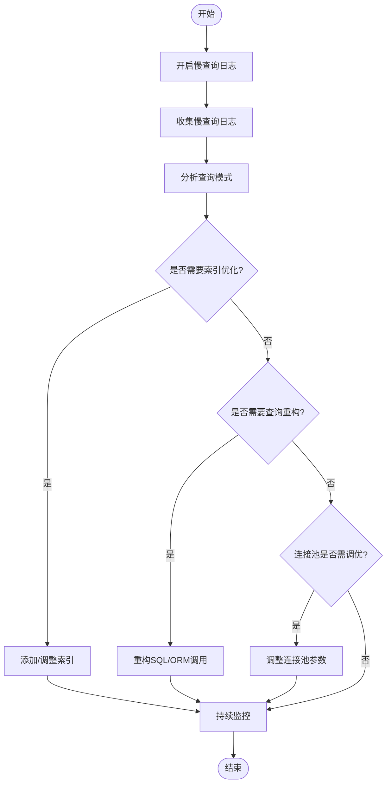
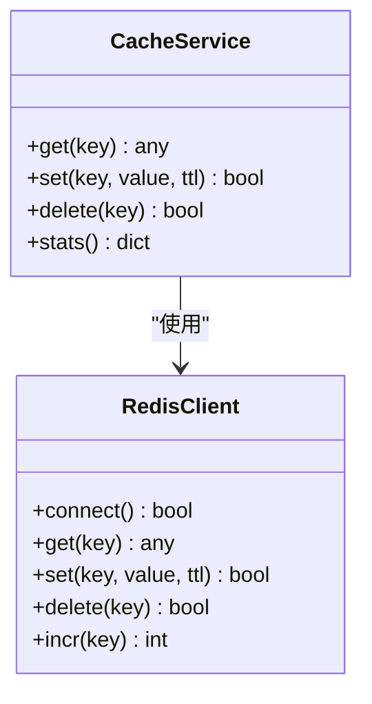
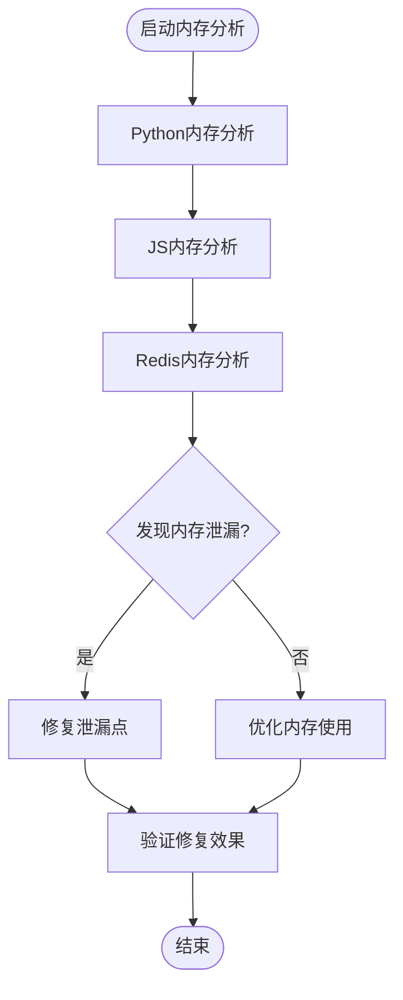
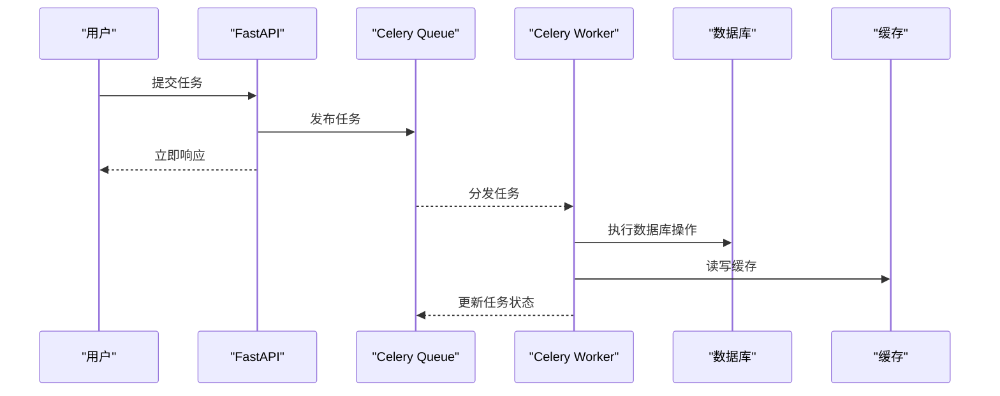
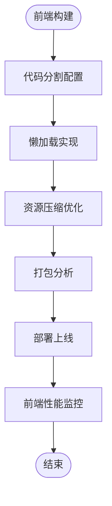
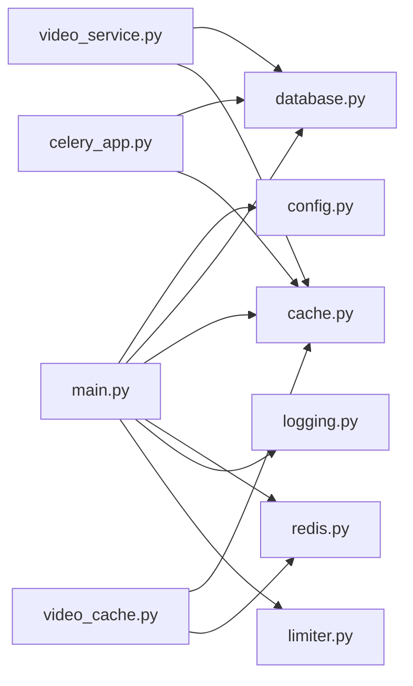

# 性能分析与优化

<cite>
**本文引用的文件**
- [backend/app/main.py](file://backend/app/main.py)
- [backend/app/core/config.py](file://backend/app/core/config.py)
- [backend/app/core/database.py](file://backend/app/core/database.py)
- [backend/app/core/cache.py](file://backend/app/core/cache.py)
- [backend/app/core/redis.py](file://backend/app/core/redis.py)
- [backend/app/core/logging.py](file://backend/app/core/logging.py)
- [backend/app/core/limiter.py](file://backend/app/core/limiter.py)
- [backend/app/tasks/celery_app.py](file://backend/app/tasks/celery_app.py)
- [backend/app/services/video_service.py](file://backend/app/services/video_service.py)
- [backend/app/services/video_cache.py](file://backend/app/services/video_cache.py)
- [backend/app/api/v1/videos.py](file://backend/app/api/v1/videos.py)
- [frontend/next.config.js](file://frontend/next.config.js)
- [frontend/package.json](file://frontend/package.json)
- [nginx.conf](file://nginx.conf)
- [docker-compose.yml](file://docker-compose.yml)
</cite>

## 目录
1. [简介](#简介)
2. [项目结构](#项目结构)
3. [核心组件](#核心组件)
4. [架构总览](#架构总览)
5. [详细组件分析](#详细组件分析)
6. [依赖关系分析](#依赖关系分析)
7. [性能考量](#性能考量)
8. [故障排查指南](#故障排查指南)
9. [结论](#结论)
10. [附录](#附录)

## 简介
本指南面向Speaking平台的后端与前端，提供系统化的性能分析与优化方法。内容覆盖：
- APM工具配置与使用（应用性能监控、数据库慢查询、缓存命中率）
- 慢查询识别与优化（索引、SQL重构、连接池调优）
- 内存使用分析（Python对象泄漏检测、JS垃圾回收、Redis碎片整理）
- 并发处理优化（Celery队列、异步请求、负载均衡）
- 前端性能优化（代码分割、懒加载、资源压缩）
- 基准测试方法与性能回归检测流程

## 项目结构
本项目采用前后端分离架构：
- 后端：FastAPI + SQLAlchemy + Celery + Redis
- 前端：Next.js（SSR/CSR混合）、Nginx反向代理
- 部署：Docker Compose编排，Nginx作为入口

**图示来源**
- [nginx.conf](file://nginx.conf)
- [docker-compose.yml](file://docker-compose.yml)

**章节来源**
- [backend/app/main.py](file://backend/app/main.py)
- [frontend/next.config.js](file://frontend/next.config.js)
- [docker-compose.yml](file://docker-compose.yml)

## 核心组件
- 应用入口与中间件：FastAPI应用初始化、日志、限流、错误处理
- 数据访问层：SQLAlchemy引擎与会话管理、连接池参数
- 缓存层：Redis客户端封装、缓存策略与命中率统计
- 任务队列：Celery应用与Worker配置、重试与超时
- 服务层：视频相关服务与缓存读写
- 前端构建：Next.js构建优化、分包与资源压缩

**章节来源**
- [backend/app/core/config.py](file://backend/app/core/config.py)
- [backend/app/core/database.py](file://backend/app/core/database.py)
- [backend/app/core/cache.py](file://backend/app/core/cache.py)
- [backend/app/core/redis.py](file://backend/app/core/redis.py)
- [backend/app/tasks/celery_app.py](file://backend/app/tasks/celery_app.py)
- [backend/app/services/video_service.py](file://backend/app/services/video_service.py)
- [backend/app/services/video_cache.py](file://backend/app/services/video_cache.py)
- [frontend/next.config.js](file://frontend/next.config.js)

## 架构总览
下图展示关键运行时组件的交互关系与数据流向，便于定位性能瓶颈。

**图示来源**
- [backend/app/api/v1/videos.py](file://backend/app/api/v1/videos.py)
- [backend/app/services/video_service.py](file://backend/app/services/video_service.py)
- [backend/app/services/video_cache.py](file://backend/app/services/video_cache.py)
- [backend/app/core/redis.py](file://backend/app/core/redis.py)
- [backend/app/core/database.py](file://backend/app/core/database.py)

## 详细组件分析

### APM与应用性能监控
- 建议接入APM（如Sentry、OpenTelemetry、Prometheus+Grafana），在以下位置埋点：
  - FastAPI路由层：记录请求耗时、状态码、用户ID
  - 数据库层：记录慢查询、连接池等待时间
  - 缓存层：记录命中率、延迟、键空间分布
  - 任务队列：记录任务时长、失败率、重试次数
- 指标采集与上报：
  - 使用中间件或装饰器统一收集指标
  - 将指标导出到Prometheus，可视化于Grafana
  - 错误追踪通过Sentry集中上报

**章节来源**
- [backend/app/core/logging.py](file://backend/app/core/logging.py)
- [backend/app/core/limiter.py](file://backend/app/core/limiter.py)

### 数据库查询分析与慢查询优化
- 启用慢查询日志：
  - PostgreSQL设置log_min_duration_statement阈值
  - 定期导出慢查询日志进行分析
- 索引优化：
  - 针对高频过滤条件建立复合索引
  - 避免过度索引导致写放大
- 查询语句重构：
  - 减少N+1查询，使用JOIN或批量加载
  - 分页查询使用游标或基于主键的范围查询
- 连接池调优：
  - 调整SQLAlchemy连接池大小、超时与回收策略
  - 监控连接池占用与等待队列长度

**图示来源**
- [backend/app/core/database.py](file://backend/app/core/database.py)

**章节来源**
- [backend/app/core/database.py](file://backend/app/core/database.py)

### 缓存命中率统计与优化
- 缓存策略：
  - 热点数据优先缓存（如视频元数据、推荐列表）
  - 合理设置过期时间与更新策略（写穿/写回）
- 命中率统计：
  - 在缓存读写路径中记录命中/未命中计数
  - 聚合统计并上报至监控系统
- 优化手段：
  - 预热常用缓存键
  - 使用分布式锁避免缓存击穿
  - 分层缓存（本地+Redis）

**图示来源**
- [backend/app/core/cache.py](file://backend/app/core/cache.py)
- [backend/app/core/redis.py](file://backend/app/core/redis.py)

**章节来源**
- [backend/app/core/cache.py](file://backend/app/core/cache.py)
- [backend/app/core/redis.py](file://backend/app/core/redis.py)
- [backend/app/services/video_cache.py](file://backend/app/services/video_cache.py)

### 内存使用分析
- Python对象内存泄漏检测：
  - 使用tracemalloc或memory_profiler跟踪内存分配
  - 定期采样堆快照，分析大对象与循环引用
- JavaScript垃圾回收分析：
  - Chrome DevTools Memory面板观察GC事件
  - 使用Performance面板分析长任务与内存峰值
- Redis内存碎片整理：
  - 监控碎片率（mem_fragmentation_ratio）
  - 必要时重启或触发后台清理

**章节来源**
- [backend/app/core/logging.py](file://backend/app/core/logging.py)

### 并发处理优化
- Celery任务队列调优：
  - 调整worker数量、并发度与预取限制
  - 设置任务超时与重试策略
  - 监控队列长度与任务执行时长
- 异步请求处理：
  - 使用异步IO减少阻塞
  - 合理拆分同步与异步任务
- 负载均衡配置：
  - Nginx上游权重与健康检查
  - 多实例部署与自动扩缩容

**图示来源**
- [backend/app/tasks/celery_app.py](file://backend/app/tasks/celery_app.py)

**章节来源**
- [backend/app/tasks/celery_app.py](file://backend/app/tasks/celery_app.py)
- [nginx.conf](file://nginx.conf)

### 前端性能优化
- 代码分割：
  - Next.js动态导入实现路由级代码分割
  - 第三方库按需加载
- 懒加载：
  - 图片与视频组件懒加载
  - 滚动触发的数据加载
- 资源压缩：
  - 启用Gzip/Brotli压缩
  - 图片格式优化（WebP/AVIF）
  - 静态资源版本化与缓存策略

**章节来源**
- [frontend/next.config.js](file://frontend/next.config.js)
- [frontend/package.json](file://frontend/package.json)

## 依赖关系分析
后端核心模块间的依赖关系如下：

**图示来源**
- [backend/app/main.py](file://backend/app/main.py)
- [backend/app/core/config.py](file://backend/app/core/config.py)
- [backend/app/core/database.py](file://backend/app/core/database.py)
- [backend/app/core/cache.py](file://backend/app/core/cache.py)
- [backend/app/core/redis.py](file://backend/app/core/redis.py)
- [backend/app/core/logging.py](file://backend/app/core/logging.py)
- [backend/app/core/limiter.py](file://backend/app/core/limiter.py)
- [backend/app/services/video_service.py](file://backend/app/services/video_service.py)
- [backend/app/services/video_cache.py](file://backend/app/services/video_cache.py)
- [backend/app/tasks/celery_app.py](file://backend/app/tasks/celery_app.py)

**章节来源**
- [backend/app/main.py](file://backend/app/main.py)

## 性能考量
- 数据库性能：
  - 监控慢查询与锁等待
  - 合理设计索引与表结构
  - 读写分离与分库分表评估
- 缓存性能：
  - 监控命中率与延迟
  - 避免缓存穿透与雪崩
  - 热点键保护机制
- 内存性能：
  - 定期内存泄漏扫描
  - 大对象与序列化优化
  - GC调优与监控
- 并发性能：
  - 队列积压监控
  - Worker资源隔离
  - 背压与降级策略
- 前端性能：
  - 首屏加载时间优化
  - 网络请求合并与缓存
  - 渲染性能监控

## 故障排查指南
- 慢查询排查：
  - 查看数据库慢查询日志
  - 使用EXPLAIN分析执行计划
  - 检查索引使用情况
- 缓存问题：
  - 监控命中率与错误率
  - 检查缓存键冲突与过期策略
  - 验证缓存一致性
- 内存问题：
  - 使用内存分析工具定位泄漏
  - 检查大对象与循环引用
  - 监控GC频率与停顿时间
- 队列问题：
  - 检查队列长度与消费速率
  - 监控任务失败与重试
  - 分析Worker资源使用情况
- 前端问题：
  - 使用DevTools分析加载时间
  - 检查网络请求与缓存策略
  - 监控JavaScript错误与性能指标

**章节来源**
- [backend/app/core/logging.py](file://backend/app/core/logging.py)
- [backend/app/core/limiter.py](file://backend/app/core/limiter.py)

## 结论
通过系统化的性能分析与优化，可以显著提升Speaking平台的稳定性和用户体验。建议建立完整的性能监控体系，定期进行性能测试与优化，确保系统在高负载下的稳定运行。

## 附录
- 性能基准测试方法：
  - 使用Locust或JMeter进行压力测试
  - 定义关键性能指标（KPI）
  - 建立性能回归检测流程
- 性能回归检测流程：
  - 自动化性能测试集成到CI/CD
  - 设置性能阈值告警
  - 定期生成性能报告
