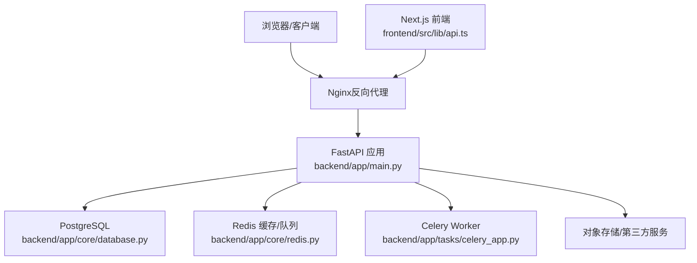
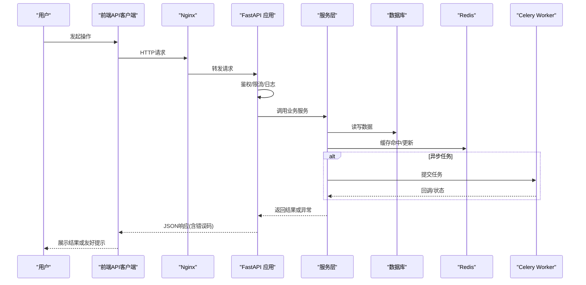
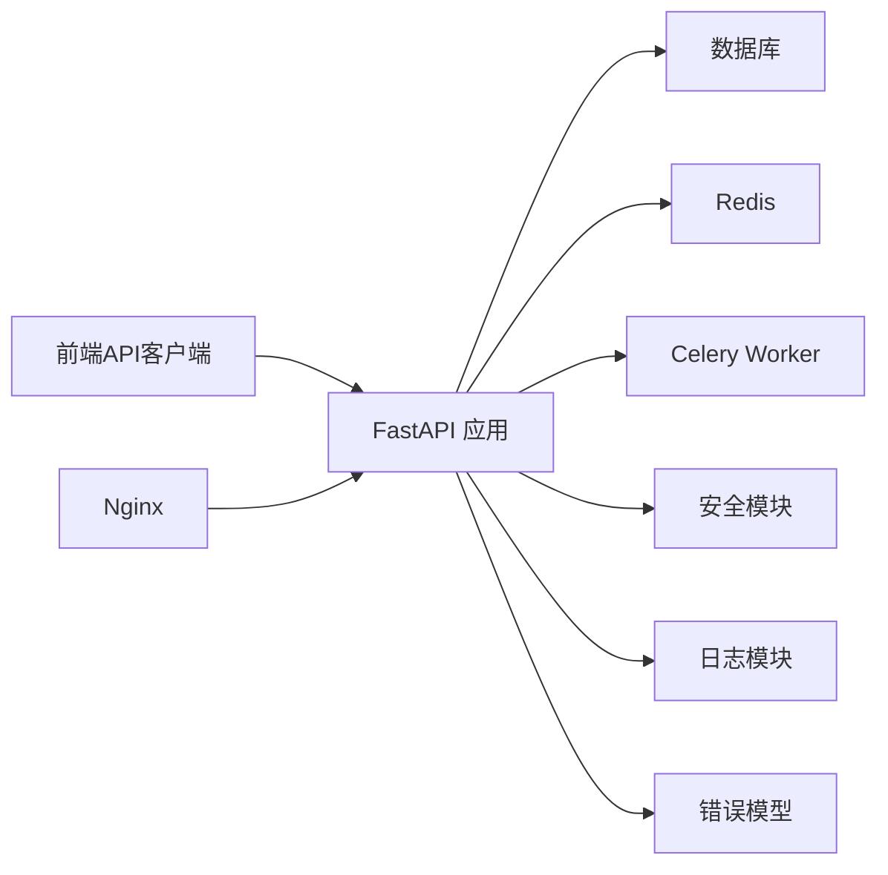

# 故障排查

<cite>
**本文引用的文件**
- [backend/app/main.py](file://backend/app/main.py)
- [backend/app/core/logging.py](file://backend/app/core/logging.py)
- [backend/app/core/errors.py](file://backend/app/core/errors.py)
- [backend/app/core/database.py](file://backend/app/core/database.py)
- [backend/app/core/redis.py](file://backend/app/core/redis.py)
- [backend/app/core/security.py](file://backend/app/core/security.py)
- [backend/app/api/v1/auth.py](file://backend/app/api/v1/auth.py)
- [backend/app/services/video_service.py](file://backend/app/services/video_service.py)
- [backend/app/tasks/celery_app.py](file://backend/app/tasks/celery_app.py)
- [backend/app/core/config.py](file://backend/app/core/config.py)
- [backend/app/core/cache.py](file://backend/app/core/cache.py)
- [backend/app/core/token_blacklist.py](file://backend/app/core/token_blacklist.py)
- [backend/app/api/v1/internal.py](file://backend/app/api/v1/internal.py)
- [frontend/src/lib/errors.ts](file://frontend/src/lib/errors.ts)
- [frontend/src/lib/api.ts](file://frontend/src/lib/api.ts)
- [nginx.conf](file://nginx.conf)
- [docker-compose.prod.yml](file://docker-compose.prod.yml)
</cite>

## 目录
1. [简介](#简介)
2. [项目结构](#项目结构)
3. [核心组件](#核心组件)
4. [架构总览](#架构总览)
5. [详细组件分析](#详细组件分析)
6. [依赖关系分析](#依赖关系分析)
7. [性能考量](#性能考量)
8. [故障排查指南](#故障排查指南)
9. [安全事件检测与响应](#安全事件检测与响应)
10. [系统健康检查清单](#系统健康检查清单)
11. [问题上报流程与支持渠道](#问题上报流程与支持渠道)
12. [结论](#结论)

## 简介
本指南面向Speaking平台的运维、研发与技术支持人员，聚焦于生产环境常见问题的定位与修复。内容覆盖连接超时、数据库锁死、内存泄漏与性能瓶颈的诊断方法；日志分析方法（级别设置、关键标识、聚合工具）；错误处理策略（异常捕获、错误码定义、用户友好提示）；性能监控（APM、数据库查询分析、前端性能分析）；安全事件（SQL注入、XSS、权限绕过）的检测与响应；以及健康检查、预防性维护与应急预案。

## 项目结构
后端采用FastAPI应用，核心模块包括：
- API路由层：按功能域划分v1接口
- 服务层：业务逻辑封装
- 任务层：Celery异步任务
- 基础设施：数据库、Redis、缓存、配置、安全、日志、限流等
- 迁移与脚本：Alembic迁移与数据初始化脚本

前端基于Next.js，提供管理端与用户端页面，统一通过API客户端访问后端。

图表来源
- [backend/app/main.py](file://backend/app/main.py)
- [backend/app/core/database.py](file://backend/app/core/database.py)
- [backend/app/core/redis.py](file://backend/app/core/redis.py)
- [backend/app/tasks/celery_app.py](file://backend/app/tasks/celery_app.py)
- [frontend/src/lib/api.ts](file://frontend/src/lib/api.ts)
- [nginx.conf](file://nginx.conf)

章节来源
- [backend/app/main.py](file://backend/app/main.py)
- [backend/app/core/config.py](file://backend/app/core/config.py)
- [docker-compose.prod.yml](file://docker-compose.prod.yml)

## 核心组件
- 应用入口与中间件：统一异常处理、请求日志、CORS、鉴权、限流
- 日志系统：结构化日志、分级输出、关键追踪ID
- 错误模型：统一错误码、HTTP状态映射、用户友好消息
- 数据访问：连接池、事务、慢查询告警
- 缓存与会话：Redis键空间、过期策略、黑名单
- 安全：JWT签发校验、令牌黑名单、输入校验
- 任务调度：Celery任务编排、重试与幂等
- 内部接口：健康检查、指标暴露

章节来源
- [backend/app/core/logging.py](file://backend/app/core/logging.py)
- [backend/app/core/errors.py](file://backend/app/core/errors.py)
- [backend/app/core/database.py](file://backend/app/core/database.py)
- [backend/app/core/redis.py](file://backend/app/core/redis.py)
- [backend/app/core/security.py](file://backend/app/core/security.py)
- [backend/app/tasks/celery_app.py](file://backend/app/tasks/celery_app.py)
- [backend/app/api/v1/internal.py](file://backend/app/api/v1/internal.py)

## 架构总览
下图展示从请求到响应的主路径，以及关键外部依赖与错误处理点。

图表来源
- [backend/app/main.py](file://backend/app/main.py)
- [backend/app/core/security.py](file://backend/app/core/security.py)
- [backend/app/core/database.py](file://backend/app/core/database.py)
- [backend/app/core/redis.py](file://backend/app/core/redis.py)
- [backend/app/tasks/celery_app.py](file://backend/app/tasks/celery_app.py)
- [frontend/src/lib/api.ts](file://frontend/src/lib/api.ts)

## 详细组件分析

### 日志系统与追踪
- 日志级别：DEBUG/INFO/WARNING/ERROR，生产默认INFO，调试可临时调至DEBUG
- 关键标识：请求ID、用户ID、资源ID、任务ID，贯穿全链路
- 输出格式：JSON结构化，便于聚合与分析
- 聚合工具：ELK/EFK、云原生日志平台、Prometheus+Grafana（指标）

建议实践
- 在API入口与异常捕获处记录请求ID与耗时
- 对慢查询、外部调用失败、重试次数进行告警
- 使用集中式日志平台进行检索与关联

章节来源
- [backend/app/core/logging.py](file://backend/app/core/logging.py)
- [backend/app/core/config.py](file://backend/app/core/config.py)

### 错误处理与错误码
- 统一异常捕获：HTTP异常、业务异常、第三方调用异常
- 错误码定义：分层编码（模块_子模块_错误类型），便于定位
- 用户提示：区分技术细节与用户可见信息，避免泄露敏感数据
- 前端错误处理：统一拦截器，根据错误码显示友好提示

章节来源
- [backend/app/core/errors.py](file://backend/app/core/errors.py)
- [frontend/src/lib/errors.ts](file://frontend/src/lib/errors.ts)
- [frontend/src/lib/api.ts](file://frontend/src/lib/api.ts)

### 数据库与连接池
- 连接池参数：最大连接数、空闲超时、获取超时
- 慢查询：启用慢查询日志与阈值告警
- 锁死诊断：长事务、未释放锁、行级锁竞争
- 索引优化：EXPLAIN分析热点查询

章节来源
- [backend/app/core/database.py](file://backend/app/core/database.py)

### 缓存与Redis
- 键命名规范：前缀+实体+ID+时间戳
- 过期策略：合理TTL，避免雪崩与穿透
- 一致性：写穿/回源策略，缓存失效时机
- 容量与命中率：监控内存使用与命中率

章节来源
- [backend/app/core/redis.py](file://backend/app/core/redis.py)
- [backend/app/core/cache.py](file://backend/app/core/cache.py)

### 安全与鉴权
- JWT：签发、校验、刷新、黑名单
- 输入校验：白名单、长度限制、类型校验
- 防注入：参数化查询、ORM优先
- XSS防护：输出转义、CSP策略

章节来源
- [backend/app/core/security.py](file://backend/app/core/security.py)
- [backend/app/core/token_blacklist.py](file://backend/app/core/token_blacklist.py)
- [backend/app/api/v1/auth.py](file://backend/app/api/v1/auth.py)

### 异步任务与幂等
- 任务编排：视频处理、评分、通知等
- 重试策略：指数退避、最大重试次数
- 幂等设计：去重键、状态机、补偿机制

章节来源
- [backend/app/tasks/celery_app.py](file://backend/app/tasks/celery_app.py)
- [backend/app/services/video_service.py](file://backend/app/services/video_service.py)

### 内部接口与健康检查
- /internal/health：存活探针
- /internal/metrics：指标暴露
- 依赖检查：DB、Redis、外部服务连通性

章节来源
- [backend/app/api/v1/internal.py](file://backend/app/api/v1/internal.py)

## 依赖关系分析

图表来源
- [backend/app/main.py](file://backend/app/main.py)
- [backend/app/core/database.py](file://backend/app/core/database.py)
- [backend/app/core/redis.py](file://backend/app/core/redis.py)
- [backend/app/tasks/celery_app.py](file://backend/app/tasks/celery_app.py)
- [backend/app/core/security.py](file://backend/app/core/security.py)
- [backend/app/core/logging.py](file://backend/app/core/logging.py)
- [backend/app/core/errors.py](file://backend/app/core/errors.py)
- [frontend/src/lib/api.ts](file://frontend/src/lib/api.ts)
- [nginx.conf](file://nginx.conf)

章节来源
- [backend/app/main.py](file://backend/app/main.py)
- [docker-compose.prod.yml](file://docker-compose.prod.yml)

## 性能考量
- 连接池与线程池：根据CPU与IO特性调整并发度
- 缓存命中率：热点数据预加载、批量读取
- 数据库索引：覆盖常用查询条件，避免全表扫描
- 任务队列：削峰填谷，避免阻塞主线程
- 前端性能：懒加载、图片压缩、CDN加速

[本节为通用指导，不直接分析具体文件]

## 故障排查指南

### 连接超时
可能原因
- 数据库连接池耗尽或网络延迟高
- Redis连接失败或内存不足
- 外部服务不可用或限流

诊断步骤
- 查看应用日志中的连接错误与超时堆栈
- 检查数据库连接池使用率与慢查询
- 检查Redis内存、持久化与网络连通性
- 对外部服务进行连通性与速率限制测试

处置建议
- 扩容连接池与实例，优化网络路径
- 增加重试与熔断策略
- 降级非关键依赖

章节来源
- [backend/app/core/database.py](file://backend/app/core/database.py)
- [backend/app/core/redis.py](file://backend/app/core/redis.py)
- [backend/app/core/logging.py](file://backend/app/core/logging.py)

### 数据库锁死
可能原因
- 长事务未提交或回滚
- 行级锁竞争，热点更新
- 索引缺失导致锁升级

诊断步骤
- 查看活跃会话与等待事件
- 识别持有锁的事务与SQL
- 分析执行计划与索引使用情况

处置建议
- 终止长时间运行的事务
- 优化SQL与索引
- 拆分大事务，减少锁范围

章节来源
- [backend/app/core/database.py](file://backend/app/core/database.py)

### 内存泄漏
可能原因
- 未释放的引用或全局缓存膨胀
- 序列化对象过大
- 第三方库内存增长

诊断步骤
- 监控进程RSS与GC统计
- 导出堆快照并分析对象分布
- 定位持续增长的数据结构

处置建议
- 限制缓存大小与TTL
- 分片与淘汰策略
- 定期重启与滚动更新

章节来源
- [backend/app/core/cache.py](file://backend/app/core/cache.py)
- [backend/app/core/redis.py](file://backend/app/core/redis.py)

### 性能瓶颈
可能原因
- CPU密集型任务阻塞
- I/O等待过高
- 缓存未命中导致重复计算

诊断步骤
- APM采集调用链与耗时分布
- 数据库慢查询与锁等待
- 缓存命中率与带宽占用

处置建议
- 异步化CPU任务
- 优化查询与索引
- 预热热点数据

章节来源
- [backend/app/tasks/celery_app.py](file://backend/app/tasks/celery_app.py)
- [backend/app/core/database.py](file://backend/app/core/database.py)
- [backend/app/core/cache.py](file://backend/app/core/cache.py)

### 日志分析方法
- 级别设置：生产INFO，调试DEBUG；按模块独立开关
- 关键标识：request_id、user_id、resource_id、task_id
- 聚合工具：ELK/EFK、云日志平台、Prometheus+Grafana
- 检索技巧：按traceId串联多服务日志

章节来源
- [backend/app/core/logging.py](file://backend/app/core/logging.py)
- [backend/app/core/config.py](file://backend/app/core/config.py)

### 错误处理策略
- 异常捕获：统一中间件捕获HTTP与业务异常
- 错误码：模块-子模块-错误类型，便于前端分类处理
- 用户提示：隐藏技术细节，提供可操作建议

章节来源
- [backend/app/core/errors.py](file://backend/app/core/errors.py)
- [frontend/src/lib/errors.ts](file://frontend/src/lib/errors.ts)
- [frontend/src/lib/api.ts](file://frontend/src/lib/api.ts)

### 性能监控工具
- APM：分布式追踪、调用链、热点函数
- 数据库：慢查询日志、执行计划、锁等待
- 前端：Lighthouse、Web Vitals、错误上报

[本节为通用指导，不直接分析具体文件]

## 安全事件检测与响应

### SQL注入
检测
- 审计输入校验与参数化查询
- 监控异常SQL模式与报错频率

响应
- 立即阻断可疑IP与账号
- 回滚受影响事务并恢复数据
- 补充白名单与长度限制

章节来源
- [backend/app/core/security.py](file://backend/app/core/security.py)
- [backend/app/core/database.py](file://backend/app/core/database.py)

### XSS攻击
检测
- 审查输出转义与CSP策略
- 监控异常脚本加载与DOM操作

响应
- 清理恶意内容并加固输出
- 更新CSP与输入过滤规则

章节来源
- [backend/app/core/security.py](file://backend/app/core/security.py)

### 权限绕过
检测
- 审计鉴权逻辑与角色校验
- 监控越权访问与异常行为

响应
- 修复鉴权漏洞并强制登出
- 重置相关令牌与审计日志

章节来源
- [backend/app/core/security.py](file://backend/app/core/security.py)
- [backend/app/core/token_blacklist.py](file://backend/app/core/token_blacklist.py)
- [backend/app/api/v1/auth.py](file://backend/app/api/v1/auth.py)

## 系统健康检查清单
- 应用层
  - 存活探针与就绪探针正常
  - 错误率与延迟在阈值内
- 数据层
  - 数据库连接池使用率<80%
  - 慢查询数量与锁等待正常
  - Redis内存与命中率达标
- 任务层
  - Celery队列堆积量稳定
  - 任务成功率与重试率正常
- 外部依赖
  - 第三方服务连通性与限流正常
- 安全
  - 认证失败与异常登录告警
  - 输入校验与输出转义生效

章节来源
- [backend/app/api/v1/internal.py](file://backend/app/api/v1/internal.py)
- [backend/app/core/database.py](file://backend/app/core/database.py)
- [backend/app/core/redis.py](file://backend/app/core/redis.py)
- [backend/app/tasks/celery_app.py](file://backend/app/tasks/celery_app.py)

## 问题上报流程与支持渠道
- 上报渠道
  - 工单系统：描述现象、影响范围、复现步骤
  - 即时通讯：紧急事件快速同步
  - 邮件：非紧急问题归档
- 支持渠道
  - 一线运维：基础环境与依赖排查
  - 二线研发：代码与逻辑定位
  - 三线专家：复杂问题与架构优化
- 知识库维护
  - 沉淀常见问题与解决方案
  - 定期复盘与更新SOP

[本节为通用指导，不直接分析具体文件]

## 结论
通过统一的日志与错误模型、健壮的依赖管理与监控体系，结合标准化的排查流程与安全响应机制，能够快速定位并解决Speaking平台在生产环境的各类问题。建议持续完善健康检查与预防性维护，提升系统的稳定性与可观测性。
