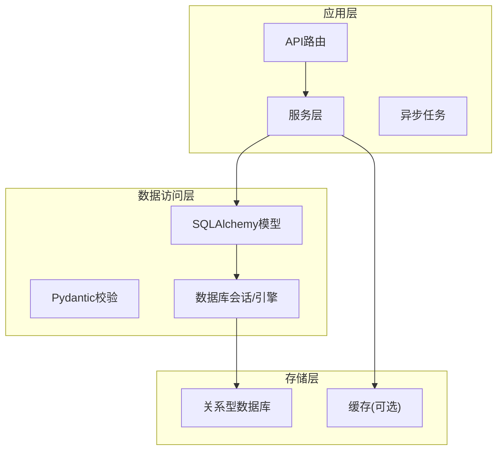
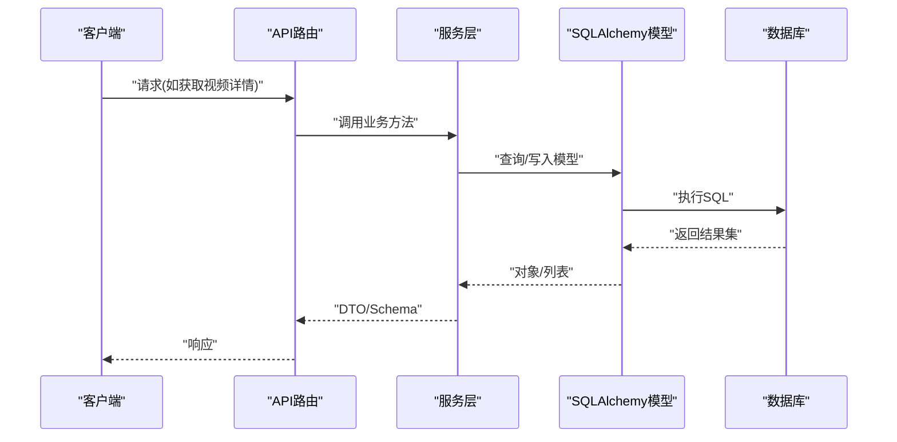
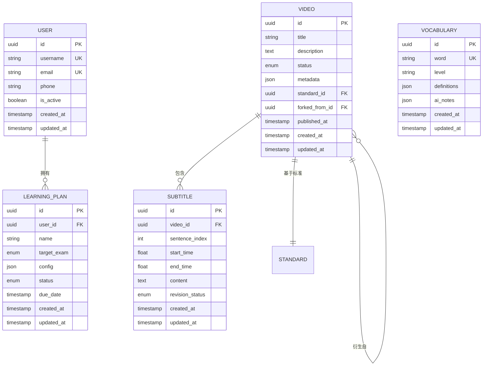
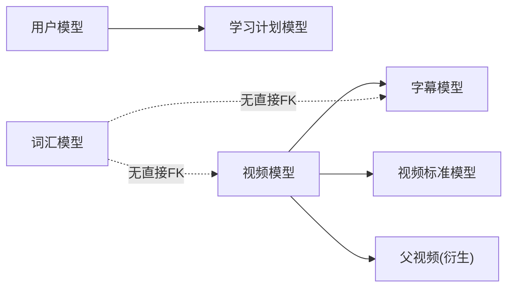

# 数据库设计

<cite>
**本文引用的文件**
- [backend/app/models/user.py](file://backend/app/models/user.py)
- [backend/app/models/video.py](file://backend/app/models/video.py)
- [backend/app/models/subtitle.py](file://backend/app/models/subtitle.py)
- [backend/app/models/learning_plan.py](file://backend/app/models/learning_plan.py)
- [backend/app/models/vocabulary.py](file://backend/app/models/vocabulary.py)
- [backend/app/core/database.py](file://backend/app/core/database.py)
- [backend/alembic.ini](file://backend/alembic.ini)
- [backend/migrations/env.py](file://backend/migrations/env.py)
- [backend/migrations/script.py.mako](file://backend/migrations/script.py.mako)
- [backend/migrations/versions/80e681bd554d_initial_schema.py](file://backend/migrations/versions/80e681bd554d_initial_schema.py)
- [backend/migrations/versions/a1b2c3d4e5f6_add_subtitle_words.py](file://backend/migrations/versions/a1b2c3d4e5f6_add_subtitle_words.py)
- [backend/migrations/versions/c1d2e3f4g5h6_add_learning_plan_models.py](file://backend/migrations/versions/c1d2e3f4g5h6_add_learning_plan_models.py)
- [backend/migrations/versions/f6a7b8c9d0e1_add_word_levels_and_target_exam.py](file://backend/migrations/versions/f6a7b8c9d0e1_add_word_levels_and_target_exam.py)
- [backend/migrations/versions/q6r7s8t9u0v1_add_missing_indexes.py](file://backend/migrations/versions/q6r7s8t9u0v1_add_missing_indexes.py)
- [backend/migrations/versions/r7s8t9u0v1w2_add_ondelete_cascade.py](file://backend/migrations/versions/r7s8t9u0v1w2_add_ondelete_cascade.py)
- [backend/migrations/versions/u2v3w4x5y6z7_add_video_standards_and_forked_from.py](file://backend/migrations/versions/u2v3w4x5y6z7_add_video_standards_and_forked_from.py)
- [backend/migrations/versions/x5y6z7a8b9c0_add_uq_learning_record_user_video.py](file://backend/migrations/versions/x5y6z7a8b9c0_add_uq_learning_record_user_video.py)
- [backend/migrations/versions/z9y8x7w6v5u4_drop_user_streak_columns.py](file://backend/migrations/versions/z9y8x7w6v5u4_drop_user_streak_columns.py)
- [backend/app/schemas/video.py](file://backend/app/schemas/video.py)
- [backend/app/schemas/vocabulary.py](file://backend/app/schemas/vocabulary.py)
- [backend/app/schemas/user.py](file://backend/app/schemas/user.py)
</cite>

## 目录
1. [简介](#简介)
2. [项目结构](#项目结构)
3. [核心组件](#核心组件)
4. [架构总览](#架构总览)
5. [详细组件分析](#详细组件分析)
6. [依赖关系分析](#依赖关系分析)
7. [性能考虑](#性能考虑)
8. [故障排查指南](#故障排查指南)
9. [结论](#结论)
10. [附录](#附录)

## 简介
本文件面向Speaking平台的数据库设计与数据治理，聚焦实体关系模型（ER图）、表结构与字段定义、主外键与索引策略、查询优化、Alembic迁移管理、版本控制与回滚、数据验证与业务约束、ORM映射与访问模式、生命周期管理与备份恢复安全策略，以及常用查询示例与调优建议。文档以仓库中的SQLAlchemy模型、Alembic迁移与Pydantic Schema为依据，确保内容与实际实现一致。

## 项目结构
后端采用FastAPI + SQLAlchemy + Alembic的常见分层：
- models：领域模型（用户、视频、字幕、学习计划、词汇等）
- schemas：请求/响应校验与序列化
- core/database：数据库连接与会话管理
- migrations：Alembic迁移脚本与配置
- services/tasks：服务层与异步任务（读写分离、批处理等）

图表来源
- [backend/app/core/database.py](file://backend/app/core/database.py)
- [backend/app/models/user.py](file://backend/app/models/user.py)
- [backend/app/models/video.py](file://backend/app/models/video.py)
- [backend/app/models/subtitle.py](file://backend/app/models/subtitle.py)
- [backend/app/models/learning_plan.py](file://backend/app/models/learning_plan.py)
- [backend/app/models/vocabulary.py](file://backend/app/models/vocabulary.py)

章节来源
- [backend/app/core/database.py](file://backend/app/core/database.py)
- [backend/app/models/user.py](file://backend/app/models/user.py)
- [backend/app/models/video.py](file://backend/app/models/video.py)
- [backend/app/models/subtitle.py](file://backend/app/models/subtitle.py)
- [backend/app/models/learning_plan.py](file://backend/app/models/learning_plan.py)
- [backend/app/models/vocabulary.py](file://backend/app/models/vocabulary.py)

## 核心组件
- 用户（User）：账户、认证、偏好与学习统计
- 视频（Video）：元数据、状态机、评分与标准版本
- 字幕（Subtitle）：分句、时间轴、修订与合并更新
- 学习计划（LearningPlan）：目标、周期、进度与记录
- 词汇（Vocabulary/Word）：词目、级别、考试目标、AI笔记

章节来源
- [backend/app/models/user.py](file://backend/app/models/user.py)
- [backend/app/models/video.py](file://backend/app/models/video.py)
- [backend/app/models/subtitle.py](file://backend/app/models/subtitle.py)
- [backend/app/models/learning_plan.py](file://backend/app/models/learning_plan.py)
- [backend/app/models/vocabulary.py](file://backend/app/models/vocabulary.py)

## 架构总览
下图展示从API到数据库的核心数据流，强调模型间关系与关键索引点。

图表来源
- [backend/app/core/database.py](file://backend/app/core/database.py)
- [backend/app/models/video.py](file://backend/app/models/video.py)
- [backend/app/models/subtitle.py](file://backend/app/models/subtitle.py)
- [backend/app/models/learning_plan.py](file://backend/app/models/learning_plan.py)
- [backend/app/models/vocabulary.py](file://backend/app/models/vocabulary.py)

## 详细组件分析

### 实体关系模型（ER图）

图表来源
- [backend/app/models/user.py](file://backend/app/models/user.py)
- [backend/app/models/video.py](file://backend/app/models/video.py)
- [backend/app/models/subtitle.py](file://backend/app/models/subtitle.py)
- [backend/app/models/learning_plan.py](file://backend/app/models/learning_plan.py)
- [backend/app/models/vocabulary.py](file://backend/app/models/vocabulary.py)

章节来源
- [backend/app/models/user.py](file://backend/app/models/user.py)
- [backend/app/models/video.py](file://backend/app/models/video.py)
- [backend/app/models/subtitle.py](file://backend/app/models/subtitle.py)
- [backend/app/models/learning_plan.py](file://backend/app/models/learning_plan.py)
- [backend/app/models/vocabulary.py](file://backend/app/models/vocabulary.py)

### 表结构与字段定义要点
- 用户表
  - 主键：uuid
  - 唯一约束：用户名、邮箱
  - 关键字段：手机号、激活状态、创建/更新时间
- 视频表
  - 主键：uuid
  - 状态枚举：草稿、待审核、已发布、处理中等
  - 关联：标准版本、父视频（fork）
  - 扩展：封面、时长、语言、标签等元数据
- 字幕表
  - 主键：uuid
  - 外键：video_id
  - 关键字段：句子序号、起止时间、内容、修订状态
  - 索引：按视频ID与时间范围查询
- 学习计划表
  - 主键：uuid
  - 外键：user_id
  - 关键字段：名称、目标考试、配置JSON、截止日期、状态
- 词汇表
  - 主键：uuid
  - 唯一约束：单词
  - 关键字段：级别、释义、AI笔记、时间戳

章节来源
- [backend/app/models/user.py](file://backend/app/models/user.py)
- [backend/app/models/video.py](file://backend/app/models/video.py)
- [backend/app/models/subtitle.py](file://backend/app/models/subtitle.py)
- [backend/app/models/learning_plan.py](file://backend/app/models/learning_plan.py)
- [backend/app/models/vocabulary.py](file://backend/app/models/vocabulary.py)

### 主键、外键与约束
- 主键：统一使用UUID，避免自增冲突与泄露顺序信息
- 外键：
  - 字幕→视频
  - 学习计划→用户
  - 视频→标准版本、父视频（fork）
- 唯一约束：
  - 用户名、邮箱唯一
  - 单词唯一
  - 学习记录用户+视频唯一（防止重复记录）
- 级联删除：在合适的外键上启用ON DELETE CASCADE，保证一致性

章节来源
- [backend/migrations/versions/r7s8t9u0v1w2_add_ondelete_cascade.py](file://backend/migrations/versions/r7s8t9u0v1w2_add_ondelete_cascade.py)
- [backend/migrations/versions/x5y6z7a8b9c0_add_uq_learning_record_user_video.py](file://backend/migrations/versions/x5y6z7a8b9c0_add_uq_learning_record_user_video.py)

### 索引设计与查询优化
- 高频查询路径
  - 按视频ID检索字幕：video_id + sentence_index
  - 按时间窗口检索字幕：video_id + start_time/end_time
  - 学习计划按用户与状态筛选：user_id + status
  - 词汇按级别与考试目标筛选：level + target_exam
- 索引策略
  - 复合索引覆盖常见过滤条件
  - 对大文本字段避免索引，必要时使用全文检索或外部搜索引擎
  - 定期分析慢查询并补充索引

章节来源
- [backend/migrations/versions/q6r7s8t9u0v1_add_missing_indexes.py](file://backend/migrations/versions/q6r7s8t9u0v1_add_missing_indexes.py)
- [backend/migrations/versions/f92a8f2617d9_add_subtitle_video_id_sentence_index_.py](file://backend/migrations/versions/f92a8f2617d9_add_subtitle_video_id_sentence_index_.py)

### 数据验证规则、业务约束与完整性检查
- Pydantic Schema校验
  - 必填字段、类型、长度、格式（邮箱、URL、日期）
  - 自定义校验器（如密码强度、时间区间合法性）
- 业务约束
  - 视频状态流转（草稿→待审核→已发布）
  - 字幕修订流程（提议→合并→快照）
  - 学习计划状态与截止日期逻辑
- 完整性检查
  - 外键约束保证引用完整性
  - 唯一约束避免重复数据
  - 触发器或应用层校验保证复杂规则

章节来源
- [backend/app/schemas/video.py](file://backend/app/schemas/video.py)
- [backend/app/schemas/vocabulary.py](file://backend/app/schemas/vocabulary.py)
- [backend/app/schemas/user.py](file://backend/app/schemas/user.py)

### 数据访问模式与ORM映射
- 会话管理
  - 通过数据库引擎创建会话工厂
  - 请求级事务，失败自动回滚
- ORM映射
  - 模型类与表一一对应
  - 关系属性（relationship）表达一对多、多对一
  - 延迟加载与预加载策略平衡N+1问题
- 批量操作
  - 大批量插入/更新使用bulk操作
  - 异步任务处理耗时操作（转录、翻译、评分）

章节来源
- [backend/app/core/database.py](file://backend/app/core/database.py)
- [backend/app/models/user.py](file://backend/app/models/user.py)
- [backend/app/models/video.py](file://backend/app/models/video.py)
- [backend/app/models/subtitle.py](file://backend/app/models/subtitle.py)
- [backend/app/models/learning_plan.py](file://backend/app/models/learning_plan.py)
- [backend/app/models/vocabulary.py](file://backend/app/models/vocabulary.py)

### 数据生命周期管理、备份恢复与安全策略
- 生命周期
  - 创建：API接收→Schema校验→ORM持久化
  - 更新：乐观锁或版本号控制
  - 归档：历史版本保留（字幕修订、视频标准）
  - 删除：软删除或级联删除
- 备份恢复
  - 定期全量与增量备份
  - 恢复演练与RTO/RPO指标
- 安全策略
  - 敏感字段加密（密码哈希、令牌）
  - 最小权限原则（数据库账号）
  - 审计日志与访问控制

[本节为通用指导，不直接分析具体文件]

### 常用查询示例与性能调优建议
- 常用查询
  - 获取某视频的完整字幕序列（按时间排序）
  - 获取用户的最近学习计划与完成度
  - 按级别与考试目标检索词汇
- 调优建议
  - 使用EXPLAIN分析执行计划
  - 合理分页与只取必要字段
  - 热点数据缓存（Redis）
  - 读写分离与连接池调优

[本节为通用指导，不直接分析具体文件]

## 依赖关系分析

图表来源
- [backend/app/models/user.py](file://backend/app/models/user.py)
- [backend/app/models/video.py](file://backend/app/models/video.py)
- [backend/app/models/subtitle.py](file://backend/app/models/subtitle.py)
- [backend/app/models/learning_plan.py](file://backend/app/models/learning_plan.py)
- [backend/app/models/vocabulary.py](file://backend/app/models/vocabulary.py)

章节来源
- [backend/app/models/user.py](file://backend/app/models/user.py)
- [backend/app/models/video.py](file://backend/app/models/video.py)
- [backend/app/models/subtitle.py](file://backend/app/models/subtitle.py)
- [backend/app/models/learning_plan.py](file://backend/app/models/learning_plan.py)
- [backend/app/models/vocabulary.py](file://backend/app/models/vocabulary.py)

## 性能考虑
- 索引命中优先：确保WHERE与JOIN列有合适索引
- 减少N+1：使用joinedload/selectinload预加载关联
- 分批处理：大表导入/导出使用批次大小限制
- 缓存热点：视频元数据、字幕片段、词汇字典
- 连接池：根据并发调整pool_size与max_overflow
- 监控慢查询：定期收集与分析慢查询日志

[本节为通用指导，不直接分析具体文件]

## 故障排查指南
- 迁移失败
  - 检查迁移脚本幂等性与依赖顺序
  - 使用Alembic历史查看与回滚
- 外键冲突
  - 确认级联删除策略与清理顺序
- 索引缺失导致慢查询
  - 使用EXPLAIN定位，补充复合索引
- 数据不一致
  - 校验唯一约束与业务规则
  - 使用审计日志追踪变更

章节来源
- [backend/alembic.ini](file://backend/alembic.ini)
- [backend/migrations/env.py](file://backend/migrations/env.py)
- [backend/migrations/script.py.mako](file://backend/migrations/script.py.mako)

## 结论
本设计围绕用户、视频、字幕、学习计划与词汇五大核心实体构建，采用UUID主键、明确的外键与唯一约束、合理的索引策略与Alembic迁移管理，保障数据一致性与可演进性。结合Pydantic校验与服务层业务规则，形成从输入到存储的完整闭环。后续可通过缓存、读写分离与慢查询优化进一步提升性能与稳定性。

## 附录

### Alembic迁移管理与版本控制
- 配置与初始化
  - alembic.ini：迁移目录、数据库URL、环境设置
  - env.py：引擎配置、目标元数据、上下文
  - script.py.mako：迁移模板
- 版本控制
  - 每个迁移对应一个版本文件，命名清晰
  - 合并分支时注意头合并与冲突解决
- 回滚策略
  - 支持downgrade回滚
  - 谨慎修改已有迁移，优先新增迁移

章节来源
- [backend/alembic.ini](file://backend/alembic.ini)
- [backend/migrations/env.py](file://backend/migrations/env.py)
- [backend/migrations/script.py.mako](file://backend/migrations/script.py.mako)

### 关键迁移说明
- 初始架构
  - 80e681bd554d_initial_schema.py：基础表结构
- 字幕增强
  - a1b2c3d4e5f6_add_subtitle_words.py：字幕与词汇关联
- 学习计划模型
  - c1d2e3f4g5h6_add_learning_plan_models.py：学习计划相关表
- 词汇级别与考试目标
  - f6a7b8c9d0e1_add_word_levels_and_target_exam.py：词汇扩展字段
- 索引补全
  - q6r7s8t9u0v1_add_missing_indexes.py：补齐缺失索引
- 级联删除
  - r7s8t9u0v1w2_add_ondelete_cascade.py：外键级联策略
- 视频标准与衍生
  - u2v3w4x5y6z7_add_video_standards_and_forked_from.py：标准版本与衍生关系
- 学习记录唯一性
  - x5y6z7a8b9c0_add_uq_learning_record_user_video.py：用户+视频唯一约束
- 用户连续打卡列移除
  - z9y8x7w6v5u4_drop_user_streak_columns.py：清理冗余列

章节来源
- [backend/migrations/versions/80e681bd554d_initial_schema.py](file://backend/migrations/versions/80e681bd554d_initial_schema.py)
- [backend/migrations/versions/a1b2c3d4e5f6_add_subtitle_words.py](file://backend/migrations/versions/a1b2c3d4e5f6_add_subtitle_words.py)
- [backend/migrations/versions/c1d2e3f4g5h6_add_learning_plan_models.py](file://backend/migrations/versions/c1d2e3f4g5h6_add_learning_plan_models.py)
- [backend/migrations/versions/f6a7b8c9d0e1_add_word_levels_and_target_exam.py](file://backend/migrations/versions/f6a7b8c9d0e1_add_word_levels_and_target_exam.py)
- [backend/migrations/versions/q6r7s8t9u0v1_add_missing_indexes.py](file://backend/migrations/versions/q6r7s8t9u0v1_add_missing_indexes.py)
- [backend/migrations/versions/r7s8t9u0v1w2_add_ondelete_cascade.py](file://backend/migrations/versions/r7s8t9u0v1w2_add_ondelete_cascade.py)
- [backend/migrations/versions/u2v3w4x5y6z7_add_video_standards_and_forked_from.py](file://backend/migrations/versions/u2v3w4x5y6z7_add_video_standards_and_forked_from.py)
- [backend/migrations/versions/x5y6z7a8b9c0_add_uq_learning_record_user_video.py](file://backend/migrations/versions/x5y6z7a8b9c0_add_uq_learning_record_user_video.py)
- [backend/migrations/versions/z9y8x7w6v5u4_drop_user_streak_columns.py](file://backend/migrations/versions/z9y8x7w6v5u4_drop_user_streak_columns.py)
