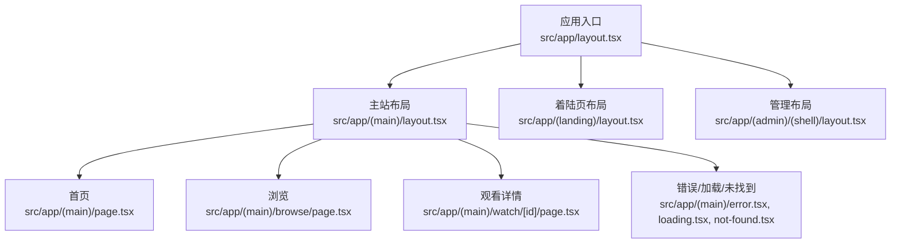
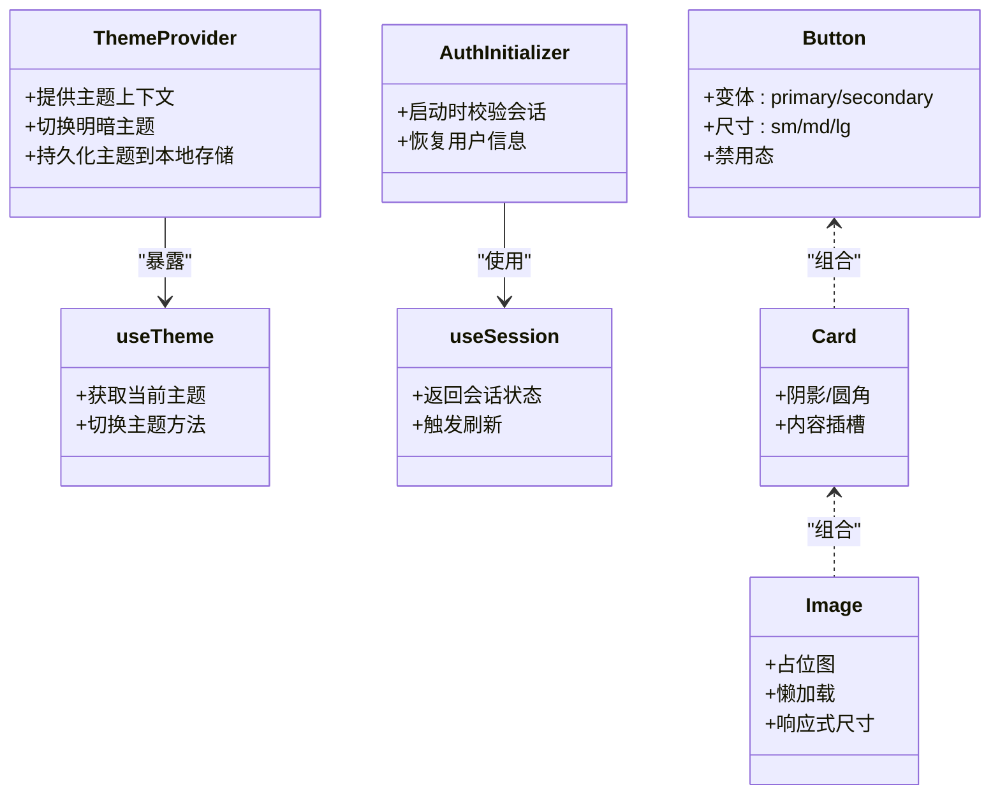
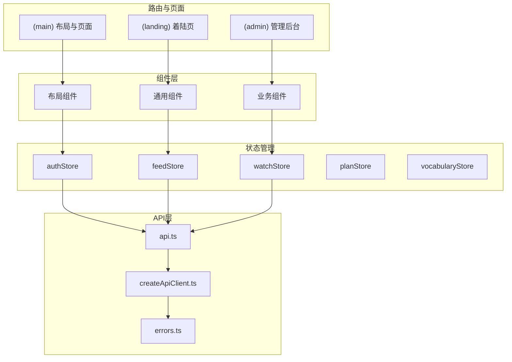
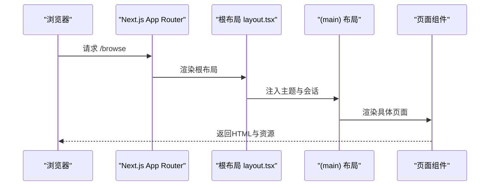
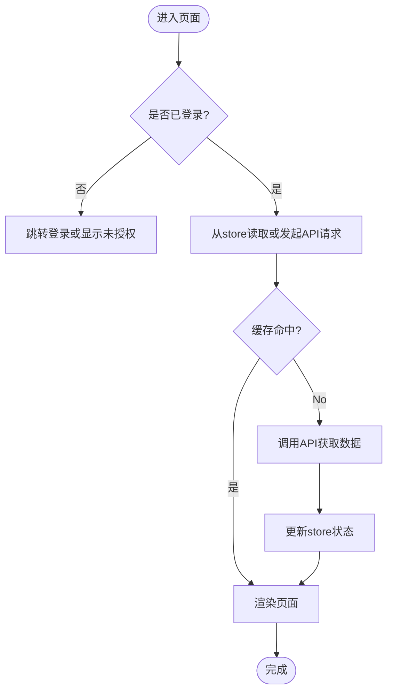
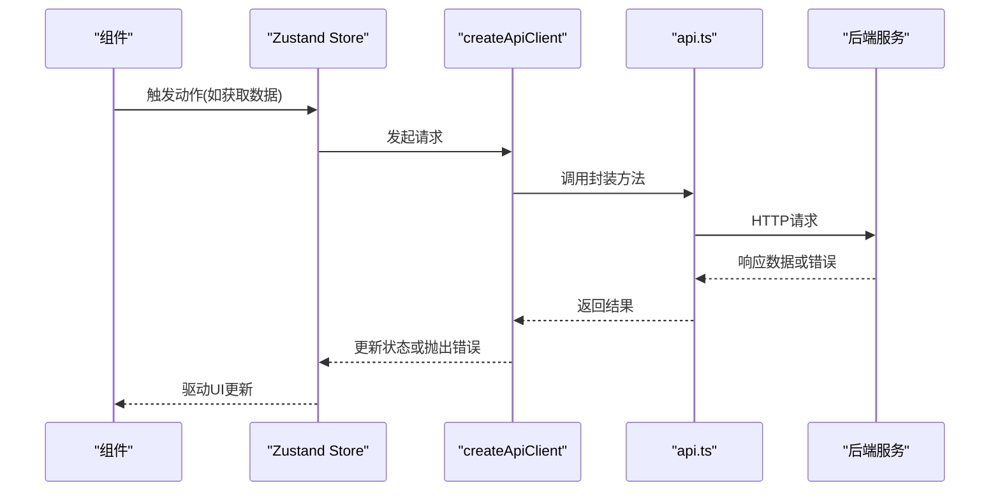
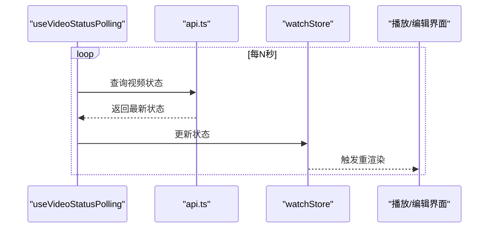
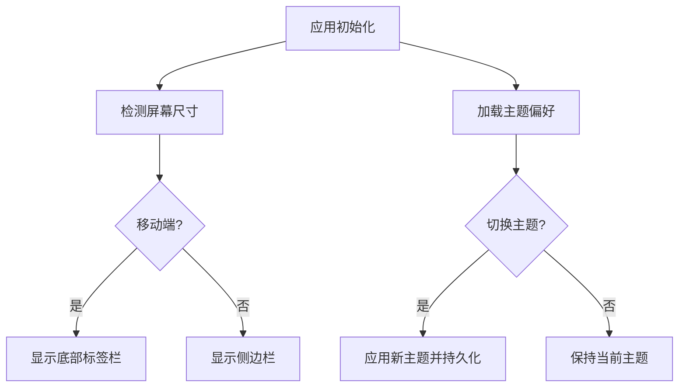
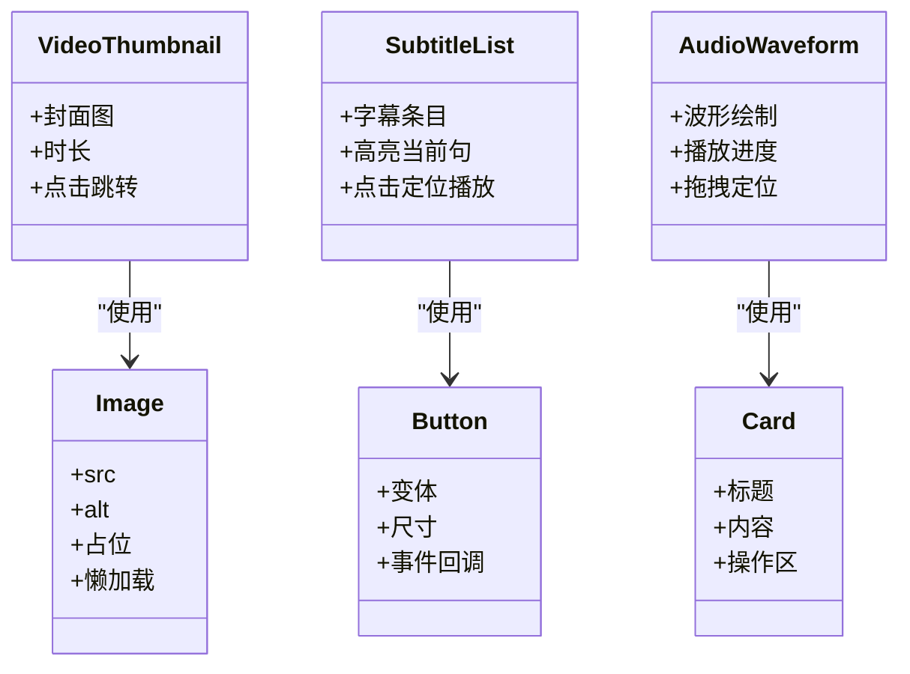
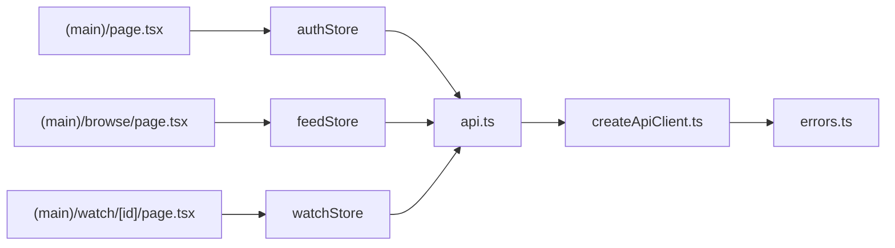

# 前端架构

<cite>
**本文引用的文件**
- [frontend/src/app/layout.tsx](file://frontend/src/app/layout.tsx)
- [frontend/src/app/(main)/layout.tsx](file://frontend/src/app/(main)/layout.tsx)
- [frontend/src/app/(landing)/layout.tsx](file://frontend/src/app/(landing)/layout.tsx)
- [frontend/src/app/(admin)/(shell)/layout.tsx](file://frontend/src/app/(admin)/(shell)/layout.tsx)
- [frontend/src/app/(main)/page.tsx](file://frontend/src/app/(main)/page.tsx)
- [frontend/src/app/(main)/browse/page.tsx](file://frontend/src/app/(main)/browse/page.tsx)
- [frontend/src/app/(main)/watch/[id]/page.tsx](file://frontend/src/app/(main)/watch/[id]/page.tsx)
- [frontend/src/app/(main)/error.tsx](file://frontend/src/app/(main)/error.tsx)
- [frontend/src/app/(main)/loading.tsx](file://frontend/src/app/(main)/loading.tsx)
- [frontend/src/app/(main)/not-found.tsx](file://frontend/src/app/(main)/not-found.tsx)
- [frontend/src/components/common/ThemeProvider.tsx](file://frontend/src/components/common/ThemeProvider.tsx)
- [frontend/src/hooks/useTheme.ts](file://frontend/src/hooks/useTheme.ts)
- [frontend/src/stores/authStore.ts](file://frontend/src/stores/authStore.ts)
- [frontend/src/stores/feedStore.ts](file://frontend/src/stores/feedStore.ts)
- [frontend/src/stores/watchStore.ts](file://frontend/src/stores/watchStore.ts)
- [frontend/src/stores/planStore.ts](file://frontend/src/stores/planStore.ts)
- [frontend/src/stores/vocabularyStore.ts](file://frontend/src/stores/vocabularyStore.ts)
- [frontend/src/lib/api.ts](file://frontend/src/lib/api.ts)
- [frontend/src/lib/createApiClient.ts](file://frontend/src/lib/createApiClient.ts)
- [frontend/src/lib/errors.ts](file://frontend/src/lib/errors.ts)
- [frontend/src/hooks/useSession.ts](file://frontend/src/hooks/useSession.ts)
- [frontend/src/hooks/useVideoPlayer.ts](file://frontend/src/hooks/useVideoPlayer.ts)
- [frontend/src/hooks/useVideoStatusPolling.ts](file://frontend/src/hooks/useVideoStatusPolling.ts)
- [frontend/src/hooks/useMediaQuery.ts](file://frontend/src/hooks/useMediaQuery.ts)
- [frontend/src/components/layout/SidebarProvider.tsx](file://frontend/src/components/layout/SidebarProvider.tsx)
- [frontend/src/components/layout/MobileTabBar.tsx](file://frontend/src/components/layout/MobileTabBar.tsx)
- [frontend/src/components/common/AuthInitializer.tsx](file://frontend/src/components/common/AuthInitializer.tsx)
- [frontend/src/components/common/ErrorState.tsx](file://frontend/src/components/common/ErrorState.tsx)
- [frontend/src/components/common/Spinner.tsx](file://frontend/src/components/common/Spinner.tsx)
- [frontend/src/components/ui/Button.tsx](file://frontend/src/components/ui/Button.tsx)
- [frontend/src/components/ui/Card.tsx](file://frontend/src/components/ui/Card.tsx)
- [frontend/src/components/ui/Image.tsx](file://frontend/src/components/ui/Image.tsx)
- [frontend/src/components/video/VideoThumbnail.tsx](file://frontend/src/components/video/VideoThumbnail.tsx)
- [frontend/src/components/subtitle/SubtitleList.tsx](file://frontend/src/components/subtitle/SubtitleList.tsx)
- [frontend/src/components/speaking/AudioWaveform.tsx](file://frontend/src/components/speaking/AudioWaveform.tsx)
- [frontend/package.json](file://frontend/package.json)
- [frontend/next.config.js](file://frontend/next.config.js)
</cite>

## 目录
1. [简介](#简介)
2. [项目结构](#项目结构)
3. [核心组件](#核心组件)
4. [架构总览](#架构总览)
5. [详细组件分析](#详细组件分析)
6. [依赖关系分析](#依赖关系分析)
7. [性能考量](#性能考量)
8. [故障排查指南](#故障排查指南)
9. [结论](#结论)
10. [附录](#附录)

## 简介
本文件为Speaking平台的前端架构文档，聚焦于基于Next.js App Router的架构设计、组件化模式与状态管理策略。内容涵盖路由组织、页面结构与组件层次、Zustand状态管理、本地存储策略、实时数据同步机制、响应式设计与主题系统、UI组件库架构、性能优化（代码分割与懒加载）、后端API集成模式、错误处理与缓存策略，并提供组件架构图与数据流图，帮助读者快速理解并高效扩展前端系统。

## 项目结构
前端采用Next.js App Router，按功能域划分路由组：
- (main)：主站业务路由，包含首页、浏览、观看、搜索、词汇、历史记录等
- (landing)：着陆页与营销相关页面
- (admin)：后台管理模块，含登录与管理Shell布局
- 全局布局与错误/加载/未找到页面位于根app目录

**图表来源**
- [frontend/src/app/layout.tsx](file://frontend/src/app/layout.tsx)
- [frontend/src/app/(main)/layout.tsx](file://frontend/src/app/(main)/layout.tsx)
- [frontend/src/app/(landing)/layout.tsx](file://frontend/src/app/(landing)/layout.tsx)
- [frontend/src/app/(admin)/(shell)/layout.tsx](file://frontend/src/app/(admin)/(shell)/layout.tsx)
- [frontend/src/app/(main)/page.tsx](file://frontend/src/app/(main)/page.tsx)
- [frontend/src/app/(main)/browse/page.tsx](file://frontend/src/app/(main)/browse/page.tsx)
- [frontend/src/app/(main)/watch/[id]/page.tsx](file://frontend/src/app/(main)/watch/[id]/page.tsx)
- [frontend/src/app/(main)/error.tsx](file://frontend/src/app/(main)/error.tsx)
- [frontend/src/app/(main)/loading.tsx](file://frontend/src/app/(main)/loading.tsx)
- [frontend/src/app/(main)/not-found.tsx](file://frontend/src/app/(main)/not-found.tsx)

**章节来源**
- [frontend/src/app/layout.tsx](file://frontend/src/app/layout.tsx)
- [frontend/src/app/(main)/layout.tsx](file://frontend/src/app/(main)/layout.tsx)
- [frontend/src/app/(landing)/layout.tsx](file://frontend/src/app/(landing)/layout.tsx)
- [frontend/src/app/(admin)/(shell)/layout.tsx](file://frontend/src/app/(admin)/(shell)/layout.tsx)
- [frontend/src/app/(main)/page.tsx](file://frontend/src/app/(main)/page.tsx)
- [frontend/src/app/(main)/browse/page.tsx](file://frontend/src/app/(main)/browse/page.tsx)
- [frontend/src/app/(main)/watch/[id]/page.tsx](file://frontend/src/app/(main)/watch/[id]/page.tsx)
- [frontend/src/app/(main)/error.tsx](file://frontend/src/app/(main)/error.tsx)
- [frontend/src/app/(main)/loading.tsx](file://frontend/src/app/(main)/loading.tsx)
- [frontend/src/app/(main)/not-found.tsx](file://frontend/src/app/(main)/not-found.tsx)

## 核心组件
- 主题系统：通过主题提供者与useTheme钩子实现暗色/亮色切换与持久化
- 会话与认证：AuthInitializer在应用启动时初始化认证状态，useSession提供会话上下文
- UI基础组件：Button、Card、Image等原子组件统一样式与交互
- 业务组件：视频缩略图、字幕列表、音频波形等面向场景的复合组件

**图表来源**
- [frontend/src/components/common/ThemeProvider.tsx](file://frontend/src/components/common/ThemeProvider.tsx)
- [frontend/src/hooks/useTheme.ts](file://frontend/src/hooks/useTheme.ts)
- [frontend/src/components/common/AuthInitializer.tsx](file://frontend/src/components/common/AuthInitializer.tsx)
- [frontend/src/hooks/useSession.ts](file://frontend/src/hooks/useSession.ts)
- [frontend/src/components/ui/Button.tsx](file://frontend/src/components/ui/Button.tsx)
- [frontend/src/components/ui/Card.tsx](file://frontend/src/components/ui/Card.tsx)
- [frontend/src/components/ui/Image.tsx](file://frontend/src/components/ui/Image.tsx)

**章节来源**
- [frontend/src/components/common/ThemeProvider.tsx](file://frontend/src/components/common/ThemeProvider.tsx)
- [frontend/src/hooks/useTheme.ts](file://frontend/src/hooks/useTheme.ts)
- [frontend/src/components/common/AuthInitializer.tsx](file://frontend/src/components/common/AuthInitializer.tsx)
- [frontend/src/hooks/useSession.ts](file://frontend/src/hooks/useSession.ts)
- [frontend/src/components/ui/Button.tsx](file://frontend/src/components/ui/Button.tsx)
- [frontend/src/components/ui/Card.tsx](file://frontend/src/components/ui/Card.tsx)
- [frontend/src/components/ui/Image.tsx](file://frontend/src/components/ui/Image.tsx)

## 架构总览
整体架构围绕“App Router路由层 + 组件树 + Zustand状态层 + API客户端”展开。页面组件负责渲染与交互，状态由Zustand store集中管理，API调用通过统一的客户端封装，错误与加载状态通过Hook与通用组件抽象。

**图表来源**
- [frontend/src/app/(main)/layout.tsx](file://frontend/src/app/(main)/layout.tsx)
- [frontend/src/app/(landing)/layout.tsx](file://frontend/src/app/(landing)/layout.tsx)
- [frontend/src/app/(admin)/(shell)/layout.tsx](file://frontend/src/app/(admin)/(shell)/layout.tsx)
- [frontend/src/stores/authStore.ts](file://frontend/src/stores/authStore.ts)
- [frontend/src/stores/feedStore.ts](file://frontend/src/stores/feedStore.ts)
- [frontend/src/stores/watchStore.ts](file://frontend/src/stores/watchStore.ts)
- [frontend/src/stores/planStore.ts](file://frontend/src/stores/planStore.ts)
- [frontend/src/stores/vocabularyStore.ts](file://frontend/src/stores/vocabularyStore.ts)
- [frontend/src/lib/api.ts](file://frontend/src/lib/api.ts)
- [frontend/src/lib/createApiClient.ts](file://frontend/src/lib/createApiClient.ts)
- [frontend/src/lib/errors.ts](file://frontend/src/lib/errors.ts)

## 详细组件分析

### 路由与布局
- 根布局定义全局HTML骨架、CSS与主题提供者
- (main)布局承载导航、侧边栏、移动端底部标签栏等
- (landing)布局用于着陆页展示
- (admin)布局提供管理后台Shell与权限控制

**图表来源**
- [frontend/src/app/layout.tsx](file://frontend/src/app/layout.tsx)
- [frontend/src/app/(main)/layout.tsx](file://frontend/src/app/(main)/layout.tsx)
- [frontend/src/app/(main)/browse/page.tsx](file://frontend/src/app/(main)/browse/page.tsx)

**章节来源**
- [frontend/src/app/layout.tsx](file://frontend/src/app/layout.tsx)
- [frontend/src/app/(main)/layout.tsx](file://frontend/src/app/(main)/layout.tsx)
- [frontend/src/app/(landing)/layout.tsx](file://frontend/src/app/(landing)/layout.tsx)
- [frontend/src/app/(admin)/(shell)/layout.tsx](file://frontend/src/app/(admin)/(shell)/layout.tsx)

### 状态管理（Zustand）
- authStore：管理用户认证状态、登录/登出、令牌刷新
- feedStore：管理首页与推荐流数据、分页与缓存
- watchStore：管理播放状态、字幕进度、练习记录
- planStore：学习计划与每日目标
- vocabularyStore：词汇学习、测验与记忆曲线

**图表来源**
- [frontend/src/stores/authStore.ts](file://frontend/src/stores/authStore.ts)
- [frontend/src/stores/feedStore.ts](file://frontend/src/stores/feedStore.ts)
- [frontend/src/stores/watchStore.ts](file://frontend/src/stores/watchStore.ts)
- [frontend/src/stores/planStore.ts](file://frontend/src/stores/planStore.ts)
- [frontend/src/stores/vocabularyStore.ts](file://frontend/src/stores/vocabularyStore.ts)

**章节来源**
- [frontend/src/stores/authStore.ts](file://frontend/src/stores/authStore.ts)
- [frontend/src/stores/feedStore.ts](file://frontend/src/stores/feedStore.ts)
- [frontend/src/stores/watchStore.ts](file://frontend/src/stores/watchStore.ts)
- [frontend/src/stores/planStore.ts](file://frontend/src/stores/planStore.ts)
- [frontend/src/stores/vocabularyStore.ts](file://frontend/src/stores/vocabularyStore.ts)

### API集成与错误处理
- createApiClient：创建带拦截器的HTTP客户端，统一处理鉴权头、重试与超时
- api.ts：封装业务接口，按模块组织调用方法
- errors.ts：统一错误类型与提示映射

**图表来源**
- [frontend/src/lib/createApiClient.ts](file://frontend/src/lib/createApiClient.ts)
- [frontend/src/lib/api.ts](file://frontend/src/lib/api.ts)
- [frontend/src/lib/errors.ts](file://frontend/src/lib/errors.ts)

**章节来源**
- [frontend/src/lib/createApiClient.ts](file://frontend/src/lib/createApiClient.ts)
- [frontend/src/lib/api.ts](file://frontend/src/lib/api.ts)
- [frontend/src/lib/errors.ts](file://frontend/src/lib/errors.ts)

### 实时数据同步机制
- 视频状态轮询：useVideoStatusPolling定时查询视频处理状态，驱动播放与编辑界面更新
- 会话保持：useSession结合认证状态刷新，确保跨页面一致性

**图表来源**
- [frontend/src/hooks/useVideoStatusPolling.ts](file://frontend/src/hooks/useVideoStatusPolling.ts)
- [frontend/src/stores/watchStore.ts](file://frontend/src/stores/watchStore.ts)
- [frontend/src/lib/api.ts](file://frontend/src/lib/api.ts)

**章节来源**
- [frontend/src/hooks/useVideoStatusPolling.ts](file://frontend/src/hooks/useVideoStatusPolling.ts)
- [frontend/src/stores/watchStore.ts](file://frontend/src/stores/watchStore.ts)
- [frontend/src/lib/api.ts](file://frontend/src/lib/api.ts)

### 响应式设计与主题系统
- 响应式：useMediaQuery根据屏幕尺寸切换布局与交互；MobileTabBar提供移动端底部导航
- 主题：ThemeProvider与useTheme实现明暗主题切换与本地持久化

**图表来源**
- [frontend/src/hooks/useMediaQuery.ts](file://frontend/src/hooks/useMediaQuery.ts)
- [frontend/src/components/layout/MobileTabBar.tsx](file://frontend/src/components/layout/MobileTabBar.tsx)
- [frontend/src/components/common/ThemeProvider.tsx](file://frontend/src/components/common/ThemeProvider.tsx)
- [frontend/src/hooks/useTheme.ts](file://frontend/src/hooks/useTheme.ts)

**章节来源**
- [frontend/src/hooks/useMediaQuery.ts](file://frontend/src/hooks/useMediaQuery.ts)
- [frontend/src/components/layout/MobileTabBar.tsx](file://frontend/src/components/layout/MobileTabBar.tsx)
- [frontend/src/components/common/ThemeProvider.tsx](file://frontend/src/components/common/ThemeProvider.tsx)
- [frontend/src/hooks/useTheme.ts](file://frontend/src/hooks/useTheme.ts)

### UI组件库架构
- 原子组件：Button、Card、Image等提供一致的视觉与交互规范
- 复合组件：VideoThumbnail、SubtitleList、AudioWaveform等组合原子组件形成业务视图

**图表来源**
- [frontend/src/components/ui/Button.tsx](file://frontend/src/components/ui/Button.tsx)
- [frontend/src/components/ui/Card.tsx](file://frontend/src/components/ui/Card.tsx)
- [frontend/src/components/ui/Image.tsx](file://frontend/src/components/ui/Image.tsx)
- [frontend/src/components/video/VideoThumbnail.tsx](file://frontend/src/components/video/VideoThumbnail.tsx)
- [frontend/src/components/subtitle/SubtitleList.tsx](file://frontend/src/components/subtitle/SubtitleList.tsx)
- [frontend/src/components/speaking/AudioWaveform.tsx](file://frontend/src/components/speaking/AudioWaveform.tsx)

**章节来源**
- [frontend/src/components/ui/Button.tsx](file://frontend/src/components/ui/Button.tsx)
- [frontend/src/components/ui/Card.tsx](file://frontend/src/components/ui/Card.tsx)
- [frontend/src/components/ui/Image.tsx](file://frontend/src/components/ui/Image.tsx)
- [frontend/src/components/video/VideoThumbnail.tsx](file://frontend/src/components/video/VideoThumbnail.tsx)
- [frontend/src/components/subtitle/SubtitleList.tsx](file://frontend/src/components/subtitle/SubtitleList.tsx)
- [frontend/src/components/speaking/AudioWaveform.tsx](file://frontend/src/components/speaking/AudioWaveform.tsx)

## 依赖关系分析
- 页面与布局依赖状态管理与API客户端
- 组件之间通过props与Context传递数据，避免深层耦合
- Zustand store作为单一事实源，减少重复状态

**图表来源**
- [frontend/src/app/(main)/page.tsx](file://frontend/src/app/(main)/page.tsx)
- [frontend/src/app/(main)/browse/page.tsx](file://frontend/src/app/(main)/browse/page.tsx)
- [frontend/src/app/(main)/watch/[id]/page.tsx](file://frontend/src/app/(main)/watch/[id]/page.tsx)
- [frontend/src/stores/authStore.ts](file://frontend/src/stores/authStore.ts)
- [frontend/src/stores/feedStore.ts](file://frontend/src/stores/feedStore.ts)
- [frontend/src/stores/watchStore.ts](file://frontend/src/stores/watchStore.ts)
- [frontend/src/lib/api.ts](file://frontend/src/lib/api.ts)
- [frontend/src/lib/createApiClient.ts](file://frontend/src/lib/createApiClient.ts)
- [frontend/src/lib/errors.ts](file://frontend/src/lib/errors.ts)

**章节来源**
- [frontend/src/app/(main)/page.tsx](file://frontend/src/app/(main)/page.tsx)
- [frontend/src/app/(main)/browse/page.tsx](file://frontend/src/app/(main)/browse/page.tsx)
- [frontend/src/app/(main)/watch/[id]/page.tsx](file://frontend/src/app/(main)/watch/[id]/page.tsx)
- [frontend/src/stores/authStore.ts](file://frontend/src/stores/authStore.ts)
- [frontend/src/stores/feedStore.ts](file://frontend/src/stores/feedStore.ts)
- [frontend/src/stores/watchStore.ts](file://frontend/src/stores/watchStore.ts)
- [frontend/src/lib/api.ts](file://frontend/src/lib/api.ts)
- [frontend/src/lib/createApiClient.ts](file://frontend/src/lib/createApiClient.ts)
- [frontend/src/lib/errors.ts](file://frontend/src/lib/errors.ts)

## 性能考量
- 代码分割与懒加载：Next.js自动按路由进行代码分割；图片组件支持懒加载与占位图
- 缓存策略：store内缓存数据，配合API客户端的重试与超时配置；可引入服务端缓存与CDN
- 渲染优化：使用React.memo与useMemo减少不必要的重渲染；Skeleton与ErrorState提升感知性能
- 构建优化：合理拆分第三方库，按需引入；利用PostCSS与Tailwind优化CSS体积

[本节为通用指导，不直接分析具体文件]

## 故障排查指南
- 认证问题：检查AuthInitializer初始化流程与useSession状态；确认令牌刷新逻辑
- API错误：查看errors.ts的错误映射与提示；检查createApiClient的拦截器配置
- 加载与空状态：使用Spinner与EmptyState/ErorrState统一反馈；确保store状态与UI一致
- 播放与字幕：验证watchStore状态更新与useVideoPlayer钩子；检查字幕数据格式与高亮逻辑

**章节来源**
- [frontend/src/components/common/AuthInitializer.tsx](file://frontend/src/components/common/AuthInitializer.tsx)
- [frontend/src/hooks/useSession.ts](file://frontend/src/hooks/useSession.ts)
- [frontend/src/lib/errors.ts](file://frontend/src/lib/errors.ts)
- [frontend/src/lib/createApiClient.ts](file://frontend/src/lib/createApiClient.ts)
- [frontend/src/components/common/ErrorState.tsx](file://frontend/src/components/common/ErrorState.tsx)
- [frontend/src/components/common/Spinner.tsx](file://frontend/src/components/common/Spinner.tsx)
- [frontend/src/stores/watchStore.ts](file://frontend/src/stores/watchStore.ts)
- [frontend/src/hooks/useVideoPlayer.ts](file://frontend/src/hooks/useVideoPlayer.ts)
- [frontend/src/components/subtitle/SubtitleList.tsx](file://frontend/src/components/subtitle/SubtitleList.tsx)

## 结论
本架构以Next.js App Router为核心，结合Zustand状态管理与模块化组件体系，实现了清晰的路由组织、良好的组件复用与可扩展的状态模型。通过统一的API客户端与错误处理机制，提升了系统的稳定性与可维护性。响应式设计与主题系统保障了多端体验的一致性，性能优化策略确保了良好的用户体验。建议后续持续完善缓存策略与服务端渲染优化，进一步提升首屏性能与交互流畅度。

[本节为总结性内容，不直接分析具体文件]

## 附录
- 包管理与构建：package.json定义依赖与脚本；next.config.js配置构建与运行时选项
- 布局与导航：SidebarProvider与MobileTabBar提供桌面与移动端导航一致性
- 业务组件示例：VideoThumbnail、SubtitleList、AudioWaveform展示了组件组合与状态联动

**章节来源**
- [frontend/package.json](file://frontend/package.json)
- [frontend/next.config.js](file://frontend/next.config.js)
- [frontend/src/components/layout/SidebarProvider.tsx](file://frontend/src/components/layout/SidebarProvider.tsx)
- [frontend/src/components/layout/MobileTabBar.tsx](file://frontend/src/components/layout/MobileTabBar.tsx)
- [frontend/src/components/video/VideoThumbnail.tsx](file://frontend/src/components/video/VideoThumbnail.tsx)
- [frontend/src/components/subtitle/SubtitleList.tsx](file://frontend/src/components/subtitle/SubtitleList.tsx)
- [frontend/src/components/speaking/AudioWaveform.tsx](file://frontend/src/components/speaking/AudioWaveform.tsx)
