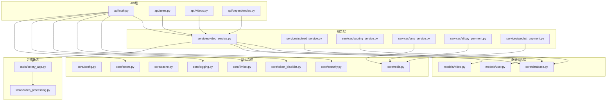
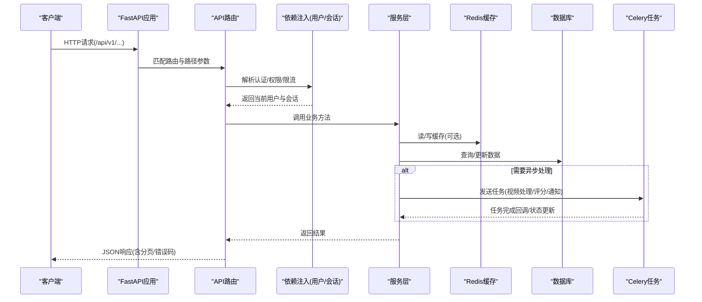
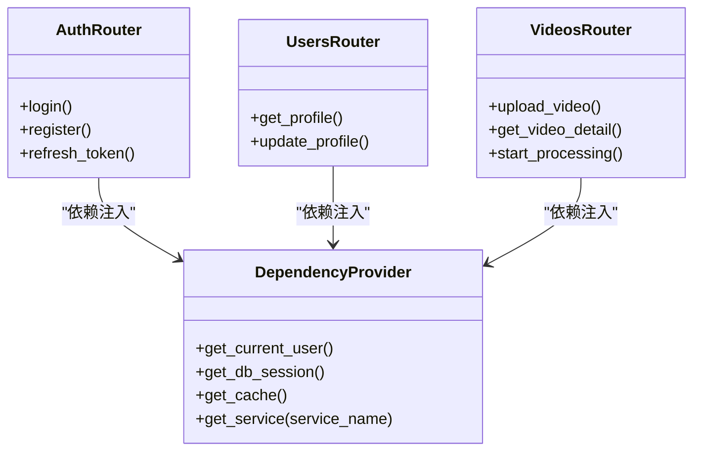
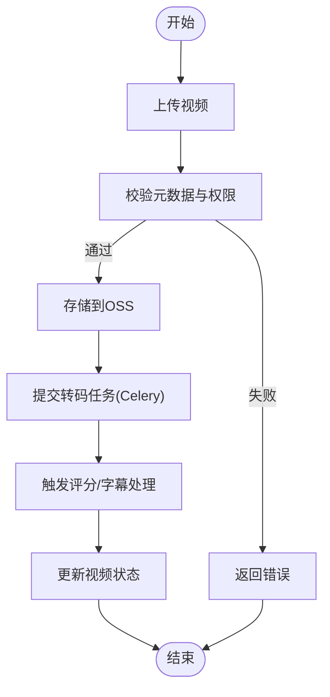
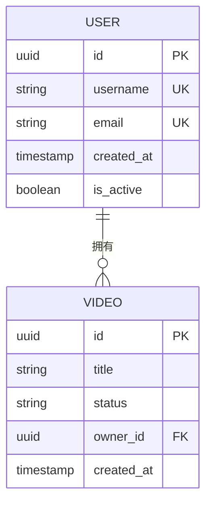
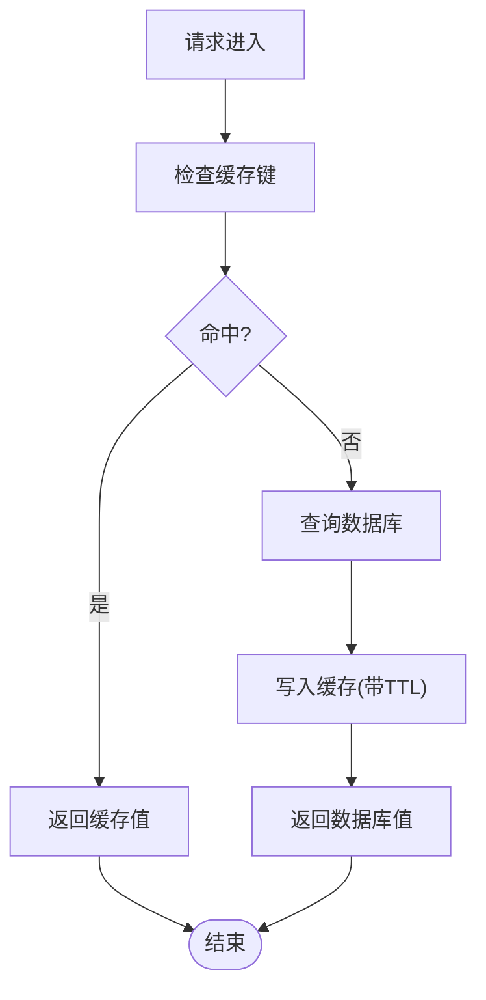
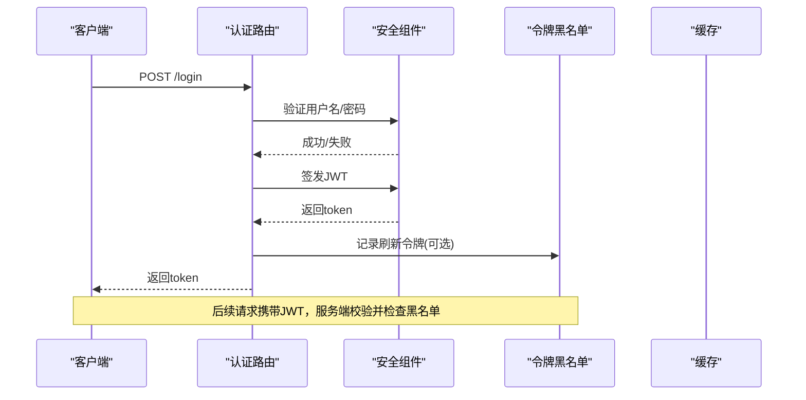
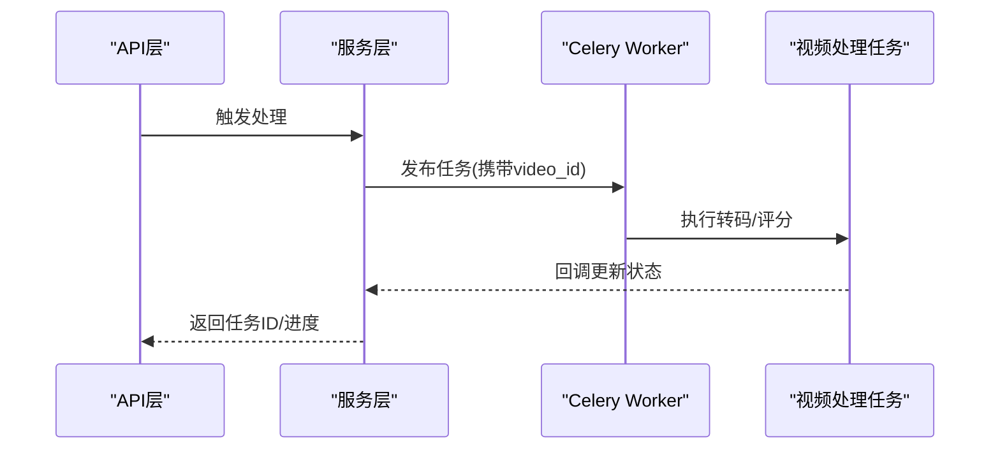
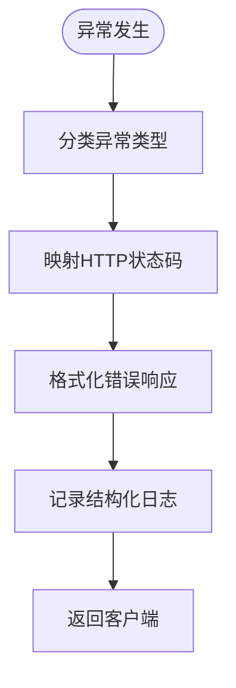
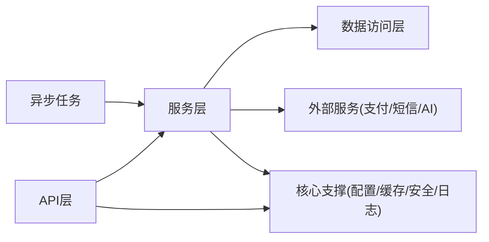

# 后端架构

<cite>
**本文引用的文件**
- [backend/app/main.py](file://backend/app/main.py)
- [backend/app/api/dependencies.py](file://backend/app/api/dependencies.py)
- [backend/app/core/config.py](file://backend/app/core/config.py)
- [backend/app/core/database.py](file://backend/app/core/database.py)
- [backend/app/core/redis.py](file://backend/app/core/redis.py)
- [backend/app/core/cache.py](file://backend/app/core/cache.py)
- [backend/app/core/security.py](file://backend/app/core/security.py)
- [backend/app/core/token_blacklist.py](file://backend/app/core/token_blacklist.py)
- [backend/app/core/errors.py](file://backend/app/core/errors.py)
- [backend/app/core/logging.py](file://backend/app/core/logging.py)
- [backend/app/core/limiter.py](file://backend/app/core/limiter.py)
- [backend/app/tasks/celery_app.py](file://backend/app/tasks/celery_app.py)
- [backend/app/tasks/video_processing.py](file://backend/app/tasks/video_processing.py)
- [backend/app/services/video_service.py](file://backend/app/services/video_service.py)
- [backend/app/services/upload_service.py](file://backend/app/services/upload_service.py)
- [backend/app/services/scoring_service.py](file://backend/app/services/scoring_service.py)
- [backend/app/services/sms_service.py](file://backend/app/services/sms_service.py)
- [backend/app/services/alipay_payment.py](file://backend/app/services/alipay_payment.py)
- [backend/app/services/wechat_payment.py](file://backend/app/services/wechat_payment.py)
- [backend/app/api/auth.py](file://backend/app/api/auth.py)
- [backend/app/api/users.py](file://backend/app/api/users.py)
- [backend/app/api/videos.py](file://backend/app/api/videos.py)
- [backend/app/models/user.py](file://backend/app/models/user.py)
- [backend/app/models/video.py](file://backend/app/models/video.py)
</cite>

## 目录
1. [简介](#简介)
2. [项目结构](#项目结构)
3. [核心组件](#核心组件)
4. [架构总览](#架构总览)
5. [详细组件分析](#详细组件分析)
6. [依赖关系分析](#依赖关系分析)
7. [性能考量](#性能考量)
8. [故障排查指南](#故障排查指南)
9. [结论](#结论)
10. [附录](#附录)

## 简介
本文件为Speaking平台后端架构的权威文档，聚焦基于FastAPI的分层架构设计：API层、服务层与数据访问层的职责划分；模块化设计原则、依赖注入模式与中间件机制；异步任务处理（Celery）、缓存策略（Redis）与数据库连接管理；安全认证、权限控制、错误处理与日志记录；API设计规范、请求响应格式与版本管理；扩展点设计与插件化集成模式。文档同时提供架构图与数据流图，帮助读者快速理解系统全貌与关键流程。

## 项目结构
后端采用清晰的模块分层组织：
- API层：按业务域拆分路由模块（如auth、users、videos等），统一使用依赖注入获取服务与资源。
- 服务层：封装领域逻辑与第三方调用（上传、评分、短信、支付、视频处理等）。
- 数据访问层：通过SQLAlchemy模型与数据库会话管理实现持久化。
- 核心支撑：配置、缓存、Redis、安全、限流、错误与日志等横切能力。
- 异步任务：Celery应用与任务定义，用于耗时操作（视频转码、评分、通知等）。

**图表来源**
- [backend/app/main.py:1-200](file://backend/app/main.py#L1-L200)
- [backend/app/api/dependencies.py:1-200](file://backend/app/api/dependencies.py#L1-L200)
- [backend/app/core/config.py:1-200](file://backend/app/core/config.py#L1-L200)
- [backend/app/core/database.py:1-200](file://backend/app/core/database.py#L1-L200)
- [backend/app/core/redis.py:1-200](file://backend/app/core/redis.py#L1-L200)
- [backend/app/core/cache.py:1-200](file://backend/app/core/cache.py#L1-L200)
- [backend/app/core/security.py:1-200](file://backend/app/core/security.py#L1-L200)
- [backend/app/core/token_blacklist.py:1-200](file://backend/app/core/token_blacklist.py#L1-L200)
- [backend/app/core/errors.py:1-200](file://backend/app/core/errors.py#L1-L200)
- [backend/app/core/logging.py:1-200](file://backend/app/core/logging.py#L1-L200)
- [backend/app/core/limiter.py:1-200](file://backend/app/core/limiter.py#L1-L200)
- [backend/app/tasks/celery_app.py:1-200](file://backend/app/tasks/celery_app.py#L1-L200)
- [backend/app/tasks/video_processing.py:1-200](file://backend/app/tasks/video_processing.py#L1-L200)
- [backend/app/services/video_service.py:1-200](file://backend/app/services/video_service.py#L1-L200)
- [backend/app/services/upload_service.py:1-200](file://backend/app/services/upload_service.py#L1-L200)
- [backend/app/services/scoring_service.py:1-200](file://backend/app/services/scoring_service.py#L1-L200)
- [backend/app/services/sms_service.py:1-200](file://backend/app/services/sms_service.py#L1-L200)
- [backend/app/services/alipay_payment.py:1-200](file://backend/app/services/alipay_payment.py#L1-L200)
- [backend/app/services/wechat_payment.py:1-200](file://backend/app/services/wechat_payment.py#L1-L200)
- [backend/app/api/auth.py:1-200](file://backend/app/api/auth.py#L1-L200)
- [backend/app/api/users.py:1-200](file://backend/app/api/users.py#L1-L200)
- [backend/app/api/videos.py:1-200](file://backend/app/api/videos.py#L1-L200)
- [backend/app/models/user.py:1-200](file://backend/app/models/user.py#L1-L200)
- [backend/app/models/video.py:1-200](file://backend/app/models/video.py#L1-L200)

**章节来源**
- [backend/app/main.py:1-200](file://backend/app/main.py#L1-L200)

## 核心组件
- 应用入口与中间件：FastAPI应用初始化、全局异常处理器、CORS、限流、日志、健康检查等。
- 配置中心：集中读取环境变量与配置文件，提供类型安全的配置对象。
- 数据库连接：SQLAlchemy引擎与会话生命周期管理，支持事务与连接池。
- Redis与缓存：连接池、键空间隔离、序列化策略、过期与失效策略。
- 安全与鉴权：JWT签发与校验、黑名单、密码哈希、权限校验装饰器。
- 错误处理：统一异常类型、HTTP状态码映射、结构化错误响应。
- 日志记录：结构化日志、请求追踪ID、敏感信息脱敏。
- 限流：基于IP或用户的速率限制，保护接口稳定性。
- 异步任务：Celery应用注册、任务编排、重试与幂等性保障。
- 服务层：领域逻辑聚合、外部服务适配（OSS、短信、支付、AI评分等）。
- API层：路由定义、参数校验、依赖注入、分页与版本前缀。

**章节来源**
- [backend/app/core/config.py:1-200](file://backend/app/core/config.py#L1-L200)
- [backend/app/core/database.py:1-200](file://backend/app/core/database.py#L1-L200)
- [backend/app/core/redis.py:1-200](file://backend/app/core/redis.py#L1-L200)
- [backend/app/core/cache.py:1-200](file://backend/app/core/cache.py#L1-L200)
- [backend/app/core/security.py:1-200](file://backend/app/core/security.py#L1-L200)
- [backend/app/core/token_blacklist.py:1-200](file://backend/app/core/token_blacklist.py#L1-L200)
- [backend/app/core/errors.py:1-200](file://backend/app/core/errors.py#L1-L200)
- [backend/app/core/logging.py:1-200](file://backend/app/core/logging.py#L1-L200)
- [backend/app/core/limiter.py:1-200](file://backend/app/core/limiter.py#L1-L200)
- [backend/app/tasks/celery_app.py:1-200](file://backend/app/tasks/celery_app.py#L1-L200)

## 架构总览
下图展示从客户端请求到服务层、数据层与异步任务的完整链路，以及缓存与安全组件的参与位置。

**图表来源**
- [backend/app/main.py:1-200](file://backend/app/main.py#L1-L200)
- [backend/app/api/dependencies.py:1-200](file://backend/app/api/dependencies.py#L1-L200)
- [backend/app/core/cache.py:1-200](file://backend/app/core/cache.py#L1-L200)
- [backend/app/core/database.py:1-200](file://backend/app/core/database.py#L1-L200)
- [backend/app/tasks/celery_app.py:1-200](file://backend/app/tasks/celery_app.py#L1-L200)

## 详细组件分析

### API层与依赖注入
- 路由组织：按功能域拆分（认证、用户、视频、学习、支付等），统一以/api/v1前缀进行版本管理。
- 依赖注入：通过FastAPI的Depends注入当前用户、数据库会话、缓存实例与服务对象，避免硬耦合。
- 参数校验：Pydantic Schema统一入参出参结构，自动校验与文档生成。
- 中间件：全局异常、日志、限流、CORS、请求追踪贯穿所有路由。

**图表来源**
- [backend/app/api/auth.py:1-200](file://backend/app/api/auth.py#L1-L200)
- [backend/app/api/users.py:1-200](file://backend/app/api/users.py#L1-L200)
- [backend/app/api/videos.py:1-200](file://backend/app/api/videos.py#L1-L200)
- [backend/app/api/dependencies.py:1-200](file://backend/app/api/dependencies.py#L1-L200)

**章节来源**
- [backend/app/api/dependencies.py:1-200](file://backend/app/api/dependencies.py#L1-L200)
- [backend/app/api/auth.py:1-200](file://backend/app/api/auth.py#L1-L200)
- [backend/app/api/users.py:1-200](file://backend/app/api/users.py#L1-L200)
- [backend/app/api/videos.py:1-200](file://backend/app/api/videos.py#L1-L200)

### 服务层与领域逻辑
- 视频服务：协调上传、转码、字幕处理、评分、推荐等流程，必要时触发异步任务。
- 上传服务：对接对象存储（OSS），处理分片、断点续传、元数据写入。
- 评分服务：调用AI模型或外部评分服务，结合质量评估与安全网策略。
- 短信服务：验证码发送、模板渲染、失败重试与频率限制。
- 支付服务：支付宝与微信支付适配器，统一订单创建、回调处理与对账。

**图表来源**
- [backend/app/services/video_service.py:1-200](file://backend/app/services/video_service.py#L1-L200)
- [backend/app/services/upload_service.py:1-200](file://backend/app/services/upload_service.py#L1-L200)
- [backend/app/services/scoring_service.py:1-200](file://backend/app/services/scoring_service.py#L1-L200)
- [backend/app/tasks/video_processing.py:1-200](file://backend/app/tasks/video_processing.py#L1-L200)

**章节来源**
- [backend/app/services/video_service.py:1-200](file://backend/app/services/video_service.py#L1-L200)
- [backend/app/services/upload_service.py:1-200](file://backend/app/services/upload_service.py#L1-L200)
- [backend/app/services/scoring_service.py:1-200](file://backend/app/services/scoring_service.py#L1-L200)

### 数据访问层与模型
- 模型定义：用户、视频、评论、收藏、学习计划等实体，包含字段约束与关系。
- 会话管理：每个请求创建独立会话，确保事务边界与并发安全。
- 查询优化：索引、分页、预加载与批量操作，减少N+1问题。

**图表来源**
- [backend/app/models/user.py:1-200](file://backend/app/models/user.py#L1-L200)
- [backend/app/models/video.py:1-200](file://backend/app/models/video.py#L1-L200)

**章节来源**
- [backend/app/models/user.py:1-200](file://backend/app/models/user.py#L1-L200)
- [backend/app/models/video.py:1-200](file://backend/app/models/video.py#L1-L200)
- [backend/app/core/database.py:1-200](file://backend/app/core/database.py#L1-L200)

### 缓存策略与Redis
- 连接管理：连接池、超时与重试策略，保证高可用。
- 键命名规范：按模块与实体维度隔离，避免冲突。
- 缓存策略：热点数据TTL、读写穿透防护、一致性更新。

**图表来源**
- [backend/app/core/redis.py:1-200](file://backend/app/core/redis.py#L1-L200)
- [backend/app/core/cache.py:1-200](file://backend/app/core/cache.py#L1-L200)

**章节来源**
- [backend/app/core/redis.py:1-200](file://backend/app/core/redis.py#L1-L200)
- [backend/app/core/cache.py:1-200](file://backend/app/core/cache.py#L1-L200)

### 安全认证与权限控制
- JWT：签发、刷新、黑名单校验，支持短期令牌与长期刷新令牌分离。
- 密码安全：强哈希算法、盐值随机化、登录失败锁定策略。
- 权限模型：基于角色的访问控制（RBAC），细粒度资源授权。

**图表来源**
- [backend/app/api/auth.py:1-200](file://backend/app/api/auth.py#L1-L200)
- [backend/app/core/security.py:1-200](file://backend/app/core/security.py#L1-L200)
- [backend/app/core/token_blacklist.py:1-200](file://backend/app/core/token_blacklist.py#L1-L200)

**章节来源**
- [backend/app/core/security.py:1-200](file://backend/app/core/security.py#L1-L200)
- [backend/app/core/token_blacklist.py:1-200](file://backend/app/core/token_blacklist.py#L1-L200)
- [backend/app/api/auth.py:1-200](file://backend/app/api/auth.py#L1-L200)

### 异步任务处理（Celery）
- 任务编排：视频转码、评分、通知、数据清洗等耗时操作。
- 可靠性：重试、死信队列、幂等性与去重键。
- 监控：任务状态、执行时长、失败告警。

**图表来源**
- [backend/app/tasks/celery_app.py:1-200](file://backend/app/tasks/celery_app.py#L1-L200)
- [backend/app/tasks/video_processing.py:1-200](file://backend/app/tasks/video_processing.py#L1-L200)

**章节来源**
- [backend/app/tasks/celery_app.py:1-200](file://backend/app/tasks/celery_app.py#L1-L200)
- [backend/app/tasks/video_processing.py:1-200](file://backend/app/tasks/video_processing.py#L1-L200)

### 错误处理与日志记录
- 统一异常：自定义异常类、HTTP状态码映射、错误码规范。
- 结构化日志：请求ID、用户ID、耗时、关键事件与堆栈。
- 敏感信息脱敏：密码、令牌、手机号等字段过滤。

**图表来源**
- [backend/app/core/errors.py:1-200](file://backend/app/core/errors.py#L1-L200)
- [backend/app/core/logging.py:1-200](file://backend/app/core/logging.py#L1-L200)

**章节来源**
- [backend/app/core/errors.py:1-200](file://backend/app/core/errors.py#L1-L200)
- [backend/app/core/logging.py:1-200](file://backend/app/core/logging.py#L1-L200)

### 中间件机制
- 全局中间件：CORS、请求追踪、限流、健康检查、审计日志。
- 路由级中间件：权限校验、速率限制、请求体大小限制。
- 可插拔：按环境启用/禁用，便于灰度与回滚。

**章节来源**
- [backend/app/core/limiter.py:1-200](file://backend/app/core/limiter.py#L1-L200)
- [backend/app/core/logging.py:1-200](file://backend/app/core/logging.py#L1-L200)

### 扩展点与插件架构
- 服务适配器：支付、短信、AI评分等通过抽象接口接入，便于替换与扩展。
- 任务插件：新增任务类型需注册到Celery应用，遵循统一签名与返回值约定。
- 配置开关：通过配置中心动态启用/禁用功能，支持A/B测试与灰度发布。

**章节来源**
- [backend/app/services/alipay_payment.py:1-200](file://backend/app/services/alipay_payment.py#L1-L200)
- [backend/app/services/wechat_payment.py:1-200](file://backend/app/services/wechat_payment.py#L1-L200)
- [backend/app/services/sms_service.py:1-200](file://backend/app/services/sms_service.py#L1-L200)
- [backend/app/tasks/celery_app.py:1-200](file://backend/app/tasks/celery_app.py#L1-L200)

## 依赖关系分析
- API层依赖服务层，服务层依赖数据访问层与外部服务。
- 核心支撑模块被各层共享，形成稳定的基础设施。
- 异步任务与服务层解耦，通过消息队列通信。

**图表来源**
- [backend/app/main.py:1-200](file://backend/app/main.py#L1-L200)
- [backend/app/api/dependencies.py:1-200](file://backend/app/api/dependencies.py#L1-L200)
- [backend/app/core/config.py:1-200](file://backend/app/core/config.py#L1-L200)
- [backend/app/core/database.py:1-200](file://backend/app/core/database.py#L1-L200)
- [backend/app/core/redis.py:1-200](file://backend/app/core/redis.py#L1-L200)
- [backend/app/core/cache.py:1-200](file://backend/app/core/cache.py#L1-L200)
- [backend/app/core/security.py:1-200](file://backend/app/core/security.py#L1-L200)
- [backend/app/core/token_blacklist.py:1-200](file://backend/app/core/token_blacklist.py#L1-L200)
- [backend/app/core/errors.py:1-200](file://backend/app/core/errors.py#L1-L200)
- [backend/app/core/logging.py:1-200](file://backend/app/core/logging.py#L1-L200)
- [backend/app/core/limiter.py:1-200](file://backend/app/core/limiter.py#L1-L200)
- [backend/app/tasks/celery_app.py:1-200](file://backend/app/tasks/celery_app.py#L1-L200)

**章节来源**
- [backend/app/main.py:1-200](file://backend/app/main.py#L1-L200)

## 性能考量
- 数据库：连接池大小、查询优化、索引设计、读写分离（未来）。
- 缓存：热点数据优先、合理TTL、缓存击穿/雪崩防护。
- 异步：任务拆分、批处理、背压与限流。
- 网络：超时与重试、熔断与降级、CDN与静态资源加速。
- 监控：指标采集、慢查询分析、分布式追踪。

[本节为通用指导，不直接分析具体文件]

## 故障排查指南
- 常见问题：认证失败、令牌过期、权限不足、数据库连接超时、Redis不可用、任务失败。
- 定位手段：查看结构化日志、错误码与堆栈、任务状态与重试次数。
- 恢复策略：重启服务、清理锁与脏数据、回滚变更、扩容与降级。

**章节来源**
- [backend/app/core/errors.py:1-200](file://backend/app/core/errors.py#L1-L200)
- [backend/app/core/logging.py:1-200](file://backend/app/core/logging.py#L1-L200)
- [backend/app/core/limiter.py:1-200](file://backend/app/core/limiter.py#L1-L200)

## 结论
本架构以FastAPI为核心，采用清晰的分层与模块化设计，结合依赖注入、中间件与统一错误处理，构建了可扩展、高可用的后端系统。通过Celery异步任务与Redis缓存，有效提升了吞吐与响应速度。安全认证与权限控制保障了数据安全与合规。未来可进一步引入读写分离、服务网格与更完善的可观测性体系。

[本节为总结性内容，不直接分析具体文件]

## 附录
- API设计规范：RESTful风格、统一错误码、分页与排序、版本前缀/api/v1。
- 请求响应格式：JSON为主，字段命名规范、必填项与类型约束明确。
- 版本管理：兼容变更策略、弃用标记、迁移脚本与回滚方案。
- 第三方集成：适配器模式、配置开关、密钥管理与限流保护。

[本节为补充说明，不直接分析具体文件]
