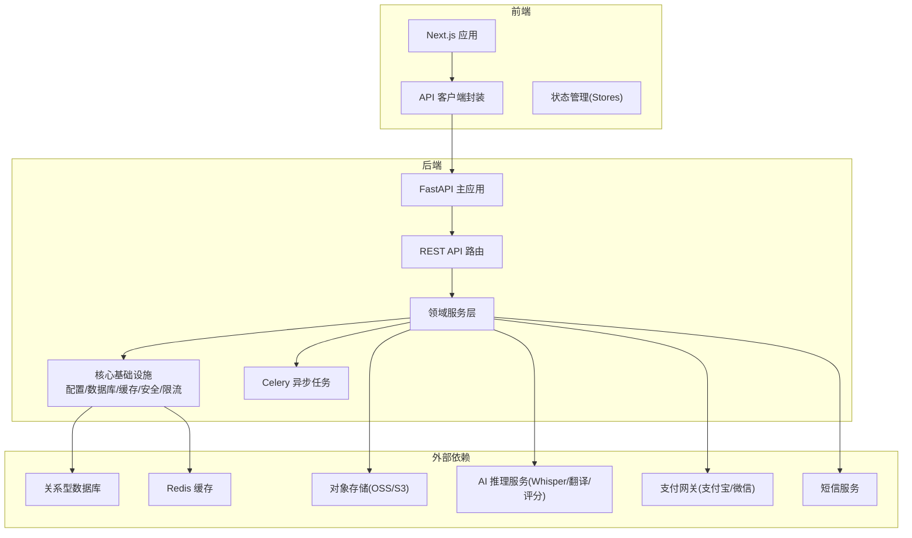
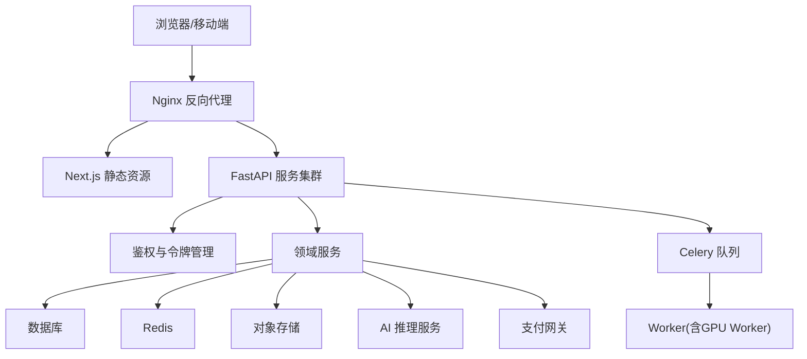
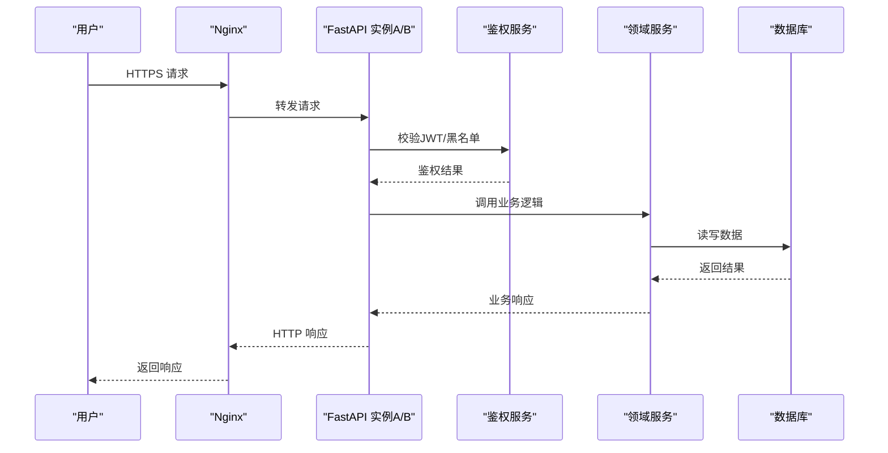
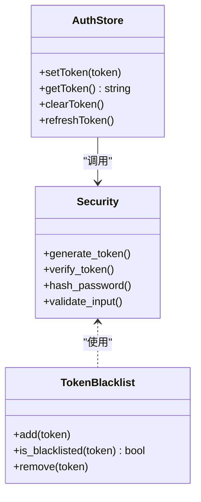
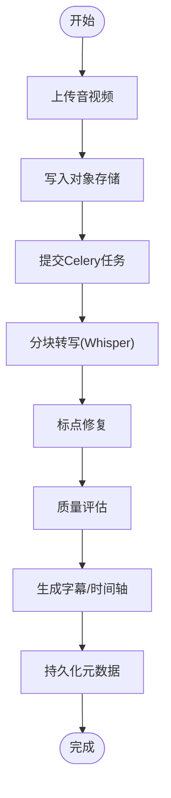
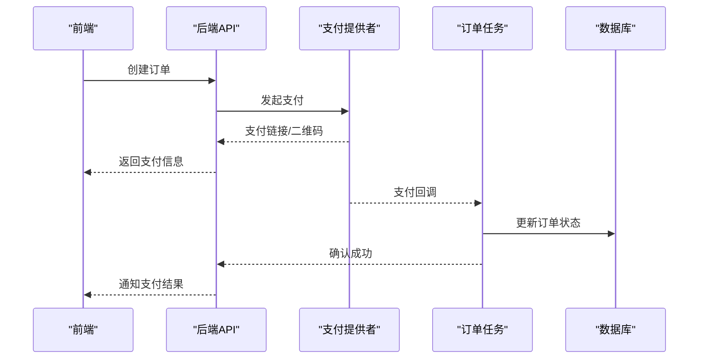
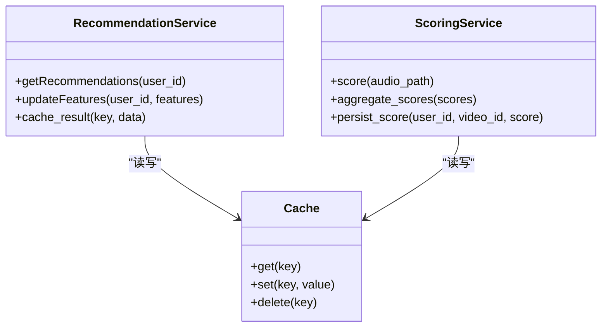
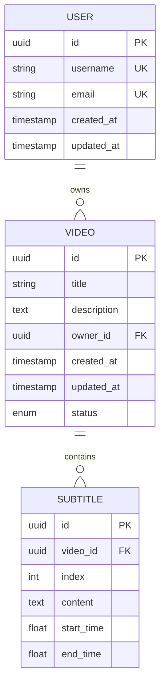
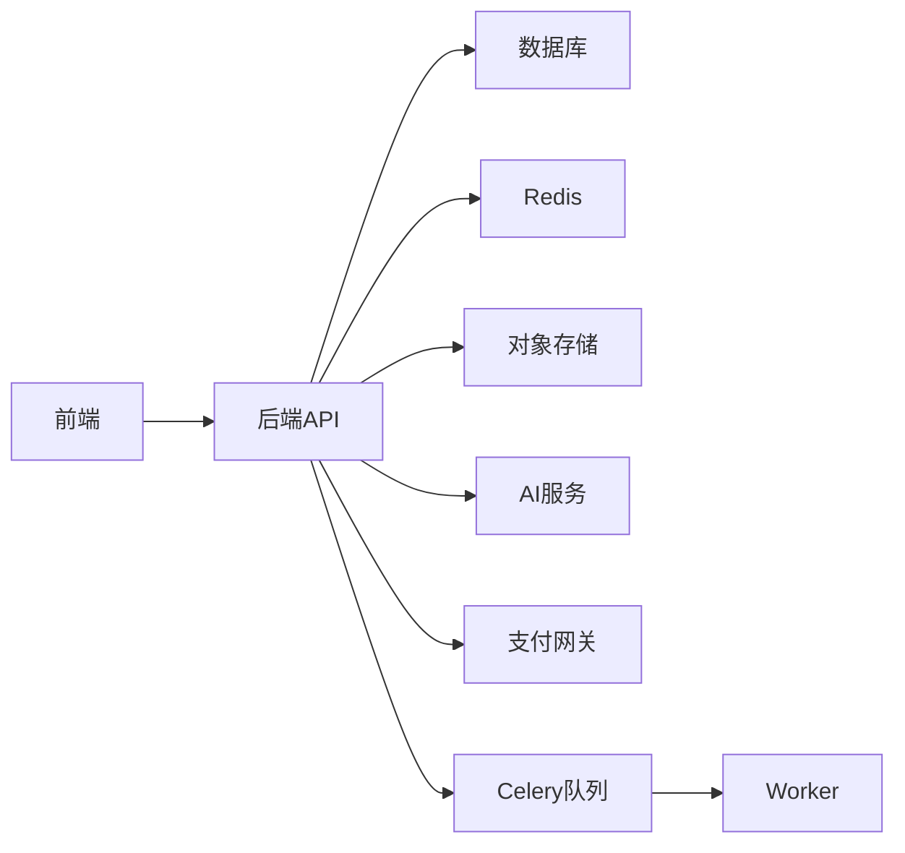

# 架构设计

<cite>
**本文引用的文件**
- [backend/app/main.py](file://backend/app/main.py)
- [backend/app/api/dependencies.py](file://backend/app/api/dependencies.py)
- [backend/app/core/config.py](file://backend/app/core/config.py)
- [backend/app/core/database.py](file://backend/app/core/database.py)
- [backend/app/core/redis.py](file://backend/app/core/redis.py)
- [backend/app/core/security.py](file://backend/app/core/security.py)
- [backend/app/core/token_blacklist.py](file://backend/app/core/token_blacklist.py)
- [backend/app/core/cache.py](file://backend/app/core/cache.py)
- [backend/app/core/errors.py](file://backend/app/core/errors.py)
- [backend/app/core/limiter.py](file://backend/app/core/limiter.py)
- [backend/app/services/video_service.py](file://backend/app/services/video_service.py)
- [backend/app/services/upload_service.py](file://backend/app/services/upload_service.py)
- [backend/app/services/transcription/chunked_transcription.py](file://backend/app/services/transcription/chunked_transcription.py)
- [backend/app/services/transcription/whisper_model.py](file://backend/app/services/transcription/whisper_model.py)
- [backend/app/services/translation/engines.py](file://backend/app/services/translation/engines.py)
- [backend/app/services/scoring_service.py](file://backend/app/services/scoring_service.py)
- [backend/app/services/recommendation_service.py](file://backend/app/services/recommendation_service.py)
- [backend/app/services/payment_provider.py](file://backend/app/services/payment_provider.py)
- [backend/app/services/alipay_payment.py](file://backend/app/services/alipay_payment.py)
- [backend/app/services/wechat_payment.py](file://backend/app/services/wechat_payment.py)
- [backend/app/tasks/celery_app.py](file://backend/app/tasks/celery_app.py)
- [backend/app/tasks/video_processing.py](file://backend/app/tasks/video_processing.py)
- [backend/app/tasks/order_tasks.py](file://backend/app/tasks/order_tasks.py)
- [backend/app/models/user.py](file://backend/app/models/user.py)
- [backend/app/models/video.py](file://backend/app/models/video.py)
- [backend/app/schemas/common.py](file://backend/app/schemas/common.py)
- [frontend/src/lib/api.ts](file://frontend/src/lib/api.ts)
- [frontend/src/lib/createApiClient.ts](file://frontend/src/lib/createApiClient.ts)
- [frontend/src/stores/authStore.ts](file://frontend/src/stores/authStore.ts)
- [nginx.conf](file://nginx.conf)
- [docker-compose.yml](file://docker-compose.yml)
- [docker-compose.prod.yml](file://docker-compose.prod.yml)
- [backend/Dockerfile](file://backend/Dockerfile)
- [frontend/Dockerfile](file://frontend/Dockerfile)
- [docs/architecture/SYSTEM-MAP.md](file://docs/architecture/SYSTEM-MAP.md)
- [docs/architecture/FRONTEND-ARCHITECTURE.md](file://docs/architecture/FRONTEND-ARCHITECTURE.md)
- [docs/operations/PRODUCTION.md](file://docs/operations/PRODUCTION.md)
- [docs/operations/GPU-WORKER-SETUP.md](file://docs/operations/GPU-WORKER-SETUP.md)
- [docs/operations/RUNBOOK.md](file://docs/operations/RUNBOOK.md)
- [docs/operations/SECURITY.md](file://docs/operations/SECURITY.md)
- [AGENTS.md](file://AGENTS.md)
</cite>

## 目录
1. [引言](#引言)
2. [项目结构](#项目结构)
3. [核心组件](#核心组件)
4. [架构总览](#架构总览)
5. [详细组件分析](#详细组件分析)
6. [依赖关系分析](#依赖关系分析)
7. [性能考量](#性能考量)
8. [故障排查指南](#故障排查指南)
9. [结论](#结论)
10. [附录](#附录)

## 引言
本架构设计文档面向Speaking平台，目标是提供一份全面、可落地的系统级设计说明。内容涵盖前后端分离与微服务化原则、核心组件交互、数据流与通信协议、技术选型与权衡、基础设施与部署拓扑、可扩展性策略、横切关注点（安全、监控、灾难恢复）、API网关与负载均衡、服务发现机制，以及第三方依赖与版本兼容性。文档同时给出系统上下文图与组件分解图，帮助读者从宏观到微观理解系统全貌。

## 项目结构
项目采用前后端分离与模块化后端组织：
- 前端：Next.js应用，包含页面路由、组件库、状态管理、API客户端封装与类型定义。
- 后端：Python FastAPI应用，按领域划分API、模型、服务、任务与核心基础设施。
- 运维：Nginx作为反向代理与静态资源分发，Docker Compose编排开发/生产环境，Celery异步任务队列处理耗时任务。
- 文档：架构决策记录、运行手册、GPU工作节点配置等。

**图表来源**
- [backend/app/main.py:1-200](file://backend/app/main.py#L1-L200)
- [backend/app/api/dependencies.py:1-200](file://backend/app/api/dependencies.py#L1-L200)
- [backend/app/core/config.py:1-200](file://backend/app/core/config.py#L1-L200)
- [backend/app/core/database.py:1-200](file://backend/app/core/database.py#L1-L200)
- [backend/app/core/redis.py:1-200](file://backend/app/core/redis.py#L1-L200)
- [backend/app/tasks/celery_app.py:1-200](file://backend/app/tasks/celery_app.py#L1-L200)
- [frontend/src/lib/api.ts:1-200](file://frontend/src/lib/api.ts#L1-L200)
- [frontend/src/lib/createApiClient.ts:1-200](file://frontend/src/lib/createApiClient.ts#L1-L200)

**章节来源**
- [docs/architecture/SYSTEM-MAP.md:1-200](file://docs/architecture/SYSTEM-MAP.md#L1-L200)
- [docs/architecture/FRONTEND-ARCHITECTURE.md:1-200](file://docs/architecture/FRONTEND-ARCHITECTURE.md#L1-L200)
- [docker-compose.yml:1-200](file://docker-compose.yml#L1-L200)
- [docker-compose.prod.yml:1-200](file://docker-compose.prod.yml#L1-L200)

## 核心组件
- 应用入口与路由：FastAPI主应用集中注册路由与中间件，统一错误处理、鉴权、限流与日志。
- 领域服务层：视频、字幕、学习、推荐、支付、通知、行为分析等业务能力抽象为服务模块。
- 核心基础设施：配置中心、数据库连接池、Redis缓存、安全与令牌黑名单、速率限制、统一异常。
- 异步任务：Celery任务编排视频处理、订单流程、评分计算、计划生成等耗时操作。
- 前端客户端：统一的API客户端封装、认证状态管理、错误处理与重试策略。

**章节来源**
- [backend/app/main.py:1-200](file://backend/app/main.py#L1-L200)
- [backend/app/api/dependencies.py:1-200](file://backend/app/api/dependencies.py#L1-L200)
- [backend/app/core/config.py:1-200](file://backend/app/core/config.py#L1-L200)
- [backend/app/core/database.py:1-200](file://backend/app/core/database.py#L1-L200)
- [backend/app/core/redis.py:1-200](file://backend/app/core/redis.py#L1-L200)
- [backend/app/core/security.py:1-200](file://backend/app/core/security.py#L1-L200)
- [backend/app/core/token_blacklist.py:1-200](file://backend/app/core/token_blacklist.py#L1-L200)
- [backend/app/core/cache.py:1-200](file://backend/app/core/cache.py#L1-L200)
- [backend/app/core/errors.py:1-200](file://backend/app/core/errors.py#L1-L200)
- [backend/app/core/limiter.py:1-200](file://backend/app/core/limiter.py#L1-L200)
- [backend/app/services/video_service.py:1-200](file://backend/app/services/video_service.py#L1-L200)
- [backend/app/services/upload_service.py:1-200](file://backend/app/services/upload_service.py#L1-L200)
- [backend/app/tasks/celery_app.py:1-200](file://backend/app/tasks/celery_app.py#L1-L200)
- [frontend/src/lib/api.ts:1-200](file://frontend/src/lib/api.ts#L1-L200)
- [frontend/src/lib/createApiClient.ts:1-200](file://frontend/src/lib/createApiClient.ts#L1-L200)
- [frontend/src/stores/authStore.ts:1-200](file://frontend/src/stores/authStore.ts#L1-L200)

## 架构总览
系统采用前后端分离与微服务化原则：
- 前端通过HTTPS访问Nginx，Nginx将请求转发至后端API或静态资源。
- 后端以FastAPI提供服务，使用JWT进行身份认证，结合Redis实现令牌黑名单与限流。
- 业务逻辑下沉至服务层，持久化通过ORM访问数据库，热点数据通过Redis缓存。
- 耗时任务通过Celery异步执行，支持GPU工作节点加速语音识别与转写。
- 对象存储用于音视频与字幕文件，支付网关对接支付宝与微信支付。

**图表来源**
- [nginx.conf:1-200](file://nginx.conf#L1-L200)
- [backend/app/main.py:1-200](file://backend/app/main.py#L1-L200)
- [backend/app/core/security.py:1-200](file://backend/app/core/security.py#L1-L200)
- [backend/app/core/token_blacklist.py:1-200](file://backend/app/core/token_blacklist.py#L1-L200)
- [backend/app/core/limiter.py:1-200](file://backend/app/core/limiter.py#L1-L200)
- [backend/app/tasks/celery_app.py:1-200](file://backend/app/tasks/celery_app.py#L1-L200)
- [docs/operations/GPU-WORKER-SETUP.md:1-200](file://docs/operations/GPU-WORKER-SETUP.md#L1-L200)

**章节来源**
- [docs/architecture/SYSTEM-MAP.md:1-200](file://docs/architecture/SYSTEM-MAP.md#L1-L200)
- [docs/operations/PRODUCTION.md:1-200](file://docs/operations/PRODUCTION.md#L1-L200)

## 详细组件分析

### API网关与负载均衡
- Nginx作为统一入口，负责TLS终止、静态资源缓存、请求转发与基础限流。
- 多实例后端服务通过Nginx轮询或加权策略进行负载均衡。
- 健康检查与熔断可通过上游健康探针与超时配置实现。

**图表来源**
- [nginx.conf:1-200](file://nginx.conf#L1-L200)
- [backend/app/core/security.py:1-200](file://backend/app/core/security.py#L1-L200)
- [backend/app/core/token_blacklist.py:1-200](file://backend/app/core/token_blacklist.py#L1-L200)

**章节来源**
- [nginx.conf:1-200](file://nginx.conf#L1-L200)
- [backend/app/core/limiter.py:1-200](file://backend/app/core/limiter.py#L1-L200)

### 认证与安全
- 使用JWT进行无状态鉴权，配合Redis实现令牌黑名单与短期刷新。
- 密码哈希、敏感配置加密、CORS与CSRF防护在核心安全模块中统一实现。
- 登录态由前端状态管理维护，并在API请求头携带令牌。

**图表来源**
- [backend/app/core/security.py:1-200](file://backend/app/core/security.py#L1-L200)
- [backend/app/core/token_blacklist.py:1-200](file://backend/app/core/token_blacklist.py#L1-L200)
- [frontend/src/stores/authStore.ts:1-200](file://frontend/src/stores/authStore.ts#L1-L200)

**章节来源**
- [backend/app/core/security.py:1-200](file://backend/app/core/security.py#L1-L200)
- [backend/app/core/token_blacklist.py:1-200](file://backend/app/core/token_blacklist.py#L1-L200)
- [frontend/src/stores/authStore.ts:1-200](file://frontend/src/stores/authStore.ts#L1-L200)

### 视频处理流水线
- 上传服务接收音视频文件并写入对象存储，触发异步任务。
- Celery任务编排转写、分句、标点修复、质量评估与字幕生成。
- Whisper模型与分块转写提升长音频处理能力，GPU Worker加速推理。

**图表来源**
- [backend/app/services/upload_service.py:1-200](file://backend/app/services/upload_service.py#L1-L200)
- [backend/app/tasks/video_processing.py:1-200](file://backend/app/tasks/video_processing.py#L1-L200)
- [backend/app/services/transcription/chunked_transcription.py:1-200](file://backend/app/services/transcription/chunked_transcription.py#L1-L200)
- [backend/app/services/transcription/whisper_model.py:1-200](file://backend/app/services/transcription/whisper_model.py#L1-L200)

**章节来源**
- [backend/app/services/upload_service.py:1-200](file://backend/app/services/upload_service.py#L1-L200)
- [backend/app/tasks/video_processing.py:1-200](file://backend/app/tasks/video_processing.py#L1-L200)
- [backend/app/services/transcription/chunked_transcription.py:1-200](file://backend/app/services/transcription/chunked_transcription.py#L1-L200)
- [backend/app/services/transcription/whisper_model.py:1-200](file://backend/app/services/transcription/whisper_model.py#L1-L200)
- [docs/operations/GPU-WORKER-SETUP.md:1-200](file://docs/operations/GPU-WORKER-SETUP.md#L1-L200)

### 支付与订单流程
- 支付提供者接口抽象，具体实现包括支付宝与微信支付。
- 订单任务处理支付回调、状态同步与对账。
- 幂等性与重试机制确保资金安全。

**图表来源**
- [backend/app/services/payment_provider.py:1-200](file://backend/app/services/payment_provider.py#L1-L200)
- [backend/app/services/alipay_payment.py:1-200](file://backend/app/services/alipay_payment.py#L1-L200)
- [backend/app/services/wechat_payment.py:1-200](file://backend/app/services/wechat_payment.py#L1-L200)
- [backend/app/tasks/order_tasks.py:1-200](file://backend/app/tasks/order_tasks.py#L1-L200)

**章节来源**
- [backend/app/services/payment_provider.py:1-200](file://backend/app/services/payment_provider.py#L1-L200)
- [backend/app/services/alipay_payment.py:1-200](file://backend/app/services/alipay_payment.py#L1-L200)
- [backend/app/services/wechat_payment.py:1-200](file://backend/app/services/wechat_payment.py#L1-L200)
- [backend/app/tasks/order_tasks.py:1-200](file://backend/app/tasks/order_tasks.py#L1-L200)

### 推荐与评分服务
- 推荐服务基于用户行为与内容特征生成个性化列表。
- 评分服务对口语输出进行多维度打分，结合AI能力与规则引擎。
- 缓存热点推荐结果，降低数据库压力。

**图表来源**
- [backend/app/services/recommendation_service.py:1-200](file://backend/app/services/recommendation_service.py#L1-L200)
- [backend/app/services/scoring_service.py:1-200](file://backend/app/services/scoring_service.py#L1-L200)
- [backend/app/core/cache.py:1-200](file://backend/app/core/cache.py#L1-L200)

**章节来源**
- [backend/app/services/recommendation_service.py:1-200](file://backend/app/services/recommendation_service.py#L1-L200)
- [backend/app/services/scoring_service.py:1-200](file://backend/app/services/scoring_service.py#L1-L200)
- [backend/app/core/cache.py:1-200](file://backend/app/core/cache.py#L1-L200)

### 数据模型与持久化
- 用户、视频、字幕、学习记录等实体通过ORM映射，支持迁移与版本控制。
- 索引与约束保证查询性能与数据一致性。
- 读写分离与连接池优化高并发场景。

**图表来源**
- [backend/app/models/user.py:1-200](file://backend/app/models/user.py#L1-L200)
- [backend/app/models/video.py:1-200](file://backend/app/models/video.py#L1-L200)

**章节来源**
- [backend/app/models/user.py:1-200](file://backend/app/models/user.py#L1-L200)
- [backend/app/models/video.py:1-200](file://backend/app/models/video.py#L1-L200)
- [backend/app/core/database.py:1-200](file://backend/app/core/database.py#L1-L200)

## 依赖关系分析
- 前端依赖后端REST API，通过统一客户端封装处理鉴权、错误与重试。
- 后端依赖数据库、Redis、对象存储、AI服务与支付网关。
- Celery任务与Worker解耦业务逻辑，支持水平扩展。

**图表来源**
- [frontend/src/lib/api.ts:1-200](file://frontend/src/lib/api.ts#L1-L200)
- [backend/app/main.py:1-200](file://backend/app/main.py#L1-L200)
- [backend/app/core/database.py:1-200](file://backend/app/core/database.py#L1-L200)
- [backend/app/core/redis.py:1-200](file://backend/app/core/redis.py#L1-L200)
- [backend/app/tasks/celery_app.py:1-200](file://backend/app/tasks/celery_app.py#L1-L200)

**章节来源**
- [frontend/src/lib/api.ts:1-200](file://frontend/src/lib/api.ts#L1-L200)
- [backend/app/core/database.py:1-200](file://backend/app/core/database.py#L1-L200)
- [backend/app/core/redis.py:1-200](file://backend/app/core/redis.py#L1-L200)
- [backend/app/tasks/celery_app.py:1-200](file://backend/app/tasks/celery_app.py#L1-L200)

## 性能考量
- 缓存策略：热点数据入Redis，减少数据库压力；缓存失效与更新策略需明确。
- 异步处理：视频转写、评分、推荐预计算等耗时任务放入Celery队列，避免阻塞请求。
- 连接池与限流：数据库与Redis连接池优化，API限流防止滥用。
- GPU加速：语音识别与转写使用GPU Worker提升吞吐。
- 静态资源：Nginx缓存与CDN加速前端资源加载。

[本节为通用指导，不直接分析具体文件]

## 故障排查指南
- 日志与监控：统一日志格式，接入集中式日志与指标采集，关键路径埋点。
- 错误处理：统一异常码与错误响应，便于前端展示与调试。
- 健康检查：服务健康探针与依赖可用性检测，快速定位问题。
- 回滚与降级：数据库迁移回滚策略，AI服务不可用时的降级方案。

**章节来源**
- [backend/app/core/errors.py:1-200](file://backend/app/core/errors.py#L1-L200)
- [backend/app/core/logging.py:1-200](file://backend/app/core/logging.py#L1-L200)
- [docs/operations/RUNBOOK.md:1-200](file://docs/operations/RUNBOOK.md#L1-L200)
- [docs/operations/SECURITY.md:1-200](file://docs/operations/SECURITY.md#L1-L200)

## 结论
Speaking平台采用前后端分离与微服务化架构，通过Nginx、FastAPI、Celery与Redis等组件构建高可用、可扩展的系统。核心业务如视频处理、支付、推荐与评分均通过服务层解耦，异步任务与GPU加速保障性能。安全、监控与灾难恢复贯穿系统设计，确保稳定运行与快速恢复。

[本节为总结，不直接分析具体文件]

## 附录
- 技术栈：Next.js、FastAPI、PostgreSQL、Redis、Celery、Nginx、Docker。
- 第三方依赖：对象存储、AI推理服务、支付网关、短信服务。
- 版本兼容：Python版本、Node版本、依赖包版本锁定与升级策略。
- 部署拓扑：开发环境与生产环境差异，容器编排与扩缩容策略。

**章节来源**
- [backend/Dockerfile:1-200](file://backend/Dockerfile#L1-L200)
- [frontend/Dockerfile:1-200](file://frontend/Dockerfile#L1-L200)
- [docker-compose.yml:1-200](file://docker-compose.yml#L1-L200)
- [docker-compose.prod.yml:1-200](file://docker-compose.prod.yml#L1-L200)
- [AGENTS.md:1-200](file://AGENTS.md#L1-L200)
