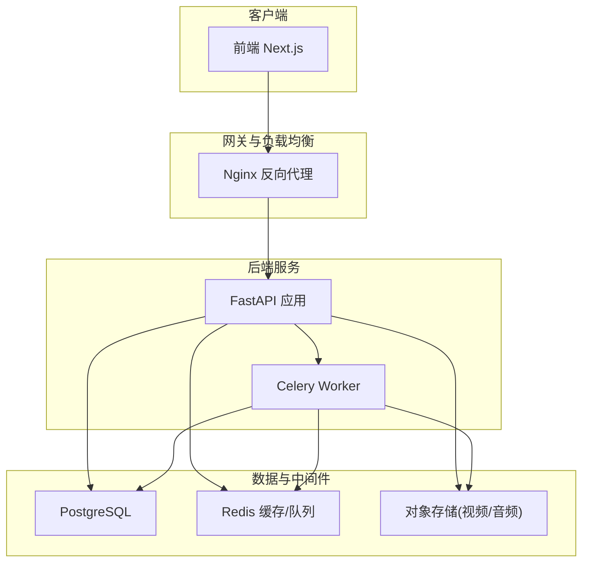
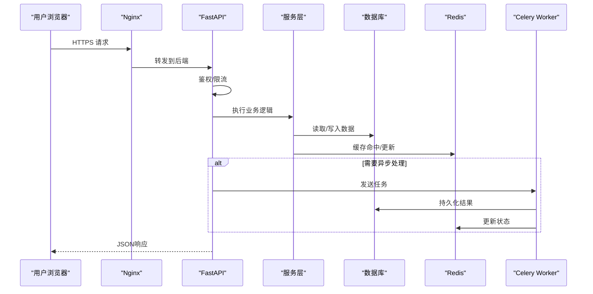
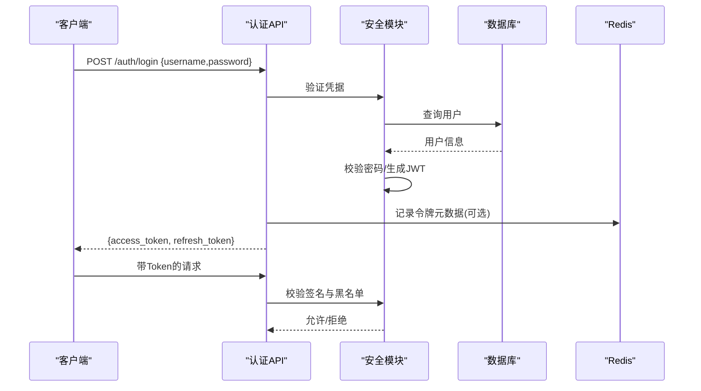
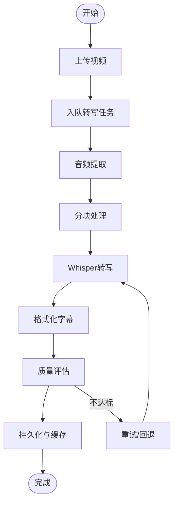
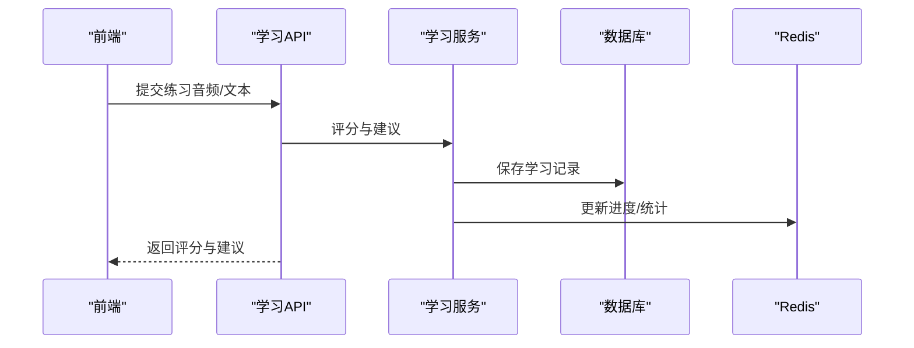
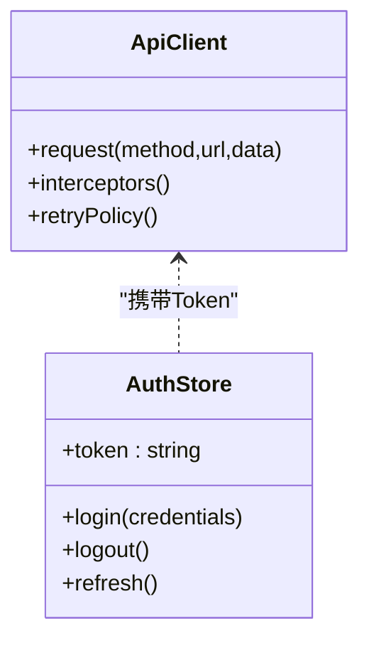
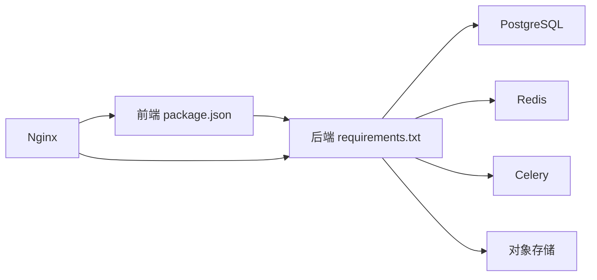
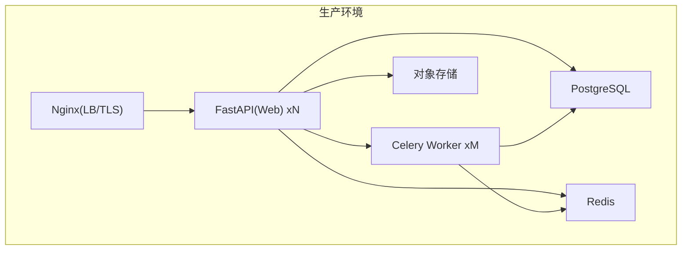

# 系统概览

<cite>
**本文引用的文件**
- [backend/app/main.py](file://backend/app/main.py)
- [backend/app/api/v1/auth.py](file://backend/app/api/v1/auth.py)
- [backend/app/api/v1/users.py](file://backend/app/api/v1/users.py)
- [backend/app/api/v1/videos.py](file://backend/app/api/v1/videos.py)
- [backend/app/api/v1/learning.py](file://backend/app/api/v1/learning.py)
- [backend/app/core/config.py](file://backend/app/core/config.py)
- [backend/app/core/database.py](file://backend/app/core/database.py)
- [backend/app/core/cache.py](file://backend/app/core/cache.py)
- [backend/app/core/security.py](file://backend/app/core/security.py)
- [backend/app/services/video_service.py](file://backend/app/services/video_service.py)
- [backend/app/services/transcription/audio_extractor.py](file://backend/app/services/transcription/audio_extractor.py)
- [backend/app/services/transcription/chunked_transcription.py](file://backend/app/services/transcription/chunked_transcription.py)
- [backend/app/services/transcription/whisper_model.py](file://backend/app/services/transcription/whisper_model.py)
- [backend/app/tasks/celery_app.py](file://backend/app/tasks/celery_app.py)
- [backend/app/tasks/video_processing.py](file://backend/app/tasks/video_processing.py)
- [frontend/src/lib/api.ts](file://frontend/src/lib/api.ts)
- [frontend/src/lib/createApiClient.ts](file://frontend/src/lib/createApiClient.ts)
- [frontend/src/stores/authStore.ts](file://frontend/src/stores/authStore.ts)
- [nginx.conf](file://nginx.conf)
- [docker-compose.yml](file://docker-compose.yml)
- [Dockerfile](file://backend/Dockerfile)
- [requirements.txt](file://backend/requirements.txt)
- [package.json](file://frontend/package.json)
</cite>

## 目录
1. [简介](#简介)
2. [项目结构](#项目结构)
3. [核心组件](#核心组件)
4. [架构总览](#架构总览)
5. [详细组件分析](#详细组件分析)
6. [依赖关系分析](#依赖关系分析)
7. [性能考量](#性能考量)
8. [故障排查指南](#故障排查指南)
9. [结论](#结论)
10. [附录](#附录)

## 简介
本文件为Speaking平台的系统概览文档，面向产品、研发与运维人员，帮助快速理解平台整体架构、技术栈选择、前后端分离设计、微服务原则、组件交互、数据流向、通信协议与集成点，以及基础设施需求、可扩展性、部署拓扑和横切关注点（安全、监控、灾难恢复）。

## 项目结构
- 前端：Next.js应用，采用路由即页面组织方式，API客户端集中管理，状态管理使用轻量store。
- 后端：Python FastAPI应用，按领域划分API版本v1，核心能力通过services层封装，异步任务由Celery驱动，数据库与缓存通过core层统一接入。
- 基础设施：Nginx作为反向代理与静态资源入口；容器化编排使用docker-compose；构建镜像基于官方基础镜像。

**图示来源**
- [nginx.conf](file://nginx.conf)
- [backend/app/main.py](file://backend/app/main.py)
- [backend/app/tasks/celery_app.py](file://backend/app/tasks/celery_app.py)
- [docker-compose.yml](file://docker-compose.yml)

**章节来源**
- [backend/app/main.py](file://backend/app/main.py)
- [frontend/src/lib/api.ts](file://frontend/src/lib/api.ts)
- [nginx.conf](file://nginx.conf)
- [docker-compose.yml](file://docker-compose.yml)

## 核心组件
- API网关与路由：Nginx将HTTP请求转发至后端FastAPI服务，提供TLS终止、静态资源托管与限流策略。
- 业务API层：按领域划分的REST接口，如认证、用户、视频、学习等，统一鉴权与参数校验。
- 服务层：封装复杂业务逻辑，如视频处理、转写、翻译、推荐、评分等。
- 任务队列：Celery负责耗时任务（转写、字幕处理、视频审核流水线），支持重试与幂等。
- 数据访问：SQLAlchemy模型+迁移，Redis用于缓存与会话/令牌黑名单。
- 前端应用：Next.js页面与组件，集中式API客户端与状态管理。

**章节来源**
- [backend/app/api/v1/auth.py](file://backend/app/api/v1/auth.py)
- [backend/app/api/v1/users.py](file://backend/app/api/v1/users.py)
- [backend/app/api/v1/videos.py](file://backend/app/api/v1/videos.py)
- [backend/app/api/v1/learning.py](file://backend/app/api/v1/learning.py)
- [backend/app/services/video_service.py](file://backend/app/services/video_service.py)
- [backend/app/tasks/celery_app.py](file://backend/app/tasks/celery_app.py)
- [backend/app/core/database.py](file://backend/app/core/database.py)
- [backend/app/core/cache.py](file://backend/app/core/cache.py)
- [frontend/src/lib/api.ts](file://frontend/src/lib/api.ts)
- [frontend/src/stores/authStore.ts](file://frontend/src/stores/authStore.ts)

## 架构总览
- 前后端分离：前端通过HTTPS调用后端REST API，JWT进行身份认证，跨域由Nginx与后端共同配置。
- 微服务原则：当前为单体FastAPI，但按领域拆分API与服务层，便于未来拆分为独立服务；任务队列解耦耗时流程。
- 数据流：请求经Nginx进入FastAPI，鉴权后进入服务层，读写数据库与缓存，必要时触发Celery任务。
- 通信协议：HTTP/HTTPS REST；内部任务通过Redis消息队列；外部集成（支付、短信、AI）通过HTTP或SDK。

**图示来源**
- [nginx.conf](file://nginx.conf)
- [backend/app/main.py](file://backend/app/main.py)
- [backend/app/core/security.py](file://backend/app/core/security.py)
- [backend/app/core/database.py](file://backend/app/core/database.py)
- [backend/app/core/cache.py](file://backend/app/core/cache.py)
- [backend/app/tasks/celery_app.py](file://backend/app/tasks/celery_app.py)

## 详细组件分析

### 认证与授权
- 流程：登录获取JWT，后续请求携带Authorization头；服务端校验签名与黑名单；权限控制基于角色与资源。
- 关键点：密码哈希、刷新令牌、短信验证码登录、令牌黑名单防重放。

**图示来源**
- [backend/app/api/v1/auth.py](file://backend/app/api/v1/auth.py)
- [backend/app/core/security.py](file://backend/app/core/security.py)
- [backend/app/core/cache.py](file://backend/app/core/cache.py)
- [frontend/src/stores/authStore.ts](file://frontend/src/stores/authStore.ts)

**章节来源**
- [backend/app/api/v1/auth.py](file://backend/app/api/v1/auth.py)
- [backend/app/core/security.py](file://backend/app/core/security.py)
- [backend/app/core/cache.py](file://backend/app/core/cache.py)
- [frontend/src/stores/authStore.ts](file://frontend/src/stores/authStore.ts)

### 视频处理与转写
- 流程：上传视频→触发转写任务→分块提取音频→Whisper转写→字幕整理→入库与缓存。
- 关键点：分块转写降低内存峰值，失败重试，质量评估与安全网。

**图示来源**
- [backend/app/services/video_service.py](file://backend/app/services/video_service.py)
- [backend/app/services/transcription/audio_extractor.py](file://backend/app/services/transcription/audio_extractor.py)
- [backend/app/services/transcription/chunked_transcription.py](file://backend/app/services/transcription/chunked_transcription.py)
- [backend/app/services/transcription/whisper_model.py](file://backend/app/services/transcription/whisper_model.py)
- [backend/app/tasks/video_processing.py](file://backend/app/tasks/video_processing.py)

**章节来源**
- [backend/app/services/video_service.py](file://backend/app/services/video_service.py)
- [backend/app/services/transcription/audio_extractor.py](file://backend/app/services/transcription/audio_extractor.py)
- [backend/app/services/transcription/chunked_transcription.py](file://backend/app/services/transcription/chunked_transcription.py)
- [backend/app/services/transcription/whisper_model.py](file://backend/app/services/transcription/whisper_model.py)
- [backend/app/tasks/video_processing.py](file://backend/app/tasks/video_processing.py)

### 学习与练习
- 功能：学习计划、跟读、词汇训练、练习记录与反馈。
- 数据流：前端发起练习请求→后端计算得分/建议→写入学习记录→缓存热点数据。

**图示来源**
- [backend/app/api/v1/learning.py](file://backend/app/api/v1/learning.py)
- [backend/app/core/cache.py](file://backend/app/core/cache.py)
- [backend/app/core/database.py](file://backend/app/core/database.py)

**章节来源**
- [backend/app/api/v1/learning.py](file://backend/app/api/v1/learning.py)
- [backend/app/core/cache.py](file://backend/app/core/cache.py)
- [backend/app/core/database.py](file://backend/app/core/database.py)

### 前端API客户端与状态管理
- API客户端：统一封装请求、错误处理、拦截器与重试策略。
- 状态管理：认证状态、播放状态、计划与词汇等局部store。

**图示来源**
- [frontend/src/lib/api.ts](file://frontend/src/lib/api.ts)
- [frontend/src/lib/createApiClient.ts](file://frontend/src/lib/createApiClient.ts)
- [frontend/src/stores/authStore.ts](file://frontend/src/stores/authStore.ts)

**章节来源**
- [frontend/src/lib/api.ts](file://frontend/src/lib/api.ts)
- [frontend/src/lib/createApiClient.ts](file://frontend/src/lib/createApiClient.ts)
- [frontend/src/stores/authStore.ts](file://frontend/src/stores/authStore.ts)

## 依赖关系分析
- 后端依赖：FastAPI、SQLAlchemy、Alembic、Celery、Redis、Pydantic、加密库、HTTP客户端。
- 前端依赖：Next.js、TypeScript、状态管理库、UI组件库、测试框架。
- 运行时依赖：Nginx、PostgreSQL、Redis、对象存储、GPU Worker（可选）。

**图示来源**
- [package.json](file://frontend/package.json)
- [requirements.txt](file://backend/requirements.txt)
- [docker-compose.yml](file://docker-compose.yml)

**章节来源**
- [requirements.txt](file://backend/requirements.txt)
- [package.json](file://frontend/package.json)
- [docker-compose.yml](file://docker-compose.yml)

## 性能考量
- 缓存策略：热点数据（用户信息、视频元数据、字幕片段）优先从Redis读取，减少DB压力。
- 异步处理：转写、评分、推荐等耗时操作放入Celery队列，避免阻塞请求。
- 分页与懒加载：列表接口分页，前端按需加载组件与数据。
- 连接池与超时：数据库与缓存连接池优化，合理设置超时与重试。
- 媒体传输：大文件直传对象存储，CDN加速分发。

[本节为通用指导，无需特定文件引用]

## 故障排查指南
- 认证失败：检查JWT签名、过期时间、黑名单；确认前端正确携带Authorization头。
- 转写失败：查看Celery日志、GPU Worker状态、音频提取与分块逻辑；检查Whisper模型可用性与内存。
- 数据库问题：连接池耗尽、慢查询；检查索引与事务隔离级别。
- 缓存异常：Redis连通性、键空间不足、序列化兼容性问题。
- 前端网络：跨域、代理配置、证书与端口映射。

**章节来源**
- [backend/app/core/security.py](file://backend/app/core/security.py)
- [backend/app/tasks/celery_app.py](file://backend/app/tasks/celery_app.py)
- [backend/app/core/database.py](file://backend/app/core/database.py)
- [backend/app/core/cache.py](file://backend/app/core/cache.py)
- [nginx.conf](file://nginx.conf)

## 结论
Speaking平台采用前后端分离与模块化单体架构，结合Celery异步任务与Redis缓存，满足视频转写、学习练习与内容管理的核心场景。通过Nginx统一入口、JWT鉴权与分层服务，具备良好的可维护性与扩展性。未来可按领域进一步拆分为微服务，提升弹性与隔离性。

[本节为总结，无需特定文件引用]

## 附录

### 基础设施与部署拓扑
- 容器编排：docker-compose定义Web、Worker、DB、Redis等服务。
- 反向代理：Nginx提供TLS终止、静态资源与负载均衡。
- 构建镜像：后端Dockerfile基于官方Python镜像，安装依赖并启动服务。

**图示来源**
- [docker-compose.yml](file://docker-compose.yml)
- [nginx.conf](file://nginx.conf)
- [backend/Dockerfile](file://backend/Dockerfile)

**章节来源**
- [docker-compose.yml](file://docker-compose.yml)
- [nginx.conf](file://nginx.conf)
- [backend/Dockerfile](file://backend/Dockerfile)

### 技术栈与兼容性
- 后端：Python 3.x、FastAPI、SQLAlchemy、Alembic、Celery、Redis、Pydantic、加密库。
- 前端：Next.js、TypeScript、现代浏览器支持。
- 运行时：PostgreSQL、Redis、对象存储、可选GPU Worker。

**章节来源**
- [requirements.txt](file://backend/requirements.txt)
- [package.json](file://frontend/package.json)

### API网关与负载均衡
- Nginx作为入口，按路径转发至后端API，支持健康检查与限流。
- 多实例Web服务水平扩展，配合负载均衡提高吞吐与可用性。

**章节来源**
- [nginx.conf](file://nginx.conf)
- [docker-compose.yml](file://docker-compose.yml)

### 服务发现机制
- 当前部署使用固定域名与反向代理，未引入动态服务发现；如需云原生扩展，可引入Consul/Nacos等。

[本节为概念说明，无需特定文件引用]

### 横切关注点
- 安全性：JWT鉴权、密码哈希、输入校验、CORS与CSRF防护、敏感配置环境变量管理。
- 监控：结构化日志、指标采集、错误追踪；关键链路埋点（转写、评分、支付）。
- 灾难恢复：数据库备份与快照、Redis持久化、对象存储版本化、灰度发布与回滚策略。

**章节来源**
- [backend/app/core/security.py](file://backend/app/core/security.py)
- [backend/app/core/config.py](file://backend/app/core/config.py)
- [backend/app/core/logging.py](file://backend/app/core/logging.py)
