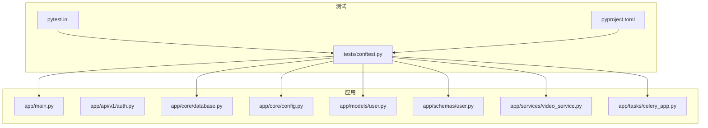
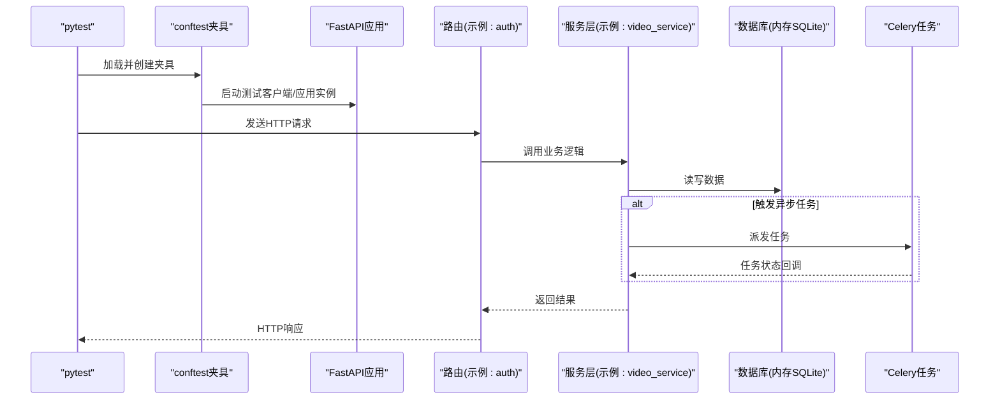
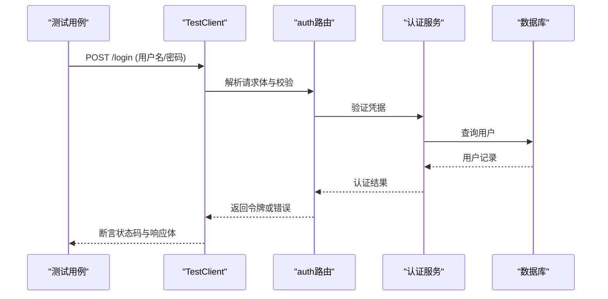
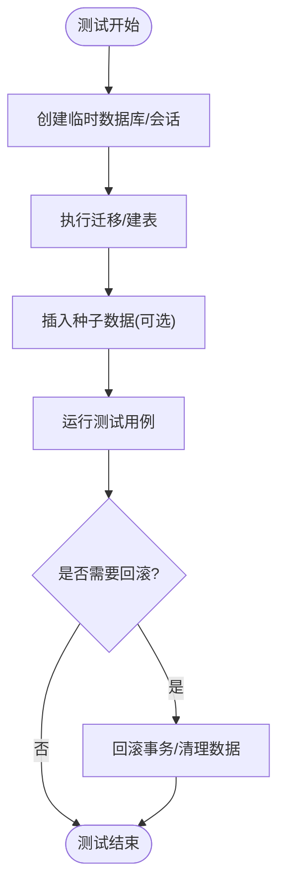
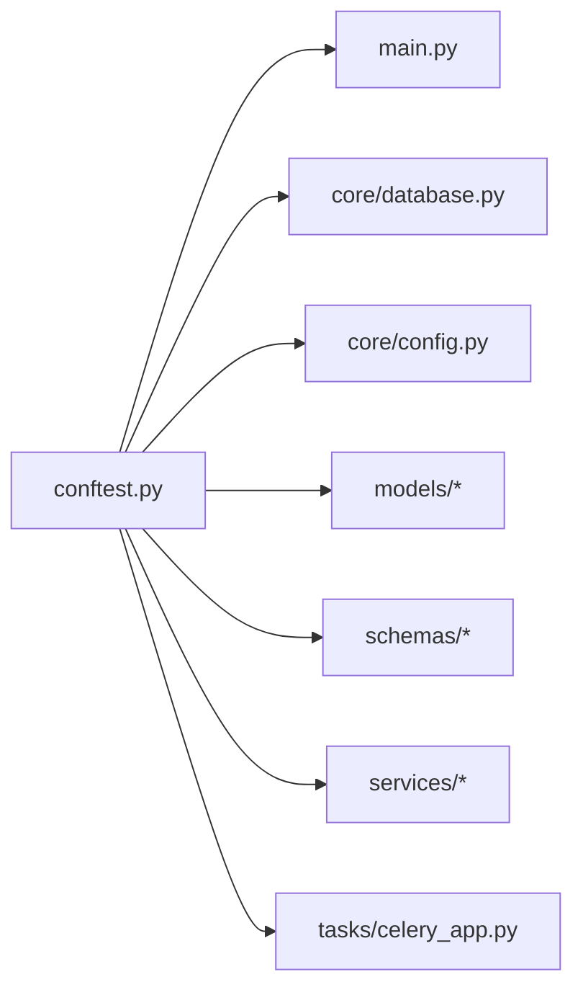

# 单元测试

<cite>
**本文引用的文件**
- [backend/tests/conftest.py](file://backend/tests/conftest.py)
- [backend/pytest.ini](file://backend/pytest.ini)
- [backend/pyproject.toml](file://backend/pyproject.toml)
- [backend/app/main.py](file://backend/app/main.py)
- [backend/app/api/v1/auth.py](file://backend/app/api/v1/auth.py)
- [backend/app/core/database.py](file://backend/app/core/database.py)
- [backend/app/core/config.py](file://backend/app/core/config.py)
- [backend/app/models/user.py](file://backend/app/models/user.py)
- [backend/app/schemas/user.py](file://backend/app/schemas/user.py)
- [backend/app/services/video_service.py](file://backend/app/services/video_service.py)
- [backend/app/tasks/celery_app.py](file://backend/app/tasks/celery_app.py)
- [backend/.github/workflows/ci.yml](file://backend/.github/workflows/ci.yml)
</cite>

## 目录
1. [简介](#简介)
2. [项目结构](#项目结构)
3. [核心组件](#核心组件)
4. [架构总览](#架构总览)
5. [详细组件分析](#详细组件分析)
6. [依赖关系分析](#依赖关系分析)
7. [性能考虑](#性能考虑)
8. [故障排查指南](#故障排查指南)
9. [结论](#结论)
10. [附录](#附录)

## 简介
本文件面向Speaking平台后端单元测试，系统性说明基于pytest的测试实践与规范，覆盖FastAPI路由、服务层逻辑、数据模型、数据库测试策略（内存数据库与夹具）、异步代码测试（Celery任务与异步函数）、测试数据管理（工厂与清理）、断言库使用、异常与边界条件测试、覆盖率收集与分析，以及持续集成中的自动化执行。文档以仓库现有实现为依据，提供可操作的指导与最佳实践。

## 项目结构
后端测试位于 backend/tests 目录，采用按功能模块划分的测试文件组织方式；测试配置集中在 pytest.ini 与 pyproject.toml；应用入口与依赖注入在 app/main.py；数据库与配置在 core 子包；模型与Schema在 models 与 schemas 子包；异步任务在 tasks 子包。

图表来源
- [backend/tests/conftest.py](file://backend/tests/conftest.py)
- [backend/pytest.ini](file://backend/pytest.ini)
- [backend/pyproject.toml](file://backend/pyproject.toml)
- [backend/app/main.py](file://backend/app/main.py)
- [backend/app/core/database.py](file://backend/app/core/database.py)
- [backend/app/core/config.py](file://backend/app/core/config.py)
- [backend/app/models/user.py](file://backend/app/models/user.py)
- [backend/app/schemas/user.py](file://backend/app/schemas/user.py)
- [backend/app/services/video_service.py](file://backend/app/services/video_service.py)
- [backend/app/tasks/celery_app.py](file://backend/app/tasks/celery_app.py)

章节来源
- [backend/tests/conftest.py](file://backend/tests/conftest.py)
- [backend/pytest.ini](file://backend/pytest.ini)
- [backend/pyproject.toml](file://backend/pyproject.toml)

## 核心组件
- 测试框架与配置：pytest.ini 定义运行参数与插件；pyproject.toml 声明依赖与可选特性（如覆盖率）。
- 全局夹具：conftest.py 提供数据库会话、客户端、用户上下文、Mock对象等共享资源。
- FastAPI测试客户端：通过 TestClient 或异步客户端对路由进行端到端验证。
- 数据库策略：使用内存SQLite或事务回滚隔离测试数据，确保用例间独立。
- 异步与任务：针对async函数与Celery任务分别提供专用夹具与辅助方法。
- 数据模型与Schema：基于Pydantic的输入输出校验，结合工厂生成稳定测试数据。

章节来源
- [backend/pytest.ini](file://backend/pytest.ini)
- [backend/pyproject.toml](file://backend/pyproject.toml)
- [backend/tests/conftest.py](file://backend/tests/conftest.py)

## 架构总览
下图展示测试执行时关键组件的交互关系：测试夹具初始化应用与数据库连接，TestClient发起请求，路由调用服务层，服务层访问模型并通过ORM持久化到内存数据库，必要时触发异步任务。

图表来源
- [backend/app/main.py](file://backend/app/main.py)
- [backend/app/api/v1/auth.py](file://backend/app/api/v1/auth.py)
- [backend/app/services/video_service.py](file://backend/app/services/video_service.py)
- [backend/app/core/database.py](file://backend/app/core/database.py)
- [backend/app/tasks/celery_app.py](file://backend/app/tasks/celery_app.py)

## 详细组件分析

### 测试配置与运行环境
- pytest.ini：集中配置测试根路径、插件、标记、并行选项等。
- pyproject.toml：声明测试依赖（pytest、httpx、alembic、coverage等），支持可选特性如 coverage 与 asyncio。
- conftest.py：定义跨用例共享的Fixture，包括数据库会话、应用客户端、认证上下文、外部依赖Mock等。

章节来源
- [backend/pytest.ini](file://backend/pytest.ini)
- [backend/pyproject.toml](file://backend/pyproject.toml)
- [backend/tests/conftest.py](file://backend/tests/conftest.py)

### FastAPI路由测试
- 使用TestClient或异步客户端构造请求，覆盖正常路径、参数校验失败、权限不足、服务端错误等场景。
- 建议为每个路由编写最小化用例集：成功、边界值、异常分支。
- 对于需要鉴权的路由，通过夹具注入Token或模拟登录态。

图表来源
- [backend/app/api/v1/auth.py](file://backend/app/api/v1/auth.py)
- [backend/app/core/database.py](file://backend/app/core/database.py)

章节来源
- [backend/app/api/v1/auth.py](file://backend/app/api/v1/auth.py)

### 服务层逻辑测试
- 服务层应无副作用或仅通过依赖注入访问外部资源，便于Mock与隔离测试。
- 针对视频处理、评分、推荐等服务，优先测试输入校验、业务规则、异常传播。
- 使用工厂生成稳定的领域对象，避免硬编码数据。

章节来源
- [backend/app/services/video_service.py](file://backend/app/services/video_service.py)

### 数据模型与Schema测试
- 模型层关注ORM映射与约束；Schema层关注输入输出校验。
- 对Schema进行正向与反向校验测试：合法输入、非法字段、类型不匹配、必填缺失等。
- 模型变更需同步更新迁移脚本，并在测试中验证迁移顺序与兼容性。

章节来源
- [backend/app/models/user.py](file://backend/app/models/user.py)
- [backend/app/schemas/user.py](file://backend/app/schemas/user.py)

### 数据库测试策略
- 使用内存SQLite或事务回滚保证用例隔离与快速执行。
- 通过Alembic在测试前构建表结构，或使用SQLAlchemy元数据直接创建。
- 每个用例结束后自动回滚或清空，避免数据污染。

图表来源
- [backend/app/core/database.py](file://backend/app/core/database.py)

章节来源
- [backend/app/core/database.py](file://backend/app/core/database.py)

### 异步代码与Celery任务测试
- 异步函数：使用异步TestClient或事件循环运行器，确保await正确执行。
- Celery任务：使用本地Eager模式或InMemory后端，避免依赖真实Broker；提供等待与断言任务结果的辅助方法。
- 对耗时任务设置超时与重试策略的边界用例。

章节来源
- [backend/app/tasks/celery_app.py](file://backend/app/tasks/celery_app.py)

### 测试数据管理与工厂
- 使用工厂类或函数生成一致的测试数据，减少重复与脆弱性。
- 对关联实体采用批量创建与级联清理，避免孤儿数据。
- 对外部依赖（如OSS、支付网关）使用Mock或Stub替换。

章节来源
- [backend/tests/conftest.py](file://backend/tests/conftest.py)

### 断言库与异常、边界条件测试
- 推荐使用标准assert语句配合httpx断言响应结构与状态码。
- 明确覆盖异常分支：参数校验失败、权限拒绝、外部服务不可用、并发冲突等。
- 边界条件：空集合、极大/极小值、特殊字符、时间边界等。

章节来源
- [backend/tests/conftest.py](file://backend/tests/conftest.py)

## 依赖关系分析
测试对应用模块的依赖主要体现在夹具与导入路径上。下图展示测试夹具与应用核心模块之间的依赖关系。

图表来源
- [backend/tests/conftest.py](file://backend/tests/conftest.py)
- [backend/app/main.py](file://backend/app/main.py)
- [backend/app/core/database.py](file://backend/app/core/database.py)
- [backend/app/core/config.py](file://backend/app/core/config.py)
- [backend/app/models/user.py](file://backend/app/models/user.py)
- [backend/app/schemas/user.py](file://backend/app/schemas/user.py)
- [backend/app/services/video_service.py](file://backend/app/services/video_service.py)
- [backend/app/tasks/celery_app.py](file://backend/app/tasks/celery_app.py)

章节来源
- [backend/tests/conftest.py](file://backend/tests/conftest.py)

## 性能考虑
- 使用内存数据库与轻量Mock降低I/O开销。
- 合理拆分用例，避免单用例过长导致阻塞。
- 启用pytest-xdist并行执行，注意资源竞争与幂等性。
- 控制种子数据规模，按需懒加载。

[本节为通用指导，无需引用具体文件]

## 故障排查指南
- 测试无法启动：检查pytest.ini与pyproject.toml依赖安装与环境变量。
- 数据库相关错误：确认迁移脚本可用、内存数据库初始化成功、会话生命周期正确。
- 异步任务失败：确认Celery后端配置与任务注册，必要时切换至Eager模式调试。
- Mock未生效：检查依赖注入点是否正确替换，避免被其他夹具覆盖。

章节来源
- [backend/pytest.ini](file://backend/pytest.ini)
- [backend/pyproject.toml](file://backend/pyproject.toml)
- [backend/tests/conftest.py](file://backend/tests/conftest.py)

## 结论
通过统一的pytest配置、完善的夹具体系、内存数据库与Mock策略，以及对异步与任务的专项支持，Speaking平台后端测试具备高内聚、低耦合与强隔离的特点。遵循本文档的实践，可显著提升测试质量与迭代效率。

[本节为总结性内容，无需引用具体文件]

## 附录

### 持续集成中的自动化测试执行
- CI流水线在每次提交后拉取代码、安装依赖、执行测试套件，并上传覆盖率报告。
- 建议在CI中缓存依赖与构建产物，缩短执行时间。
- 对失败的测试提供清晰日志与截图（如有UI交互）。

章节来源
- [backend/.github/workflows/ci.yml](file://backend/.github/workflows/ci.yml)
