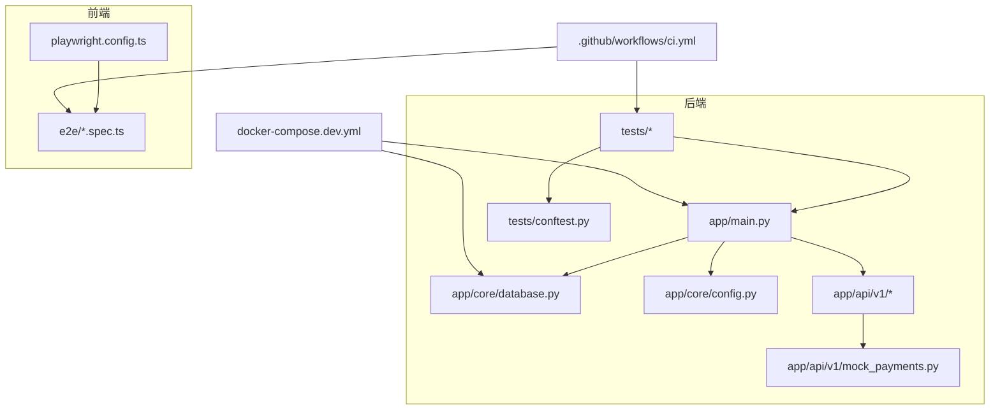
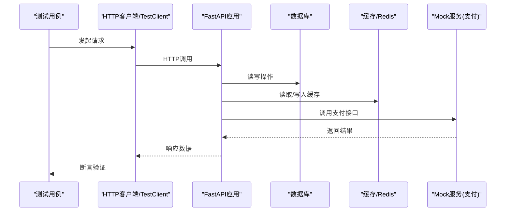
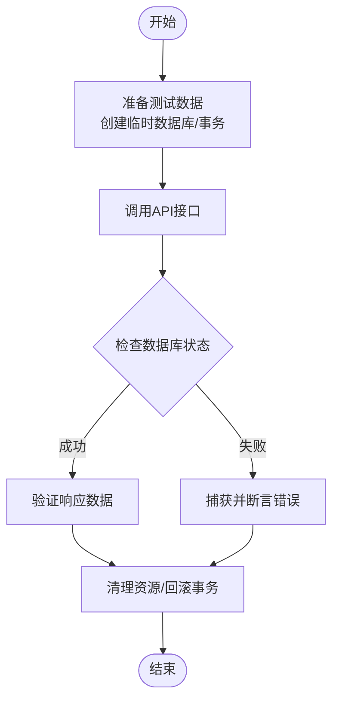
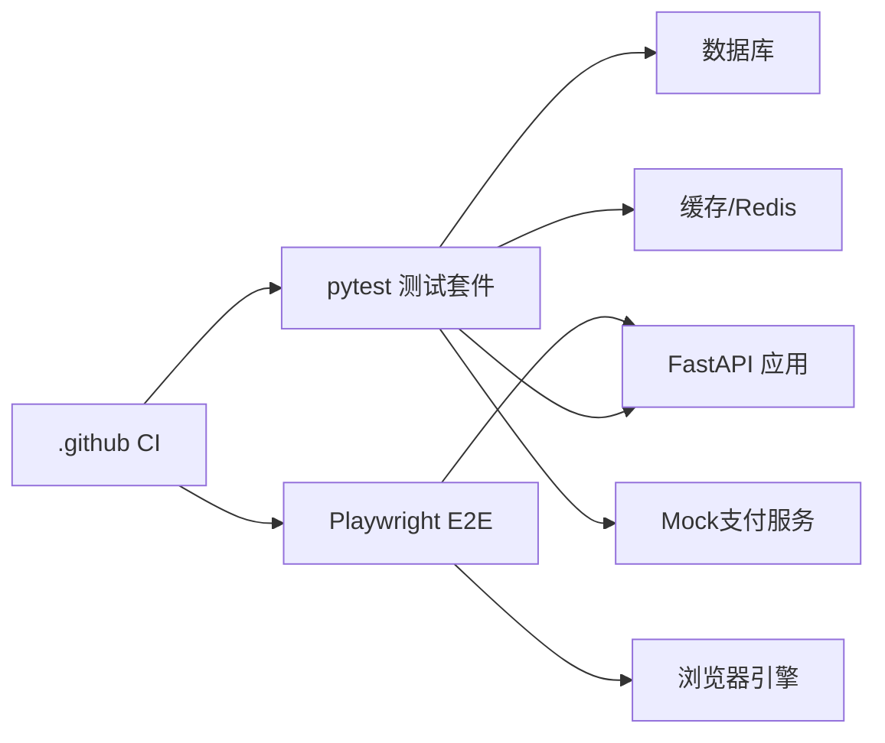

# 测试策略

<cite>
**本文引用的文件**
- [backend/pytest.ini](file://backend/pytest.ini)
- [backend/tests/conftest.py](file://backend/tests/conftest.py)
- [backend/tests/test_auth.py](file://backend/tests/test_auth.py)
- [backend/tests/test_videos.py](file://backend/tests/test_videos.py)
- [backend/tests/test_payments.py](file://backend/tests/test_payments.py)
- [backend/app/api/v1/mock_payments.py](file://backend/app/api/v1/mock_payments.py)
- [backend/app/core/database.py](file://backend/app/core/database.py)
- [backend/app/core/config.py](file://backend/app/core/config.py)
- [backend/app/main.py](file://backend/app/main.py)
- [frontend/playwright.config.ts](file://frontend/playwright.config.ts)
- [frontend/e2e/auth.spec.ts](file://frontend/e2e/auth.spec.ts)
- [frontend/e2e/video.spec.ts](file://frontend/e2e/video.spec.ts)
- [frontend/e2e/mobile.spec.ts](file://frontend/e2e/mobile.spec.ts)
- [frontend/e2e/screenshot-matrix.spec.ts](file://frontend/e2e/screenshot-matrix.spec.ts)
- [.github/workflows/ci.yml](file://.github/workflows/ci.yml)
- [docker-compose.dev.yml](file://docker-compose.dev.yml)
</cite>

## 目录
1. [简介](#简介)
2. [项目结构](#项目结构)
3. [核心组件](#核心组件)
4. [架构总览](#架构总览)
5. [详细组件分析](#详细组件分析)
6. [依赖分析](#依赖分析)
7. [性能考虑](#性能考虑)
8. [故障排查指南](#故障排查指南)
9. [结论](#结论)
10. [附录](#附录)

## 简介
本文件为Speaking平台的全面测试策略文档，覆盖单元测试（pytest）、集成测试（数据库、API、外部服务模拟）、端到端测试（Playwright）、性能测试（负载、压力、基准）、测试数据与环境隔离、持续集成与质量门禁、覆盖率报告、移动端与跨浏览器兼容性及无障碍测试。目标是帮助开发者快速建立稳定、可维护、可扩展的测试体系，确保平台在功能、性能与可用性方面达到生产标准。

## 项目结构
后端采用FastAPI应用，测试位于backend/tests，使用pytest框架；前端E2E位于frontend/e2e，使用Playwright。CI配置位于.github/workflows/ci.yml，开发环境通过docker-compose.dev.yml编排。

图表来源
- [backend/app/main.py:1-200](file://backend/app/main.py#L1-L200)
- [backend/app/core/database.py:1-200](file://backend/app/core/database.py#L1-L200)
- [backend/app/core/config.py:1-200](file://backend/app/core/config.py#L1-L200)
- [backend/app/api/v1/mock_payments.py:1-200](file://backend/app/api/v1/mock_payments.py#L1-L200)
- [backend/tests/conftest.py:1-200](file://backend/tests/conftest.py#L1-L200)
- [frontend/playwright.config.ts:1-200](file://frontend/playwright.config.ts#L1-L200)
- [frontend/e2e/auth.spec.ts:1-200](file://frontend/e2e/auth.spec.ts#L1-L200)
- [.github/workflows/ci.yml:1-200](file://.github/workflows/ci.yml#L1-L200)
- [docker-compose.dev.yml:1-200](file://docker-compose.dev.yml#L1-L200)

章节来源
- [backend/pytest.ini:1-200](file://backend/pytest.ini#L1-L200)
- [backend/tests/conftest.py:1-200](file://backend/tests/conftest.py#L1-L200)
- [frontend/playwright.config.ts:1-200](file://frontend/playwright.config.ts#L1-L200)
- [.github/workflows/ci.yml:1-200](file://.github/workflows/ci.yml#L1-L200)
- [docker-compose.dev.yml:1-200](file://docker-compose.dev.yml#L1-L200)

## 核心组件
- 单元测试框架：pytest，支持fixtures、参数化、异步测试、插件生态。
- 集成测试：基于TestClient或HTTP客户端调用API，配合数据库事务回滚或独立测试库。
- E2E测试：Playwright，支持多浏览器、移动端设备模拟、截图对比、网络拦截。
- 性能测试：Locust或k6进行负载与压力测试，结合APM与指标采集做基准。
- 覆盖率：pytest-cov生成HTML/JSON报告，CI中设置阈值作为质量门禁。
- 环境隔离：Docker Compose编排DB、Redis、Mock服务，测试专用环境变量。

章节来源
- [backend/pytest.ini:1-200](file://backend/pytest.ini#L1-L200)
- [backend/tests/conftest.py:1-200](file://backend/tests/conftest.py#L1-L200)
- [frontend/playwright.config.ts:1-200](file://frontend/playwright.config.ts#L1-L200)

## 架构总览
下图展示从测试入口到后端API、数据库、缓存及外部服务的调用路径，以及前端E2E对浏览器的自动化控制。

图表来源
- [backend/app/main.py:1-200](file://backend/app/main.py#L1-L200)
- [backend/app/core/database.py:1-200](file://backend/app/core/database.py#L1-L200)
- [backend/app/api/v1/mock_payments.py:1-200](file://backend/app/api/v1/mock_payments.py#L1-L200)

## 详细组件分析

### 单元测试（pytest）
- 用例组织：按模块划分test_*.py，使用conftest.py提供共享fixtures。
- 断言策略：优先断言业务结果与状态码，避免实现细节耦合。
- Mock对象：使用unittest.mock或httpx.MockTransport对外部依赖进行替换。
- 异步测试：使用pytest-asyncio处理异步API与服务方法。
- 参数化：使用@pytest.mark.parametrize覆盖边界条件与异常分支。

示例参考路径
- [backend/tests/test_auth.py:1-200](file://backend/tests/test_auth.py#L1-L200)
- [backend/tests/test_videos.py:1-200](file://backend/tests/test_videos.py#L1-L200)
- [backend/tests/test_payments.py:1-200](file://backend/tests/test_payments.py#L1-L200)

章节来源
- [backend/tests/conftest.py:1-200](file://backend/tests/conftest.py#L1-L200)
- [backend/tests/test_auth.py:1-200](file://backend/tests/test_auth.py#L1-L200)
- [backend/tests/test_videos.py:1-200](file://backend/tests/test_videos.py#L1-L200)
- [backend/tests/test_payments.py:1-200](file://backend/tests/test_payments.py#L1-L200)

### 集成测试（数据库、API、外部服务）
- 数据库测试：使用事务回滚或独立测试库，保证用例间隔离与快速执行。
- API测试：通过TestClient或HTTP客户端直接调用路由，验证输入输出与错误处理。
- 外部服务模拟：使用mock_payments等本地Mock替代真实第三方服务，确保稳定性与可控性。

图表来源
- [backend/app/core/database.py:1-200](file://backend/app/core/database.py#L1-L200)
- [backend/app/api/v1/mock_payments.py:1-200](file://backend/app/api/v1/mock_payments.py#L1-L200)

章节来源
- [backend/app/core/database.py:1-200](file://backend/app/core/database.py#L1-L200)
- [backend/app/api/v1/mock_payments.py:1-200](file://backend/app/api/v1/mock_payments.py#L1-L200)

### 端到端测试（Playwright）
- 浏览器自动化：登录、视频播放、交互流程等关键用户路径。
- 多设备矩阵：桌面与移动端设备模拟，截图对比回归。
- 网络拦截：拦截API响应以加速测试与模拟异常场景。
- 并行执行：利用Playwright并行能力提升执行效率。

示例参考路径
- [frontend/e2e/auth.spec.ts:1-200](file://frontend/e2e/auth.spec.ts#L1-L200)
- [frontend/e2e/video.spec.ts:1-200](file://frontend/e2e/video.spec.ts#L1-L200)
- [frontend/e2e/mobile.spec.ts:1-200](file://frontend/e2e/mobile.spec.ts#L1-L200)
- [frontend/e2e/screenshot-matrix.spec.ts:1-200](file://frontend/e2e/screenshot-matrix.spec.ts#L1-L200)
- [frontend/playwright.config.ts:1-200](file://frontend/playwright.config.ts#L1-L200)

章节来源
- [frontend/playwright.config.ts:1-200](file://frontend/playwright.config.ts#L1-L200)
- [frontend/e2e/auth.spec.ts:1-200](file://frontend/e2e/auth.spec.ts#L1-L200)
- [frontend/e2e/video.spec.ts:1-200](file://frontend/e2e/video.spec.ts#L1-L200)
- [frontend/e2e/mobile.spec.ts:1-200](file://frontend/e2e/mobile.spec.ts#L1-L200)
- [frontend/e2e/screenshot-matrix.spec.ts:1-200](file://frontend/e2e/screenshot-matrix.spec.ts#L1-L200)

### 性能测试（负载、压力、基准）
- 工具选择：Locust用于Python后端压测，k6用于前端与API混合压测。
- 场景设计：典型用户路径（登录、搜索、播放、提交练习），逐步增加并发。
- 指标采集：收集P95/P99延迟、吞吐、错误率，结合APM定位瓶颈。
- 基准回归：将关键接口响应时间纳入质量门禁，防止性能退化。

章节来源
- [.github/workflows/ci.yml:1-200](file://.github/workflows/ci.yml#L1-L200)

### 测试数据管理
- 种子数据：脚本生成基础数据，便于快速初始化测试环境。
- 工厂模式：动态构造复杂对象，减少硬编码数据。
- 数据隔离：每个用例独立数据上下文，避免相互污染。
- 清理策略：用例结束后自动清理或事务回滚。

章节来源
- [backend/tests/conftest.py:1-200](file://backend/tests/conftest.py#L1-L200)

### 测试环境隔离
- Docker Compose：编排数据库、Redis、Mock服务，统一环境。
- 环境变量：区分开发与测试配置，避免影响生产。
- 网络隔离：测试容器间通信通过内部网络，屏蔽外部依赖。

章节来源
- [docker-compose.dev.yml:1-200](file://docker-compose.dev.yml#L1-L200)
- [backend/app/core/config.py:1-200](file://backend/app/core/config.py#L1-L200)

### 持续集成与质量门禁
- CI流水线：代码提交触发单元测试、集成测试、E2E测试。
- 覆盖率阈值：低于阈值则构建失败，强制质量改进。
- 并行执行：分阶段并行运行，缩短反馈周期。
- 报告归档：保存测试结果与覆盖率报告供审查。

章节来源
- [.github/workflows/ci.yml:1-200](file://.github/workflows/ci.yml#L1-L200)

### 移动端测试、跨浏览器兼容性与无障碍测试
- 移动端：Playwright模拟手机设备，验证触控与布局适配。
- 跨浏览器：Chrome、Firefox、Safari（如可用）矩阵执行。
- 无障碍：键盘导航、屏幕阅读器语义、颜色对比度检查。

章节来源
- [frontend/playwright.config.ts:1-200](file://frontend/playwright.config.ts#L1-L200)
- [frontend/e2e/mobile.spec.ts:1-200](file://frontend/e2e/mobile.spec.ts#L1-L200)

### 最佳实践与常见问题
- 最佳实践
  - 用例命名清晰，描述行为而非实现。
  - 单一职责：一个用例只验证一个断言点。
  - 使用夹具集中管理共享逻辑。
  - 外部依赖一律Mock，保持测试确定性。
- 常见问题
  - 数据库竞争：使用事务隔离或独立测试库。
  - 异步竞态：合理等待与重试机制。
  - 网络超时：设置合理超时与重试策略。
  - 截图差异：固定随机种子与字体渲染。

章节来源
- [backend/tests/conftest.py:1-200](file://backend/tests/conftest.py#L1-L200)
- [frontend/playwright.config.ts:1-200](file://frontend/playwright.config.ts#L1-L200)

## 依赖分析
测试套件依赖后端应用、数据库、缓存与Mock服务；前端E2E依赖浏览器引擎与Playwright运行时。CI负责协调各层依赖的执行顺序与资源分配。

图表来源
- [backend/pytest.ini:1-200](file://backend/pytest.ini#L1-L200)
- [backend/app/main.py:1-200](file://backend/app/main.py#L1-L200)
- [backend/app/core/database.py:1-200](file://backend/app/core/database.py#L1-L200)
- [backend/app/api/v1/mock_payments.py:1-200](file://backend/app/api/v1/mock_payments.py#L1-L200)
- [frontend/playwright.config.ts:1-200](file://frontend/playwright.config.ts#L1-L200)
- [.github/workflows/ci.yml:1-200](file://.github/workflows/ci.yml#L1-L200)

章节来源
- [backend/pytest.ini:1-200](file://backend/pytest.ini#L1-L200)
- [.github/workflows/ci.yml:1-200](file://.github/workflows/ci.yml#L1-L200)

## 性能考虑
- 测试执行优化：并行化、缓存依赖、跳过慢用例。
- 数据库优化：索引与查询计划检查，避免全表扫描。
- 内存与CPU监控：识别热点函数与高开销操作。
- 基准回归：关键接口响应时间与吞吐纳入CI门禁。

[本节为通用指导，不直接分析具体文件]

## 故障排查指南
- 常见错误
  - 连接失败：检查数据库与Redis地址与端口。
  - 权限问题：确认测试账户权限与迁移状态。
  - Mock未生效：验证依赖注入与补丁位置。
  - 浏览器崩溃：更新驱动与系统依赖。
- 调试技巧
  - 启用详细日志与追踪。
  - 使用交互式调试器定位问题。
  - 导出测试报告与截图辅助分析。

章节来源
- [backend/app/core/config.py:1-200](file://backend/app/core/config.py#L1-L200)
- [backend/app/core/database.py:1-200](file://backend/app/core/database.py#L1-L200)
- [frontend/playwright.config.ts:1-200](file://frontend/playwright.config.ts#L1-L200)

## 结论
通过分层测试策略（单元、集成、E2E、性能）与完善的CI与质量门禁，Speaking平台能够在功能正确性、性能稳定性与用户体验方面获得可靠保障。建议持续完善测试覆盖率、扩展自动化场景，并将性能基准纳入发布流程，确保高质量交付。

[本节为总结性内容，不直接分析具体文件]

## 附录
- 术语表
  - Fixture：测试夹具，提供共享数据与前置后置逻辑。
  - Mock：模拟对象，替换外部依赖以隔离测试。
  - 覆盖率：被测试代码执行的百分比，衡量测试充分性。
  - 质量门禁：CI中设置的阈值，未达标则阻断合并。
- 参考路径
  - 后端测试配置与用例：[backend/pytest.ini](file://backend/pytest.ini), [backend/tests/conftest.py](file://backend/tests/conftest.py), [backend/tests/test_auth.py](file://backend/tests/test_auth.py), [backend/tests/test_videos.py](file://backend/tests/test_videos.py), [backend/tests/test_payments.py](file://backend/tests/test_payments.py)
  - 前端E2E配置与用例：[frontend/playwright.config.ts](file://frontend/playwright.config.ts), [frontend/e2e/auth.spec.ts](file://frontend/e2e/auth.spec.ts), [frontend/e2e/video.spec.ts](file://frontend/e2e/video.spec.ts), [frontend/e2e/mobile.spec.ts](file://frontend/e2e/mobile.spec.ts), [frontend/e2e/screenshot-matrix.spec.ts](file://frontend/e2e/screenshot-matrix.spec.ts)
  - CI与环境：[.github/workflows/ci.yml](file://.github/workflows/ci.yml), [docker-compose.dev.yml](file://docker-compose.dev.yml)

[本节为补充信息，不直接分析具体文件]
