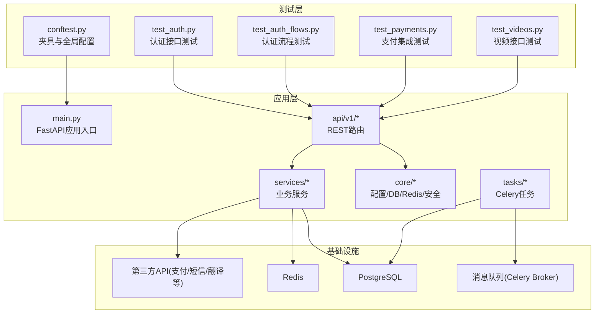
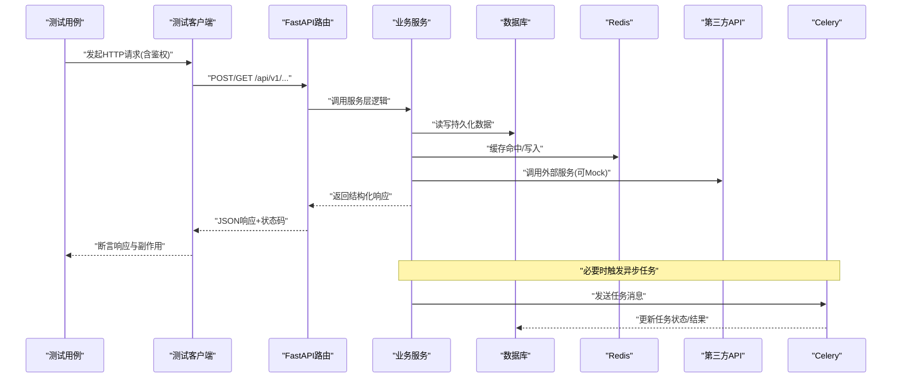
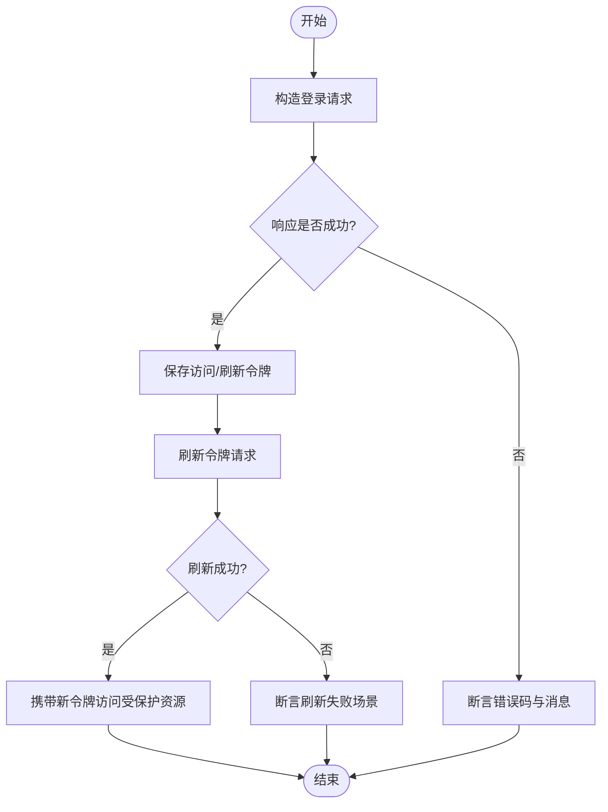
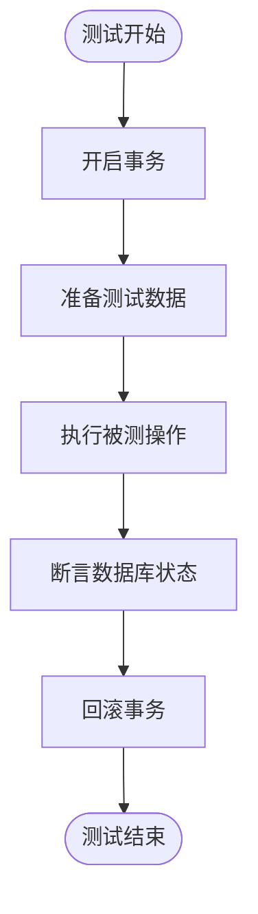
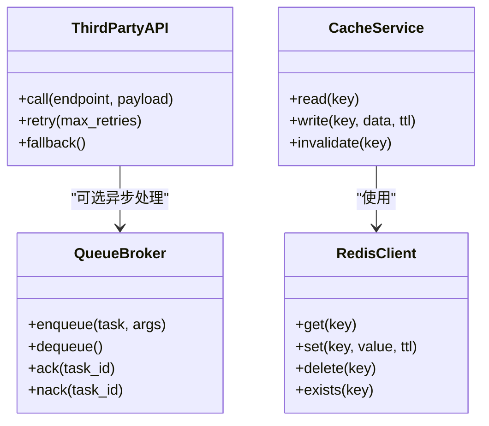
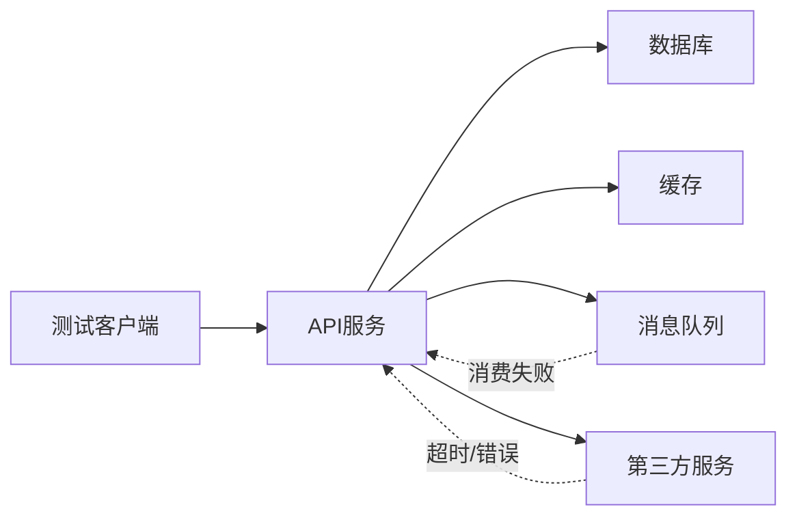
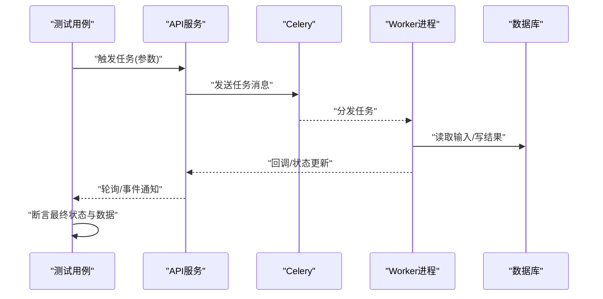
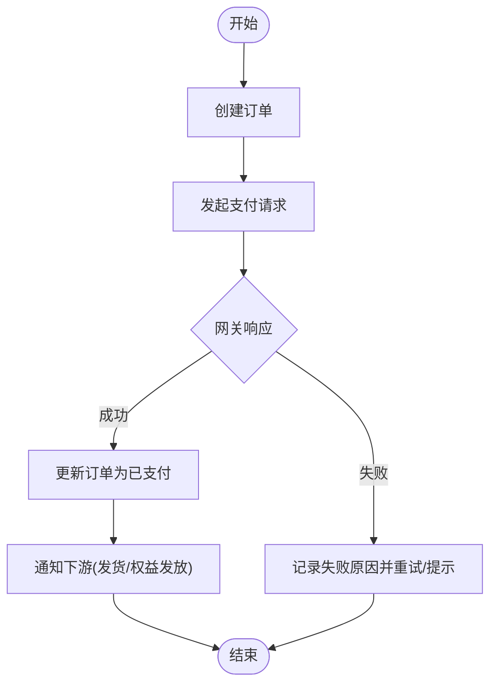
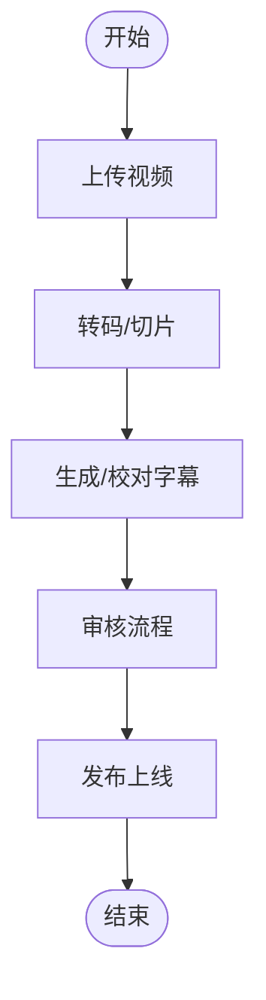
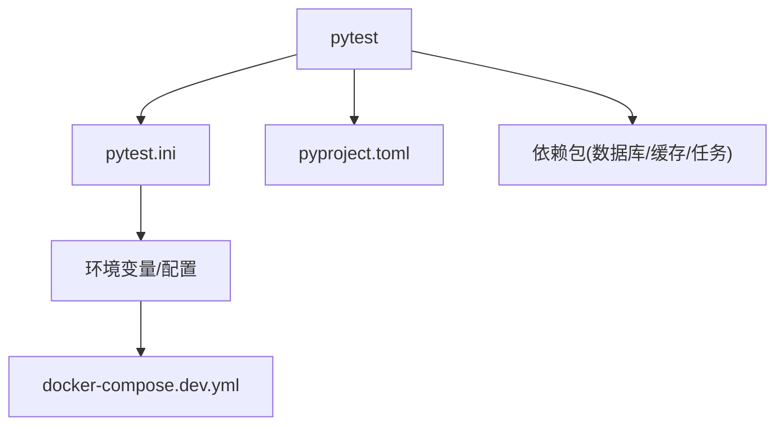

# 集成测试

<cite>
**本文引用的文件**
- [backend/tests/conftest.py](file://backend/tests/conftest.py)
- [backend/tests/test_auth.py](file://backend/tests/test_auth.py)
- [backend/tests/test_auth_flows.py](file://backend/tests/test_auth_flows.py)
- [backend/tests/test_payments.py](file://backend/tests/test_payments.py)
- [backend/tests/test_videos.py](file://backend/tests/test_videos.py)
- [backend/app/api/v1/auth.py](file://backend/app/api/v1/auth.py)
- [backend/app/core/config.py](file://backend/app/core/config.py)
- [backend/app/core/database.py](file://backend/app/core/database.py)
- [backend/app/core/redis.py](file://backend/app/core/redis.py)
- [backend/app/tasks/celery_app.py](file://backend/app/tasks/celery_app.py)
- [backend/pyproject.toml](file://backend/pyproject.toml)
- [backend/pytest.ini](file://backend/pytest.ini)
- [docker-compose.dev.yml](file://docker-compose.dev.yml)
</cite>

## 目录
1. [简介](#简介)
2. [项目结构](#项目结构)
3. [核心组件](#核心组件)
4. [架构总览](#架构总览)
5. [详细组件分析](#详细组件分析)
6. [依赖关系分析](#依赖关系分析)
7. [性能考量](#性能考量)
8. [故障排查指南](#故障排查指南)
9. [结论](#结论)
10. [附录](#附录)

## 简介
本指南面向Speaking平台的后端集成测试，覆盖以下关键主题：
- API集成测试：HTTP请求模拟、认证流程与响应验证
- 数据库集成测试：事务回滚、测试数据准备与关系验证
- 外部服务集成测试：Redis缓存、消息队列与第三方API模拟
- 微服务间通信测试：服务依赖管理与故障场景
- 异步任务集成测试：Celery任务链与事件驱动架构
- 性能基准与负载测试方法
- 测试环境隔离策略与测试数据管理方案

## 项目结构
后端测试位于 backend/tests 目录，使用 pytest 框架组织用例；配置与夹具集中在 conftest.py。应用核心能力包括 FastAPI 路由、SQLAlchemy ORM、Redis 缓存、Celery 异步任务等。

图表来源
- [backend/tests/conftest.py](file://backend/tests/conftest.py)
- [backend/app/main.py](file://backend/app/main.py)
- [backend/app/core/database.py](file://backend/app/core/database.py)
- [backend/app/core/redis.py](file://backend/app/core/redis.py)
- [backend/app/tasks/celery_app.py](file://backend/app/tasks/celery_app.py)

章节来源
- [backend/tests/conftest.py](file://backend/tests/conftest.py)
- [backend/pytest.ini](file://backend/pytest.ini)
- [backend/pyproject.toml](file://backend/pyproject.toml)

## 核心组件
- 测试夹具与生命周期管理：通过 conftest.py 提供数据库会话、客户端、Redis连接、Mock服务等，确保每个用例在独立事务中运行并自动回滚。
- HTTP客户端封装：基于 httpx/requests 的测试客户端，支持携带鉴权头、构造复杂请求体、断言响应结构与状态码。
- 认证流程测试：覆盖登录、注册、令牌刷新、权限校验、黑名单拦截等路径。
- 数据库关系验证：通过ORM查询与聚合断言，保证外键约束、级联删除、唯一约束与计数一致性。
- 外部服务模拟：对支付网关、短信服务、AI翻译/评分等外部依赖进行Mock或沙箱模式，避免真实调用。
- 异步任务验证：通过Celery工作进程或本地同步执行器，验证任务入队、执行结果与状态流转。

章节来源
- [backend/tests/conftest.py](file://backend/tests/conftest.py)
- [backend/tests/test_auth.py](file://backend/tests/test_auth.py)
- [backend/tests/test_auth_flows.py](file://backend/tests/test_auth_flows.py)
- [backend/tests/test_payments.py](file://backend/tests/test_payments.py)
- [backend/tests/test_videos.py](file://backend/tests/test_videos.py)

## 架构总览
下图展示从测试到应用的端到端调用链，以及外部依赖的交互点。

图表来源
- [backend/app/api/v1/auth.py](file://backend/app/api/v1/auth.py)
- [backend/app/core/database.py](file://backend/app/core/database.py)
- [backend/app/core/redis.py](file://backend/app/core/redis.py)
- [backend/app/tasks/celery_app.py](file://backend/app/tasks/celery_app.py)

## 详细组件分析

### API集成测试（认证与授权）
- 目标：验证登录、注册、令牌签发与刷新、权限控制、黑名单拦截等路径的正确性与健壮性。
- 关键点：
  - 使用测试客户端构造带Authorization头的请求，覆盖成功与失败分支。
  - 校验响应体字段、状态码、错误码与消息格式。
  - 针对敏感操作（如修改密码、删除账户）验证权限与二次确认。
  - 结合Redis校验令牌黑名单与限流行为。

图表来源
- [backend/tests/test_auth.py](file://backend/tests/test_auth.py)
- [backend/tests/test_auth_flows.py](file://backend/tests/test_auth_flows.py)
- [backend/app/api/v1/auth.py](file://backend/app/api/v1/auth.py)

章节来源
- [backend/tests/test_auth.py](file://backend/tests/test_auth.py)
- [backend/tests/test_auth_flows.py](file://backend/tests/test_auth_flows.py)
- [backend/app/api/v1/auth.py](file://backend/app/api/v1/auth.py)

### 数据库集成测试（事务回滚与关系验证）
- 目标：确保每条用例在独立事务中运行，用例结束后自动回滚，不污染共享数据。
- 关键点：
  - 使用测试数据库实例，启动前创建表结构，按需提供种子数据。
  - 在每个测试函数前后开启/提交或回滚事务，保证隔离性。
  - 对外键、唯一约束、级联删除进行断言，确保数据一致性。
  - 对分页、排序、过滤等查询条件进行边界值验证。

图表来源
- [backend/tests/conftest.py](file://backend/tests/conftest.py)
- [backend/app/core/database.py](file://backend/app/core/database.py)

章节来源
- [backend/tests/conftest.py](file://backend/tests/conftest.py)
- [backend/app/core/database.py](file://backend/app/core/database.py)

### 外部服务集成测试（Redis、消息队列、第三方API）
- Redis缓存：
  - 验证缓存命中/失效策略，清理测试Key，避免跨用例污染。
  - 对热点数据与过期时间进行断言。
- 消息队列：
  - 使用本地Broker或内存Broker，验证任务入队与出队顺序。
  - 检查任务状态机与重试机制。
- 第三方API：
  - 使用Mock或沙箱环境，覆盖成功、超时、网络异常、签名失败等分支。
  - 校验重试与熔断降级逻辑。

图表来源
- [backend/app/core/redis.py](file://backend/app/core/redis.py)
- [backend/app/tasks/celery_app.py](file://backend/app/tasks/celery_app.py)

章节来源
- [backend/app/core/redis.py](file://backend/app/core/redis.py)
- [backend/app/tasks/celery_app.py](file://backend/app/tasks/celery_app.py)

### 微服务间通信测试（依赖管理与故障场景）
- 依赖管理：
  - 使用容器编排（Docker Compose）拉起依赖服务（DB、Redis、MQ）。
  - 通过环境变量切换测试/生产配置。
- 故障场景：
  - 模拟下游服务不可用、延迟、错误响应，验证上游服务的容错与降级。
  - 验证幂等性与补偿机制。

图表来源
- [docker-compose.dev.yml](file://docker-compose.dev.yml)
- [backend/app/core/config.py](file://backend/app/core/config.py)

章节来源
- [docker-compose.dev.yml](file://docker-compose.dev.yml)
- [backend/app/core/config.py](file://backend/app/core/config.py)

### 异步任务集成测试（Celery任务链与事件驱动）
- 目标：验证任务入队、执行、结果存储与状态流转，以及任务链的顺序与依赖。
- 关键点：
  - 使用本地同步执行器或Worker进程，确保任务可被调度。
  - 断言任务结果、中间状态与重试次数。
  - 对事件驱动链路（发布/订阅）进行端到端验证。

图表来源
- [backend/app/tasks/celery_app.py](file://backend/app/tasks/celery_app.py)

章节来源
- [backend/app/tasks/celery_app.py](file://backend/app/tasks/celery_app.py)

### 支付与订单集成测试
- 目标：验证支付流程、订单状态机、退款与对账。
- 关键点：
  - 使用Mock支付网关，覆盖成功、失败、重复支付、超时等场景。
  - 校验订单幂等性与并发安全性。
  - 断言通知回调与状态同步。

图表来源
- [backend/tests/test_payments.py](file://backend/tests/test_payments.py)

章节来源
- [backend/tests/test_payments.py](file://backend/tests/test_payments.py)

### 视频与媒体处理集成测试
- 目标：验证视频上传、转码、字幕生成、审核与发布流程。
- 关键点：
  - 使用小体积测试文件，缩短处理时间。
  - 断言各阶段状态转换与产物完整性。
  - 验证失败重试与人工介入流程。

图表来源
- [backend/tests/test_videos.py](file://backend/tests/test_videos.py)

章节来源
- [backend/tests/test_videos.py](file://backend/tests/test_videos.py)

## 依赖关系分析
- 测试框架与插件：pytest、pytest-cov、httpx/requests、alembic（迁移）、faker（数据生成）。
- 运行时依赖：FastAPI、SQLAlchemy、Redis、Celery、第三方SDK（支付/短信/AI）。
- 配置与环境：通过 pyproject.toml 与 pytest.ini 管理测试选项与插件；docker-compose.dev.yml 提供本地依赖服务。

图表来源
- [backend/pyproject.toml](file://backend/pyproject.toml)
- [backend/pytest.ini](file://backend/pytest.ini)
- [docker-compose.dev.yml](file://docker-compose.dev.yml)

章节来源
- [backend/pyproject.toml](file://backend/pyproject.toml)
- [backend/pytest.ini](file://backend/pytest.ini)
- [docker-compose.dev.yml](file://docker-compose.dev.yml)

## 性能考量
- 基准测试方法：
  - 使用 locust/k6 对关键接口进行压测，关注QPS、P95/P99延迟、错误率。
  - 对数据库慢查询进行分析，添加必要索引与查询优化。
  - 对Redis热点Key进行分片与过期策略调优。
- 负载测试工具：
  - Locust：Python脚本定义用户行为，支持分布式执行。
  - k6：JS脚本定义负载模型，便于CI集成。
- 监控与指标：
  - 采集应用指标（请求数、耗时、错误率）、系统指标（CPU、内存、IO）、业务指标（转化率、成功率）。
  - 结合APM工具（如Prometheus/Grafana）进行可视化与告警。

[本节为通用指导，不直接分析具体文件]

## 故障排查指南
- 常见问题定位：
  - 数据库连接失败：检查连接串、端口、权限与防火墙规则。
  - Redis连接超时：检查网络连通性与最大连接数限制。
  - 任务未执行：确认Broker可达、Worker进程存活与队列名称一致。
  - 第三方API失败：查看日志中的错误码与重试策略。
- 调试技巧：
  - 启用详细日志与请求追踪，输出关键上下文。
  - 使用断点与交互式调试定位问题。
  - 通过最小化用例复现问题，逐步扩大范围。

章节来源
- [backend/app/core/config.py](file://backend/app/core/config.py)
- [backend/app/core/database.py](file://backend/app/core/database.py)
- [backend/app/core/redis.py](file://backend/app/core/redis.py)
- [backend/app/tasks/celery_app.py](file://backend/app/tasks/celery_app.py)

## 结论
通过完善的集成测试体系，Speaking平台能够在持续集成环境中快速发现回归问题，保障API稳定性、数据一致性与外部依赖可靠性。建议持续完善测试覆盖率、引入性能基线与自动化巡检，提升交付质量与运维效率。

[本节为总结性内容，不直接分析具体文件]

## 附录
- 测试环境搭建：
  - 使用 docker-compose.dev.yml 拉起依赖服务。
  - 配置环境变量与密钥，切换到测试模式。
- 测试数据管理：
  - 使用夹具与工厂方法生成稳定、可复用的测试数据。
  - 对敏感数据进行脱敏与随机化。
- 最佳实践：
  - 用例命名清晰，描述预期行为。
  - 断言明确，覆盖正向与反向路径。
  - 保持用例独立与可并行执行。

[本节为补充信息，不直接分析具体文件]
