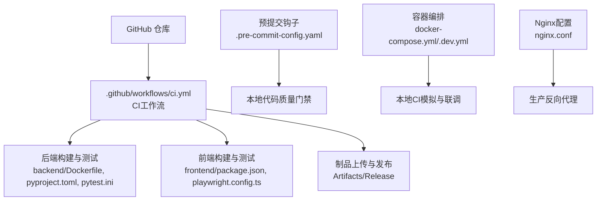
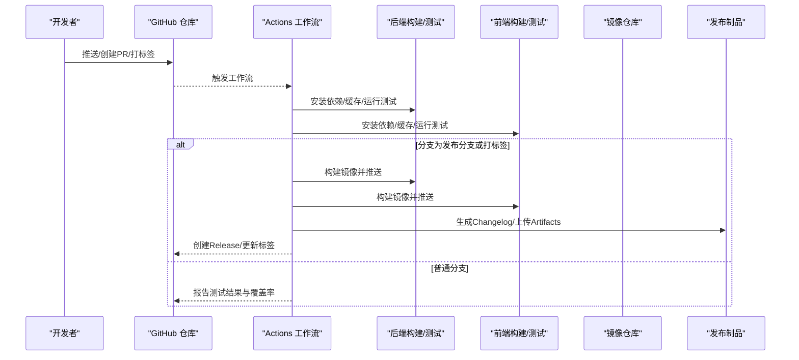
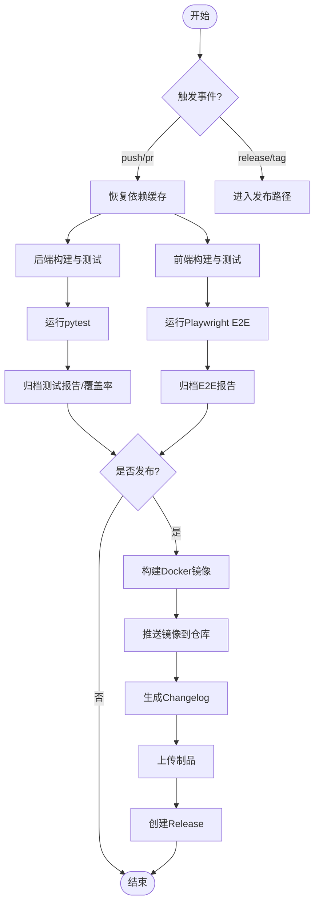
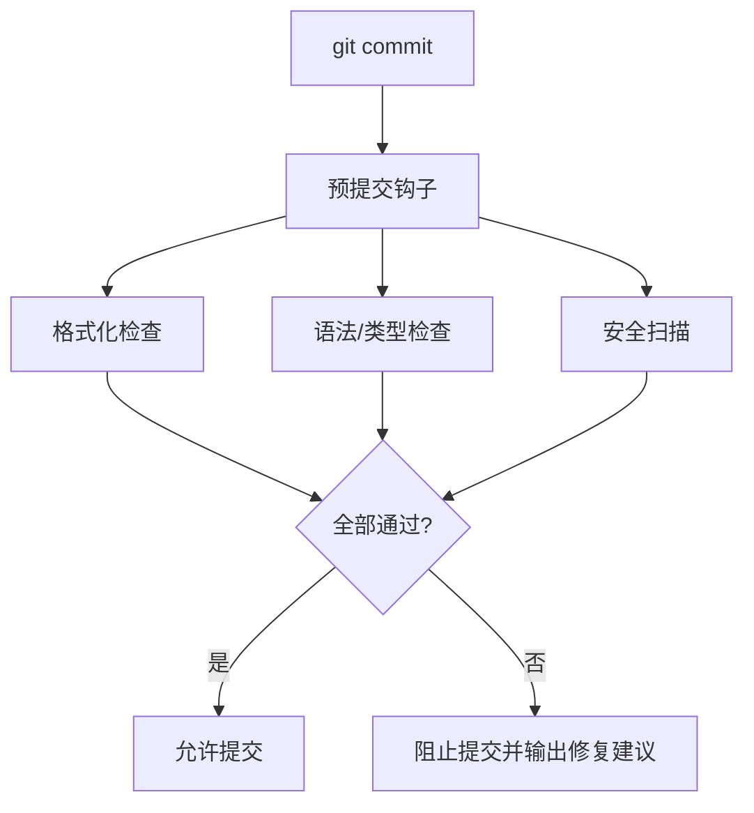
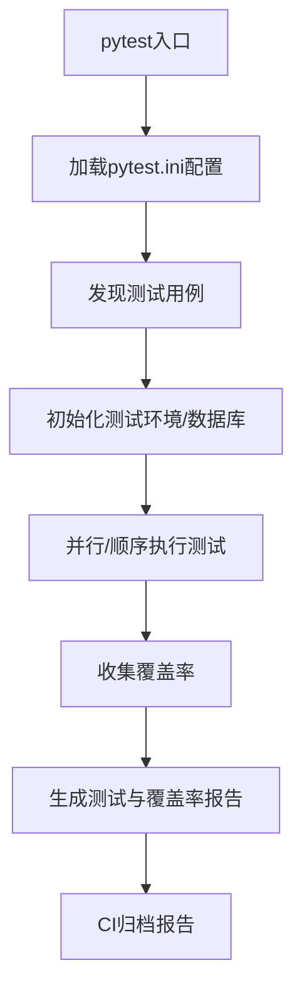
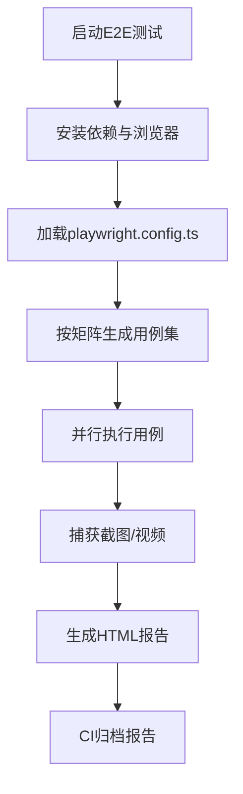
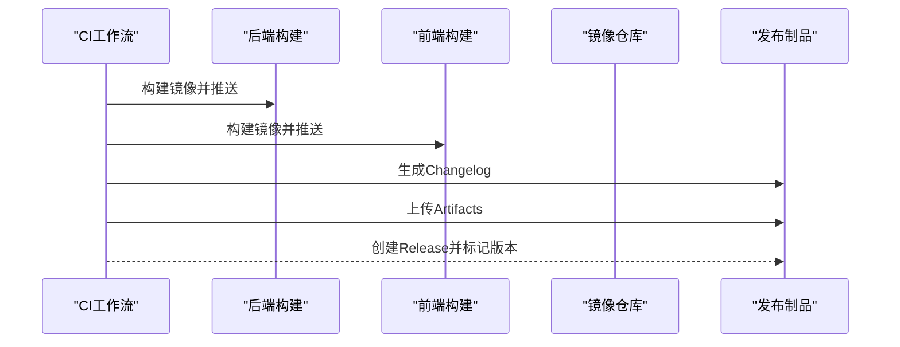
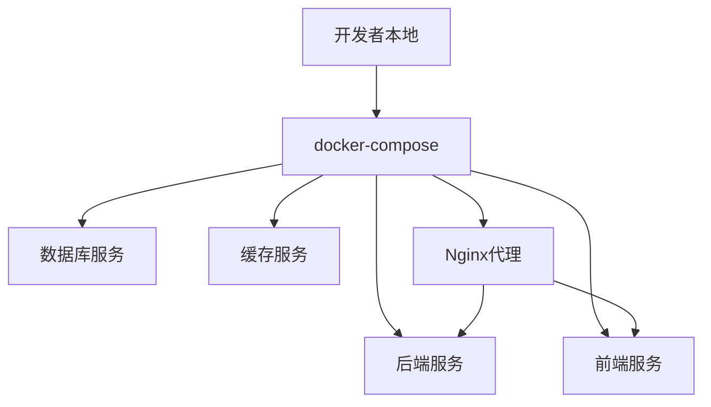
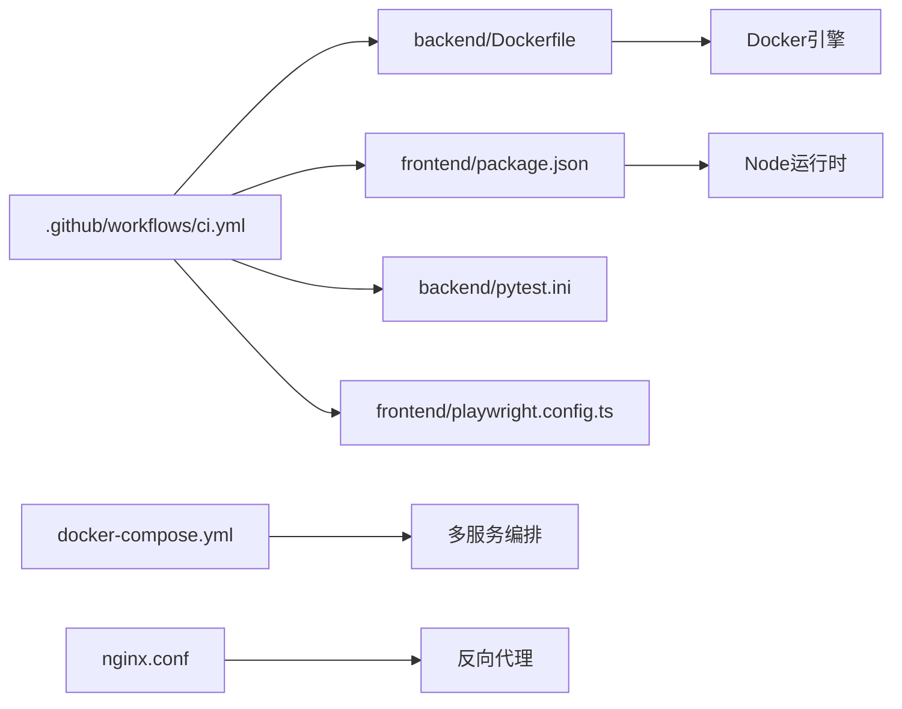

# CI/CD流水线

<cite>
**本文引用的文件**
- [ci.yml](file://.github/workflows/ci.yml)
- [pre-commit-config.yaml](file://.pre-commit-config.yaml)
- [backend/pyproject.toml](file://backend/pyproject.toml)
- [backend/pytest.ini](file://backend/pytest.ini)
- [backend/Dockerfile](file://backend/Dockerfile)
- [frontend/package.json](file://frontend/package.json)
- [frontend/playwright.config.ts](file://frontend/playwright.config.ts)
- [docker-compose.yml](file://docker-compose.yml)
- [docker-compose.dev.yml](file://docker-compose.dev.yml)
- [nginx.conf](file://nginx.conf)
</cite>

## 目录
1. [简介](#简介)
2. [项目结构](#项目结构)
3. [核心组件](#核心组件)
4. [架构总览](#架构总览)
5. [详细组件分析](#详细组件分析)
6. [依赖分析](#依赖分析)
7. [性能考虑](#性能考虑)
8. [故障排查指南](#故障排查指南)
9. [结论](#结论)
10. [附录](#附录)

## 简介
本文件面向Speaking平台的CI/CD流水线，系统化说明GitHub Actions工作流、预提交钩子、测试策略、构建优化与发布流程。文档覆盖代码检查、单元测试、集成测试、构建发布与自动化部署，并提供本地CI模拟与故障排查建议，帮助团队稳定、高效地交付质量可靠的版本。

## 项目结构
仓库采用前后端分离与多环境编排：
- .github/workflows/ci.yml：GitHub Actions主工作流定义
- .pre-commit-config.yaml：预提交钩子配置（格式化、语法检查、安全扫描）
- backend：Python后端（FastAPI + SQLAlchemy + Celery），含pytest测试与Docker镜像构建
- frontend：Next.js前端，含Playwright E2E测试与Docker镜像构建
- docker-compose*.yml：本地与开发环境编排
- nginx.conf：反向代理与静态资源服务配置

**图表来源**
- [ci.yml](file://.github/workflows/ci.yml)
- [pre-commit-config.yaml](file://.pre-commit-config.yaml)
- [backend/Dockerfile](file://backend/Dockerfile)
- [backend/pyproject.toml](file://backend/pyproject.toml)
- [backend/pytest.ini](file://backend/pytest.ini)
- [frontend/package.json](file://frontend/package.json)
- [frontend/playwright.config.ts](file://frontend/playwright.config.ts)
- [docker-compose.yml](file://docker-compose.yml)
- [docker-compose.dev.yml](file://docker-compose.dev.yml)
- [nginx.conf](file://nginx.conf)

**章节来源**
- [.github/workflows/ci.yml](file://.github/workflows/ci.yml)
- [.pre-commit-config.yaml](file://.pre-commit-config.yaml)
- [backend/Dockerfile](file://backend/Dockerfile)
- [backend/pyproject.toml](file://backend/pyproject.toml)
- [backend/pytest.ini](file://backend/pytest.ini)
- [frontend/package.json](file://frontend/package.json)
- [frontend/playwright.config.ts](file://frontend/playwright.config.ts)
- [docker-compose.yml](file://docker-compose.yml)
- [docker-compose.dev.yml](file://docker-compose.dev.yml)
- [nginx.conf](file://nginx.conf)

## 核心组件
- GitHub Actions工作流：统一触发条件、矩阵构建、缓存、测试与发布步骤
- 预提交钩子：统一代码风格、类型检查与安全扫描，提升合并前质量
- 后端测试套件：基于pytest的单元与集成测试，覆盖API、业务逻辑与外部依赖模拟
- 前端测试套件：基于Playwright的端到端测试，覆盖关键用户路径
- 构建与发布：Docker镜像构建、产物归档、标签与Changelog生成、制品上传

**章节来源**
- [.github/workflows/ci.yml](file://.github/workflows/ci.yml)
- [.pre-commit-config.yaml](file://.pre-commit-config.yaml)
- [backend/pytest.ini](file://backend/pytest.ini)
- [frontend/playwright.config.ts](file://frontend/playwright.config.ts)

## 架构总览
下图展示从代码提交到发布的端到端流水线，包括分支保护、并行构建、测试矩阵、制品归档与发布。

**图表来源**
- [ci.yml](file://.github/workflows/ci.yml)
- [backend/Dockerfile](file://backend/Dockerfile)
- [frontend/package.json](file://frontend/package.json)

## 详细组件分析

### GitHub Actions工作流（ci.yml）
- 触发条件：支持push、pull_request、release等事件；可按分支过滤
- 环境变量：通过secrets注入敏感信息（如镜像仓库凭据、数据库连接串）
- 缓存策略：对Python与Node依赖进行缓存，加速构建
- 并行执行：使用矩阵策略同时运行后端与前端任务
- 测试阶段：分别执行后端pytest与前端E2E测试
- 构建阶段：构建Docker镜像，推送至镜像仓库
- 发布阶段：根据标签生成Changelog，上传制品，创建Release

**图表来源**
- [ci.yml](file://.github/workflows/ci.yml)

**章节来源**
- [.github/workflows/ci.yml](file://.github/workflows/ci.yml)

### 预提交钩子（.pre-commit-config.yaml）
- 代码格式化：统一Python与TypeScript/JS格式
- 语法检查：静态分析与类型检查，避免低级错误
- 安全扫描：检测常见漏洞与敏感信息泄露
- 执行时机：在git commit时自动运行，失败则阻止提交

**图表来源**
- [.pre-commit-config.yaml](file://.pre-commit-config.yaml)

**章节来源**
- [.pre-commit-config.yaml](file://.pre-commit-config.yaml)

### 后端测试策略（pytest）
- 框架与配置：基于pytest，配置文件位于backend/pytest.ini
- 测试范围：API路由、业务服务、模型与迁移、第三方服务模拟
- 数据准备：fixtures与事务回滚保证测试隔离
- 覆盖率：结合覆盖率工具生成报告，随CI归档

**图表来源**
- [backend/pytest.ini](file://backend/pytest.ini)

**章节来源**
- [backend/pytest.ini](file://backend/pytest.ini)
- [backend/pyproject.toml](file://backend/pyproject.toml)

### 前端测试策略（Playwright E2E）
- 框架与配置：基于Playwright，配置文件位于frontend/playwright.config.ts
- 测试场景：认证、浏览、观看视频、兑换码等关键路径
- 浏览器矩阵：多浏览器与视口尺寸矩阵，确保兼容性
- 截图与视频：失败用例自动截图/录制，便于定位问题

**图表来源**
- [frontend/playwright.config.ts](file://frontend/playwright.config.ts)

**章节来源**
- [frontend/playwright.config.ts](file://frontend/playwright.config.ts)
- [frontend/package.json](file://frontend/package.json)

### 构建与发布流程
- Docker镜像：后端与前端分别构建镜像，遵循最小化与分层缓存
- 制品归档：测试报告、覆盖率、E2E截图与日志作为Artifacts上传
- 版本管理：依据Git标签生成Changelog，创建Release并关联制品
- 镜像推送：将镜像推送到受信任的镜像仓库，供部署拉取

**图表来源**
- [backend/Dockerfile](file://backend/Dockerfile)
- [frontend/package.json](file://frontend/package.json)
- [ci.yml](file://.github/workflows/ci.yml)

**章节来源**
- [backend/Dockerfile](file://backend/Dockerfile)
- [frontend/package.json](file://frontend/package.json)
- [.github/workflows/ci.yml](file://.github/workflows/ci.yml)

### 本地CI模拟与联调
- 容器编排：使用docker-compose与docker-compose.dev.yml快速拉起后端、前端、数据库与缓存
- Nginx代理：通过nginx.conf提供反向代理与静态资源服务
- 本地测试：在容器中运行pytest与Playwright，验证变更影响

**图表来源**
- [docker-compose.yml](file://docker-compose.yml)
- [docker-compose.dev.yml](file://docker-compose.dev.yml)
- [nginx.conf](file://nginx.conf)

**章节来源**
- [docker-compose.yml](file://docker-compose.yml)
- [docker-compose.dev.yml](file://docker-compose.dev.yml)
- [nginx.conf](file://nginx.conf)

## 依赖分析
- 工作流依赖：ci.yml依赖后端与前端的构建脚本与测试配置
- 测试依赖：pytest与Playwright分别管理依赖与浏览器驱动
- 构建依赖：Dockerfile引用基础镜像与依赖清单，确保可重复构建
- 编排依赖：docker-compose组合服务，nginx.conf提供统一入口

**图表来源**
- [ci.yml](file://.github/workflows/ci.yml)
- [backend/Dockerfile](file://backend/Dockerfile)
- [backend/pytest.ini](file://backend/pytest.ini)
- [frontend/package.json](file://frontend/package.json)
- [frontend/playwright.config.ts](file://frontend/playwright.config.ts)
- [docker-compose.yml](file://docker-compose.yml)
- [nginx.conf](file://nginx.conf)

**章节来源**
- [.github/workflows/ci.yml](file://.github/workflows/ci.yml)
- [backend/Dockerfile](file://backend/Dockerfile)
- [backend/pytest.ini](file://backend/pytest.ini)
- [frontend/package.json](file://frontend/package.json)
- [frontend/playwright.config.ts](file://frontend/playwright.config.ts)
- [docker-compose.yml](file://docker-compose.yml)
- [nginx.conf](file://nginx.conf)

## 性能考虑
- 依赖缓存：对Python与Node依赖进行缓存，减少下载与安装时间
- 并行执行：矩阵策略并行运行后端与前端任务，缩短整体耗时
- 增量构建：利用Docker层缓存与只读依赖目录，提高构建效率
- 测试隔离：使用事务回滚与独立数据库实例，避免测试间干扰
- 资源限制：合理设置并发与超时，防止资源争用导致失败

[本节为通用指导，不直接分析具体文件]

## 故障排查指南
- 工作流失败：查看Actions日志，确认触发条件与环境变量是否正确
- 依赖安装失败：检查网络与镜像源，必要时更换国内镜像
- 测试失败：查看测试报告与截图，定位用例与环境差异
- 构建失败：检查Dockerfile与依赖清单，确保基础镜像可用
- 部署失败：核对镜像仓库权限、域名解析与服务端口配置

**章节来源**
- [.github/workflows/ci.yml](file://.github/workflows/ci.yml)
- [backend/Dockerfile](file://backend/Dockerfile)
- [frontend/package.json](file://frontend/package.json)
- [docker-compose.yml](file://docker-compose.yml)
- [nginx.conf](file://nginx.conf)

## 结论
本流水线以GitHub Actions为核心，结合预提交钩子、完善的测试策略与容器化构建，实现了从代码质量到发布的全链路自动化。通过缓存、并行与增量构建优化，显著提升了构建与测试效率。建议在后续迭代中持续完善覆盖率阈值、安全扫描规则与发布策略，进一步提升交付质量与稳定性。

[本节为总结性内容，不直接分析具体文件]

## 附录
- 术语表：CI/CD、Artifact、Changelog、E2E、Matrix、Cache等
- 最佳实践：分支策略、标签规范、环境变量管理与密钥保管
- 参考链接：GitHub Actions官方文档、pytest与Playwright文档、Docker最佳实践

[本节为补充信息，不直接分析具体文件]
