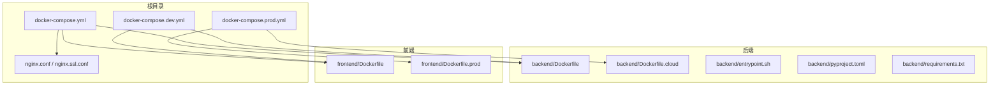
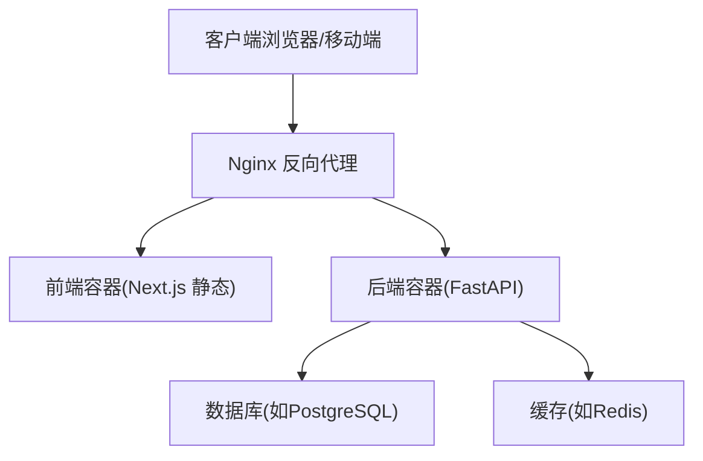
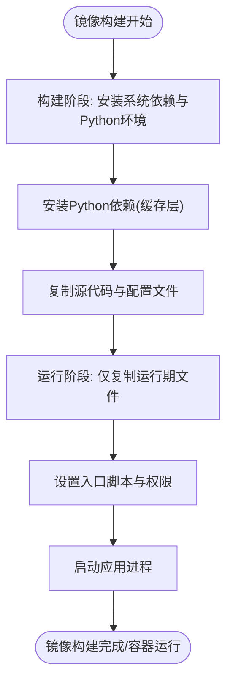
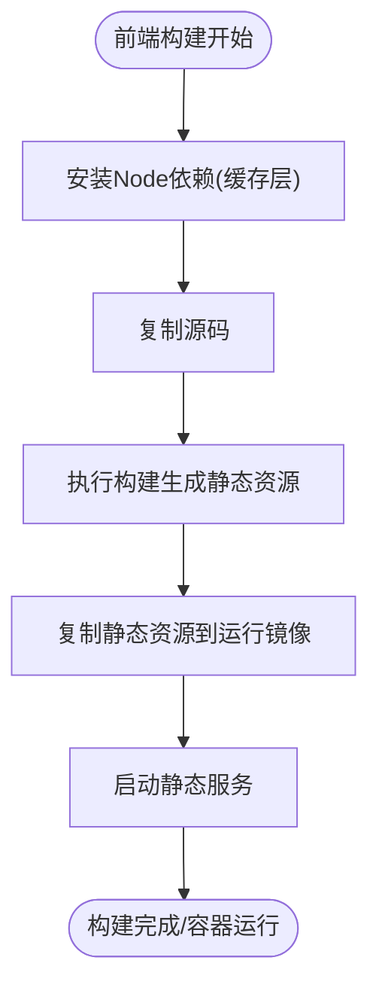
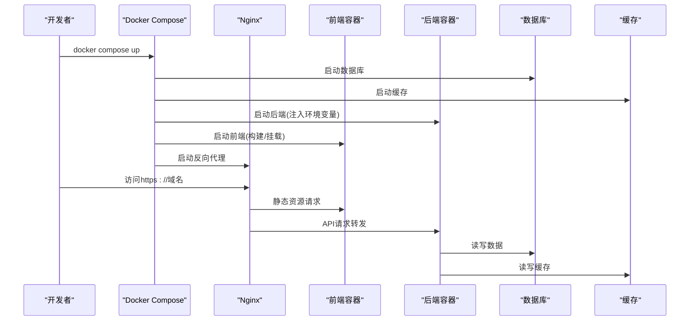
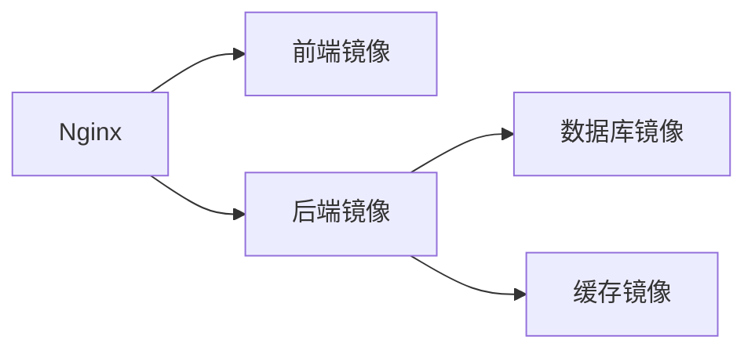

# Docker容器化部署

<cite>
**本文引用的文件**
- [backend/Dockerfile](file://backend/Dockerfile)
- [backend/Dockerfile.cloud](file://backend/Dockerfile.cloud)
- [backend/entrypoint.sh](file://backend/entrypoint.sh)
- [backend/pyproject.toml](file://backend/pyproject.toml)
- [backend/requirements.txt](file://backend/requirements.txt)
- [frontend/Dockerfile](file://frontend/Dockerfile)
- [frontend/Dockerfile.prod](file://frontend/Dockerfile.prod)
- [docker-compose.yml](file://docker-compose.yml)
- [docker-compose.dev.yml](file://docker-compose.dev.yml)
- [docker-compose.prod.yml](file://docker-compose.prod.yml)
- [nginx.conf](file://nginx.conf)
- [nginx.ssl.conf](file://nginx.ssl.conf)
</cite>

## 目录
1. [简介](#简介)
2. [项目结构](#项目结构)
3. [核心组件](#核心组件)
4. [架构总览](#架构总览)
5. [详细组件分析](#详细组件分析)
6. [依赖关系分析](#依赖关系分析)
7. [性能考虑](#性能考虑)
8. [故障排查指南](#故障排查指南)
9. [结论](#结论)
10. [附录](#附录)

## 简介
本文件面向Speaking平台的Docker容器化与编排部署，覆盖后端（Python/FastAPI）与前端（Next.js）镜像构建、多阶段构建优化、依赖管理与分层策略；说明Docker Compose服务定义、网络、数据卷与环境变量管理；区分开发环境与生产环境配置差异（调试模式、日志级别、资源限制）；提供健康检查、重启策略、日志收集方案；并给出容器安全最佳实践、编排示例与常见问题排查指引。

## 项目结构
仓库采用前后端分离的目录组织：
- backend：后端应用、依赖、Docker镜像定义、入口脚本等
- frontend：前端应用、构建产物、Docker镜像定义等
- 根目录：Docker Compose编排文件、Nginx反向代理配置等

**图示来源**
- [docker-compose.yml](file://docker-compose.yml)
- [docker-compose.dev.yml](file://docker-compose.dev.yml)
- [docker-compose.prod.yml](file://docker-compose.prod.yml)
- [nginx.conf](file://nginx.conf)
- [nginx.ssl.conf](file://nginx.ssl.conf)
- [backend/Dockerfile](file://backend/Dockerfile)
- [backend/Dockerfile.cloud](file://backend/Dockerfile.cloud)
- [frontend/Dockerfile](file://frontend/Dockerfile)
- [frontend/Dockerfile.prod](file://frontend/Dockerfile.prod)

**章节来源**
- [docker-compose.yml](file://docker-compose.yml)
- [docker-compose.dev.yml](file://docker-compose.dev.yml)
- [docker-compose.prod.yml](file://docker-compose.prod.yml)
- [nginx.conf](file://nginx.conf)
- [nginx.ssl.conf](file://nginx.ssl.conf)
- [backend/Dockerfile](file://backend/Dockerfile)
- [backend/Dockerfile.cloud](file://backend/Dockerfile.cloud)
- [frontend/Dockerfile](file://frontend/Dockerfile)
- [frontend/Dockerfile.prod](file://frontend/Dockerfile.prod)

## 核心组件
- 后端镜像构建
  - 多阶段构建：基础镜像安装系统依赖与Python环境，第二阶段仅拷贝运行期所需代码与依赖，减小镜像体积
  - 依赖管理：通过pyproject.toml与requirements.txt锁定依赖，结合缓存层加速构建
  - 入口脚本：entrypoint.sh负责启动前的初始化与参数注入，最终执行应用进程
- 前端镜像构建
  - 多阶段构建：构建阶段安装依赖并编译静态资源，生产阶段仅包含静态产物与轻量运行时
  - 环境变量：通过构建时或运行期注入NEXT_PUBLIC_*等变量控制行为
- 编排与反向代理
  - docker-compose定义后端、前端、数据库、缓存等服务及网络、卷、环境变量
  - Nginx作为统一入口，处理HTTPS、路由转发与静态资源访问

**章节来源**
- [backend/Dockerfile](file://backend/Dockerfile)
- [backend/Dockerfile.cloud](file://backend/Dockerfile.cloud)
- [backend/entrypoint.sh](file://backend/entrypoint.sh)
- [backend/pyproject.toml](file://backend/pyproject.toml)
- [backend/requirements.txt](file://backend/requirements.txt)
- [frontend/Dockerfile](file://frontend/Dockerfile)
- [frontend/Dockerfile.prod](file://frontend/Dockerfile.prod)
- [docker-compose.yml](file://docker-compose.yml)
- [docker-compose.dev.yml](file://docker-compose.dev.yml)
- [docker-compose.prod.yml](file://docker-compose.prod.yml)
- [nginx.conf](file://nginx.conf)
- [nginx.ssl.conf](file://nginx.ssl.conf)

## 架构总览
整体部署由Nginx统一接入，将请求分发到前端静态服务与后端API；后端依赖数据库与缓存等外部服务；开发环境可通过Compose一键拉起所有依赖。

**图示来源**
- [nginx.conf](file://nginx.conf)
- [nginx.ssl.conf](file://nginx.ssl.conf)
- [docker-compose.yml](file://docker-compose.yml)

## 详细组件分析

### 后端镜像构建与运行
- 多阶段构建策略
  - 构建阶段：安装系统级依赖、Python解释器与依赖包，预编译扩展
  - 运行阶段：仅复制必要文件与依赖，使用非root用户运行，最小化攻击面
- 依赖管理
  - pyproject.toml声明项目元数据与依赖，requirements.txt用于锁定版本
  - 利用Docker层缓存机制，优先缓存依赖安装层，提升构建速度
- 入口脚本
  - entrypoint.sh进行环境变量校验、数据库迁移、权限设置后启动应用进程
  - 支持传入不同命令以适配开发/生产场景

**图示来源**
- [backend/Dockerfile](file://backend/Dockerfile)
- [backend/Dockerfile.cloud](file://backend/Dockerfile.cloud)
- [backend/entrypoint.sh](file://backend/entrypoint.sh)

**章节来源**
- [backend/Dockerfile](file://backend/Dockerfile)
- [backend/Dockerfile.cloud](file://backend/Dockerfile.cloud)
- [backend/entrypoint.sh](file://backend/entrypoint.sh)
- [backend/pyproject.toml](file://backend/pyproject.toml)
- [backend/requirements.txt](file://backend/requirements.txt)

### 前端镜像构建与运行
- 多阶段构建策略
  - 构建阶段：安装Node依赖、执行构建脚本生成静态资源
  - 生产阶段：仅包含静态产物与轻量HTTP服务器，减少镜像体积
- 环境变量
  - NEXT_PUBLIC_*在构建或运行期注入，控制API地址、功能开关等
- 缓存优化
  - 先安装依赖再复制源码，充分利用Docker层缓存

**图示来源**
- [frontend/Dockerfile](file://frontend/Dockerfile)
- [frontend/Dockerfile.prod](file://frontend/Dockerfile.prod)

**章节来源**
- [frontend/Dockerfile](file://frontend/Dockerfile)
- [frontend/Dockerfile.prod](file://frontend/Dockerfile.prod)

### Docker Compose编排配置
- 服务定义
  - 后端服务：暴露API端口，挂载日志/数据卷，注入环境变量
  - 前端服务：暴露静态端口，挂载构建产物或源码（开发）
  - 反向代理：Nginx服务，统一入口与SSL终止
  - 依赖服务：数据库、缓存等
- 网络配置
  - 自定义桥接网络隔离服务间通信
- 数据卷挂载
  - 持久化数据库文件、日志、上传媒体等
- 环境变量管理
  - 通过.env文件或Compose内联变量注入敏感信息与配置项

**图示来源**
- [docker-compose.yml](file://docker-compose.yml)
- [docker-compose.dev.yml](file://docker-compose.dev.yml)
- [docker-compose.prod.yml](file://docker-compose.prod.yml)
- [nginx.conf](file://nginx.conf)
- [nginx.ssl.conf](file://nginx.ssl.conf)

**章节来源**
- [docker-compose.yml](file://docker-compose.yml)
- [docker-compose.dev.yml](file://docker-compose.dev.yml)
- [docker-compose.prod.yml](file://docker-compose.prod.yml)
- [nginx.conf](file://nginx.conf)
- [nginx.ssl.conf](file://nginx.ssl.conf)

### 开发环境与生产环境差异
- 调试模式
  - 开发：开启热重载、详细日志、调试中间件
  - 生产：关闭调试、精简日志、启用错误上报
- 日志级别
  - 开发：DEBUG/INFO
  - 生产：WARNING/INFO
- 资源限制
  - 开发：宽松CPU/内存限制
  - 生产：严格限制，避免资源争用
- 环境变量
  - 开发：本地数据库、缓存、第三方密钥占位
  - 生产：真实密钥、域名、TLS证书路径

**章节来源**
- [docker-compose.dev.yml](file://docker-compose.dev.yml)
- [docker-compose.prod.yml](file://docker-compose.prod.yml)
- [backend/entrypoint.sh](file://backend/entrypoint.sh)

### 健康检查、重启策略与日志收集
- 健康检查
  - 后端：HTTP探针检测关键接口可用性
  - 前端：静态页面可达性检查
  - 数据库/缓存：连接探测
- 重启策略
  - 失败自动重启，限制最大重试次数
  - 依赖就绪后再启动上游服务
- 日志收集
  - 容器stdout/stderr输出到驱动
  - 可选挂载日志卷供集中采集

**章节来源**
- [docker-compose.yml](file://docker-compose.yml)
- [docker-compose.dev.yml](file://docker-compose.dev.yml)
- [docker-compose.prod.yml](file://docker-compose.prod.yml)

### 容器安全最佳实践
- 非root用户运行
  - 创建专用用户与组，最小权限运行应用
- 最小镜像
  - 多阶段构建、裁剪不必要的工具与库
- 镜像扫描
  - CI集成漏洞扫描，阻断高危镜像发布
- 只读文件系统
  - 对不需要写盘的目录设置为只读
- 密钥管理
  - 使用环境变量或密钥管理服务，避免硬编码

**章节来源**
- [backend/Dockerfile](file://backend/Dockerfile)
- [backend/Dockerfile.cloud](file://backend/Dockerfile.cloud)
- [frontend/Dockerfile](file://frontend/Dockerfile)
- [frontend/Dockerfile.prod](file://frontend/Dockerfile.prod)

## 依赖关系分析
- 后端依赖
  - Python运行时、系统库、数据库驱动、缓存客户端
- 前端依赖
  - Node运行时、构建工具链、静态资源服务器
- 编排依赖
  - Nginx、数据库、缓存、存储卷、网络

**图示来源**
- [docker-compose.yml](file://docker-compose.yml)
- [nginx.conf](file://nginx.conf)

**章节来源**
- [docker-compose.yml](file://docker-compose.yml)
- [nginx.conf](file://nginx.conf)

## 性能考虑
- 镜像分层优化
  - 依赖层与应用层分离，最大化缓存命中
  - 合并RUN指令减少层数
- 构建缓存
  - 先安装依赖再复制源码，避免无效重建
- 资源限制
  - 合理设置CPU/内存上限，避免单容器占用过多资源
- 静态资源
  - 前端构建产物压缩、按需加载
- 反向代理
  - Nginx启用Gzip、缓存头、连接复用

[本节为通用指导，不直接分析具体文件]

## 故障排查指南
- 常见症状
  - 后端无法启动：检查环境变量、依赖安装、数据库连接
  - 前端无法访问：检查构建产物、端口映射、Nginx路由
  - 健康检查失败：确认探针路径与返回码
- 定位步骤
  - 查看容器日志：docker logs <容器名>
  - 进入容器调试：docker exec -it <容器名> /bin/bash
  - 检查网络连通：docker network inspect <网络名>
  - 验证卷挂载：ls -la /挂载路径
- 恢复措施
  - 修正环境变量并重载配置
  - 清理缓存与重建镜像
  - 调整资源限制与重启策略

**章节来源**
- [docker-compose.yml](file://docker-compose.yml)
- [docker-compose.dev.yml](file://docker-compose.dev.yml)
- [docker-compose.prod.yml](file://docker-compose.prod.yml)
- [backend/entrypoint.sh](file://backend/entrypoint.sh)

## 结论
通过多阶段构建与合理的分层策略，Speaking平台的前后端镜像实现了体积最小化与构建效率最大化；Docker Compose提供了统一的编排能力，配合Nginx实现稳定可靠的反向代理与流量分发；开发/生产环境的差异化配置确保了灵活性与安全性；健康检查、重启策略与日志收集提升了可观测性与稳定性；遵循容器安全最佳实践进一步降低了风险。建议在生产环境中持续进行镜像扫描与资源监控，确保长期稳定运行。

[本节为总结性内容，不直接分析具体文件]

## 附录
- 快速启动
  - 开发环境：使用开发编排文件拉起全部服务
  - 生产环境：使用生产编排文件并注入环境变量
- 常用命令
  - 构建镜像、启动服务、查看日志、进入容器、停止服务
- 参考配置
  - Nginx反向代理、SSL证书、环境变量模板

[本节为补充信息，不直接分析具体文件]
