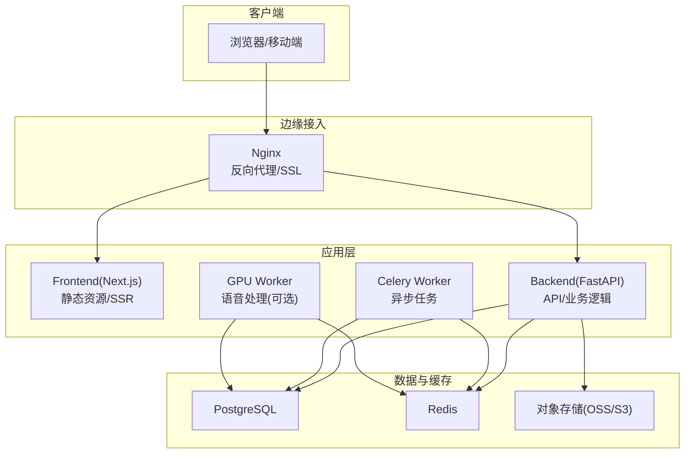
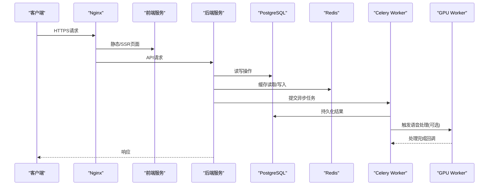
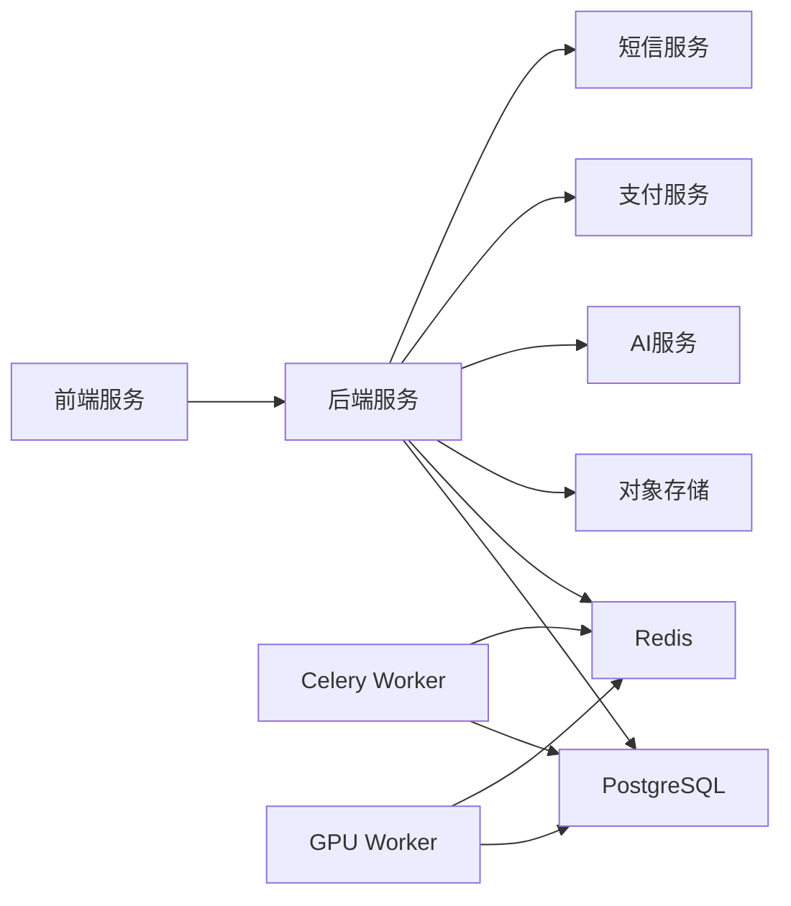

# 部署运维

<cite>
**本文引用的文件**
- [docker-compose.yml](file://docker-compose.yml)
- [docker-compose.dev.yml](file://docker-compose.dev.yml)
- [docker-compose.prod.yml](file://docker-compose.prod.yml)
- [nginx.conf](file://nginx.conf)
- [nginx.ssl.conf](file://nginx.ssl.conf)
- [backend/Dockerfile](file://backend/Dockerfile)
- [backend/Dockerfile.cloud](file://backend/Dockerfile.cloud)
- [frontend/Dockerfile](file://frontend/Dockerfile)
- [frontend/Dockerfile.prod](file://frontend/Dockerfile.prod)
- [backend/entrypoint.sh](file://backend/entrypoint.sh)
- [backend/pyproject.toml](file://backend/pyproject.toml)
- [backend/requirements.txt](file://backend/requirements.txt)
- [backend/.dockerignore](file://backend/.dockerignore)
- [backend/app/main.py](file://backend/app/main.py)
- [backend/app/core/config.py](file://backend/app/core/config.py)
- [backend/app/core/database.py](file://backend/app/core/database.py)
- [backend/app/core/redis.py](file://backend/app/core/redis.py)
- [backend/app/core/security.py](file://backend/app/core/security.py)
- [backend/app/core/logging.py](file://backend/app/core/logging.py)
- [backend/app/api/dependencies.py](file://backend/app/api/dependencies.py)
- [backend/migrations/env.py](file://backend/migrations/env.py)
- [backend/alembic.ini](file://backend/alembic.ini)
- [backend/scripts/start_gpu_worker.py](file://backend/scripts/start_gpu_worker.py)
- [backend/tests/conftest.py](file://backend/tests/conftest.py)
- [backend/pytest.ini](file://backend/pytest.ini)
- [.github/workflows/ci.yml](file://.github/workflows/ci.yml)
- [docs/operations/PRODUCTION.md](file://docs/operations/PRODUCTION.md)
- [docs/operations/RUNBOOK.md](file://docs/operations/RUNBOOK.md)
- [docs/operations/SECURITY.md](file://docs/operations/SECURITY.md)
- [docs/operations/GPU-WORKER-SETUP.md](file://docs/operations/GPU-WORKER-SETUP.md)
</cite>

## 目录
1. [简介](#简介)
2. [项目结构](#项目结构)
3. [核心组件](#核心组件)
4. [架构总览](#架构总览)
5. [详细组件分析](#详细组件分析)
6. [依赖关系分析](#依赖关系分析)
7. [性能考虑](#性能考虑)
8. [故障排查指南](#故障排查指南)
9. [结论](#结论)
10. [附录](#附录)

## 简介
本文件为Speaking平台的完整部署与运维文档，面向生产环境。内容涵盖：
- Docker容器化镜像构建、容器编排与服务编排
- 生产环境配置管理（环境变量、配置文件、密钥）
- CI/CD流水线设计（代码检查、自动化测试、构建发布、部署策略）
- 负载均衡、反向代理与SSL证书管理
- 监控告警（日志收集、性能指标、健康检查）
- 数据库备份恢复、灾难恢复与容量规划
- 故障排查、性能调优与安全加固
- 运维自动化脚本与工具使用

## 项目结构
项目采用前后端分离与多服务编排：
- 后端：Python FastAPI应用，包含API、服务层、任务队列、迁移等
- 前端：Next.js应用，提供用户界面与管理后台
- 反向代理：Nginx作为统一入口，处理HTTPS、静态资源与请求转发
- 数据与缓存：PostgreSQL、Redis
- 任务与GPU工作节点：Celery Worker + GPU Worker（可选）
- 编排：Docker Compose用于本地与生产编排

**图表来源**
- [docker-compose.yml](file://docker-compose.yml)
- [nginx.conf](file://nginx.conf)
- [backend/app/main.py](file://backend/app/main.py)
- [backend/app/core/database.py](file://backend/app/core/database.py)
- [backend/app/core/redis.py](file://backend/app/core/redis.py)

**章节来源**
- [docker-compose.yml](file://docker-compose.yml)
- [docker-compose.prod.yml](file://docker-compose.prod.yml)
- [nginx.conf](file://nginx.conf)

## 核心组件
- 反向代理与SSL：Nginx统一入口，负责TLS终止、静态资源缓存、请求路由与健康检查透传
- 前端服务：Next.js构建产物，支持SSR与静态资源托管
- 后端服务：FastAPI应用，暴露REST API，集成鉴权、限流、日志、数据库与缓存
- 任务系统：Celery Worker执行异步任务（如视频处理、评分、通知等），GPU Worker处理语音识别
- 数据层：PostgreSQL持久化，Redis缓存与会话/限流
- 对象存储：OSS/S3用于媒体文件与字幕等资源

**章节来源**
- [nginx.conf](file://nginx.conf)
- [nginx.ssl.conf](file://nginx.ssl.conf)
- [backend/app/main.py](file://backend/app/main.py)
- [backend/app/core/config.py](file://backend/app/core/config.py)
- [backend/app/core/database.py](file://backend/app/core/database.py)
- [backend/app/core/redis.py](file://backend/app/core/redis.py)

## 架构总览
下图展示从客户端到各服务的调用链路与数据流向，包括反向代理、前后端、缓存、数据库与任务队列。

**图表来源**
- [docker-compose.yml](file://docker-compose.yml)
- [backend/app/main.py](file://backend/app/main.py)
- [backend/app/core/database.py](file://backend/app/core/database.py)
- [backend/app/core/redis.py](file://backend/app/core/redis.py)

## 详细组件分析

### 容器化与镜像构建
- 后端镜像：基于Python运行时，安装依赖并复制应用代码，设置入口脚本与环境变量
- 前端镜像：Node构建阶段生成静态资源，最终镜像仅包含运行所需文件
- 云优化镜像：针对云端环境裁剪依赖与镜像体积

关键要点：
- 使用.dockerignore排除无关文件，减小镜像体积
- 入口脚本负责启动Uvicorn、执行迁移与健康检查
- 环境变量通过Compose注入，敏感信息使用密钥管理

**章节来源**
- [backend/Dockerfile](file://backend/Dockerfile)
- [backend/Dockerfile.cloud](file://backend/Dockerfile.cloud)
- [frontend/Dockerfile](file://frontend/Dockerfile)
- [frontend/Dockerfile.prod](file://frontend/Dockerfile.prod)
- [backend/.dockerignore](file://backend/.dockerignore)
- [backend/entrypoint.sh](file://backend/entrypoint.sh)

### 服务编排与容器编排
- docker-compose.yml：定义开发环境与基础服务（后端、前端、数据库、缓存、Worker）
- docker-compose.dev.yml：开发增强配置（调试、热重载、额外工具）
- docker-compose.prod.yml：生产编排（资源限制、健康检查、滚动更新、外部密钥挂载）

编排重点：
- 服务间网络隔离与端口映射
- 健康检查与重启策略
- 卷挂载用于数据持久化与日志输出
- 环境变量与密钥注入（推荐Secrets或外部配置中心）

**章节来源**
- [docker-compose.yml](file://docker-compose.yml)
- [docker-compose.dev.yml](file://docker-compose.dev.yml)
- [docker-compose.prod.yml](file://docker-compose.prod.yml)

### 反向代理与负载均衡
- Nginx作为统一入口，配置HTTPS证书、HTTP重定向、Gzip压缩、静态资源缓存
- 将API请求转发至后端服务，静态资源由前端服务提供
- 可配置上游多个后端实例以实现负载均衡与高可用

建议：
- 使用健康检查与失败重试
- 合理设置超时与连接池参数
- 启用访问日志与错误日志，便于问题定位

**章节来源**
- [nginx.conf](file://nginx.conf)
- [nginx.ssl.conf](file://nginx.ssl.conf)

### SSL证书管理
- 证书文件通过卷挂载或Secrets注入到Nginx容器
- 自动续期建议使用ACME客户端（如certbot）配合外部DNS验证
- 强制HTTPS与HSTS头，禁用不安全协议与弱加密套件

**章节来源**
- [nginx.ssl.conf](file://nginx.ssl.conf)

### 生产环境配置管理
- 环境变量：数据库连接、Redis地址、JWT密钥、第三方服务凭据等
- 配置文件：应用级配置通过环境变量覆盖默认值
- 密钥管理：推荐使用平台Secrets或KMS，避免硬编码

最佳实践：
- 区分开发与生产配置
- 最小权限原则，按需授予服务访问权限
- 定期轮换密钥与令牌

**章节来源**
- [backend/app/core/config.py](file://backend/app/core/config.py)
- [backend/app/core/security.py](file://backend/app/core/security.py)

### 数据库与迁移
- PostgreSQL作为主数据存储，连接参数通过环境变量注入
- Alembic用于数据库版本管理与迁移脚本
- 启动流程中执行迁移以确保Schema一致性

注意事项：
- 迁移前进行备份
- 灰度发布时确保迁移兼容性与回滚方案
- 索引与查询优化需结合慢查询日志

**章节来源**
- [backend/app/core/database.py](file://backend/app/core/database.py)
- [backend/migrations/env.py](file://backend/migrations/env.py)
- [backend/alembic.ini](file://backend/alembic.ini)

### 缓存与会话
- Redis用于会话、限流、热点数据缓存
- 连接参数与密码通过环境变量配置
- 注意缓存失效策略与一致性

**章节来源**
- [backend/app/core/redis.py](file://backend/app/core/redis.py)

### 任务系统与GPU工作节点
- Celery Worker处理异步任务（评分、通知、数据处理等）
- GPU Worker专门处理语音识别与转写任务
- 任务队列与结果存储通过Redis或消息中间件

扩展建议：
- 根据负载动态扩缩容Worker数量
- 监控任务积压与失败率
- GPU资源隔离与调度

**章节来源**
- [backend/scripts/start_gpu_worker.py](file://backend/scripts/start_gpu_worker.py)
- [docs/operations/GPU-WORKER-SETUP.md](file://docs/operations/GPU-WORKER-SETUP.md)

### 安全与鉴权
- JWT鉴权与令牌黑名单机制
- 密码哈希与传输加密
- 输入校验与速率限制

安全措施：
- 最小权限原则与网络隔离
- 审计日志与异常告警
- 定期安全扫描与漏洞修复

**章节来源**
- [backend/app/core/security.py](file://backend/app/core/security.py)
- [backend/app/api/dependencies.py](file://backend/app/api/dependencies.py)

### 日志与监控
- 结构化日志输出，便于集中采集与分析
- 健康检查接口供编排系统探测服务状态
- 指标暴露与告警规则（CPU、内存、请求延迟、错误率）

建议：
- 使用ELK/EFK或Prometheus+Grafana
- 设置关键阈值与告警通道（邮件、短信、IM）

**章节来源**
- [backend/app/core/logging.py](file://backend/app/core/logging.py)
- [backend/app/main.py](file://backend/app/main.py)

### 测试与质量保障
- 单元测试与集成测试框架配置
- 测试夹具与数据准备
- CI中执行测试用例与覆盖率报告

**章节来源**
- [backend/tests/conftest.py](file://backend/tests/conftest.py)
- [backend/pytest.ini](file://backend/pytest.ini)

## 依赖关系分析
- 后端依赖：数据库、缓存、对象存储、第三方API（AI、支付、短信等）
- 前端依赖：后端API、CDN与静态资源
- 任务系统依赖：消息队列与数据库
- 反向代理依赖：证书与上游服务

**图表来源**
- [docker-compose.yml](file://docker-compose.yml)
- [backend/app/core/config.py](file://backend/app/core/config.py)

**章节来源**
- [docker-compose.yml](file://docker-compose.yml)
- [backend/app/core/config.py](file://backend/app/core/config.py)

## 性能考虑
- 反向代理层：启用Gzip、缓存静态资源、合理设置超时与连接池
- 应用层：连接池、缓存命中率、异步任务削峰填谷
- 数据层：索引优化、慢查询分析与分库分表策略
- 资源限制：容器CPU/内存限制与弹性伸缩
- 监控与告警：关键指标阈值与自动扩容

[本节为通用指导，不直接分析具体文件]

## 故障排查指南
常见问题与处理步骤：
- 服务无法启动：检查环境变量与密钥、端口冲突、依赖服务可用性
- 数据库连接失败：核对连接参数、网络连通性、权限与防火墙
- 缓存异常：检查Redis连接与内存使用、键过期策略
- 任务堆积：查看Worker日志、队列长度、失败重试策略
- 性能下降：分析慢查询、缓存命中率、CPU/内存使用率

建议工具：
- 日志集中采集与检索
- 链路追踪与分布式跟踪
- 压测与容量评估

**章节来源**
- [docs/operations/RUNBOOK.md](file://docs/operations/RUNBOOK.md)
- [backend/app/core/logging.py](file://backend/app/core/logging.py)

## 结论
通过容器化与编排，Speaking平台实现了高可用、可扩展与易维护的部署架构。结合CI/CD、监控告警与安全加固，可在生产环境中稳定运行。建议持续优化性能与容量规划，完善灾备与自动化运维能力。

[本节为总结，不直接分析具体文件]

## 附录

### CI/CD流水线设计
- 代码检查：静态分析、格式检查、依赖安全扫描
- 自动化测试：单元、集成与端到端测试
- 构建发布：镜像构建、制品归档、版本标签
- 部署策略：蓝绿/金丝雀发布、回滚机制

**章节来源**
- [.github/workflows/ci.yml](file://.github/workflows/ci.yml)

### 生产环境清单
- 基础设施：计算节点、存储、网络与安全组
- 服务清单：前端、后端、数据库、缓存、任务队列、GPU Worker
- 配置项：环境变量、密钥、域名与证书
- 监控告警：指标、日志、事件与告警通道

**章节来源**
- [docs/operations/PRODUCTION.md](file://docs/operations/PRODUCTION.md)

### 安全加固措施
- 最小权限与网络隔离
- 输入校验与输出编码
- 依赖漏洞扫描与补丁管理
- 审计日志与合规检查

**章节来源**
- [docs/operations/SECURITY.md](file://docs/operations/SECURITY.md)

### 数据库备份与灾难恢复
- 定期全量与增量备份
- 异地容灾与多副本策略
- 恢复演练与RTO/RPO目标
- 数据一致性与完整性校验

[本节为通用指导，不直接分析具体文件]

### 容量规划
- 流量预测与峰值评估
- 资源利用率与弹性伸缩
- 成本优化与资源回收
- 容量预警与扩容预案

[本节为通用指导，不直接分析具体文件]

### 运维自动化脚本与工具
- 一键部署与回滚脚本
- 健康检查与自愈策略
- 日志轮转与清理
- 证书自动续期

**章节来源**
- [backend/entrypoint.sh](file://backend/entrypoint.sh)
- [backend/scripts/start_gpu_worker.py](file://backend/scripts/start_gpu_worker.py)
