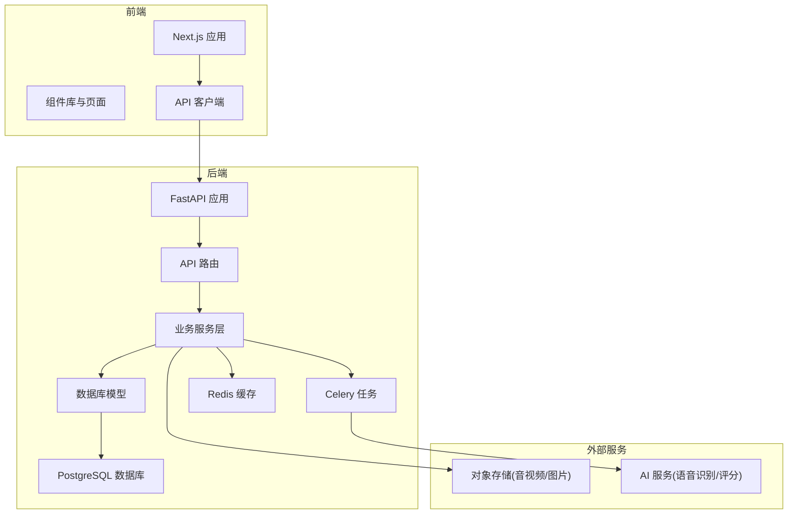
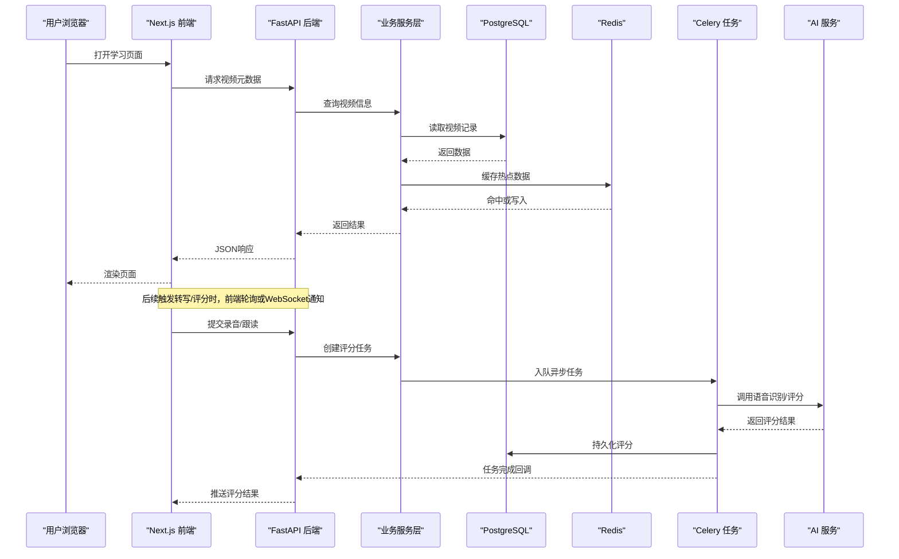
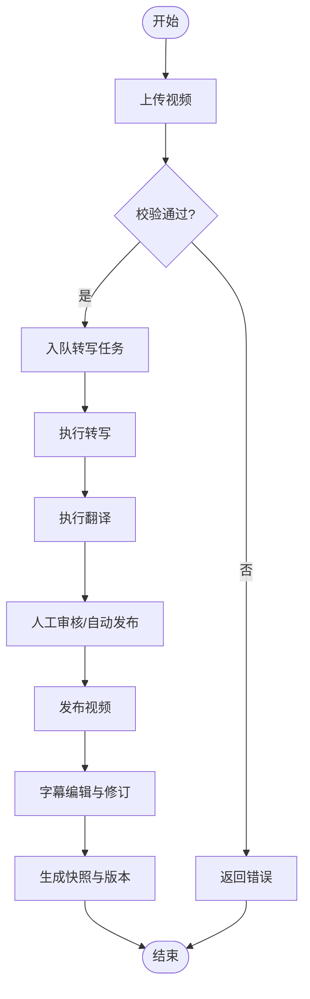
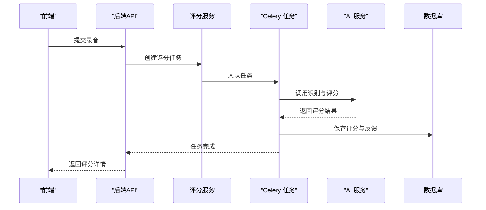
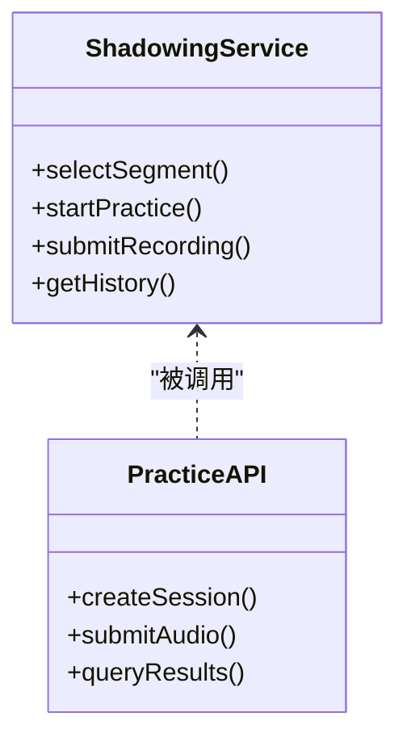
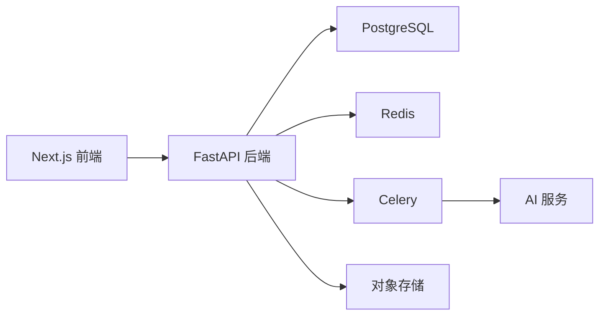

# 项目概述

<cite>
**本文引用的文件**
- [README.md](file://README.md)
- [backend/app/main.py](file://backend/app/main.py)
- [backend/pyproject.toml](file://backend/pyproject.toml)
- [backend/requirements.txt](file://backend/requirements.txt)
- [frontend/package.json](file://frontend/package.json)
- [frontend/next.config.js](file://frontend/next.config.js)
- [docker-compose.yml](file://docker-compose.yml)
- [nginx.conf](file://nginx.conf)
- [docs/architecture/SYSTEM-MAP.md](file://docs/architecture/SYSTEM-MAP.md)
- [docs/architecture/FRONTEND-ARCHITECTURE.md](file://docs/architecture/FRONTEND-ARCHITECTURE.md)
- [docs/api/API-REFERENCE.md](file://docs/api/API-REFERENCE.md)
- [docs/operations/RUNBOOK.md](file://docs/operations/RUNBOOK.md)
- [docs/progress/PROGRESS.md](file://docs/progress/PROGRESS.md)
- [backend/app/core/config.py](file://backend/app/core/config.py)
- [backend/app/core/database.py](file://backend/app/core/database.py)
- [backend/app/core/redis.py](file://backend/app/core/redis.py)
- [backend/app/services/video_service.py](file://backend/app/services/video_service.py)
- [backend/app/services/scoring_service.py](file://backend/app/services/scoring_service.py)
- [backend/app/services/shadowing_service.py](file://backend/app/services/shadowing_service.py)
- [backend/app/services/subtitle_edit_service.py](file://backend/app/services/subtitle_edit_service.py)
- [backend/app/api/v1/videos.py](file://backend/app/api/v1/videos.py)
- [backend/app/api/v1/practice.py](file://backend/app/api/v1/practice.py)
- [backend/app/api/v1/shadowing.py](file://backend/app/api/v1/shadowing.py)
- [backend/app/api/v1/media.py](file://backend/app/api/v1/media.py)
</cite>

## 目录
1. [简介](#简介)
2. [项目结构](#项目结构)
3. [核心组件](#核心组件)
4. [架构总览](#架构总览)
5. [详细组件分析](#详细组件分析)
6. [依赖关系分析](#依赖关系分析)
7. [性能考量](#性能考量)
8. [故障排查指南](#故障排查指南)
9. [结论](#结论)
10. [附录](#附录)

## 简介
Speaking英语学习平台是一个面向英语学习者的在线学习系统，围绕“视频学习、AI评分、口语练习、字幕编辑”等核心能力构建。平台采用前后端分离与微服务化设计原则，后端基于Python FastAPI提供REST API，前端基于Next.js构建响应式Web应用，数据存储使用PostgreSQL，缓存与消息队列使用Redis，并通过Celery进行异步任务处理。平台支持UGC视频上传与审核、字幕自动转写与翻译、跟读与影子训练、词汇与学习计划、推荐与搜索等功能，目标是帮助学习者通过真实语料与智能反馈提升英语听说能力。

本概述文档为初学者提供清晰的概念介绍，同时为有经验的开发者提供足够的技术深度，包括系统架构、数据流、关键服务与API、部署与运维要点等。

## 项目结构
仓库采用多模块组织方式：
- backend：FastAPI后端，包含API路由、领域模型、服务层、任务队列、迁移脚本与测试。
- frontend：Next.js前端，包含页面、组件、状态管理、API客户端与样式主题。
- docs：架构决策、API参考、运行手册与设计文档。
- docker相关：容器编排与反向代理配置。
- scripts：数据初始化、批量处理与运维脚本。

**图表来源**
- [backend/app/main.py](file://backend/app/main.py)
- [frontend/package.json](file://frontend/package.json)
- [docker-compose.yml](file://docker-compose.yml)
- [nginx.conf](file://nginx.conf)

**章节来源**
- [README.md](file://README.md)
- [docs/architecture/SYSTEM-MAP.md](file://docs/architecture/SYSTEM-MAP.md)
- [docs/architecture/FRONTEND-ARCHITECTURE.md](file://docs/architecture/FRONTEND-ARCHITECTURE.md)

## 核心组件
- 后端核心
  - FastAPI应用入口与中间件：统一鉴权、限流、日志、错误处理。
  - API路由：按功能域划分（用户、视频、学习、支付、管理等）。
  - 服务层：封装复杂业务逻辑（视频处理、评分、影子练习、字幕编辑、推荐等）。
  - 数据访问：SQLAlchemy模型与Alembic迁移，PostgreSQL持久化。
  - 缓存与限流：Redis缓存热点数据，速率限制保护接口。
  - 异步任务：Celery处理耗时任务（转写、评分、媒体处理）。
- 前端核心
  - Next.js应用：服务端渲染与静态生成结合，路由与布局分层。
  - 组件库：通用UI组件与业务组件（播放器、字幕编辑器、面板等）。
  - 状态管理：本地状态与全局Store（认证、播放、计划、词汇等）。
  - API客户端：统一的请求封装、错误处理与重试策略。
- 基础设施
  - 容器编排：Docker Compose一键启动开发环境。
  - 反向代理：Nginx负载均衡与静态资源托管。
  - 监控与日志：结构化日志与集中采集。

**章节来源**
- [backend/app/main.py](file://backend/app/main.py)
- [backend/app/core/config.py](file://backend/app/core/config.py)
- [backend/app/core/database.py](file://backend/app/core/database.py)
- [backend/app/core/redis.py](file://backend/app/core/redis.py)
- [frontend/package.json](file://frontend/package.json)
- [frontend/next.config.js](file://frontend/next.config.js)

## 架构总览
平台遵循前后端分离与微服务化设计原则：
- 前端通过HTTP/HTTPS调用后端REST API，获取数据与执行操作。
- 后端以FastAPI为核心，按领域拆分路由与服务，保证高内聚低耦合。
- 数据层使用PostgreSQL作为主存储，Redis用于缓存与会话/限流。
- 异步任务通过Celery解耦耗时流程，如视频转写、AI评分、字幕处理。
- 外部服务集成对象存储与AI能力，增强多媒体处理能力。

**图表来源**
- [backend/app/api/v1/videos.py](file://backend/app/api/v1/videos.py)
- [backend/app/services/video_service.py](file://backend/app/services/video_service.py)
- [backend/app/services/scoring_service.py](file://backend/app/services/scoring_service.py)
- [backend/app/core/redis.py](file://backend/app/core/redis.py)
- [backend/app/core/database.py](file://backend/app/core/database.py)

## 详细组件分析

### 视频学习与字幕编辑
- 功能目标：提供视频播放、字幕展示与编辑、转写与翻译流水线。
- 关键流程：
  - 上传与发布：管理员或授权用户上传视频，进入待处理状态，触发转写与翻译任务。
  - 字幕编辑：支持分段、合并、修订与版本快照，保障质量与安全网。
  - 播放体验：前端播放器与字幕联动，支持关键词高亮与跳转。
- 涉及服务与API：
  - 视频服务：视频元数据、标准版本、分叉与审核。
  - 字幕编辑服务：分段、合并、修订、快照与提案传播。
  - API路由：视频列表、详情、上传、审核、字幕编辑接口。

**图表来源**
- [backend/app/api/v1/videos.py](file://backend/app/api/v1/videos.py)
- [backend/app/services/video_service.py](file://backend/app/services/video_service.py)
- [backend/app/services/subtitle_edit_service.py](file://backend/app/services/subtitle_edit_service.py)

**章节来源**
- [backend/app/api/v1/videos.py](file://backend/app/api/v1/videos.py)
- [backend/app/services/video_service.py](file://backend/app/services/video_service.py)
- [backend/app/services/subtitle_edit_service.py](file://backend/app/services/subtitle_edit_service.py)

### AI评分与口语练习
- 功能目标：对学习者录音进行语音识别与评分，提供即时反馈与改进建议。
- 关键流程：
  - 录音提交：前端录制音频并上传至后端。
  - 评分任务：异步调用AI服务进行识别与评分，结果持久化。
  - 反馈展示：前端展示评分维度与建议，支持回放对比。
- 涉及服务与API：
  - 评分服务：评分规则、质量检查、结果聚合。
  - 练习服务：题目生成、练习记录、进度统计。
  - API路由：练习、评分、历史记录接口。

**图表来源**
- [backend/app/api/v1/practice.py](file://backend/app/api/v1/practice.py)
- [backend/app/services/scoring_service.py](file://backend/app/services/scoring_service.py)

**章节来源**
- [backend/app/api/v1/practice.py](file://backend/app/api/v1/practice.py)
- [backend/app/services/scoring_service.py](file://backend/app/services/scoring_service.py)

### 影子练习（Shadowing）
- 功能目标：提供影子练习模式，强化听力与口语输出。
- 关键流程：
  - 选择素材：根据难度与主题推荐句子或片段。
  - 跟读录制：实时录制并同步播放原音。
  - 评估反馈：结合评分服务给出准确度与流利度指标。
- 涉及服务与API：
  - 影子服务：片段切分、播放控制、练习记录。
  - API路由：影子练习的创建、提交与查询接口。

**图表来源**
- [backend/app/api/v1/shadowing.py](file://backend/app/api/v1/shadowing.py)
- [backend/app/services/shadowing_service.py](file://backend/app/services/shadowing_service.py)

**章节来源**
- [backend/app/api/v1/shadowing.py](file://backend/app/api/v1/shadowing.py)
- [backend/app/services/shadowing_service.py](file://backend/app/services/shadowing_service.py)

### 媒体与存储
- 功能目标：统一管理音视频、图片等资源，提供上传、下载与CDN加速。
- 关键流程：
  - 上传：前端直传对象存储，后端记录元数据。
  - 访问：通过签名URL或CDN域名访问资源。
  - 清理：过期资源回收与备份策略。
- 涉及服务与API：
  - 媒体服务：上传、下载、删除、元数据更新。
  - API路由：媒体资源接口。

**章节来源**
- [backend/app/api/v1/media.py](file://backend/app/api/v1/media.py)

## 依赖关系分析
- 后端依赖
  - FastAPI：高性能异步Web框架。
  - SQLAlchemy/Alembic：ORM与数据库迁移。
  - Redis：缓存、会话、限流与任务队列。
  - Celery：异步任务调度与执行。
  - Pydantic：数据校验与序列化。
- 前端依赖
  - Next.js：React框架与SSR/CSR混合渲染。
  - TypeScript：类型安全与开发体验。
  - TailwindCSS/样式方案：原子化样式与主题管理。
- 基础设施依赖
  - Docker Compose：容器编排与依赖管理。
  - Nginx：反向代理与静态资源服务。

**图表来源**
- [backend/pyproject.toml](file://backend/pyproject.toml)
- [backend/requirements.txt](file://backend/requirements.txt)
- [frontend/package.json](file://frontend/package.json)
- [docker-compose.yml](file://docker-compose.yml)

**章节来源**
- [backend/pyproject.toml](file://backend/pyproject.toml)
- [backend/requirements.txt](file://backend/requirements.txt)
- [frontend/package.json](file://frontend/package.json)
- [docker-compose.yml](file://docker-compose.yml)

## 性能考量
- 缓存策略：热点数据（视频元数据、推荐结果）优先从Redis读取，降低数据库压力。
- 异步处理：转写、评分、媒体处理等耗时任务通过Celery异步执行，避免阻塞请求。
- 数据库优化：合理使用索引、分页与查询优化，减少慢查询。
- 前端优化：懒加载、代码分割与静态资源缓存，提升首屏与交互性能。
- 限流与降级：对高频接口实施速率限制，异常时快速失败与降级策略。

[本节为通用指导，不直接分析具体文件]

## 故障排查指南
- 常见问题
  - 数据库连接失败：检查PostgreSQL服务状态与连接参数。
  - Redis连接超时：确认Redis服务可用与网络连通性。
  - 任务未执行：检查Celery Worker是否启动与队列是否正常。
  - 上传失败：确认对象存储权限与签名URL有效期。
- 调试工具
  - 日志查看：后端结构化日志与前端控制台输出。
  - 健康检查：服务健康端点与依赖状态检测。
  - 测试用例：单元测试与端到端测试覆盖关键路径。

**章节来源**
- [docs/operations/RUNBOOK.md](file://docs/operations/RUNBOOK.md)

## 结论
Speaking英语学习平台以视频学习为核心，融合AI评分、口语练习与字幕编辑，构建了完整的学习闭环。通过前后端分离与微服务化设计，平台具备良好的扩展性与可维护性。未来规划包括推荐系统优化、多模态内容支持、移动端适配与国际化扩展，持续提升用户体验与学习效果。

[本节为总结性内容，不直接分析具体文件]

## 附录
- 快速开始
  - 环境要求：Node.js、Python、Docker、PostgreSQL、Redis。
  - 安装步骤：克隆仓库、安装依赖、配置环境变量、启动服务。
  - 基本使用：注册账号、浏览视频、参与练习、查看评分。
- 版本信息与历程
  - 当前版本：依据仓库标签与变更记录。
  - 发展历程：功能迭代与架构演进里程碑。
  - 未来规划：新增特性与优化方向。

**章节来源**
- [docs/progress/PROGRESS.md](file://docs/progress/PROGRESS.md)
- [docs/api/API-REFERENCE.md](file://docs/api/API-REFERENCE.md)
