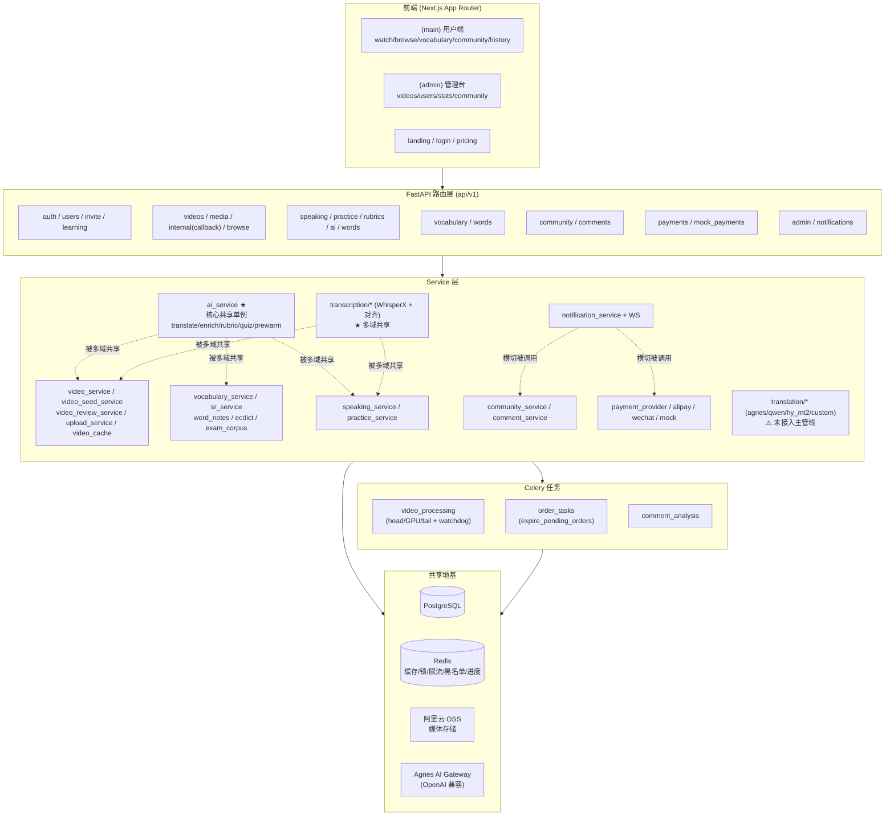
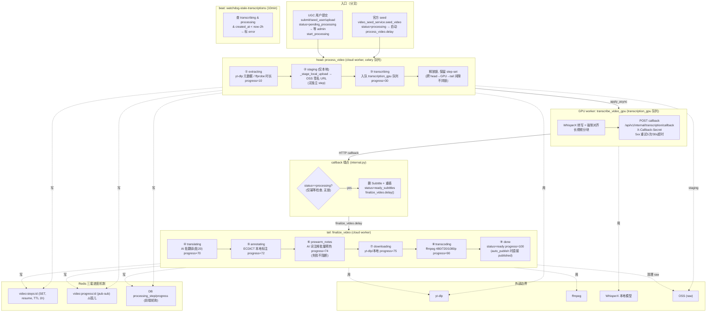
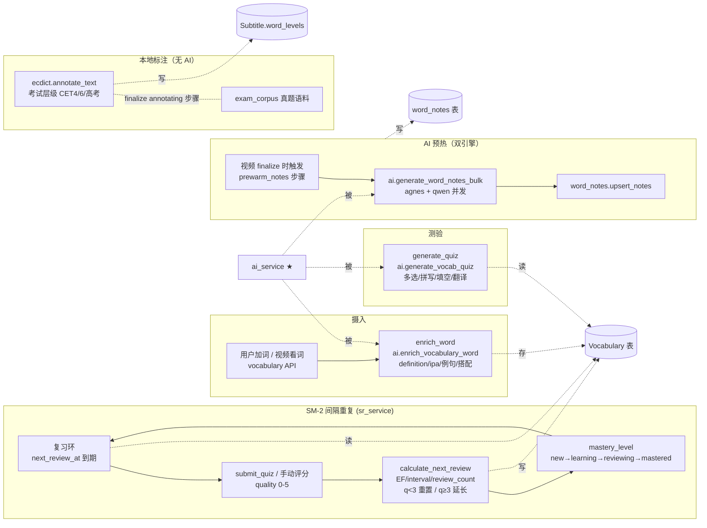
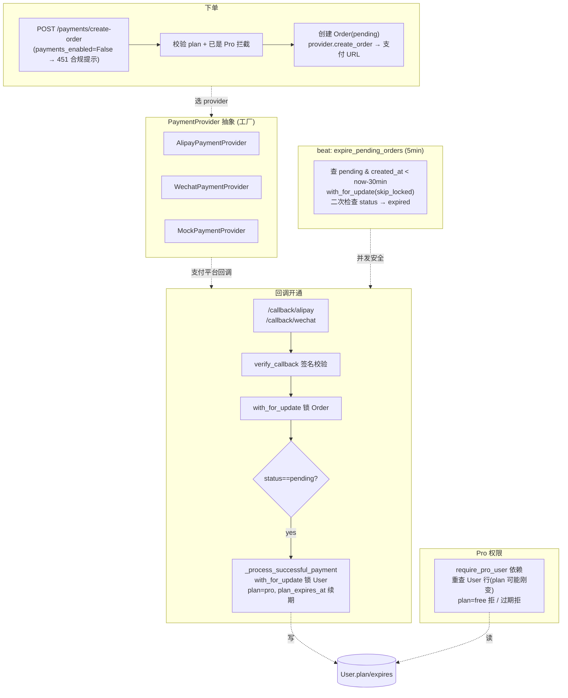
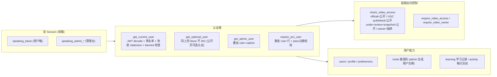
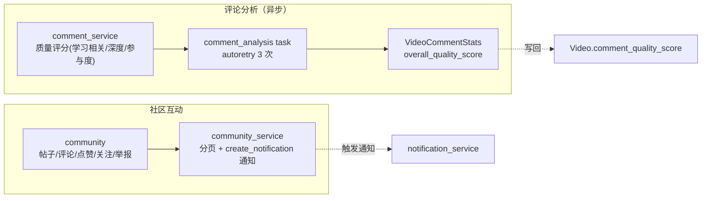
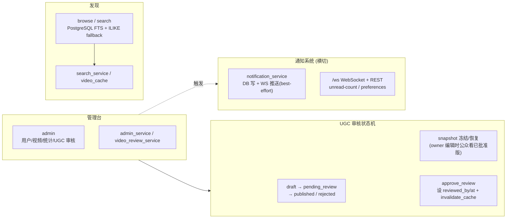
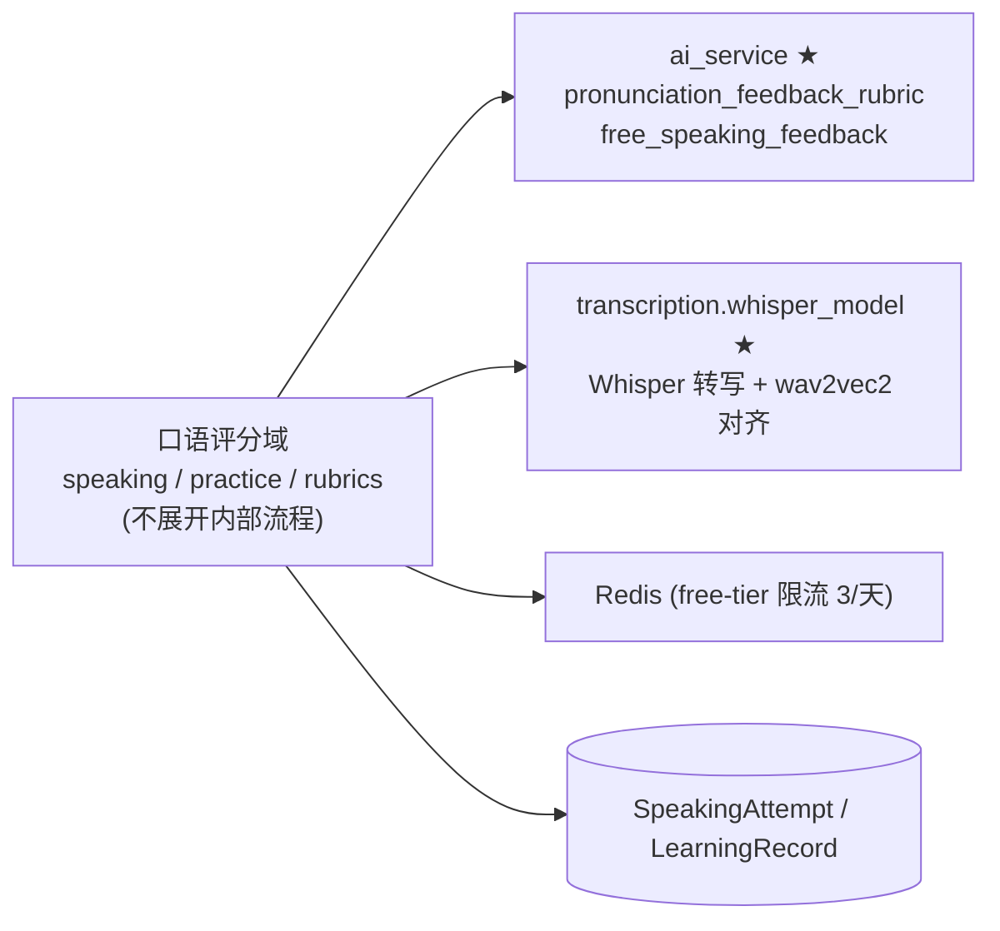

# 系统流程 / 功能地图（架构审视）

> 目的：以**架构审视**视角呈现当前真实代码的结构、执行流、耦合与风险，服务于重构/上线前的盘点。
> 粒度：总览用 service 级，视频管线详图下沉到 task/步骤级。
> 这是「现状地图」，不是 PRD 理想态——两者偏差本身就是审视产出。

---

## 导航

1. [总览：7 域 + 共享地基](#1-总览7-域--共享地基)
2. [视频管线详图（深挖）](#2-视频管线详图深挖)
3. [词汇复习域（中等）](#3-词汇复习域中等)
4. [支付会员域（中等）](#4-支付会员域中等)
5. [Auth & 用户域（轻量）](#5-auth--用户域轻量)
6. [社区域（轻量）](#6-社区域轻量)
7. [Admin & 运营域（轻量）](#7-admin--运营域轻量)
8. [口语评分域（轻量框）](#8-口语评分域轻量框)
9. [审视汇总：跨域风险清单](#9-审视汇总跨域风险清单)

---

## 1. 总览：7 域 + 共享地基

**共享热点（架构审视重点）：**
- `ai_service` 单例（`get_ai_service()` 线程安全双检锁）被 **视频管线 prewarm、词汇、口语评分、practice、ai 路由、words** 6+ 处共享——这是最大的耦合中心。
- `transcription/*`（WhisperX + wav2vec2 对齐）被**视频管线**和**口语评分**两条独立链路共享，是第二大耦合中心。
- `notification_service` 是横切能力，被社区、支付、邀请等多域调用，走 WebSocket + DB 双写。

---

## 2. 视频管线详图（深挖）

三段式 head / GPU / tail，跨进程跨队列，靠 HTTP 回调桥接。

**关键代码引用：**
- head `process_video`：`video_processing.py:202`，步骤映射 `STEP_PROGRESS` `:25-34`
- GPU `transcribe_video_gpu`：`:364`，回调 `_post_transcription_callback` `:309-361`
- callback 端点：`internal.py:24-86`（仅靠 `status==processing` 判幂等 `:53-54`，**无锁**）
- tail `finalize_video`：`:395-634`，每步 `_is_step_done` 守卫（`423/445/471/545/565`）
- watchdog：`:651-697`，beat 调度 `celery_app.py:39-42`
- 队列拓扑：`celery_app.py`（`celery`=云端 head/tail，`transcription_gpu`=GPU worker）

### 视频管线 — 风险 / 债

- **孤儿 pub-sub 通道**：`video:progress:{id}`（`video_processing.py:77`）每步都 publish，**全代码库零订阅者**。前端靠 DB 轮询 `/status`。每次推进做一次无用 PUBLISH，且给人「有实时推送」错觉。→ 接 SSE 订阅 或 删代码。
- **TranslationService 没接入主管线**：`finalize_video._translate_subtitles`（`:138-150`）调 `AIService.translate_batch`（`ai_service.py:122`），**绕过** `TranslationService` 的引擎切换 + fallback。`TRANSLATION_ENGINE=hy_mt2/qwen/custom` + `TRANSLATION_FALLBACK_ENGINE` 对字幕翻译**完全无效**。设计意图与实现脱节。
- **UGC auto_publish 绕过审核**：`seed_user_video` 的 `auto_publish` 参数（`video_seed_service.py:144`）被**硬编码忽略**——`:165` 写死 `auto_publish=True`。`finalize_video:592-594` 据此直接设 `review_status=published`，而社区流过滤 `review_status==published`（`video_service.py:88`）。后果：用户经 user-seed 提交的视频**未经 admin 审核即进社区流**，与 `videos.py:705-712` docstring 声称矛盾。**策略性 bug。**
- **callback 端点无锁，双回调竞态**：`/internal/transcription/callback` 仅靠 `status==processing` 判幂等（`internal.py:53-54`），无 Redis 锁。两个并发回调（Celery retry 二次 POST）可同时通过 → 都执行 `delete(Subtitle)` + 重插 + 都 `finalize_video.delay()`。finalize 侧 `_acquire_lock` 兜底第二个跳过，但**字幕表已双删双插**。建议 callback 也加锁。
- **GPU worker「不碰 DB/OSS 凭证」是约定非隔离**：代码路径不碰 ✅，但 `TranscriptionService.__init__` 调 `get_settings()` 会加载 `oss_access_key`/`DATABASE_URL` 进单例；生产校验（`config.py:162-172`）强制 GPU worker 进程必须设 `DATABASE_URL`/`OPENAI_API_KEY` 才能启动。隔离靠 env 约定，无配置/进程级硬隔离。
- **Redis 故障时 resume + 锁双重 fail-open**：`_acquire_lock` 异常返回 `True`（`:98-101`），`_is_step_done` 异常返回 `False`（`:87-88`）。Redis 短暂宕机期间 finalize 会**重跑所有已完成步骤**，且锁形同虚设。resume 100% 依赖 Redis 可用，无 DB 兜底。
- **step-set TTL(1h) 可能短于管线时长**：长视频的 translating + prewarm + downloading + transcoding(3 路) 容易逼近 1h；锁 TTL 30min 更短。超时则 resume 失效、并发 finalize 介入。
- **watchdog 用 `created_at` 近似入队时间**：`watchdog_stale_transcriptions`（`:673-678`）用 `created_at < now-2h`。但 admin `start_processing` 延迟触发时 `created_at` 远早于实际入队时间 → **过早误杀**正常转录中的视频。
- **`STEP_PROGRESS` 常量已漂移**：`video_service.py:441` 手抄 `STEP_PROGRESS_DOWNLOADING = 10`，而主管线 `STEP_PROGRESS["downloading"]=75`。同一「downloading」步骤前端会看到进度跳变。
- **`run_async` 的 RuntimeError fallback 违反自身约定**：多个任务包了 `try: run_async except RuntimeError: new_event_loop + run_until_complete`（`process_video:293` 等）。CLAUDE.md 禁止 per-task `asyncio.run()`，这个 fallback 恰在异常时新建一次性 loop，AsyncOpenAI client 跨重试切 loop 会出问题。
- **`auto_publish` 在 tail 内跨域改 `review_status`**：`finalize_video:592-604` 直接写 `review_status=published`，绕过 `video_review_service.approve_review`（不设 `reviewed_by/reviewed_at`）。两条发布路径写出字段不一致，`review_status` 写权限未收敛到 service 层。

---

## 3. 词汇复习域（中等）

SM-2 间隔重复 + AI 富化 + 双引擎预热 + 本地 ECDICT 考试标注。

**关键代码引用：**
- SM-2 算法：`sr_service.py:19`（纯函数，`MIN_EASE_FACTOR=1.3`，q<3 重置）
- 复习更新：`vocabulary_service._update_word_review` `:192`，从持久化 `ease_factor`/`interval_days` 计算
- 掌握度阈值：`_mastery_from_review_count` `:26`（0/≤2/≤5/>5）
- 预热双引擎：`ai_service.generate_word_notes_bulk` `:624`（`prewarm_engines`/`prewarm_concurrency` 配置，见 memory `prewarm-dual-engine`）

### 词汇域 — 风险 / 债

- **`ai = get_ai_service()` 模块级初始化**：`vocabulary_service.py:17` 在模块导入时就实例化 AI 单例，绕过了懒加载约定（CLAUDE.md 要求 lazy init）。GPU worker 等「不需要 AI 的进程」import 此模块会触发连接建立。
- **SM-2 的 `interval_days` 从持久值反推**：`_update_word_review:208-211` 用 `(next_review_at - last_reviewed_at).days` 反算当前 interval，而非直接持久化 interval 字段。若 `last_reviewed_at`/`next_review_at` 任一缺失则回退 0，且反推与真实间隔可能因时区/精度有偏差。已有 `interval_days` 列（`:221` 写入）却没用于计算输入。
- **测验评分把未答当错（quality=2）**：`submit_quiz:179-181` 未答 → quality=2（与答错同），会推进 SM-2 review_count 重置。但前端若因网络丢失个别题，用户会被误判「答错」并重置复习进度。
- **ECDICT exchange lemma bug（已知）**：见 memory `ecdict-exchange-lemma-bug`，`_parse_exchange` 误把 code 0 当变形，致 good→best 等错误。需确认是否已修。

---

## 4. 支付会员域（中等）

多 provider（Alipay/WeChat/Mock）+ 回调开通 + beat 过期 + Pro 权限校验。

**关键代码引用：**
- 抽象 + 工厂：`payment_provider.py:40`（`PaymentProvider` ABC）、`:70`（`get_payment_provider` 懒导入避循环依赖）
- 计划注册表：`PLAN_DEFINITIONS` `:22`（pro_monthly=3900fen / pro_yearly=29900fen）、`PLAN_DURATIONS` `:34`
- 开通逻辑：`_process_successful_payment` `payments.py:58`（锁 User → `plan=pro` → `plan_expires_at = max(current_expires, now) + duration`，**续期而非覆盖**）
- Pro 校验：`dependencies.require_pro_user:141`（重查 User 行，避免 JWT stale plan）
- 过期任务：`order_tasks.py:13`（`with_for_update(skip_locked=True)` + 拿锁后二次检查 `:40-41`）

### 支付域 — 风险 / 债

- **回调与过期任务的并发设计扎实**：Order 行锁 + `skip_locked` + 二次检查，是本域做得最好的部分。✅
- **`payments_enabled=False` 是 ICP 合规开关**：`payments.py:108` 全局拦截创建订单与回调，返回 451。当前默认关闭（站内支付不合规，走兑换码/小商店）。但**回调端点也一并禁用**——若曾经开启过、有 pending 订单，关闭后这些订单的回调会被 451 拒绝，无法开通，用户付了钱拿不到 Pro。需确认是否有历史 pending 订单迁移路径。
- **`query_order` 主动查询未接入**：`PaymentProvider.query_order`（`payment_provider.py:61`）定义了「回调未到时主动查单」接口，但 `payments.py` **没有任何 reconciliation 调度任务**调用它。回调丢失 → 只能靠用户手动联系。无对账机制。
- **Pro 续期「从 max(current_expires, now) 续」正确**：`:78` 处理了「已是 Pro 且未过期则从原到期日续」的边界，避免提前续费损失天数。✅ 但 `create-order:114-119` 只拦截「未过期的 Pro」，**已过期但 plan 字段仍=pro** 的用户能再次下单（此时走 `max(current_expires, now)=now` 续期，行为正确，但拦截逻辑与续期逻辑有轻微不对称）。
- **Mock provider 在生产无显式禁用**：`get_payment_provider` `:90` 兜底返回 `MockPaymentProvider`。若 `default_payment_provider` 配置拼错，生产会静默走 Mock（不真扣款却开通 Pro）。建议生产环境校验 provider 名白名单。

---

## 5. Auth & 用户域（轻量）

**关键代码引用：**
- 认证依赖：`dependencies.py:53`（`get_current_user`）、`:94`（`get_optional_user`）、`:130`（`get_admin_user`）、`:141`（`require_pro_user`）
- 改密失效：`_token_issued_before_password_change` `:32`（2 秒 leeway 吸收 iat 截断）
- 视频访问：`check_video_access` `:169`（official 公开 / UGC published 公开 / under-review+snapshot 公开 / owner 始终）

### Auth 域 — 风险 / 债

- **改密 staleness 用 2 秒 leeway**：`_token_issued_before_password_change:50` 吸收 JWT `iat` 整数截断与 `password_changed_at` 微秒精度差。设计周全。✅
- **`require_pro_user` 重查 User 行**：`:153` 避免 JWT stale plan 拒绝刚升级用户。✅ 但每个 Pro 端点多一次 DB 查询，高频端点可考虑把 plan/expires 写进 JWT claim + 容忍短暂偏差。
- **banned 检查在 `get_optional_user` 也生效**：`:124` 公开页可选认证也拒绝 banned 用户——合理，但意味着 banned 用户连公开页的个性化（如推荐）都拿不到，需确认是否符合产品意图。
- **invite 兑换升级后无主动刷新前端 token**：用户兑换邀请码升 Pro 后，旧 JWT 里 plan=free，靠 `require_pro_user` 重查兜底；但前端 localStorage 里的用户态不会自动更新，需刷新页面或重新登录才显示 Pro。

---

## 6. 社区域（轻量）

**关键代码引用：**
- 社区通知触发：`community_service.py:284/370/381/617`（4 处 `create_notification`）
- 评论质量评分：`comment_service.py:185`（学习相关40% + 深度30% + 参与度30%）、`_calculate_learning_relevance_score` `:103`（关键词字典，high/medium/low 三档）
- 异步分析任务：`comment_analysis.py:10`（`autoretry_for=(Exception,)`, `retry_backoff=True`, `max_retries=3`）

### 社区域 — 风险 / 债

- **评论质量评分是纯关键词匹配**：`LEARNING_KEYWORDS` 字典 + 「2024/2025/2026」等当低价值词。脆弱——易绕过（同义词/拼音），且「2026」等词误伤正常年份讨论。规则式，非 AI，作为排序信号可接受，作为内容质量权威评分偏弱。
- **`comment_count` 双语义注释**：`comment_service.py:301` 注释明确「YouTube 评论数 vs 社区评论数」是两个不同计数，`comment_count` 列只跟社区评论。但 YouTube 评论数「暂不单独存储」——若产品要用，需补列。
- **社区通知 4 处触发无去重**：`create_notification` 每次都新建行，重复点赞/取消再点赞会产生多条通知。无幂等/聚合。

---

## 7. Admin & 运营域（轻量）

**关键代码引用：**
- UGC 审核状态机：`video_review_service.py`（`approve_review:134-148` 设 `reviewed_by/reviewed_at` + 失效缓存；`_build_snapshot:45-81` 冻结已批准版本）
- 通知 WS：`notifications.py:65`（`ws_manager = ConnectionManager()`）、`:71`（`/ws` WebSocket）、推送 best-effort `notification_service.py:51`（异常静默吞）
- 搜索：`search_service.py`（PostgreSQL FTS + ILIKE fallback，见 memory `round3-todo` 提及 ILIKE 注入已修）

### Admin 域 — 风险 / 债

- **WS 推送 best-effort 静默吞异常**：`notification_service.py:51` `except Exception: pass`。WS 推送失败不阻塞通知创建 ✅，但**无任何日志/重试**，推送失败完全不可观测。用户在线但收不到实时通知，只能靠下次拉 REST。
- **UGC 审核有 snapshot 机制，但 auto_publish 路径绕过它**（见视频管线风险）：`finalize_video` 直接 `review_status=published` 不走 `approve_review`，不设 `reviewed_by/at`、不建 snapshot。两条发布路径字段不一致——这是跨域（视频管线 ↔ admin 审核）的耦合裂痕。
- **search FTS + ILIKE fallback 的注入面**：memory 记录 ILIKE 注入曾修过（`round3-todo`）。需确认 fallback 路径参数化是否彻底。

---

## 8. 口语评分域（轻量框）

不展开内部 Whisper→对齐→rubric 流程，只画依赖关系（架构审视关注耦合）。

**关键代码引用：**
- `speaking_service.py:260/358`（`get_ai_service()`）、`:235`（`speaking_alignment` wav2vec2 对齐）、`:22`（依赖 `transcription.whisper_model.get_whisper_model`）
- `practice_service.py:168/309`（`get_ai_service()`，依赖 `check_video_access`/`ecdict`/`exam_corpus`）

### 口语评分域 — 风险 / 债

- **共享 `transcription.whisper_model` 单例**：口语评分和视频管线共用 `get_whisper_model()`。若两个域对模型大小/语言配置需求不同，会互相干扰。且单例在 GPU worker 与云端 worker 各自进程内独立，配置漂移不可见。
- **free-tier 限流 3/天 走 Redis**：Redis 故障时限流失效（fail-open）——可能被刷。见 CLAUDE.md「Fail-open Redis」约定，业务可接受但需知晓。
- **历史致命 bug 已修**（见 memory `speaking-eval-redo`）：rubric 返回与服务层消费不匹配致全 0 分，已重做。但说明此域曾因接口契约不严出过 P0，契约应有测试守护。

---

## 9. 审视汇总：跨域风险清单

按严重度排序，标注所在域与代码位置。

### 🔴 高（策略性 bug / 数据风险）

| # | 问题 | 域 | 位置 |
|---|------|----|----|
| 1 | UGC `auto_publish` 硬编码 True，绕过审核直接进社区流 | 视频管线 | `video_seed_service.py:165` + `video_processing.py:592-594` |
| 2 | callback 端点无锁，双回调竞态致字幕表双删双插 | 视频管线 | `internal.py:53-54` |
| 3 | Redis 故障时 resume + 锁双重 fail-open，重跑所有步骤 | 视频管线 | `video_processing.py:87-88, 98-101` |

### 🟡 中（设计意图与实现脱节 / 可观测性缺口）

| # | 问题 | 域 | 位置 |
|---|------|----|----|
| 4 | TranslationService 引擎切换+fallback 未接入主管线，配置无效 | 视频管线 | `video_processing.py:138-150` |
| 5 | 孤儿 pub-sub 通道，零订阅者，给人实时推送错觉 | 视频管线 | `video_processing.py:77` |
| 6 | watchdog 用 `created_at` 近似入队时间，过早误杀正常转录 | 视频管线 | `video_processing.py:673-678` |
| 7 | `STEP_PROGRESS` 常量漂移（10 vs 75），前端进度跳变 | 视频管线 | `video_service.py:441` |
| 8 | 两条发布路径字段不一致（auto_publish 不设 reviewed_by/at/snapshot） | 跨域（管线↔admin） | `video_processing.py:592` vs `video_review_service.py:134` |
| 9 | `query_order` 主动查单接口无 reconciliation 调度，回调丢失无对账 | 支付 | `payment_provider.py:61` |
| 10 | Mock provider 兜底无生产白名单，配置拼错静默走 Mock | 支付 | `payment_provider.py:90` |
| 11 | WS 推送异常静默吞，不可观测 | Admin/通知 | `notification_service.py:51` |
| 12 | `run_async` RuntimeError fallback 违反禁止 per-task asyncio.run 约定 | 视频管线 | `video_processing.py:293` 等 |

### 🟢 低（约定/边界）

| # | 问题 | 域 | 位置 |
|---|------|----|----|
| 13 | GPU worker「不碰 DB/OSS 凭证」靠 env 约定，无硬隔离 | 视频管线 | `config.py:162-172` |
| 14 | `vocabulary_service` 模块级 `ai = get_ai_service()` 破坏懒加载 | 词汇 | `vocabulary_service.py:17` |
| 15 | SM-2 从 `next_review_at - last_reviewed_at` 反推 interval，未用 interval_days 列 | 词汇 | `vocabulary_service.py:208-211` |
| 16 | 评论质量评分纯关键词匹配，脆弱 | 社区 | `comment_service.py:18-91` |
| 17 | step-set TTL(1h)/锁 TTL(30min) 可能短于长视频管线时长 | 视频管线 | `video_processing.py:37-38` |

---

## 附：与现有文档的关系

- `docs/architecture/ARCHITECTURE.md` — ADR 决策记录（**为何**这么设计）
- `docs/api/REQUIREMENTS.md` — PRD 理想态（**应该**是什么样）
- `docs/plans/PIPELINE-FLOW.md` — 视频管线流程（**计划**视角）
- **本文 `SYSTEM-MAP.md`** — 当前真实代码的现状地图 + 风险（**实际**是什么样 + 哪里有偏差）

本文与 memory 中 `optimization-roadmap` / `architecture-refactor-backlog` / `production-launch-blockers` 互为印证，可作为下一轮重构/上线的盘点依据。
